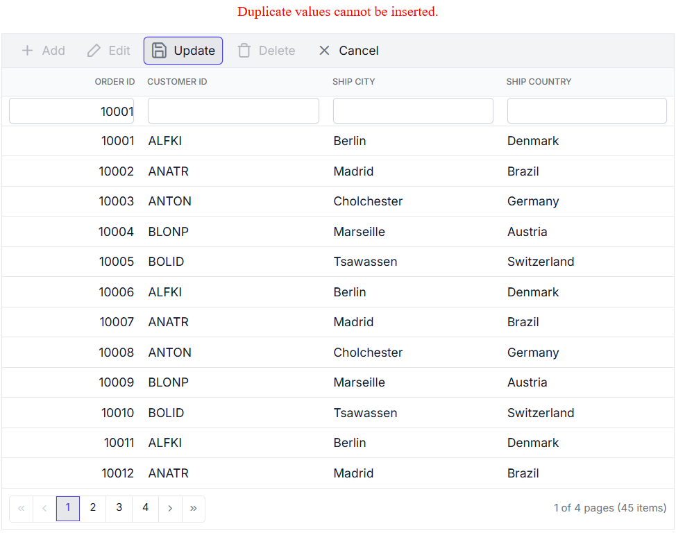

# Validation in Vue Grid component

Validation is a crucial aspect of data integrity in any application. The Vue Grid component in Syncfusion&reg; provides built-in support for easy and effective data validation. This feature ensures that the data entered or modified adheres to predefined rules, preventing errors and guaranteeing the accuracy of the displayed information.

## Column validation

Column validation allows you to validate the edited or added row data before saving it. This feature is particularly useful when you need to enforce specific rules or constraints on individual columns to ensure data integrity. By applying validation rules to columns, you can display error messages for invalid fields and prevent the saving of erroneous data. This feature leverages the **Form Validator** component to perform the validation. You can define validation rules using the [columns.validationRules](https://ej2.syncfusion.com/vue/documentation/api/grid/column/#validationrules) property to specify the criteria for validating column values.

The following code example demonstrates how to define a validation rule for grid column:









        


## Custom validation

The Custom validation feature is used to define and enforce your own validation rules for specific columns in the Grid. This is achieved by leveraging the utilizing the **Form Validator custom rules**, you can enforce your desired validation logic and display error messages for invalid fields.

In the below demo, custom validation applied for **CustomerID** column.









        


### Custom validation based on dropdown change

The Custom validation feature in the Grid allows you to apply validation rules and messages to a column based on the value of another column in edit mode. This feature is particularly useful when you need to enforce specific validation criteria that depend on the selection made in a dropdown column.

In the following sample, dropDownList edit type is used for the **Role** and **Salary** columns. A custom validation message is shown in the **Salary** column based on the value selected in the **Role** column.









        


### Custom validation for numeric column

Custom validation for a numeric column Grid is useful when you want to enforce specific validation rules on numeric values in a column. This allows you to define your own validation logic and display custom error messages when the you enters invalid data.

In the following example, custom validation functions, namely **customFn** and **customFn1**, are defined to check the entered numeric value against your validation criteria. Then, the grid column is configured with the appropriate validation settings using the **freightRules** object, specifying the custom validation functions along with corresponding error messages. Additionally, the `change` event of the numeric column is bound to the [validate](https://ej2.syncfusion.com/vue/documentation/api/form-validator/#validate) method of the form element through the edit params. This enables you to trigger validation and display error messages whenever the you modifies the value in the **NumericTextBox**.









        


## Dynamically add or remove validation rules from the form

You can dynamically add or remove validation rules from input elements within a form. This feature is particularly useful when you need to adjust the validation rules based on different scenarios or dynamically changing data.

To add validation rules dynamically to an input element, you can use the [addRules](https://ej2.syncfusion.com/vue/documentation/api/form-validator/#addrules) method. This method enables you to add validation rules to the corresponding input element based on the name attribute.

The following example to demonstrates how to dynamically add or remove a required validation rule for an input field based on a **CheckBox** selection:









        


>To remove an existing validation rule from an input element, you can use the [removeRules](https://ej2.syncfusion.com/vue/documentation/api/form-validator/#removerules) method. 

## Change the position of validation error message

By default, the validation error message in Grid is displayed below the input field. However, you have an option to customize its position and display it in a different location. This feature is particularly useful when you want to align the error message according to your application's design and layout.

To change the position of the validation error message in Grid, you can utilize the [customPlacement](https://ej2.syncfusion.com/vue/documentation/api/form-validator/#customplacement) event. This event allows you to define a custom logic to position the error message at the desired location.

Here's an example that demonstrates how to change the position of the validation error message to the top of the input field:









        


## Show custom error message while performing CRUD actions

While performing CRUD actions in the Syncfusion&reg; Vue Grid, errors may occur due to various reasons such as validation failures, network issues, or server-side exceptions. Handling these errors effectively is Essential&reg; for providing meaningful error messages when an operation fails.

To achieve this, you can use the [actionFailure](https://ej2.syncfusion.com/vue/documentation/api/grid/#actionfailure) event. This event is triggered when an action (like update, delete, or insert) fails, allowing you to retrieve the error message from the server response and display it in the UI.  

The following sample demonstrates how to retrieve and display error messages in the Syncfusion&reg; Vue Grid:  





<template>
    

        
{{ statusMessage }}

        <ejs-grid :dataSource='data' :toolbar="toolbar" :editSettings="editSettings" :actionFailure="actionFailure" allowPaging="true">
            <e-columns>
              <e-column field='OrderID' headerText='Order ID' width='120' textAlign='Right' isPrimaryKey="true"></e-column>
              <e-column field='CustomerID' headerText='Customer ID' width='160'></e-column>
              <e-column field='ShipCity' headerText='Ship City' width='150'></e-column>
              <e-column field='ShipCountry' headerText='Ship Country' width='150'></e-column>
            </e-columns>
        </ejs-grid>
    

</template>







<template>
  

    
{{ statusMessage }}

    <ejs-grid :dataSource='data' :toolbar="toolbar" :editSettings="editSettings" :actionFailure="actionFailure" allowPaging="true">
      <e-columns>
        <e-column field='OrderID' headerText='Order ID' width='120' textAlign='Right' isPrimaryKey="true"></e-column>
        <e-column field='CustomerID' headerText='Customer ID' width='160'></e-column>
        <e-column field='ShipCity' headerText='Ship City' width='150'></e-column>
        <e-column field='ShipCountry' headerText='Ship Country' width='150'></e-column>
      </e-columns>
    </ejs-grid>
  

</template>







namespace UrlAdaptor.Server.Controllers
{
  [ApiController]
  public class GridController : Controller
  {
    /// 

    /// Handles the HTTP POST request to retrieve data from the data source based on the DataManagerRequest.
    /// Supports filtering,searching, sorting, and paging operations (skip and take).
    /// 

    /// <param name="DataManagerRequest">Contains the filtering, sorting, and paging options requested by the client.</param>
    /// <returns>Returns the paginated data along with the total record count.</returns>
    [HttpPost]
    [Route("api/[controller]")]
    public object Post([FromBody] DataManagerRequest DataManagerRequest)
    {
      // Retrieve data from the data source (e.g., database).
      IQueryable<OrdersDetails> DataSource = GetOrderData().AsQueryable();
      QueryableOperation queryableOperation = new QueryableOperation(); // Initialize DataOperations instance.
      // Get the total count of records.
      int totalRecordsCount = DataSource.Count();
      // Handling paging operation.
      if (DataManagerRequest.Skip != 0)
      {
        DataSource = queryableOperation.PerformSkip(DataSource, DataManagerRequest.Skip);
      }
      if (DataManagerRequest.Take != 0)
      {
        DataSource = queryableOperation.PerformTake(DataSource, DataManagerRequest.Take);
      }
      return new { result = DataSource, count = totalRecordsCount };
    }

    /// 

    /// Handles the HTTP GET request to retrieve all order records.
    /// 

    /// <returns>Returns a list of order details.</returns>
    [HttpGet]
    [Route("api/[controller]")]
    public List<OrdersDetails> GetOrderData()
    {
      var data = OrdersDetails.GetAllRecords().ToList();
      return data;
    }

    /// 

    /// Inserts a new data item into the data collection.
    /// 

    /// <param name="newRecord">It contains the new record detail which is need to be inserted.</param>
    /// <returns>Returns void.</returns>
    [HttpPost]
    [Route("api/Grid/Insert")]
    public IActionResult Insert([FromBody] CRUDModel<OrdersDetails> newRecord)
    {
      if (newRecord.value == null)
      {
        return BadRequest(new { message = "Invalid data received." });
      }
      var existingOrder = OrdersDetails.order.FirstOrDefault(or => or.OrderID == newRecord.value.OrderID);
      if (existingOrder == null)
      {
        OrdersDetails.order.Insert(0, newRecord.value);
        return Ok(new { success = true, message = "Order added successfully.", data = newRecord.value });
      }
      else
      {
        return BadRequest(new { success = false, message = "Duplicate values cannot be inserted." });
      }
    }

    /// 

    /// Update a existing data item from the data collection.
    /// 

    /// <param name="Order">It contains the updated record detail which is need to be updated.</param>
    /// <returns>Returns void.</returns>
    [HttpPost]
    [Route("api/Grid/Update")]
    public IActionResult Update([FromBody] CRUDModel<OrdersDetails> Order)
    {
      var updatedOrder = Order.value;
      if (updatedOrder.OrderID < 10010 || updatedOrder.OrderID < 10030)
      {
        return BadRequest(new { message = "OrderID must be between 10010 and 10030 to update." });
      }
      var data = OrdersDetails.GetAllRecords().FirstOrDefault(or => or.OrderID == updatedOrder.OrderID);
      // Update the existing record.
      data.OrderID = updatedOrder.OrderID;
      data.CustomerID = updatedOrder.CustomerID;
      data.ShipCity = updatedOrder.ShipCity;
      data.ShipCountry = updatedOrder.ShipCountry;
      return Ok(new { success = true, message = "Order updated successfully." });
    }

    /// 

    /// Remove a specific data item from the data collection.
    /// 

    /// <param name="value">It contains the specific record detail which is need to be removed.</param>
    /// <return>Returns void.</return>
    [HttpPost]
    [Route("api/Grid/Remove")]
    public IActionResult Remove([FromBody] CRUDModel<OrdersDetails> value)
    {
      int orderId = int.Parse(value.key.ToString());
      if (orderId < 10031 || orderId > 10045)
      {
        return BadRequest(new { message = "OrderID must be between 10031 and 10045 to delete." });
      }
      var data = OrdersDetails.GetAllRecords().FirstOrDefault(orderData => orderData.OrderID == orderId);
      if (data != null)
      {
        OrdersDetails.GetAllRecords().Remove(data);
        return Ok(new { success = true, message = "Order deleted successfully." });
      }
      return NotFound(new { message = "Order not found." });
    }

    public class CRUDModel<T> where T : class
    {
      public string? action { get; set; }
      public string? keyColumn { get; set; }
      public object? key { get; set; }
      public T? value { get; set; }
      public List<T>? added { get; set; }
      public List<T>? changed { get; set; }
      public List<T>? deleted { get; set; }
      public IDictionary<string, object>? @params { get; set; }
    }
  }
}







namespace UrlAdaptor.Server.Models
{
  public class OrdersDetails
  {
    public static List<OrdersDetails> order = new List<OrdersDetails>();
    public OrdersDetails(){}
    public OrdersDetails(
    int OrderID, string CustomerId, int EmployeeId, double Freight, bool Verified,
    DateTime OrderDate, string ShipCity, string ShipName, string ShipCountry,
    DateTime ShippedDate, string ShipAddress) {
      this.OrderID = OrderID;
      this.CustomerID = CustomerId;
      this.EmployeeID = EmployeeId;
      this.Freight = Freight;
      this.ShipCity = ShipCity;
      this.Verified = Verified;
      this.OrderDate = OrderDate;
      this.ShipName = ShipName;
      this.ShipCountry = ShipCountry;
      this.ShippedDate = ShippedDate;
      this.ShipAddress = ShipAddress;
    }

    public static List<OrdersDetails> GetAllRecords()
    {
      if (order.Count() == 0)
      {
        int code = 10000;
        for (int i = 1; i < 10; i++)
        {
          order.Add(new OrdersDetails(code + 1, "ALFKI", i + 0, 2.3 * i, false, new DateTime(1991, 05, 15), "Berlin", "Simons bistro", "Denmark", new DateTime(1996, 7, 16), "Kirchgasse 6"));
          order.Add(new OrdersDetails(code + 2, "ANATR", i + 2, 3.3 * i, true, new DateTime(1990, 04, 04), "Madrid", "Queen Cozinha", "Brazil", new DateTime(1996, 9, 11), "Avda. Azteca 123"));
          order.Add(new OrdersDetails(code + 3, "ANTON", i + 1, 4.3 * i, true, new DateTime(1957, 11, 30), "Cholchester", "Frankenversand", "Germany", new DateTime(1996, 10, 7), "Carrera 52 con Ave. Bolívar #65-98 Llano Largo"));
          order.Add(new OrdersDetails(code + 4, "BLONP", i + 3, 5.3 * i, false, new DateTime(1930, 10, 22), "Marseille", "Ernst Handel", "Austria", new DateTime(1996, 12, 30), "Magazinweg 7"));
          order.Add(new OrdersDetails(code + 5, "BOLID", i + 4, 6.3 * i, true, new DateTime(1953, 02, 18), "Tsawassen", "Hanari Carnes", "Switzerland", new DateTime(1997, 12, 3), "1029 - 12th Ave. S."));
          code += 5;
        }
      }
      return order;
    }
    public int? OrderID { get; set; }
    public string? CustomerID { get; set; }
    public int? EmployeeID { get; set; }
    public double? Freight { get; set; }
    public string? ShipCity { get; set; }
    public bool? Verified { get; set; }
    public DateTime OrderDate { get; set; }
    public string? ShipName { get; set; }
    public string? ShipCountry { get; set; }
    public DateTime ShippedDate { get; set; }
    public string? ShipAddress { get; set; }
  }
}





The following screenshot illustrates how to retrieve and display error messages when CRUD operations fail:

## Prevent adding duplicate rows with custom validation

The Syncfusion Vue Grid allows you to enforce constraints to prevent duplicate rows by customizing the validation logic within the Grid setup. This ensures data integrity by restricting duplicate entries in the **OrderID** column.

To prevent adding duplicate rows in the Grid, follow these steps:

1. Implement Custom Validation: Define the `orderIdCustomValidation` function to check whether the entered **OrderID** already exists in the [dataSource](https://ej2.syncfusion.com/vue/documentation/api/grid/#datasource). This allows editing an existing row without triggering a duplicate error.

2. Add Dynamic Validation Rules: Create the `orderIDRules` object to enforce unique **OrderID** values. Dynamically add this rule to the form during the **save** action.

3. Handle Validation in the [actionBegin](https://ej2.syncfusion.com/vue/documentation/api/grid/#actionbegin) event: In the `actionBegin` event, check if the **requestType** is **save**. Apply the validation rule before saving and cancel the action `args.cancel = true` if the validation fails.

For server-side validation to prevent adding duplicate rows, you can refer to the detailed guidance provided in our [knowledge base](https://support.syncfusion.com/kb/article/11608/how-to-do-server-side-validation-for-grid-in-asp-net-mvc-application). If you want to display the Grid's validation tooltip instead of the alert used in our knowledge base, you can call the `grid.editModule.formObj.validate()` method in the `Ajax/Fetch` success function to display the Grid's tooltip validation for the server side.










