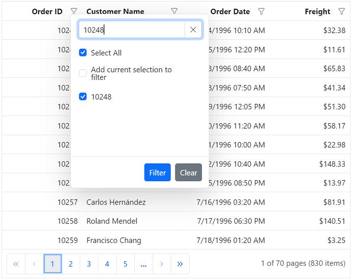

# Filter menu in Vue Grid component

You can enable filter menu by setting the [`filterSettings.type`](https://ej2.syncfusion.com/vue/documentation/api/grid/filterSettings/#type) as **Menu**.
The filter menu UI will be rendered based on its column type, which allows you to filter data. You can filter the records with different operators.






        


> * [`allowFiltering`](https://ej2.syncfusion.com/vue/documentation/api/grid/#allowfiltering) must be set as true to enable filter menu.
> * Setting [`columns.allowFiltering`](https://ej2.syncfusion.com/vue/documentation/api/grid/column/#allowfiltering) as false will prevent filter menu rendering for a particular column.

## Custom component in filter menu

The [`column.filter.ui`](https://ej2.syncfusion.com/vue/documentation/api/grid/column/#filter) is used to add custom filter components to a particular column.To implement custom filter ui, define the following functions:

* **create**:  Creates custom component.
* **write**: Wire events for custom component.
* **read**: Read the filter value from custom component.

In the following sample, dropdown is used  as custom component in the OrderID column.






        


## Customizing filter menu operators list

 You can customize the default filter operator list by defining the
  [`filterSettings.operators`](https://ej2.syncfusion.com/vue/documentation/api/grid/filterSettings/#operators) property. The available options are:

* `stringOperator`- defines customized string operator list.
* `numberOperator` - defines customized number operator list.
* `dateOperator` - defines customized date operator list.
* `booleanOperator` - defines customized boolean operator list.

In the following sample, we have customized string filter operators.





        


## Enable different filter for a column

You can use both **Menu** and **Checkbox** filter in a same Grid. To do so, set the
[`column.filter.type`](https://ej2.syncfusion.com/vue/documentation/api/grid/column/#filter) as **Menu** or **Checkbox**.

In the following sample menu filter is enabled by default and checkbox filter is enabled for the CustomerID column using the [`column.filter.type`](https://ej2.syncfusion.com/vue/documentation/api/grid/column/#filter).






        


## Filter by multiple keywords using filter menu

By default, the filtering action is performed based on the single keyword filter value from the built-in component of the filter menu dialog. Now data grid has an option to perform filtering actions based on multiple keywords instead of a single keyword alone. For this, set [`filterSettings.type`](https://ej2.syncfusion.com/vue/documentation/api/grid/filterSettings#type) as `Menu`.

In the following sample, filtering action with multiple keywords can be done by rendering the `MultiSelect` component as custom component in the OrderID column filter menu dialog.






        


## Add current selection to filter checkbox

By default, the CheckBox filter can only filter the selected items. If filtering is done multiple times on the same column, the previously filtered values in the column will be cleared. Now, it is possible to retain those previous values by using the `Add current selection to filter` checkbox. This checkbox is displayed when data is searched in the search bar of the CheckBox filter.

The following image describes the above mentioned behavior.

