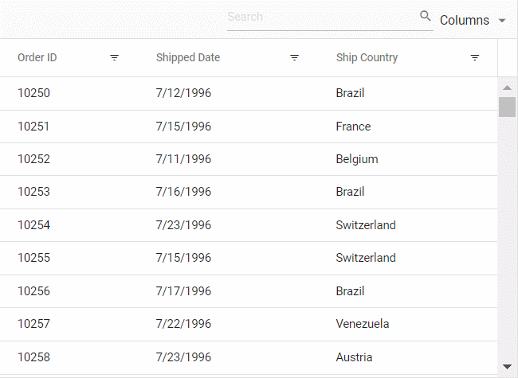

# Filtering in Vue Grid Component

Filtering allows you to view particular records based on filter criteria. To enable filtering in the Grid, set the [`allowFiltering`](https://ej2.syncfusion.com/vue/documentation/api/grid/#allowfiltering) to true. Filtering options can be configured through [`filterSettings`](https://ej2.syncfusion.com/vue/documentation/api/grid/filterSettings/). To use filter, inject `Filter` module in the `provide` section.

To get start quickly with Filtering Options, you can check on this video:



<!-- The Grid supports three types of filter, they are
* Filter bar
* Excel
* Checkbox -->






        


> * You can apply and clear filtering, by using [`filterByColumn`](https://ej2.syncfusion.com/vue/documentation/api/grid/filter/#filterbycolumn) and [`clearFiltering`](https://ej2.syncfusion.com/vue/documentation/api/grid/filter/#clearfiltering) methods.
> * To disable Filtering for a particular column, by specifying [`columns.allowFiltering`](https://ej2.syncfusion.com/vue/documentation/api/grid/column/#allowfiltering) to false.

## Initial filter

To apply the filter at initial rendering, set the filter [`predicate`](https://ej2.syncfusion.com/vue/documentation/api/grid/predicate/) object in [`filterSettings.columns`](https://ej2.syncfusion.com/vue/documentation/api/grid/filterSettingsModel/#columns).






        


## Filter operators

The filter operator for a column can be defined in [`filterSettings.columns.operator`](https://ej2.syncfusion.com/vue/documentation/api/grid/predicateModel/#operator) property.

The available operators and its supported data types are,

Operator |Description |Supported Types
-----|-----|-----
startsWith |Checks whether a value begins with the specified value. |String
endsWith |Checks whether a value ends with specified value. |String
contains |Checks whether a value contains with specified value. |String
doesnotstartwith |Checks whether the value does not begin with the specified value. |String
doesnotendwith |Checks whether the value does not end with the specified value. |String
doesnotcontain |Checks whether the value does not contain the specified value. |String
equal |Checks whether a value equal to specified value. |String &#124; Number &#124; Boolean &#124; Date
notEqual |Checks whether a value not equal to specified value. |String &#124; Number &#124; Boolean &#124; Date
greaterThan |Checks whether a value is greater than with specified value. |Number &#124; Date
greaterThanOrEqual|Checks whether a value is greater than or equal to specified value. |Number &#124; Date
lessThan |Checks whether a value is less than with specified value. |Number &#124; Date
lessThanOrEqual |Checks whether a value is less than or equal to specified value. |Number &#124; Date
isnull |Returns the values that are null. |String &#124; Number &#124; Date
isnotnull |Returns the values that are not null. |String &#124; Number &#124; Date
isempty |Returns the values that are empty. |String
isnotempty |Returns the values that are not empty. |String
between|Filter the values based on the range between the start and end specified values. |Number &#124; Date

## Wildcard and LIKE operator filter

**Wildcard** and **LIKE** filter operators filters the value based on the given string pattern, and they apply to string-type columns. But it will work slightly differently.

### Wildcard filtering

The **Wildcard** filter can process one or more search patterns using the "*" symbol, retrieving values matching the specified patterns.

* The **Wildcard** filter option is supported for the DataGrid that has all search options.

**For example:**

Operator |Description
-----|-----
a*b |Everything that starts with "a" and ends with "b".
a* |Everything that starts with "a".
*b |Everything that ends with "b".
*a* |Everything that has an "a" in it.
*a*b* |Everything that has an "a" in it, followed by anything, followed by a "b", followed by anything.

### LIKE filtering

The **LIKE** filter can process single search patterns using the "%" symbol, retrieving values matching the specified patterns. The following Grid features support LIKE filtering on string-type columns:

* Filter Menu
* Filter Bar with the [`filterSettings.showFilterBarOperator`](https://ej2.syncfusion.com/vue/documentation/api/grid/filterSettings/#showFilterBarOperator)  property enabled on the Grid [`filterSettings`](https://ej2.syncfusion.com/vue/documentation/api/grid/filterSettings/).
* Custom Filter of Excel filter type.

**For example:**

Operator |Description
-----|-----
%ab% |Returns all the value that are contains "ab" character.
ab% |Returns all the value that are ends with "ab" character.
%ab |Returns all the value that are starts with "ab" character.

> By default, the [`filterSettings.columns.operator`](https://ej2.syncfusion.com/vue/documentation/api/grid/predicateModel/#operator) value is **equal**.

## Diacritics filter

By default, grid ignores diacritic characters while filtering. To include diacritic characters, set the [`filterSettings.ignoreAccent`](https://ej2.syncfusion.com/vue/documentation/api/grid/filterSettings/#ignoreaccent) as **true**.

In the following sample, type **mun** in **Ship City** column to filter diacritic characters.






        


## See Also

* [Hide sorting options on Excel filter Dialog](../how-to/hide-sorting-in-excel-filter)
