# Global local in Vue Grid component

The Syncfusion Vue Grid component provides a feature known as Globalization (global and local), which makes the application more accessible and useful for individuals from different regions and language backgrounds. You have the ability to view data in your preferred language and format, resulting in an enhanced overall experience.

## Localization

The Syncfusion Vue Grid provides a built-in [Localization](https://ej2.syncfusion.com/vue/documentation/common/localization) library, enabling you to customize the text used in the grid to suit different languages or cultural preferences. With this library, you can change static text on various elements, such as **group drop area text** and **pager information text**, to different cultures, such as **Arabic**, **Deutsch**, **French**, and more.

This can be achieved by defining the [locale](https://ej2.syncfusion.com/vue/documentation/api/grid/#locale) property and translation object.

The following list of properties and its values are used in the grid.

**Data Rendering**

Locale key words |Text | Example 
-----|-----|-----
EmptyRecord | No records to display | 
EmptyDataSourceError | DataSource must not be empty at initial load since columns are generated from dataSource in AutoGenerate Column Grid

**Columns**

Locale key words |Text | Example 
-----|-----|-----
True | true | 
False | false | 
ColumnHeader | column header  | 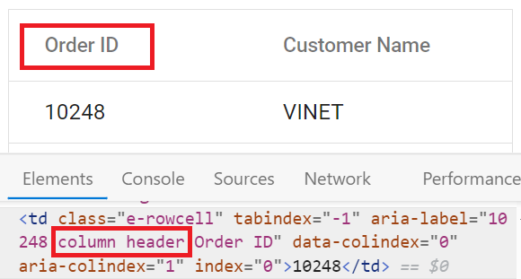
TemplateCell | is template cell | 
ClipBoard | clipboard | 
CheckBoxLabel | checkbox | 

**ColumnChooser**

Locale key words |Text | Example 
-----|-----|-----
Columnchooser | Columns | 
ChooseColumns | Choose Column | 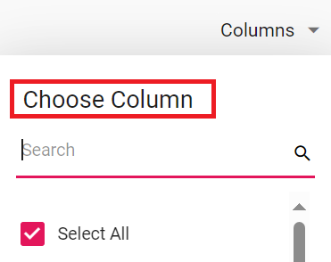
ColumnChooserDialogARIA | Column chooser | 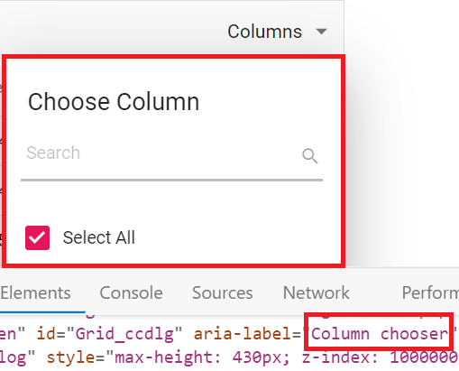

**Editing**

Locale key words |Text | Example 
-----|-----|-----
Add | Add | 
Edit| Edit | 
Cancel| Cancel | 
Update| Update | 
Delete | Delete | 
Save | Save | 
EditOperationAlert | No records selected for edit operation | 
DeleteOperationAlert | No records selected for delete operation | 
SaveButton | Save | 
OKButton | OK | 
CancelButton | Cancel | 
EditFormTitle | Details of | 
AddFormTitle | Add New Record | 
BatchSaveConfirm | Are you sure you want to save changes? | 
BatchSaveLostChanges | Unsaved changes will be lost. Are you sure you want to continue? | 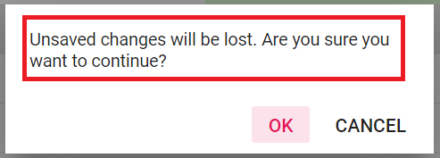
ConfirmDelete | Are you sure you want to Delete Record? | 
CancelEdit | Are you sure you want to Cancel the changes? | 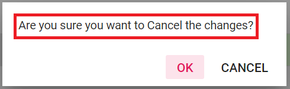
DialogEditARIA | Edit dialog | 
CommandColumnAria | is Command column column header  | 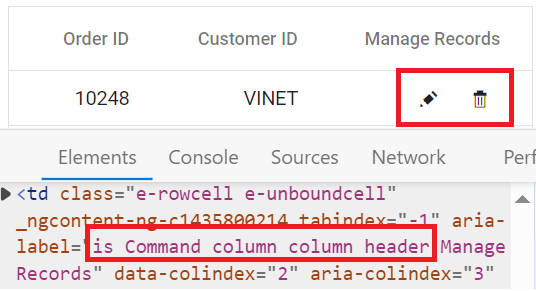
DialogEdit | Dialog edit | 

**Grouping**

Locale key words |Text | Example 
-----|-----|-----
GroupDropArea | Drag a column header here to group its column | 
UnGroup | Click here to ungroup | 
GroupDisable | Grouping is disabled for this column | 
Item | item | 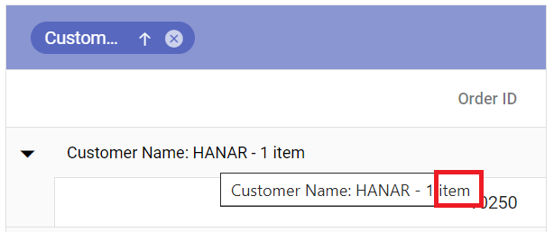
Items | items | 
UnGroupButton | Click here to ungroup |
GroupDescription | Press Ctrl space to group | 
GroupButton | Group button | 
UnGroupAria | ungroup button | 
GroupSeperator | Separator for the grouped columns | 
UnGroupIcon | ungroup the grouped column  | 
GroupedSortIcon | sort the grouped column  | 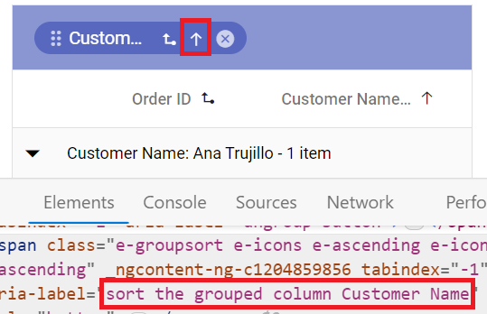
GroupedDrag | Drag the grouped column | 
GroupCaption | is groupcaption cell | 
Expanded | Expanded | 
Collapsed | Collapsed | 

**Filtering**

Locale key words |Text | Example 
-----|-----|-----
InvalidFilterMessage | Invalid Filter Data
FilterbarTitle | \s filter bar cell | 
Matchs | No Matches Found | 
FilterButton | Filter | 
ClearButton | Clear | 
StartsWith | Starts With | 
EndsWith | Ends With | 
Contains | Contains | 
Equal | Equal | 
NotEqual | Not Equal | 
LessThan | Less Than | 
LessThanOrEqual | Less Than Or Equal | 
GreaterThan | Greater Than | 
GreaterThanOrEqual | Greater Than Or Equal | 
ChooseDate | Choose a Date | 
EnterValue | Enter the value | 
SelectAll | Select All | 
Blanks | Blanks | 
FilterTrue | True | 
FilterFalse | False | 
NoResult | No Matches Found | 
ClearFilter | Clear Filter | 
NumberFilter | Number Filters | 
TextFilter | Text Filters | 
DateFilter | Date Filters | 
DateTimeFilter | DateTime Filters | 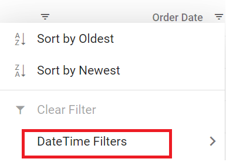
MatchCase | Match Case | 
Between | Between | 
CustomFilter | Custom Filter | 
CustomFilterPlaceHolder | Enter the value | 
CustomFilterDatePlaceHolder | Choose a date | 
AND | AND | 
OR | OR | 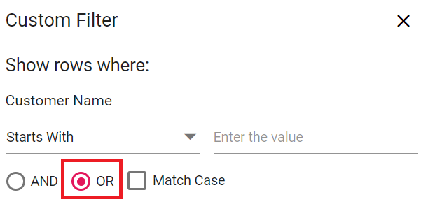
ShowRowsWhere | Show rows where: | 
NotStartsWith | Does Not Start With | 
Like | Like | 
NotEndsWith | Does Not End With | 
NotContains | Does Not Contain | 
IsNull | Null | 
NotNull | Not Null | 
IsEmpty | Empty | 
IsNotEmpty | Not Empty | 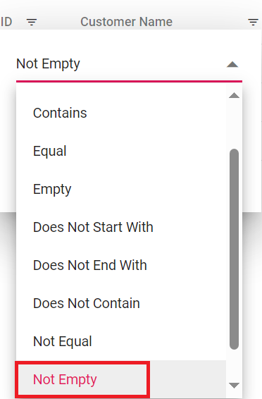
AddCurrentSelection | Add current selection to filter | 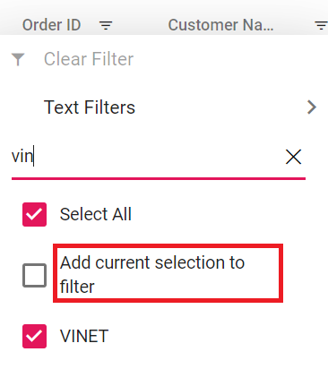
FilterMenuDialogARIA | Filter menu dialog | 
ExcelFilterDialogARIA | Excel filter dialog | 
CustomFilterDialogARIA | Custom filter dialog | 
SortAtoZ | Sort A to Z | 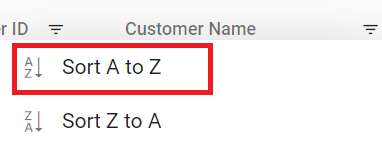
SortZtoA | Sort Z to A | 
SortByOldest | Sort by Oldest | 
SortByNewest | Sort by Newest | 
SortSmallestToLargest | Sort Smallest to Largest | 
SortLargestToSmallest | Sort Largest to Smallest | 
FilterDescription | Press Alt Down to open filter Menu | 

**Searching**

Locale key words |Text | Example 
-----|-----|-----
Search | Search | 
SearchColumns | search columns
Clear | Clear | 

**Sorting**

Locale key words |Text | Example 
-----|-----|-----
Sort | Sort | 
SortDescription | Press Enter to sort | 

**Toolbar**

Locale key words |Text | Example 
-----|-----|-----
Print | Print | 
Pdfexport | PDF Export | 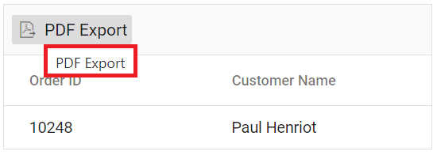
Excelexport | Excel Export | 
Csvexport | CSV Export | 

**ColumnMenu**

Locale key words |Text | Example 
-----|-----|-----
FilterMenu | Filter | 
AutoFitAll | Autofit all columns |
AutoFit | Autofit this column |
ColumnMenuDialogARIA | Column menu dialog | 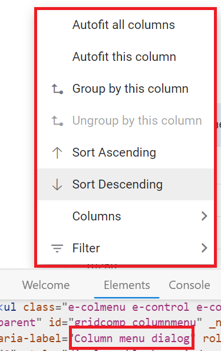
ColumnMenuDescription | Press Alt Down to open Column Menu | 

**ContextMenu**

Locale key words |Text | Example 
-----|-----|-----
Copy | Copy | 
Group | Group by this column | 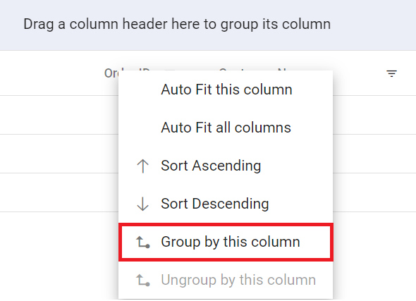
Ungroup | Ungroup by this column | 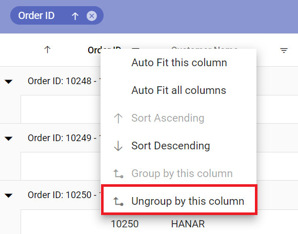
autoFitAll | Auto Fit all columns | 
autoFit | Auto Fit this column | 
Export | Export | 
FirstPage | First Page | 
LastPage | Last Page | 
PreviousPage | Previous Page | 
NextPage | Next Page | 
SortAscending | Sort Ascending | 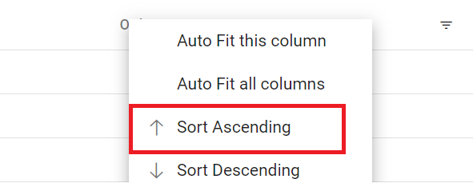
SortDescending | Sort Descending | 
EditRecord | Edit Record | 
DeleteRecord | Delete Record | 

**Pager**

Locale key words |Text | Example 
-----|-----|-----
currentPageInfo | {0} of {1} pages | 
totalItemsInfo | ({0} items) | 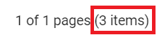
firstPageTooltip | Go to first page | 
lastPageTooltip | Go to last page | 
nextPageTooltip | Go to next page | 
previousPageTooltip | Go to previous page | 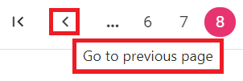
nextPagerTooltip | Go to next pager items | 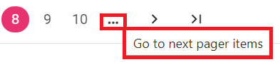
previousPagerTooltip | Go to previous pager items | 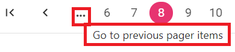
pagerDropDown | Items per page | 
pagerAllDropDown | Items | 
All | All | 
totalItemInfo | ({0} item) | 
Container | Pager Container | 
Information | Pager Information |
ExternalMsg | Pager external message | 
Page | Page  |
Of |  of  | 
Pages |  Pages |

### Loading translations for de culture

The Syncfusion Vue Grid component provides a built-in Localization library that allows you to load translation objects for different cultures. By using the **load** function of the **L10n** class, you can customize the text content of the Grid to be displayed in different languages. 

This feature allows you to specify translation objects for specific cultures, such as **Deutsch** (German), and display the Grid's content in the desired language.

The following example demonstrates how to load a translation object for **Deutsch (de)** culture, by using the **load** function of **L10n** class from the **ej2-base** module and by defining the [locale](https://ej2.syncfusion.com/vue/documentation/api/grid/#locale) to **de-DE**.









        


### Loading translations for fr culture 

The Loading translations feature allows you to specify translation objects for different cultures, such as **Deutsch**, **Arabic**, **French** and display the Grid's content in the desired language.

The following example demonstrates how to load a translation object for **French (fr)** culture, by defining the [locale](https://ej2.syncfusion.com/vue/documentation/api/grid/#locale) to **fr-FR** and by using the **load** function of **L10n** class from the **ej2-base** module.









        


### Switch the different localization

The Syncfusion Vue Grid allows you to switch the localization from one culture to another culture. This will be useful when you want to change the localization based on your requirements. 

To switch to a different localization, follow these steps:

**Step 1:** Import and load the required CLDR (Common Locale Data Repository) data for the desired culture using the loadCldr function.

```ts
loadCldr(
    cagregorian,
    currencies,
    numbers,
    timeZoneNames,
    numberingSystems
);
```

**Step 2:** To change the default culture and the currency code, you can use the methods `setCulture` for setting the locale and `setCurrencyCode` for setting the currency code.

To switch to the **French** culture and set the currency code as **EUR**, you can use the `setCulture` method and the `setCurrencyCode` method of the Grid on external button click. This is demonstrated below: 









        


## Internationalization

The Internationalization library in the Syncfusion Vue Grid provides a localized display of number, date, and time values in the Grid component based on the preferred language and region.

[Internationalization](https://ej2.syncfusion.com/vue/documentation/common/internationalization) library allows you to globalize number, date, and time values using format strings defined in the [columns.format](https://ej2.syncfusion.com/vue/documentation/api/grid/column/#format) property.

You need to load the culture format files corresponding to the desired locale. This ensures that the Grid component uses the correct format strings for number, date, and time values based on the selected culture. This can be demonstrated in the below example,









        


> * In the above sample, **Freight** column is formatted using the [NumberFormatOptions](https://ej2.syncfusion.com/vue/documentation/common/internationalization#manipulating-numbers).
> * By default, [locale](https://ej2.syncfusion.com/vue/documentation/api/grid/#locale) value is **en-US**. If you wish to change the culture to something other than **en-US**, you can simply set the `locale` property accordingly.

## Right to Left - RTL

The Right to Left (RTL) feature in the Syncfusion Vue Grid allows you to switch the text direction and layout from left-to-right to right-to-left. This feature is especially beneficial for interacting with the grid in languages that are written and read from right to left, such as **Arabic**, **Farsi,** **Urdu**, and others. Enabling RTL significantly improves the experience and accessibility for such languages.

To enable RTL in the Grid, you need to set the [enableRtl](https://ej2.syncfusion.com/vue/documentation/api/grid/#enablertl) property to **true**. By setting `enableRtl`, the grid component's text direction and layout will be adjusted to support right-to-left languages.

In the following example, the [EJ2 Toggle Switch Button](https://ej2.syncfusion.com/vue/documentation/switch/getting-started) component is added to enable or disable the Right to Left (RTL) feature for the **Arabic (ar-AE)** locale. When the switch is toggled, the [change](https://ej2.syncfusion.com/vue/documentation/api/switch/#change) event is triggered and the `enableRtl` property of the grid is updated accordingly. 









        


## See Also

* [How to apply CHF currency format in a column in Vue Grid](https://www.syncfusion.com/forums/147456/how-to-apply-chf-currency-format-in-a-column-in-vue-grid)
* [Filter the value with locale and custom format the Vue Grid](https://www.syncfusion.com/forums/165960/filter-the-value-with-locale-and-custom-format-the-vue-grid)
* [How to customize edit dialog button in Vue Grid](https://www.syncfusion.com/forums/166131/how-to-customize-edit-dialog-button-in-vue-grid)