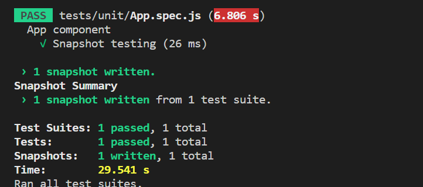

# Testing the Vue application using Jest

Vue [Jest](https://v2.vuejs.org/v2/guide/testing.html) testing is a popular approach to test Vue applications using the Jest testing framework. This approach involves the creation and execution of unit tests specifically designed for Vue components. By conducting unit testing, which focuses on testing isolated units of code like functions, methods, and components to ensure that they behave as expected. This approach validates the individual units of your Vue components, catch potential bugs early in the development process, and maintains the reliability and stability of your Vue application. To create a Jest test case for the Grid component, follow the below steps:

**Step 1: Set up the Jest testing environment**

**I. Check and install the node version:**

You need to verify if the installed version of Node is 14 or higher. If it is below version 14, you must install a version of Node above 14. You can refer the following link to install the [node version](https://nodejs.org/en/download). You can select the any node version is 14 or above and installed.

**II. Create an Vue application and install the Syncfusion Grid package:**

To create an Vue application and install the Syncfusion Grid package, you can refer to the [Getting started](https://ej2.syncfusion.com/vue/documentation/grid/getting-started) documentation.

**III. Install the Jest:**

Run the following command to install the Jest dependency using npm.

```
npm install --save-dev jest
```

**IV. How to add the unit jest test case environment:**

Run the following command to add the unit jest test case environment.

```
vue add unit-jest
npm install jest-environment-jsdom --save-dev
```


**V. How to add the test command in the script section:**

You should check that the **test** command is specified in the **script** section of the **package.json** file. If the `script` section is not specify the **test** command, you must define the **test** command in the **script** section of the **package.json** file.

```
"test": "jest"
```

**Step 2: Adding a Grid component**

Refer to the [documentation](https://ej2.syncfusion.com/vue/documentation/grid/getting-started#import-the-syncfusion-css-styles) to add the styling for the Grid component. The following code is used in this demonstration to create a Grid component. For further information on creating the Grid component, refer to the detailed [documentation](https://ej2.syncfusion.com/vue/documentation/grid/getting-started#add-syncfusion-vue-component-to-the-application).

**App.vue:**

```typescript
<template>
  <div id="app">
      <ejs-grid  id='Grid' :dataSource='data.slice(0,5)' height='315'>
          <e-columns>
              <e-column field='CustomerID' headerText='CustomerID' textAlign='Right' width=90></e-column>
              <e-column field='ContactName' headerText='ContactName' width=120></e-column>
              <e-column field='Address' headerText='Address' width=150></e-column>
              <e-column field='Country' headerText='Country' width=150></e-column>
          </e-columns>
      </ejs-grid>
  </div>
</template>
<script setup>
import { GridComponent as EjsGrid, ColumnDirective as EColumn, ColumnsDirective as EColumns } from "@syncfusion/ej2-vue-grids";
// import the your datasource instead of this
import { customerData } from './datasource';
const data = customerData;
</script>
<style>
 @import "../node_modules/@syncfusion/ej2-vue-grids/styles/material.css";
</style>
```

**Step 3: To implement the Jest test case**

You can write the Jest test case in the spec.js extension file.  You need to import the below required files in your component. You need to import the `shallowMount` function from the **@vue/test-utils** package. This function is used to render the component for vue testing.  To test a specific component, you need to import it into your testing environment. In this demo, we have written the grid component in the **App** file. So, you need to import the **App** file in the Jest test case.

```typescript
import { shallowMount } from '@vue/test-utils'
import App from '@/App.vue'
```

**I. Define test suite:**

The `describe` function is utilized to define the test suite. Within the `describe` function, use the `it` function to specify the individual test cases.

```typescript
describe('App component', () => {
  it('Length of the record', () => {
  });
});
```

**II. Types of testing:**

You need to add the different types of test cases in a `it` block.

**1. Snapshot Testing:**

The Snapshot testing involves capturing a snapshot of the rendered output of a component and comparing it against a previously stored snapshot. If the current output matches the stored snapshot, the test case will be passed successfully.

**Example:**

In the below example, the `it` block is utilized to define a test case for the **Snapshot testing**. Within the test case, the `shallowMount` function  from the **@vue/test-utils** package is used to create a shallow wrapper for the **App** component. After, the `expect` statement verifies that the rendered output matches the stored snapshot, utilizing the `toMatchSnapshot` matcher provided by Jest.

```typescript
it('Snapshot testing', () => {
  const wrapper = shallowMount(App);
  expect(wrapper).toMatchSnapshot();
});
```


**2. DOM Testing:**

The DOM testing involves testing the behavior and interact of Vue component. This goal is to ensure that the component function correctly and produce the expected output when interacting with the DOM. You can utilize libraries like **@vue/test-utils** or **@testing-library/vue** to manipulate the rendered component in the DOM testing.

**Example:**

The `it` block is used to define a test case for the "Length of the record". Within the test case, the `shallowMount` function from the **@vue/test-utils** package is used to create a shallow wrapper for the **App** component. After, you need to create the instance of grid component. We check that the data grid in the data source has the appropriate number of data records. The [dataSource](https://ej2.syncfusion.com/vue/documentation/api/grid/#datasource) property is employed to retrieve the record of the data. By utilizing this property, we can verify the accurate population of data in the grid component.

```typescript
it('Length of the record', () => {
  const wrapper = shallowMount(App);
  var gridElement = wrapper.find('#Grid');
  const gridInstance = gridElement.vm;
  expect(gridInstance.$props.dataSource).toHaveLength(5);
});
```

The following example illustrates how to create the grid sample and how to write the Jest test case.






















**Run the Jest test case:**

Run the following command to execute the Jest test case.

```
npm run test
```

> * This is only for local data. You can use the [currentViewData](https://ej2.syncfusion.com/vue/documentation/api/grid/#currentviewdata) property by rendering the remote data.
> * You can find the sample of the Unit Jest testing in DataGrid [here](https://github.com/SyncfusionExamples/DataGrid-Vue-test-case/tree/master)