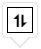
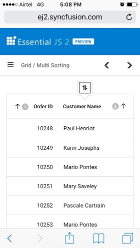

# Sorting in Vue Data Grid

The Syncfusion Vue Data Grid provides flexible sorting capabilities that help organize, analyze, and locate information efficiently. Sorting can be applied through column headers or customized to support application-specific ordering requirements.

To enable sorting in the grid, set the [allowSorting](https://ej2.syncfusion.com/vue/documentation/api/grid#allowsorting) property to `true`.

Sorting a particular column is accomplished by clicking on its column header. Each click on the header toggles the sort order between `Ascending` and `Descending`.

To use the sorting feature, inject the `Sort` module in the provide section. 









        


> * Data Grid column sorted in `Ascending` order. If a click occurs on an already sorted column, the sort direction toggles.
> * Apply and clear sorting by using the [sortColumn](https://ej2.syncfusion.com/vue/documentation/api/grid#sortcolumn) and [clearSorting](https://ej2.syncfusion.com/vue/documentation/api/grid#clearsorting) methods.
> * To disable sorting for a specific column, set the [columns.allowSorting](https://ej2.syncfusion.com/vue/documentation/api/grid/column#allowsorting) property to `false`.


## Sort order

By default, the sorting order is "ascending → descending → none".

The first click on a column header sorts the column in ascending order. A second click sorts the column in descending order. A third click clears the sorting.

> The [allowUnsort](https://ej2.syncfusion.com/vue/documentation/api/grid/sortsettings#allowunsort) property controls whether sorting can be cleared. When set to `false`, clicking a grid header will only toggle between ascending and descending order, without switching to an unsorted state. The default value is `true`.

## Initial sorting

The Data Grid component provides an option to apply initial sorting by setting the [sortSettings.columns](https://ej2.syncfusion.com/vue/documentation/api/grid/sortSettings#columns) property to the desired [field](https://ej2.syncfusion.com/vue/documentation/api/grid/sortDescriptorModel#field) and sort [direction](https://ej2.syncfusion.com/vue/documentation/api/grid/sortDescriptorModel#direction). This feature is useful for displaying data in a specific order when the grid initially loads.

The following example demonstrates setting `sortSettings.columns` for "Order ID" and "Ship City" columns with a specified [direction](https://ej2.syncfusion.com/vue/documentation/api/grid/sortDescriptorModel#direction).









        


> The initial sorting defined in [sortSettings.columns](https://ej2.syncfusion.com/vue/documentation/api/grid/sortSettings#columns) will override any sorting applied through individual interaction.

## Multi-column sorting

The Data Grid supports multi-column sorting, allowing records to be ordered using multiple sorting criteria simultaneously. Multi-column sorting makes it possible to establish hierarchical sort priorities, ensuring that records with identical values in one column can be further organized using additional columns.

To enable multi-column sorting, set the [allowSorting](https://ej2.syncfusion.com/vue/documentation/api/grid#allowsorting) and the [allowMultiSorting](https://ej2.syncfusion.com/vue/documentation/api/grid#allowmultisorting) properties to `true`. This enables sorting of multiple columns by holding the <kbd>CTRL</kbd> key and clicking the column headers. This feature is useful for datasets that require more than a single sorting dimension.

To clear multi-column sorting for a particular column, press <kbd>Shift</kbd> while clicking the column header.

> * The [allowSorting](https://ej2.syncfusion.com/vue/documentation/api/grid#allowsorting) must be `true` while enabling multi-column sort.
> * Set [allowMultiSorting](https://ej2.syncfusion.com/vue/documentation/api/grid#allowmultisorting) property as `false` to disable multi-column sorting.









        


## Disable sorting for a specific column

The Data Grid component allows disabling sorting for a column. This is useful when certain columns should not be included in the sorting process.

This is achieved by setting the [allowSorting](https://ej2.syncfusion.com/vue/documentation/api/grid#allowsorting) property of the particular column to `false`. The following example demonstrates disabling sorting for "Customer ID" column.









        



## Custom sorting

The Data Grid supports custom sorting through the [sortComparer](https://ej2.syncfusion.com/vue/documentation/api/grid/column#sortcomparer) property, providing complete control over how values are ordered within a column.

Custom sorting can be used when the required sort order differs from standard alphabetical or numerical sorting. This is useful for scenarios that require custom rankings, status-based ordering, priority sequencing, locale-aware comparisons, display-value sorting, or specialized handling of null values.

The following example demonstrates defining a custom `sortComparer` function for the "Customer ID" column.









        


> The "customSortComparer" function takes two parameters: a and b, which are the values being compared. The function returns "-1", "0", or "1", depending on the comparison result.

### Display null values always at bottom 

By default, "null" values in a Vue Data Grid are displayed at the top when sorting in descending order and at the bottom when sorting in ascending order. However, "null" values can be configured to always display at the bottom of the grid regardless of sort direction. This is achieved by utilizing the [column.sortComparer](https://ej2.syncfusion.com/vue/documentation/api/grid/column#sortcomparer)  method. This feature is particularly useful when working with data sets where "null" values might need to be clearly separated from actual data entries.

The example below demonstrates how to display "null" values at the bottom of the grid while sorting the "Order Date" column in both ascending and descending order.









        


## Foreign key sorting

Foreign-key sorting enables sorting based on displayed values rather than the underlying identifier values stored in the data source.

To sort a foreign key column based on its displayed text, the foreign key column can be enabled by using [column.dataSource](https://ej2.syncfusion.com/vue/documentation/api/grid/column#datasource), [column.foreignKeyField](https://ej2.syncfusion.com/vue/documentation/api/grid/column#foreignkeyfield) and [column.foreignKeyValue](https://ej2.syncfusion.com/vue/documentation/api/grid/column#foreignkeyvalue) properties.

### Sort foreign key column based on text for local data

When working with local data in the grid, sorting is performed based on the [foreignKeyValue](https://ej2.syncfusion.com/vue/documentation/api/grid/column#foreignkeyvalue) defined in the column. This field should be specified in the column definition with the corresponding foreign key value for each row. The grid then sorts the foreign key column according to the text representation of that value.

The following example demonstrates sorting with a foreign key column enabled, where the "Customer ID" column acts as a foreign column displaying the "Contact Name" column from foreign data.









        


> Make sure to inject the `ForeignKey` module in the provide section to ensure its availability throughout application.

### Sort foreign key column based on text for remote data

In the case of remote data in the grid, the sorting operation will be performed based on the [foreignKeyField](https://ej2.syncfusion.com/vue/documentation/api/grid/column#foreignkeyfield) property of the column. The `foreignKeyField` property should be defined in the column definition with the corresponding foreign key field name for each row. The grid will send a request to the server-side with the `foreignKeyField` name, and the server-side should handle the sorting operation and return the sorted data to the grid.

```
<template>
    <div id="app">
        <ejs-grid :dataSource='data' height='315' :allowSorting='true'>
            <e-columns>
                <e-column field='OrderID' headerText='Order ID' textAlign='Right' width=100></e-column>
                <e-column field='EmployeeID' headerText='Employee Name' width=120 foreignKeyValue='FirstName' :dataSource='employeeData'></e-column>
                <e-column field='Freight' headerText='Freight' textAlign='Right' width=80></e-column>
                <e-column field='ShipCity' headerText='Ship City' width=130  ></e-column>
            </e-columns>
        </ejs-grid>
    </div>
</template>
<script setup>
import { provide } from "vue";
import { GridComponent as EjsGrid, ColumnDirective as EColumn, ColumnsDirective as EColumns, ForeignKey, Sort } from "@syncfusion/ej2-vue-grids";
import { DataManager, ODataV4Adaptor } from "@syncfusion/ej2-data";
import { data, employeeData } from './datasource.js';
      const data: new DataManager({
        url:'/OData/Items',
        adaptor: new ODataV4Adaptor
      }),
      const employeeData: new DataManager({
        url:'/OData/Brands',
        adaptor: new ODataV4Adaptor
      })
  provide('grid',  [ForeignKey, Sort]);
</script>
<style>
  @import "../node_modules/@syncfusion/ej2-base/styles/material3.css";
  @import "../node_modules/@syncfusion/ej2-buttons/styles/material3.css";
  @import "../node_modules/@syncfusion/ej2-calendars/styles/material3.css";
  @import "../node_modules/@syncfusion/ej2-dropdowns/styles/material3.css";
  @import "../node_modules/@syncfusion/ej2-inputs/styles/material3.css";
  @import "../node_modules/@syncfusion/ej2-navigations/styles/material3.css";
  @import "../node_modules/@syncfusion/ej2-popups/styles/material3.css";
  @import "../node_modules/@syncfusion/ej2-splitbuttons/styles/material3.css";
  @import "../node_modules/@syncfusion/ej2-vue-grids/styles/material3.css";
</style>
```

The following code example describes the handling of sorting operation at server side.

```
    public class ItemsController : ODataController
    {
        [EnableQuery]
        public IQueryable<Item> Get()
        {
            List<Item> GridData = JsonConvert.DeserializeObject<Item[]>(Properties.Resources.ItemsJson).AsQueryable().ToList();
            List<Brand> empData = JsonConvert.DeserializeObject<Brand[]>(Properties.Resources.BrandsJson).AsQueryable().ToList();
            var queryString = HttpContext.Current.Request.QueryString;
            var allUrlKeyValues = ControllerContext.Request.GetQueryNameValuePairs();
            string key = allUrlKeyValues.LastOrDefault(x => x.Key == "$orderby").Value;
            if (key != null)
            {
                if (key == "EmployeeID") {
                    GridData = SortFor(key); //Only for foreignKey Column ascending
                }
                else if(key == "EmployeeID desc") {
                    GridData = SortFor(key); //Only for foreignKey Column descending
                }
            }
            var count = GridData.Count();
            var data = GridData.AsQueryable();
            return data;
        }

        public List<Item> SortFor(String Sorted)
        {
            List<Item> GridData = JsonConvert.DeserializeObject<Item[]>(Properties.Resources.ItemsJson).AsQueryable().ToList();
            List<Brand> empData = JsonConvert.DeserializeObject<Brand[]>(Properties.Resources.BrandsJson).AsQueryable().ToList();
            if (Sorted == "EmployeeID") //check whether ascending or descending
                empData = empData.OrderBy(e => e.FirstName).ToList();
            else if(Sorted == "EmployeeID desc")
                empData = empData.OrderByDescending(e => e.FirstName).ToList();
            List<Item> or = new List<Item>();
            for (int i = 0; i < empData.Count(); i++) {
                //Select the Field matching records
                IEnumerable<Item> list = GridData.Where(pred => pred.EmployeeID == empData[i].EmployeeID).ToList();
                or.AddRange(list);
            }
            return or;
        }
    }
```

## Culture-based sorting

Culture-based sorting applies locale-specific comparison rules, ensuring accurate sorting behavior for multilingual and internationalized applications.

Culture-specific sorting is achieved by utilizing the [locale](https://ej2.syncfusion.com/vue/documentation/api/grid#locale) property. By setting the `locale` property to the desired culture code, sorting is enabled based on that specific culture.

In the following example, sorting is performed based on the "ar" locale using the [column.sortComparer](https://ej2.syncfusion.com/vue/documentation/api/grid/column#sortcomparer) property.









        


## Touch interaction

On touch devices, tapping a grid header sorts that column . 
For multi‑column sorting, tap the sorting indicator  and then tap the additional grid headers to include them in the sort order.

> The [allowMultiSorting](https://ej2.syncfusion.com/vue/documentation/api/grid#allowmultisorting) and [allowSorting](https://ej2.syncfusion.com/vue/documentation/api/grid#allowsorting) must be `true` then only the popup will be shown.

The following screenshot represents a grid touch sorting in the device.



## Programmatic sorting

The Data Grid component in Syncfusion's Vue suite allows customization of column sorting and provides flexibility in sorting based on external interactions. Sort columns, remove a sort column, and clear sorting using an external button click.

### Add sort columns

External column sorting is accomplished using the [sortColumn](https://ej2.syncfusion.com/vue/documentation/api/grid#sortcolumn) method with parameters `columnName`, `direction`, and `isMultiSort`. This method enables programmatic sorting of a specific column based on specified requirements.

The following example demonstrates adding sort columns to a grid. The `DropDownList` component selects the column and sort direction. When an external button is clicked, the [sortColumn](https://ej2.syncfusion.com/vue/documentation/api/grid#sortcolumn) method is called with the specified `columnName`, `direction`, and `isMultiSort` parameters.









        


### Remove sort columns

External removal of sort columns is accomplished using the `removeSortColumn` method provided by the Data Grid component. This method removes the sorting applied to a specific column.

The following example demonstrates removing sort columns. The `DropDownList` component selects the column. When an external button is clicked, the `removeSortColumn` method removes the selected sort column.









        


### Clear sorting 

Sorting is cleared on an external button click using the [clearSorting](https://ej2.syncfusion.com/vue/documentation/api/grid#clearsorting) method provided by the grid component. This method clears the sorting applied to all columns in the grid. 

The following example demonstrates clearing sorting using the `clearSorting` method in an external button click.









        


## Sorting events

The Data Grid component provides two events related to sorting, such as `actionBegin` and `actionComplete`. These events can be used to perform custom actions before and after the sorting process is completed.

1. **actionBegin**: [actionBegin](https://ej2.syncfusion.com/vue/documentation/api/grid#actionbegin) event is triggered before the sorting action begins. It provides a way to perform any necessary operations before the sorting action takes place. This event provides a parameter that contains the current grid state, including the current sorting column, direction, and data.

2. **actionComplete**: [actionComplete](https://ej2.syncfusion.com/vue/documentation/api/grid#actioncomplete) event is triggered after the sorting action is completed. It provides a way to perform any necessary operations after the sorting action has taken place. This event provides a parameter that contains the current grid state, including the sorted data and column information.

This example demonstrates that the `actionBegin` event is used to cancel sorting for the "Order ID" column, while the `actionComplete` event displays a message after the sorting action finishes.




<template>
    <div id="app">
      <div style="margin-left:180px"><p style="color:red;" id="message">{{ message }}</p></div>
      <ejs-grid :dataSource='data' :actionComplete='actionComplete' :actionBegin='actionBegin' :allowSorting='true' height='315px'>
        <e-columns>
          <e-column field='OrderID' headerText='Order ID' textAlign='Right' width=90></e-column>
          <e-column field='CustomerID' headerText='Customer ID' width=100></e-column>
          <e-column field='ShipCity' headerText='Ship City' width=100></e-column>
          <e-column field='ShipName' headerText='Ship Name' width=120></e-column>
        </e-columns>
      </ejs-grid>
    </div>
</template>
<script setup>
import { provide, ref } from "vue";
import { GridComponent as EjsGrid, ColumnDirective as EColumn, ColumnsDirective as EColumns, Sort } from "@syncfusion/ej2-vue-grids";
import { data } from './datasource.js';
const message = ref(null);
const actionBegin = (args) => {
  if (args.requestType === 'sorting' && args.columnName === 'OrderID') {
    args.cancel = true;
    message.value = args.requestType + ' action cancelled for ' + args.columnName + ' column';
  }
}
const actionComplete = (args) => {
  message.value = args.requestType + ' action completed for ' + args.columnName + ' column';
}
  provide('grid',  [Sort]);
</script>
<style>
  @import "../node_modules/@syncfusion/ej2-base/styles/material3.css";
  @import "../node_modules/@syncfusion/ej2-buttons/styles/material3.css";
  @import "../node_modules/@syncfusion/ej2-calendars/styles/material3.css";
  @import "../node_modules/@syncfusion/ej2-dropdowns/styles/material3.css";
  @import "../node_modules/@syncfusion/ej2-inputs/styles/material3.css";
  @import "../node_modules/@syncfusion/ej2-navigations/styles/material3.css";
  @import "../node_modules/@syncfusion/ej2-popups/styles/material3.css";
  @import "../node_modules/@syncfusion/ej2-splitbuttons/styles/material3.css";
  @import "../node_modules/@syncfusion/ej2-vue-grids/styles/material3.css";
</style>




<template>
    <div id="app">
      <div style="margin-left:180px"><p style="color:red;" id="message">{{ message }}</p></div>
      <ejs-grid :dataSource='data' :actionComplete='actionComplete' :actionBegin='actionBegin' :allowSorting='true' height='315px'>
        <e-columns>
          <e-column field='OrderID' headerText='Order ID' textAlign='Right' width=90></e-column>
          <e-column field='CustomerID' headerText='Customer ID' width=100></e-column>
          <e-column field='ShipCity' headerText='Ship City' width=100></e-column>
          <e-column field='ShipName' headerText='Ship Name' width=120></e-column>
        </e-columns>
      </ejs-grid>
    </div>
</template>
<script>
import { GridComponent, ColumnDirective, ColumnsDirective, Sort } from "@syncfusion/ej2-vue-grids";
import { data } from './datasource.js';
export default {
name: "App",
components: {
"ejs-grid":GridComponent,
"e-columns":ColumnsDirective,
"e-column":ColumnDirective
},
  data() {
    return {
      data: data,
      message:''
    };
  },
  methods: {
    actionBegin(args) {
      if (args.requestType === 'sorting' && args.columnName === 'OrderID') {
        args.cancel = true;
        this.message = args.requestType + ' action cancelled for ' + args.columnName + ' column';
      }
    },
    actionComplete(args) {
      this.message = args.requestType + ' action completed for ' + args.columnName + ' column';
    }
  },
  provide: {
    grid: [Sort]
  }
}
</script>
<style>
  @import "../node_modules/@syncfusion/ej2-base/styles/material3.css";
  @import "../node_modules/@syncfusion/ej2-buttons/styles/material3.css";
  @import "../node_modules/@syncfusion/ej2-calendars/styles/material3.css";
  @import "../node_modules/@syncfusion/ej2-dropdowns/styles/material3.css";
  @import "../node_modules/@syncfusion/ej2-inputs/styles/material3.css";
  @import "../node_modules/@syncfusion/ej2-navigations/styles/material3.css";
  @import "../node_modules/@syncfusion/ej2-popups/styles/material3.css";
  @import "../node_modules/@syncfusion/ej2-splitbuttons/styles/material3.css";
  @import "../node_modules/@syncfusion/ej2-vue-grids/styles/material3.css";
</style>



        


> [args.requestType](https://ej2.syncfusion.com/vue/documentation/api/grid/sortEventArgs#requesttype) refers to the current action being performed. For example in sorting, the `args.requestType` value is `sorting`.

## Customizing the sort icon

Sort icon customization in the grid is accomplished by overriding the default grid classes `.e-icon-ascending` and `.e-icon-descending` with custom content using CSS. The desired icons or symbols are specified using the `content` property as shown below:

```css
.e-grid .e-icon-ascending::before {
  content: '\e306';
}
	
.e-grid .e-icon-descending::before {
  content: '\e304';
}
```
The following sample demonstrates a grid rendered with a customized sort icon.









        


## See also

* [Switching the column sort order between ascending and descending order in Vue Data Grid](https://www.syncfusion.com/forums/162157/switching-the-column-sort-order-between-ascending-and-descending-order-in-vue-grid)