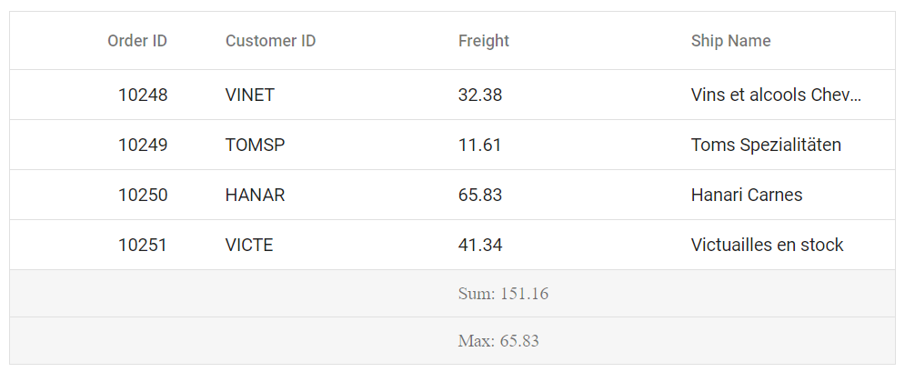

# Aggregate in Vue Grid component

You can customize the appearance of aggregate elements in the Syncfusion Vue Grid component using CSS. Below are examples of how to customize the aggregate root element and the aggregate cell elements.

## Customizing the aggregate root element

To customize the appearance of the Grid's aggregate root elements, you can use the following CSS code:

```css
.e-grid .e-gridfooter {
    font-family: cursive;
}
```

In this example, the **e-gridfooter** class represents the root element of the aggregate row in the grid footer. You can modify the `font-family` property to change the font of the aggregate root element.



## Customizing the aggregate cell elements

To customize the appearance of the Grid's aggregate cell elements (summary row cell elements), you can use the following CSS code:

```css
.e-grid .e-summaryrow .e-summarycell {
    background-color: #deecf9;
}
```

In this example, the **e-summaryrow** class represents the summary row containing aggregate cells, and the **e-summarycell** class targets individual aggregate cells within the summary row. You can modify the `background-color` property to change the `color` of the aggregate cell elements.

