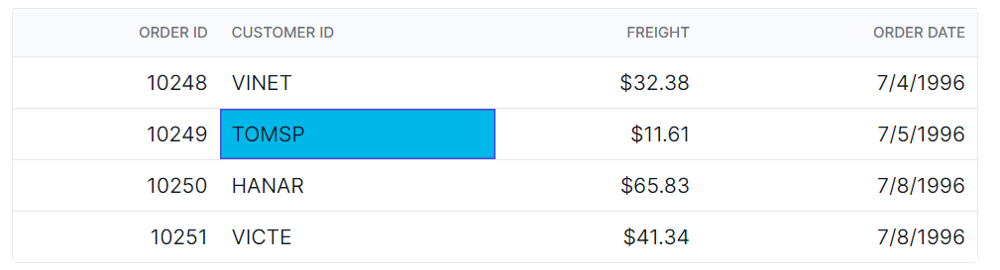

# Selection in Vue Grid component

You can customize the appearance of the selection in the Syncfusion Vue Grid component using CSS. Here are examples of how to customize the row selection background, cell selection background, and column selection background.

## Customizing the row selection background

To customize the appearance of row selection, you can use the following CSS code:

```css

.e-grid td.e-selectionbackground {
    background-color: #00b7ea;
}
```
In this example, the **.e-selectionbackground** class targets the background color of the row selection. You can modify the `background-color` property to change the background color of the selected rows.


## Customizing the cell selection background

To customize the appearance of cell selection, you can use the following CSS code:

```css
.e-grid td.e-cellselectionbackground {
    background-color: #00b7ea;
}
```

In this example, the **.e-cellselectionbackground** class targets the background color of the cell selection. You can modify the `background-color` property to change the background color of the selected cells.



## Customizing the column selection background

To customize the appearance of column selection, you can use the following CSS code:

```css
.e-grid .e-columnselection {
    background-color: #aec2ec;
}
```
In this example, the **.e-columnselection** class targets the background color of the column selection. You can modify the `background-color` property to change the background color of the selected columns.

