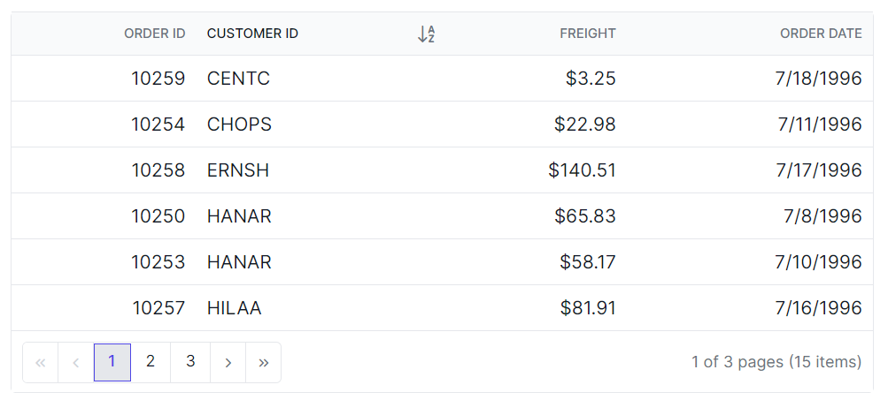
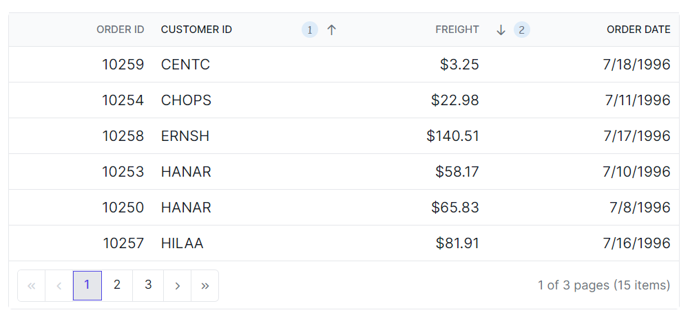

# Sorting in Vue Grid component

You can customize the appearance of the sorting icons and multi sorting icons in the Syncfusion Vue Grid component using CSS.You can use the available Syncfusion [icons](https://ej2.syncfusion.com/documentation/appearance/icons/#material) based on your theme. Here's how to do it:

## Customizing the grid sorting icon

To customize the sorting icon that appears in the Grid header when sorting is applied, you can use the following CSS code:

```css
.e-grid .e-icon-ascending::before {
    content: '\e7a3'; /* Icon code for ascending order */
}
.e-grid .e-icon-descending::before {
    content: '\e7b6'; /* Icon code for descending order */
}
```
In this example, the **.e-icon-ascending::before** class targets the sorting icon for ascending order, and the **.e-icon-descending::before** class targets the sorting icon for descending order.



## Customizing the grid multi sorting icon

To customize the multi sorting icon that appears in the grid header when multiple columns are sorted, you can use the following CSS code:

```css
.e-grid .e-sortnumber {
    background-color: #deecf9;
    font-family: cursive;
}
```

In this example, the **.e-sortnumber** class targets the background color and font family of the multi sorting icon. You can modify the `background-color` and `font-family` properties to customize the appearance of the multi sorting icon.

