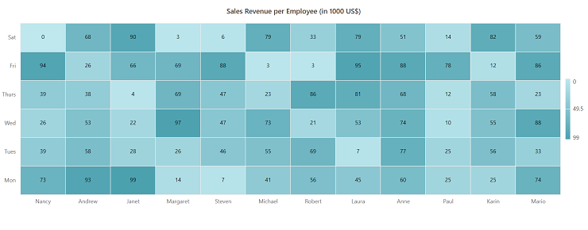

# Getting Started with Syncfusion HeatMap Component in Vue 3

This section explains how to use HeatMap component in Vue 3 application.

## Prerequisites

[System requirements for Syncfusion Vue UI components](https://ej2.syncfusion.com/vue/documentation/system-requirements/)

## Creating Vue application using Vue CLI

The easiest way to create a Vue application is to use the [`Vue CLI`](https://github.com/vuejs/vue-cli). Vue CLI versions above [`4.5.0`](https://v3.vuejs.org/guide/migration/introduction.html#vue-cli) are mandatory for creating applications using Vue 3. Use the following command to uninstall older versions of the Vue CLI.

```bash
npm uninstall vue-cli -g
```

Use the following commands to install the latest version of Vue CLI.

```bash
npm install -g @vue/cli
npm install -g @vue/cli-init
```

Create a new project using the command below.

```bash
vue create quickstart
cd quickstart
```

Initiating a new project prompts us to choose the type of project to be used for the current application. Select the option `Default (Vue 3)` from the menu.


## Adding Syncfusion HeatMap package in the application

Syncfusion Vue packages are maintained in the [`npmjs.com`](https://www.npmjs.com/~syncfusionorg) registry.
The HeatMap component will be used in this example. To install it use the following command.

```bash
npm install @syncfusion/ej2-vue-heatmap --save
```

## Adding Syncfusion Vue HeatMap component in the application

You have completed all the necessary configurations needed  for rendering the Syncfusion Vue component. Now, you are going to add the HeatMap component using following steps.

1. Import the HeatMap component in the `<script>` section of the `src/App.vue` file.

      ```
      <script>
      import { HeatMapComponent } from "@syncfusion/ej2-vue-heatmap";
      </script>
      ```

2. Register the HeatMap component as like in the below code snippet.

      ```js
      import { HeatMapComponent } from "@syncfusion/ej2-vue-heatmap";

      export default {
          name: "App",
          components: {
            "ejs-heatmap": HeatMapComponent
          }
      }
      ```

3. Add the component definition in template section.

    ```
    <template>
      <ejs-heatmap id="heatmap" :dataSource='dataSource' :xAxis='xAxis' :yAxis='yAxis' :titleSettings='titleSettings' :legendSettings='legendSettings' :cellSettings='cellSettings'  :showTooltip='showTooltip'></ejs-heatmap>
    </template>

    ```

    >Note: The heat map components are segregated into individual feature-wise modules. To use its feature, you need to inject its feature by using `provide`.

4. Summarizing the above steps, update the `src/App.vue` file with following code.

    ```
    <template>
      <ejs-heatmap id="heatmap" :dataSource='dataSource' :xAxis='xAxis' :yAxis='yAxis' :titleSettings='titleSettings' :legendSettings='legendSettings' :cellSettings='cellSettings'  :showTooltip='showTooltip'></ejs-heatmap>
    </template>

    <script>

    import { HeatMapComponent, Tooltip, Legend } from "@syncfusion/ej2-vue-heatmap";

    export default {
        name: "App",
        components: {
          "ejs-heatmap": HeatMapComponent
        },
        provide: {
          heatmap:[Tooltip, Legend]
        },
        data() {
          return {
            xAxis: {
              labels: ['Nancy', 'Andrew','Janet', 'Margaret', 'Steven', 'Michael', 'Robert', 'Laura', 'Anne', 'Paul', 'Karin', 'Mario'],
            },
            yAxis:{
              labels: ['Mon', 'Tues', 'Wed', 'Thurs', 'Fri', 'Sat'],
            },
            cellSettings: {
                showLabel: true,
            },
            titleSettings: {
                text: 'Sales Revenue per Employee (in 1000 US$)',
                textStyle: {
                    size: '15px',
                    fontWeight: '500',
                    fontStyle: 'Normal',
                    fontFamily: 'Segoe UI'
                }
            },
            dataSource: [
                [73, 39, 26, 39, 94, 0],
                [93, 58, 53, 38, 26, 68],
                [99, 28, 22, 4, 66, 90],
                [14, 26, 97, 69, 69, 3],
                [7, 46, 47, 47, 88, 6],
                [41, 55, 73, 23, 3, 79],
                [56, 69, 21, 86, 3, 33],
                [45, 7, 53, 81, 95, 79],
                [60, 77, 74, 68, 88, 51],
                [25, 25, 10, 12, 78, 14],
                [25, 56, 55, 58, 12, 82],
                [74, 33, 88, 23, 86, 59]
            ],
            legendSettings: {
                visible:true,
                position: 'Right',
                showLabel: true,
                height: "150"
            },
            showTooltip:true
        }
      }
    }
    </script>
    ```

## Running the application

Run the application using the following command.

```bash
npm run serve
```

Web server will be initiated, Open the quick start app in the browser at port [`localhost:8080`](http://localhost:8080/).


