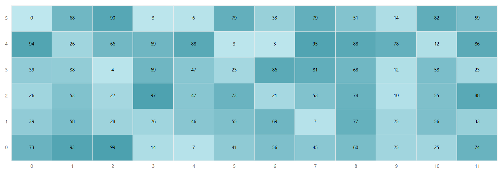

# Getting Started with Vue 3 HeatMap Chart

This article provides a step-by-step guide to creating a [Vite](https://vite.dev/) JavaScript project and integrating the Syncfusion<sup style="font-size:70%">&reg;</sup> Vue HeatMap component using either the [Composition API](https://vuejs.org/guide/introduction.html#composition-api) or the [Options API](https://vuejs.org/guide/introduction.html#options-api).

The HeatMap represents two-dimensional data through color variations. Each matrix value is rendered as a cell whose color indicates its magnitude.

You can explore some useful features in the HeatMap component using the video below.



## Prerequisites

Ensure that the development environment meets the [system requirements for Syncfusion<sup style="font-size:70%">&reg;</sup> Vue UI components](https://ej2.syncfusion.com/vue/documentation/system-requirements).

## Set Up the Vite Project

Create a Vite project using either npm or yarn.

**npm**

```bash
npm create vite@latest my-app -- --template vue
```

**yarn**

```bash
yarn create vite my-app --template vue
```

Navigate to the project directory:

```bash
cd my-app
```

Install the project dependencies using the selected package manager:

**npm**

```bash
npm install
```

**yarn**

```bash
yarn install
```

> **Note:** To create a TypeScript project, use the `vue-ts` template instead of `vue`.

## Add the Syncfusion<sup style="font-size:70%">&reg;</sup> Vue HeatMap Package

Syncfusion<sup style="font-size:70%">&reg;</sup> Vue packages are published on [npm](https://www.npmjs.com/search?q=ej2-vue).

Install the `@syncfusion/ej2-vue-heatmap` package using either npm or yarn.

**npm**

```bash
npm install @syncfusion/ej2-vue-heatmap
```

**yarn**

```bash
yarn add @syncfusion/ej2-vue-heatmap
```

Confirm that `@syncfusion/ej2-vue-heatmap` appears in `package.json` and the package-manager lock file.

## Add the Syncfusion<sup style="font-size:70%">&reg;</sup> Vue HeatMap Component

The following steps build the component progressively. Use the complete examples later in this article as the copy-ready versions.

**Step 1:** Import and Register the Component

Import the HeatMap component in **src/App.vue**.

In the Composition API example, use the `<script setup>` syntax. Components imported in this block are available to the template without a `components` option.




<script setup>
import { HeatMapComponent as EjsHeatmap } from '@syncfusion/ej2-vue-heatmap';
</script>




<script>
import { HeatMapComponent } from '@syncfusion/ej2-vue-heatmap';

export default {
  name: 'App',
  components: {
    'ejs-heatmap': HeatMapComponent
  }
};
</script>




**Step 2:** Declare the HeatMap Data

Add the following values to the existing `<script setup>` block for the Composition API or to `data()` inside the existing `export default` object for the Options API.

Each inner array represents one x-axis category and must contain one numeric value for every y-axis category. All rows must have the same length.




<script setup>
const dataSource = [
  [73, 39, 26, 39, 94, 0],
  [93, 58, 53, 38, 26, 68],
  [99, 28, 22, 4, 66, 90],
  [14, 26, 97, 69, 69, 3],
  [7, 46, 47, 47, 88, 6],
  [41, 55, 73, 23, 3, 79],
  [56, 69, 21, 86, 3, 33],
  [45, 7, 53, 81, 95, 79],
  [60, 77, 74, 68, 88, 51],
  [25, 25, 10, 12, 78, 14],
  [25, 56, 55, 58, 12, 82],
  [74, 33, 88, 23, 86, 59]
];

</script>




<script>
export default {
  data() {
    return {
      dataSource: [
        [73, 39, 26, 39, 94, 0],
        [93, 58, 53, 38, 26, 68],
        [99, 28, 22, 4, 66, 90],
        [14, 26, 97, 69, 69, 3],
        [7, 46, 47, 47, 88, 6],
        [41, 55, 73, 23, 3, 79],
        [56, 69, 21, 86, 3, 33],
        [45, 7, 53, 81, 95, 79],
        [60, 77, 74, 68, 88, 51],
        [25, 25, 10, 12, 78, 14],
        [25, 56, 55, 58, 12, 82],
        [74, 33, 88, 23, 86, 59]
      ]
    };
  }
};
</script>




**Step 3:** Define the HeatMap in the Template

Add the HeatMap to the `template` section of **src/App.vue**.

- [`dataSource`](https://ej2.syncfusion.com/vue/documentation/api/heatmap#datasource) supplies the two-dimensional numeric data.




<template>
  <div id="app">
    <ejs-heatmap id="heatmap" :dataSource="dataSource"></ejs-heatmap>
  </div>
</template>




Here is the summarized code for the above steps. Replace the contents of **src/App.vue** with either complete example.




<template>
  <div id="app">
    <ejs-heatmap id="heatmap" :dataSource="dataSource"></ejs-heatmap>
  </div>
</template>

<script setup>
import { HeatMapComponent as EjsHeatmap } from '@syncfusion/ej2-vue-heatmap';

const dataSource = [
  [73, 39, 26, 39, 94, 0],
  [93, 58, 53, 38, 26, 68],
  [99, 28, 22, 4, 66, 90],
  [14, 26, 97, 69, 69, 3],
  [7, 46, 47, 47, 88, 6],
  [41, 55, 73, 23, 3, 79],
  [56, 69, 21, 86, 3, 33],
  [45, 7, 53, 81, 95, 79],
  [60, 77, 74, 68, 88, 51],
  [25, 25, 10, 12, 78, 14],
  [25, 56, 55, 58, 12, 82],
  [74, 33, 88, 23, 86, 59]
];
</script>




<template>
  <div id="app">
    <ejs-heatmap id="heatmap" :dataSource="dataSource"
    ></ejs-heatmap>
  </div>
</template>

<script>
import { HeatMapComponent } from '@syncfusion/ej2-vue-heatmap';

export default {
  name: 'App',
  components: {
    'ejs-heatmap': HeatMapComponent
  },
  data() {
    return {
      dataSource: [
        [73, 39, 26, 39, 94, 0],
        [93, 58, 53, 38, 26, 68],
        [99, 28, 22, 4, 66, 90],
        [14, 26, 97, 69, 69, 3],
        [7, 46, 47, 47, 88, 6],
        [41, 55, 73, 23, 3, 79],
        [56, 69, 21, 86, 3, 33],
        [45, 7, 53, 81, 95, 79],
        [60, 77, 74, 68, 88, 51],
        [25, 25, 10, 12, 78, 14],
        [25, 56, 55, 58, 12, 82],
        [74, 33, 88, 23, 86, 59]
      ],
    };
  }
};
</script>




## Run the Application

Save **src/App.vue**, and then start the development server.

**npm**

```bash
npm run dev
```

**yarn**

```bash
yarn run dev
```

Open the URL displayed in the terminal, commonly `http://localhost:5173`, and verify that the HeatMap displays. Press `Ctrl+C` to stop the server.



## Troubleshooting

- **The HeatMap is not rendered.** Verify that `HeatMapComponent` is imported or registered correctly and check the browser console for package, runtime, or licensing errors.
- **The HeatMap is blank.** Verify that `dataSource` is a nonempty rectangular array containing numeric values.
- **A module-not-found error occurs.** Verify that `@syncfusion/ej2-vue-heatmap` appears in `package.json`, reinstall dependencies, and restart the development server.
- **A package or Vue version error occurs.** Confirm that the installed package release supports Vue 3 and the project's Node.js version.

For additional assistance, refer to the [Vue HeatMap API documentation](https://ej2.syncfusion.com/vue/documentation/api/heatmap).

## See Also

- [Vue HeatMap axis](https://ej2.syncfusion.com/vue/documentation/heatmap-chart/axis)
- [Vue HeatMap legend](https://ej2.syncfusion.com/vue/documentation/heatmap-chart/legend)
- [Vue HeatMap palette](https://ej2.syncfusion.com/vue/documentation/heatmap-chart/palette)
- [Vue HeatMap tooltip](https://ej2.syncfusion.com/vue/documentation/heatmap-chart/tooltip)
- [Vue HeatMap examples](https://ej2.syncfusion.com/vue/demos/#/material3/heat-map-chart/default-functionalities.html)
- [Composition API with TypeScript](https://ej2.syncfusion.com/vue/documentation/getting-started/vue-3-ts-composition)
- [Options API with TypeScript](https://ej2.syncfusion.com/vue/documentation/getting-started/vue-3-ts-options)
