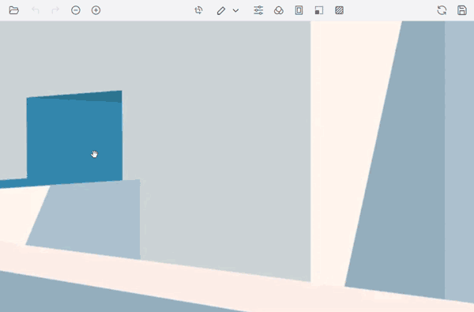
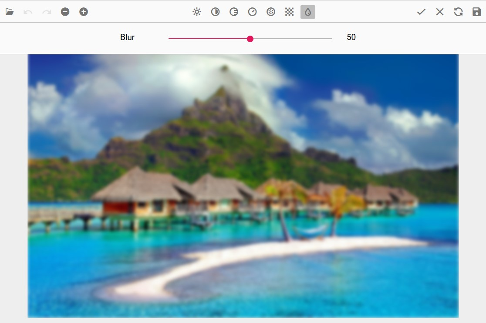
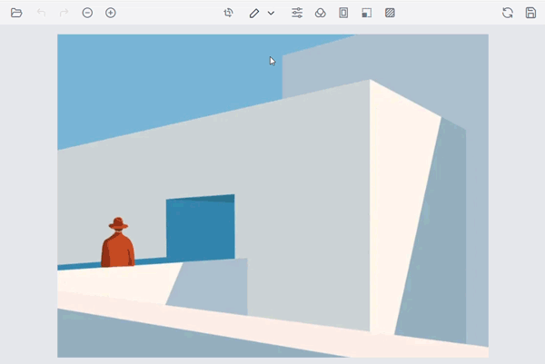
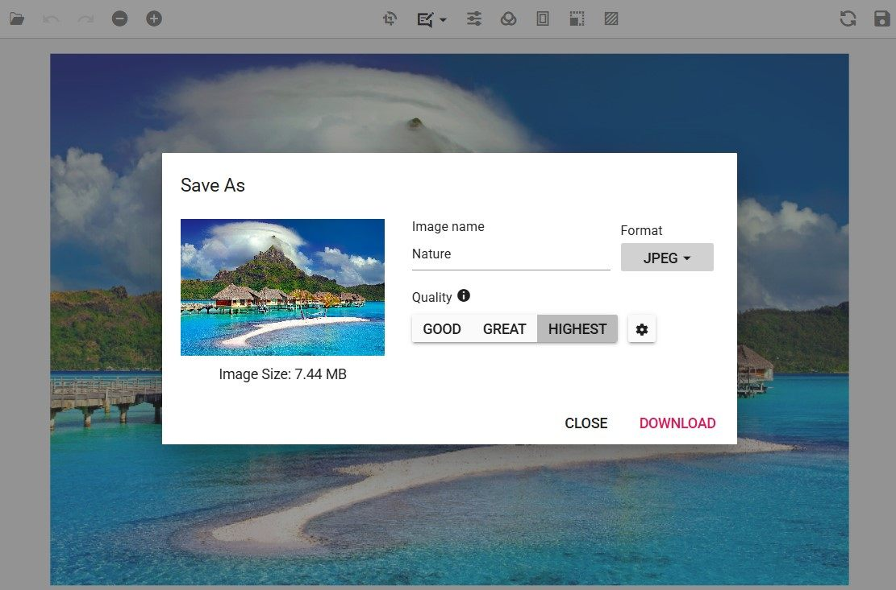

# End-user Capabilities in the Vue Image Editor component

The following operations are available for end-users and the same is explained briefly in these sections.

## Open an image

To open an image in the image editor, do the following steps.

* Click the Open icon from the left side of the toolbar.

* The file explorer lists only JPEG, PNG, JPG, WEBP, and BMP format files.

* Select the image from the file explorer window.

## Zooming

You can zoom the image in the following ways.

* Using the toolbar.

* Using pinch zoom on touch-enabled devices.

* Using the mouse wheel.

* Using the keyboard.

### Using toolbar

Click the Zoom In or Zoom Out button in the toolbar to change the zoom level.

### Using pinch

* Touch with two fingers to perform zooming.

* The zoom level is controlled by the pinch gesture.

### Using mouse wheel

* Press the <kbd>Ctrl</kbd> key and scroll the mouse wheel to zoom.

* The zoom direction is controlled by the mouse wheel scroll direction.

### Using keyboard

* Press <kbd>Ctrl</kbd> + <kbd>+</kbd> to zoom in.

* Press <kbd>Ctrl</kbd> + <kbd>-</kbd> to zoom out.

## Panning

To pan an image in the image editor:

* Click and drag the image to move it.

* Panning is enabled in the following cases:

    * When a selection is applied for cropping the image.

    * When the image size exceeds the canvas size while zoomed in.

On touch devices, panning is also available by dragging with a single finger.

## Cropping and image transformation

To crop an image in the image editor:

* Cropping is performed based on a selection in the image editor.

* Click the Crop button in the toolbar to open the contextual toolbar, which shows crop selection, rotate, flip, and straightening options.

* Click the crop selection button and choose the type of selection from the popup. Supported types are: **Custom**, **Circle**, **Square**, and **Ratio**.

* Once a selection is made, pan the image to position the cropped region.

* Use the rotate and flip buttons along with the straighten slider to perform image transformations, including any inserted annotations.

* Once the cropping region is finalized, click the Apply (tick) icon at the top right of the toolbar to crop the image.

## Annotations

To add annotations to an image in the image editor:

* Click the Annotation button in the toolbar and select the annotation type: **Line**, **Rectangle**, **Ellipse**, **Path**, **Arrow**, **Text**, or **Freehand drawing**.

* Once an annotation is added, you can reposition it by clicking and dragging, and resize it by dragging the selection handles around the annotation.

* To rotate an annotation, drag the rotation handle located at the bottom of the selected annotation. Rotation is available for all annotation types except text annotations.

* Customize the annotations through the contextual toolbar: change stroke color, stroke width, and fill color for shapes; for text annotations, also adjust font family, font size, and text formatting (bold, italic, underline, strikethrough). The contextual toolbar is enabled whenever an annotation is selected.

* When an annotation is selected, the quick access toolbar becomes active, providing convenient access to actions such as duplicating, deleting, or editing text associated with the selected annotation. This toolbar enables users to perform common operations quickly and efficiently, streamlining their workflow and enhancing the overall editing experience.

## Filtering and fine-tune

### Fine-tune

To fine-tune an image in the image editor:

* Click the Fine-tune button to display the available fine-tune options: **Brightness**, **Contrast**, **Hue**, **Saturation**, **Exposure**, **Blur**, **Sharpen**, and **Opacity**. Each option exposes a slider (typically `0`–`100` for color adjustments and `0`–`100` for opacity).

* Click one of the options to open its slider, then adjust to the desired value.

* Click on the canvas or click the Apply (tick) icon at the top right of the toolbar to apply the modifications.

### Filters

To apply filters to an image in the image editor:

* Click the Filter button to display the available filters: **Chrome**, **Cold**, **Warm**, **Grayscale**, **Sepia**, **Invert**, and **Sharpen**.

* Click a filter to apply it to the image.

* Click on the canvas or click the Apply (tick) icon at the top right of the toolbar to apply the modifications.

## Undo and redo the operations

To undo and redo actions performed in the image editor:

* The Undo button is enabled once an action is performed.

* The Redo button is enabled once an Undo action is performed.

* Click the Undo or Redo button on the left side of the toolbar to perform the corresponding operation.

* <kbd>Ctrl</kbd> + <kbd>Z</kbd> and <kbd>Ctrl</kbd> + <kbd>Y</kbd> facilitate this process by allowing users to undo and redo actions, respectively. The history is cleared when the image is reset.

## Reset an image

To revert all the changes done in the image editor:

* Click the Reset button on the right side of the toolbar.

* This reverts all the changes performed in the image editor.

## Export an image

To save the modified image in the Image Editor, follow these steps:

* **Click the Save button**
    * Locate the Save button on the right side of the toolbar and click it.

* **Select the file format**
    * In the export popup, choose your preferred file format (PNG, JPEG, SVG, or WEBP) to save the image with the applied modifications.

* **Adjust image quality (JPEG format only)**
    * When saving in JPEG, use the Image Quality slider to set the desired quality level (`0`–`100`, default `90`). A higher value retains more detail but increases file size.

* **Download the image**
    * Click Download to save the modified image to your device.

* **Use the keyboard shortcut (<kbd>Ctrl</kbd> + <kbd>S</kbd>)**
    * Press <kbd>Ctrl</kbd> + <kbd>S</kbd> to download the image in the same format as the loaded image without opening the Save dialog. For example, if the loaded image is PNG, it will be saved as PNG.

