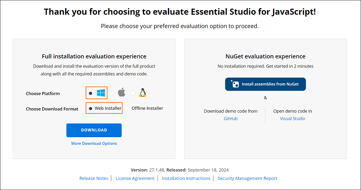
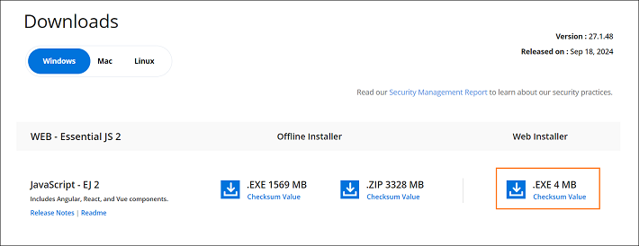
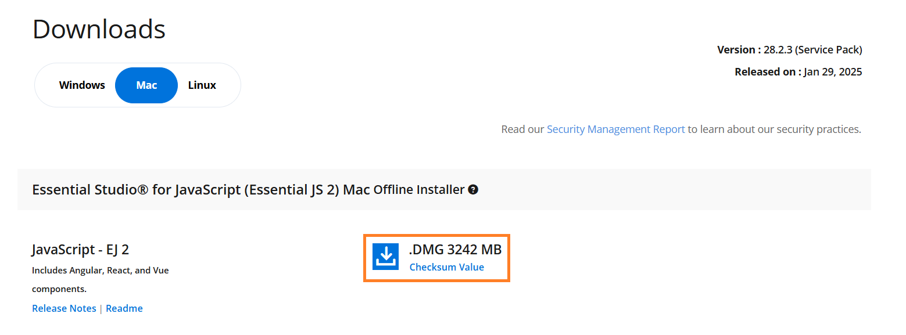

# Download JavaScript – EJ2 Installer

The Syncfusion&reg; JavaScript - EJ2 installer can be downloaded from the Syncfusion&reg; website. Download either the licensed installer or the trial installer depending on the license type.

* Trial Installer
* Licensed Installer

## Download the trial version

The 30-day trial can be downloaded in two ways:

* Download free trial setup
* Start trials if using components [through npm](https://www.npmjs.com/search?q=%40syncfusion%2Fej2-vue)

### Download free trial setup

1. You can evaluate our 30-day free trial by visiting the [Download Free Trial](https://www.syncfusion.com/downloads) page and select the JavaScript platform.

2. After completing the required form or logging in with your registered Syncfusion&reg; account, you can download the JavaScript - EJ2 trial installer from the confirmation page. (See the screenshot below.)

    

3. With a trial license, only the latest version’s trial installer can be downloaded.

4. After downloading, the Syncfusion&reg; JavaScript - EJ2 trial installer can be unlocked using either the trial unlock key or the Syncfusion&reg; registered login credential. More information on generating an unlock key can be found in [this](https://www.syncfusion.com/kb/8069/how-to-generate-unlock-key-for-essentials-studio-products?) article.

5. Before the trial expires, you can download the trial installer at any time from your registered account’s Trials & Downloads page (See the screenshot below.)

    

6. Click the Download (element 1 in the screenshot below) button to get the Syncfusion&reg; Essential&reg; Studio JavaScript – EJ2 web installer.

    

7. Click the More Download Options (element 2 in the above screenshot) button to get the Essential&reg; Studio JavaScript installer for various platforms.

- **Windows**

   - Select the **Windows** tab to download the appropriate installer options for Windows 

        - **Offline Installer:** Available in `.EXE` and `.ZIP` formats.

            

        - **Web Installer:** Available in `.EXE` format for minimal download size.

            

- **MAC** 

   * Select the **Mac** tab to download the appropriate installer options for MAC, which are provided in `.DMG` format.

     

**Start trials if using components through [npm](https://www.npmjs.com/search?q=%40syncfusion%2Fej2-vue)**

You should initiate an evaluation if you have already obtained our components through [npm](https://www.npmjs.com/search?q=%40syncfusion%2Fej2-vue)

1. You can start your 30-day free trial for JavaScript – EJ2 from the [Start Trial](https://www.syncfusion.com/account/manage-trials/start-trials) page from your account.

    

2. To access this page, you must sign up/log in with your Syncfusion&reg; account.

3. Begin your trial by selecting the JavaScript – EJ2 product.

    > Note: If trial products have already been used and have not expired, starting a new trial for the same product is not possible.
    
4. After starting the trial, visit the [Trials & Downloads](https://www.syncfusion.com/account/manage-trials/start-trials) page to download the latest trial installer. Generate the [unlock key](https://www.syncfusion.com/kb/8069/how-to-generate-unlock-key-for-essentials-studio-products) at any time before the trial expires (see screenshot below).

    

5. You can find your current active trial products on the [Trials & Downloads](https://www.syncfusion.com/account/manage-trials/start-trials) page.

### Download the license version

1. Syncfusion&reg; licensed products are available on the [License & Downloads](https://www.syncfusion.com/account/downloads) page under the registered Syncfusion&reg; account.

2. All licenses (both active and expired) associated with the account can be viewed.

3. Click the **Download** button (element 1 in the screenshot below) to download the respective product's installer.

4. The most recent version of the installer is downloaded from this page.

5. To download older version installers, visit [Downloads Older Versions](https://www.syncfusion.com/account/downloads/studio) (element 2 in the screenshot below).

6. Download other platform/add-on installers by selecting **More Downloads Options** (element 3 in the screenshot below).

7. For Windows OS, EXE and Zip formats are available for download. They are both Offline Installers.

    

For step-by-step installation guidelines, refer to the [Online installer](https://ej2.syncfusion.com/vue/documentation/installation-and-upgrade/installation-using-web-installer) and [Offline installer](https://ej2.syncfusion.com/vue/documentation/installation-and-upgrade/installation-using-offline-installer) documentation.