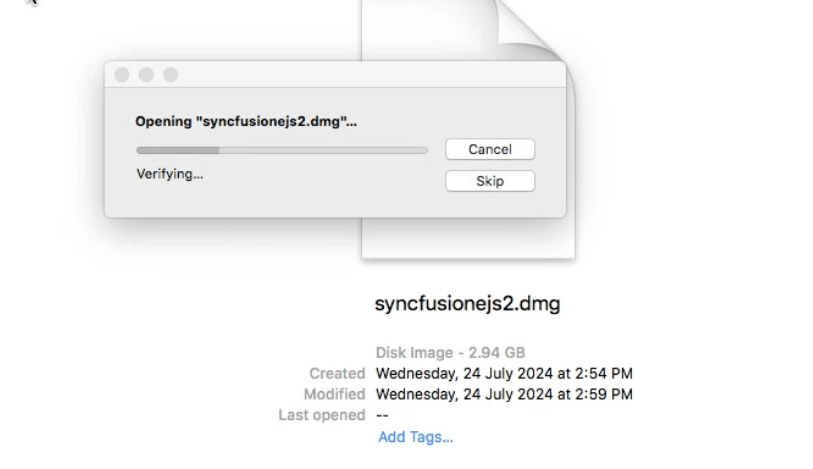
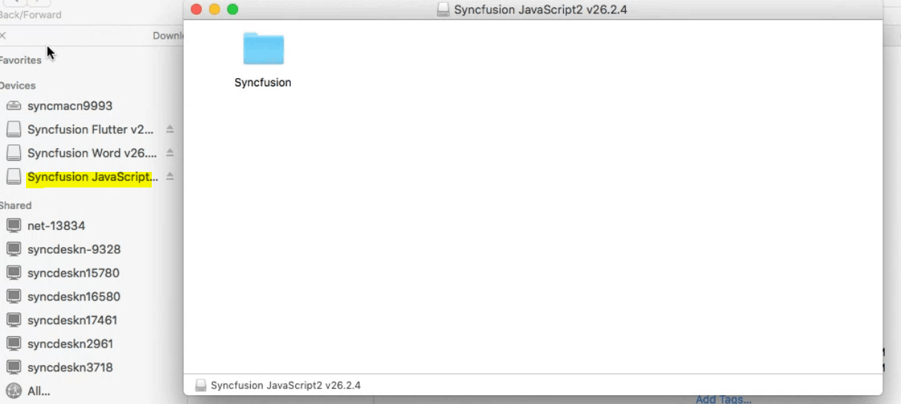
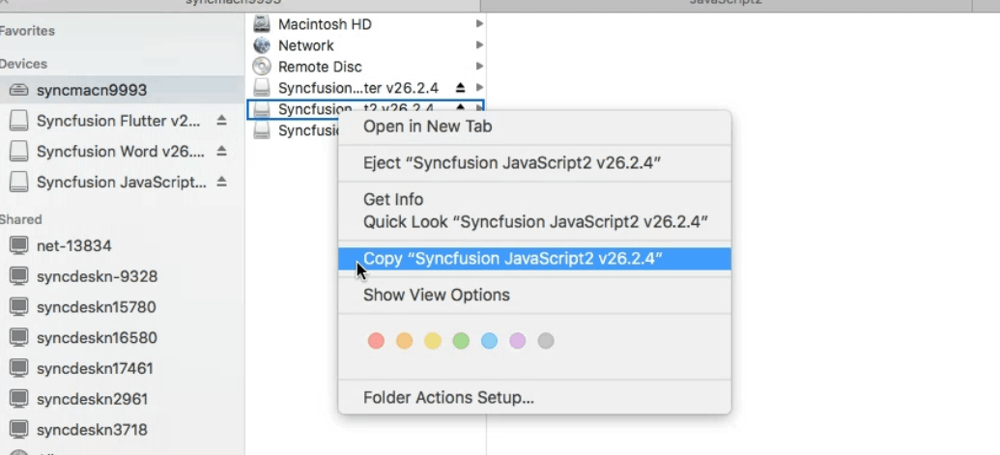
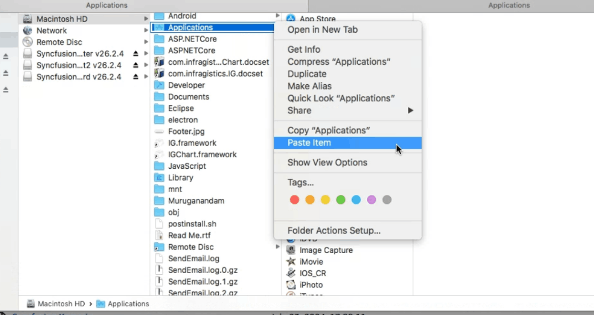
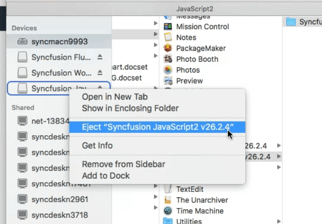

# Installing Syncfusion&reg; JavaScript – EJ2 Mac Installer

## Steps to resolve the warning message in Catalina OS or later

While running the Essential&reg; Studio JavaScript - EJ2 Mac Installer on macOS Catalina or later, the alert below may be displayed.

   

If this alert appears, follow these steps:

1. Right-click the downloaded .dmg file.
2. Select "Open With" and choose "DiskImageMounter (Default)". A confirmation pop-up appears.

      

3. Click "Open" to launch the installer window.
## Step-by-Step Installation

The steps below show how to install the Essential&reg; Studio JavaScript - EJ2 Mac installer.

1. Locate the downloaded dmg file and open the file by double click on it.

   

2. The disk image will be mounted and a virtual drive is created on the desktop or in Finder.

   

3. Copy the mounted disk contents.

   

4. And paste it in "Applications" folder shortcut.

   

> Note: An unlock key is not required to install the Mac installer. The Syncfusion&reg; Essential&reg; Studio JavaScript - EJ2 Mac installer can be used for development purposes without registering an unlock key.

5. Now you can open the folder to explore the Syncfusion&reg; Essential&reg; Studio Mac installer.

   

6. To remove the DMG file, Right-click on the virtual drive on your desktop or in the Finder sidebar and select "Eject." Also delete the folder from the Applications.

   

## License key registration in samples

After installation, a license key is required to register the demo source included with the Mac installer. For instructions on registering the license key for JavaScript - EJ2, refer to:

* [Register Syncfusion&reg; License key in the project](https://ej2.syncfusion.com/vue/documentation/licensing/license-key-registration#register-syncfusion-license-key-in-the-project)
* [Register Syncfusion&reg; license key in the Nuxt project](https://ej2.syncfusion.com/vue/documentation/licensing/license-key-registration#register-syncfusion-license-key-in-the-nuxt-project)
* [Register the license key using the npx command](https://ej2.syncfusion.com/vue/documentation/licensing/license-key-registration#register-syncfusion-license-key-using-the-npx-command)