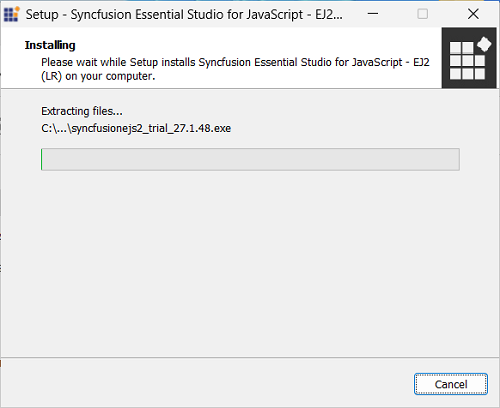
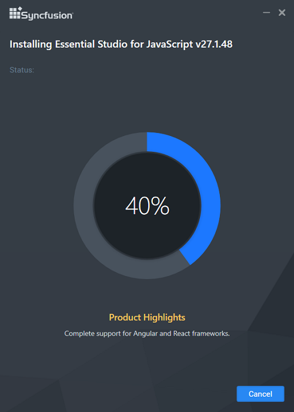
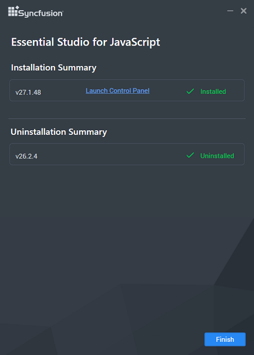

# Installation using Offline Installer

Refer to the [Download](https://ej2.syncfusion.com/vue/documentation/installation-and-upgrade/download) section to learn how to obtain the JavaScript – EJ2 trial or licensed installer.

The frameworks supported by this installer:

* JavaScript
* Angular
* React
* Vue
* JavaScript (ES5)

## Installing with UI

The steps below describe how to install the Essential&reg; Studio JavaScript – EJ2 installer.

1. Open the Syncfusion&reg; JavaScript – EJ2 offline installer file from downloaded location by double-clicking it. The Installer Wizard automatically opens and extracts the package

    

    > Note: The Installer wizard displays a dialog showing the package extraction progress.

2. To unlock the Syncfusion&reg; offline installer, choose one of the following options:

    * Login To Install
    * Use Unlock Key

    **Login To Install**
    Enter the Syncfusion&reg; email address and password. If you do not have a Syncfusion&reg; account, click **"Create an account"** to sign up. If you have forgotten the password, click **"Forgot Password"** to reset it. After entering credentials, click Next.
    

    **Use Unlock Key**
    Unlock keys are used to unlock the Syncfusion&reg; offline installer, and they are platform and version specific. You should use either Syncfusion&reg; licensed or trial Unlock key to unlock Syncfusion&reg; JavaScript – EJ2 installer.

    The trial unlock key is only valid for 30 days, and the installer will not accept an expired trial key.

    To learn how to generate an unlock key for both trial and licensed products, see [this](https://www.syncfusion.com/kb/2326) Knowledge Base article.

    

3. After reading the License Terms and Privacy Policy, check the **“I agree to the License Terms and Privacy Policy”** check box. Click the Next button.

4. Change the install and sample locations here. You can also change the Additional settings. Click Next/Install to install with the default settings.

    

    **Additional settings**

    * Select the **Install Demos** check box to install Syncfusion&reg; samples, or leave the check box unchecked, if you do not want to install Syncfusion&reg; samples
    * Select the **Configure Syncfusion&reg; Extensions in Visual Studio** checkbox to configure the Syncfusion&reg; Extensions in Visual Studio or clear this check box when you do not want to configure the Syncfusion&reg; Extensions in Visual Studio.
    * Check the **Create Desktop Shortcut** checkbox to add a desktop shortcut for Syncfusion&reg; Control Panel
    * Check the **Create Start Menu Shortcut** checkbox to add a shortcut to the start menu for Syncfusion&reg; Control Panel

5. If any previous versions of the current product is installed, the **Uninstall** Previous Version(s) wizard will be opened. Select Uninstall checkbox to uninstall the previous versions and then click the Proceed button.

    

    >Note: From the 2021 Volume 1 release, Syncfusion&reg; has added the option to uninstall previous versions from 18.1 while installing the new version.
    >
    >Note: If any version is selected to uninstall, a confirmation screen will appear; if continue is selected, the Progress screen will display the uninstall and install progress, respectively. If none of the versions are chosen to be uninstalled, only the installation progress will be displayed.

    **Confirmation alert**

    

    **Uninstall progress:**

    

    **Install progress**

    

    >Note: The Completed screen is displayed once the JavaScript – EJ2 product is installed. If any version is selected to uninstall, The completed screen will display both install and uninstall status.

    

6. After installing, click the Launch Control Panel link to open the Syncfusion&reg; Control Panel.

7. Click the Finish button. Your system has been installed with the Syncfusion&reg; Essential&reg; Studio JavaScript – EJ2 product.

## Installing in silent mode

The Syncfusion&reg; Essential&reg; Studio JavaScript – EJ2 Installer supports installation and uninstallation via the command line.

### Command line installation

To install through the command line in silent mode:

1. Run the Syncfusion&reg; JavaScript – EJ2 installer by double-clicking it. The Installer Wizard opens and extracts the package.
2. The `syncfusionejs2_(version).exe` file is extracted to the Temp directory.
3. Run `%temp%` to open the Temp folder. Locate the `syncfusionejs2_(version).exe` file in one of the subfolders.
4. Copy the extracted `syncfusionejs2_(version).exe` file to a local drive.
5. Exit the Wizard.
6. Run Command Prompt in administrator mode and enter the following arguments:

    Arguments: “installer file path/SyncfusionEssentialStudio(product)_(version).exe” /Install silent /UNLOCKKEY:“(product unlock key)” [/log “{Log file path}”] [/InstallPath:{Location to install}] [/InstallSamples:{true/false}] [/InstallAssemblies:{true/false}] [/UninstallExistAssemblies:{true/false}] [/InstallToolbox:{true/false}]

    >Note: [..] – Arguments inside the square brackets are optional.

    **Example:** “D:/Temp/syncfusionejs2x.x.x.x.exe” /Install silent /UNLOCKKEY:“product unlock key” /log “C:/Temp/EssentialStudioPlatform.log” /InstallPath:C:/Syncfusion/x.x.x.x /InstallSamples:true /InstallAssemblies:true /UninstallExistAssemblies:true /InstallToolbox:true

7. Essential&reg; Studio for JavaScript (Essential&reg; JS2) is installed.

    >Note: x.x.x.x should be replaced with the Essential&reg; Studio version and the Product Unlock Key needs to be replaced with the Unlock Key for that version.

### Command line uninstallation

Syncfusion&reg; Essential&reg; JavaScript – EJ2 can be uninstalled silently using the Command Line.

1. Run the Syncfusion&reg; JavaScript – EJ2 installer by double-clicking it. The Installer Wizard opens and extracts the package.
2. The `syncfusionejs2_(version).exe` file is extracted to the Temp directory.
3. Run `%temp%` to open the Temp folder. Locate the `syncfusionejs2_(version).exe` file in one of the subfolders.
4. Copy the extracted `syncfusionejs2_(version).exe` file to a local drive.
5. Exit the Wizard.

6. Run Command Prompt in administrator mode and enter the following arguments.

    Arguments: “Copied installer file path/ syncfusionejs2_(version).exe” /uninstall silent
    Example: “D:/Temp/syncfusionejs2_x.x.x.x.exe” /uninstall silent

7. Essential&reg; Studio for JavaScript (Essential&reg; JS2) is uninstalled.