# Installation Using the Web Installer

This guide explains how to install the Syncfusion&reg; Essential&reg; JavaScript - EJ2 **web installer** on Windows, and how to uninstall it.

> If you do not yet have the installer, refer to the [Download](https://ej2.syncfusion.com/vue/documentation/installation-and-upgrade/download) section to obtain the trial or licensed version.

**Prerequisites**

* A Windows machine with administrator privileges.
* An active internet connection (the web installer downloads the selected products at install time).
* A downloaded copy of the Syncfusion&reg; Essential&reg; Web Installer for JavaScript - EJ2.
* A valid Syncfusion&reg; account (for the login step) or a Syncfusion&reg; unlock key.

## Overview

For the Essential&reg; Studio JavaScript – EJ2 product, Syncfusion&reg; offers a Web Installer. This installer reduces the download burden by providing a smaller installer that downloads and installs only the selected products. The most recent version of the Essential&reg; Studio Web Installer is available on the [Syncfusion account downloads page](https://www.syncfusion.com/account/downloads).

The frameworks supported by this installer:

* JavaScript
* Angular
* React
* Vue
* JavaScript (ES5)

## Installation

The steps below describe how to install Essential&reg; Studio JavaScript – EJ2 Web Installer.

1. Open the Syncfusion&reg; Essential&reg; Studio JavaScript – EJ2 Web Installer file from the downloaded location by double-clicking it. The Installer Wizard automatically opens and extracts the package.

    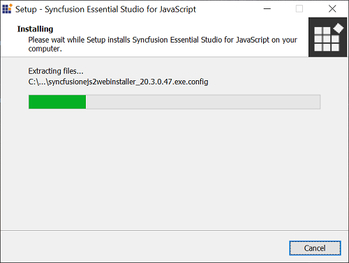

    > **Note:** The installer wizard displays a dialog showing the package extraction progress.

2. The Syncfusion&reg; JavaScript - EJ2 Web Installer's welcome wizard appears. Click **Next**.

    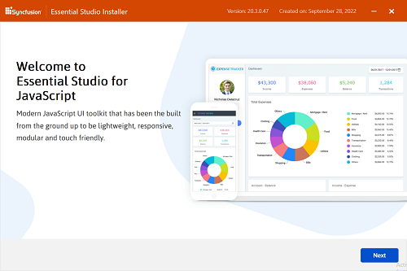

3. The Platform Selection Wizard appears. Select products to install from the **Available** tab. Check **Install All** to install all products.

    **Available**

    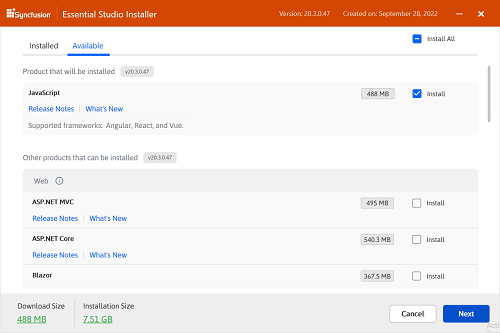

    If you have multiple products installed in the same version, they will be listed under the **Installed** tab. You can also select which products to uninstall from the same version. Click **Next**.

    **Installed**

    

    > **Important:** If required software for the selected product is not installed, the **Additional Software Required** alert appears. Installation can proceed, and required software can be installed later.

    **Required Software**

    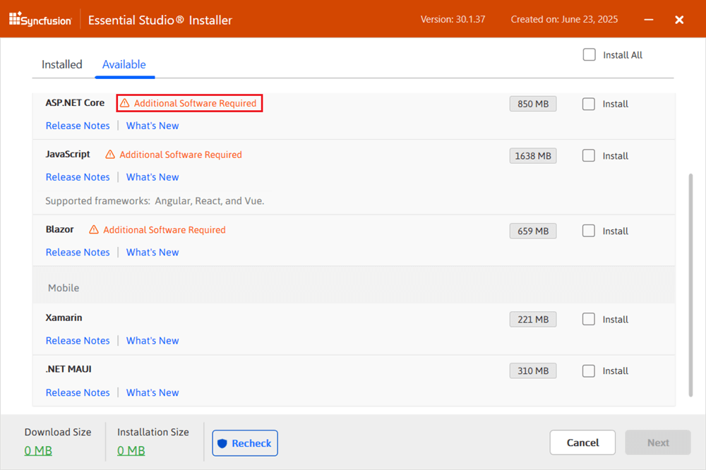

4. If previous versions of the selected products are installed, the **Uninstall Previous Version** wizard appears. View the list of previously installed versions. Check **Uninstall All** to remove all previous versions. Click **Next**.

    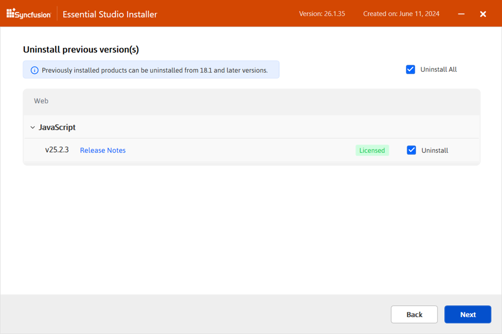

    > **Note:** Starting from 2021 Volume 1, Syncfusion&reg; provides the option to uninstall versions from 18.1 onward when installing a new version.

5. A pop-up appears to confirm uninstallation of selected previous versions. Click **Continue** to proceed.

    

6. The Confirmation Wizard appears with the list of products to be installed and uninstalled. You can view and modify the list of products that will be installed and uninstalled from this page.

    

    > **Note:** By clicking the **Download Size** and **Installation Size** links, you can determine the approximate size of the download and installation.

7. The Configuration Wizard appears. You can change the **Download**, **Install**, and **Demos** locations from here. You can also change the Additional Settings on a product-by-product basis. Click **Next** to install with the default settings.

    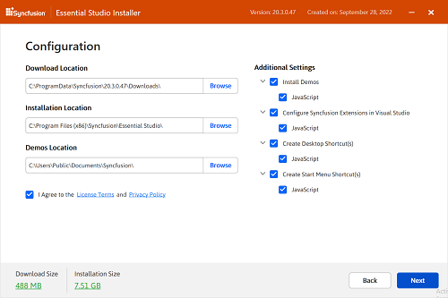

    **Additional Settings**

    * Select the **Install Demos** check box to install Syncfusion&reg; samples, or leave the check box unchecked if you do not want to install samples.
    * Select the **Configure Syncfusion&reg; Extensions controls in Visual Studio** check box to configure the Syncfusion&reg; Extensions in Visual Studio. Clear this check box if you do not want to configure the extensions.
    * Check the **Create Desktop Shortcut** check box to add a desktop shortcut for Syncfusion&reg; Control Panel.
    * Check the **Create Start Menu Shortcut** check box to add a shortcut to the start menu for Syncfusion&reg; Control Panel.

8. After reading the License Terms and Conditions, check the **I agree to the License Terms and Privacy Policy** check box. Click **Next**.

9. The Login Wizard appears. Enter your Syncfusion&reg; email address and password. If you do not already have a Syncfusion&reg; account, you can create one by clicking **Create an Account**. If you have forgotten your password, click **Forgot Password** to create a new one. Click **Install**.

    

    > **Important:** The products you have chosen will be installed based on your Syncfusion&reg; license (Trial or Licensed).

10. The download and installation / uninstallation progress is displayed as shown below.

    

11. When the installation is finished, the **Summary** wizard appears. Here you can see the list of products that have been installed successfully and those that have failed. To close the Summary wizard, click **Finish**.

    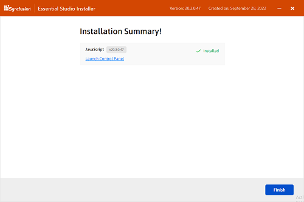

    * To open the Syncfusion&reg; Control Panel, click **Launch Control Panel**.

12. After installation, there are two Syncfusion&reg; Control Panel entries, as shown below. The **Essential&reg; Studio** entry manages all Syncfusion&reg; products installed in the same version, while the **Product** entry only uninstalls the specific product setup.

    

## Uninstallation

Syncfusion&reg; JavaScript – EJ2 installer can be uninstalled in two ways:

* Uninstall the JavaScript - EJ2 installer using the Syncfusion&reg; JavaScript - EJ2 web installer.
* Uninstall the JavaScript - EJ2 installer from the Windows Control Panel.

Follow either one of the options below to uninstall the Syncfusion&reg; Essential&reg; Studio JavaScript – EJ2 installer.

### Option 1: Uninstall the JavaScript - EJ2 Using the Web Installer

Syncfusion&reg; provides the option to uninstall products of the same version directly from the Web Installer application. Select the products to be uninstalled from the list, and the Web Installer will uninstall them one by one.

1. Open the Syncfusion&reg; Essential&reg; Studio JavaScript – EJ2 Online Installer file from the downloaded location by double-clicking it. The Installer Wizard automatically opens and extracts the package.

    

2. The Syncfusion&reg; JavaScript – EJ2 Web Installer's welcome wizard appears. Click **Next**.

    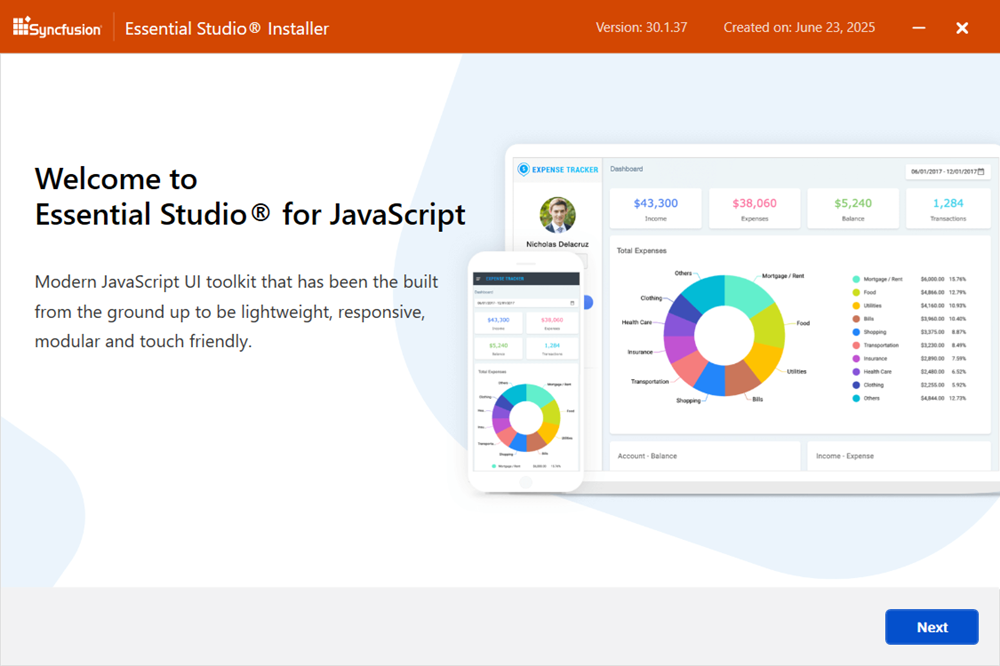

3. From the Platform Selection Wizard, use the **Installed** tab to choose the products to uninstall. To uninstall all products, check the **Uninstall All** check box. Click **Next**, then follow the on-screen prompts to confirm and complete the uninstallation.

### Option 2: Uninstall the JavaScript - EJ2 from the Windows Control Panel

You can uninstall all the installed products by selecting the **Syncfusion&reg; Essential&reg; Studio {version}** entry (element 1 in the below screenshot) from the Windows control panel, or you can uninstall JavaScript – EJ2 alone by selecting the **Syncfusion&reg; Essential&reg; Studio for JavaScript – EJ2 {version}** entry (element 2 in the below screenshot) from the Windows control panel.

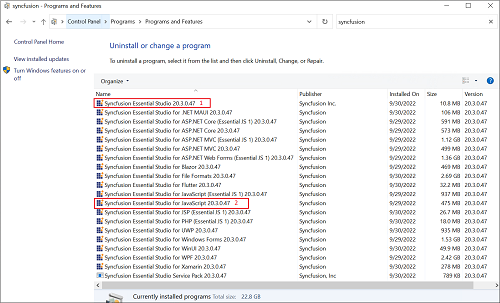

> **Note:** If the **Syncfusion&reg; Essential Studio for JavaScript - EJ2 {version}** entry is selected from the Windows Control Panel, only the Syncfusion&reg; Essential Studio JavaScript - EJ2 product is removed, and the default MSI uninstallation window is displayed.

1. The Platform Selection Wizard appears. From the **Installed** tab, select the products to be uninstalled. To select all products, check the **Uninstall All** check box. Click **Next**.

    **Installed**

    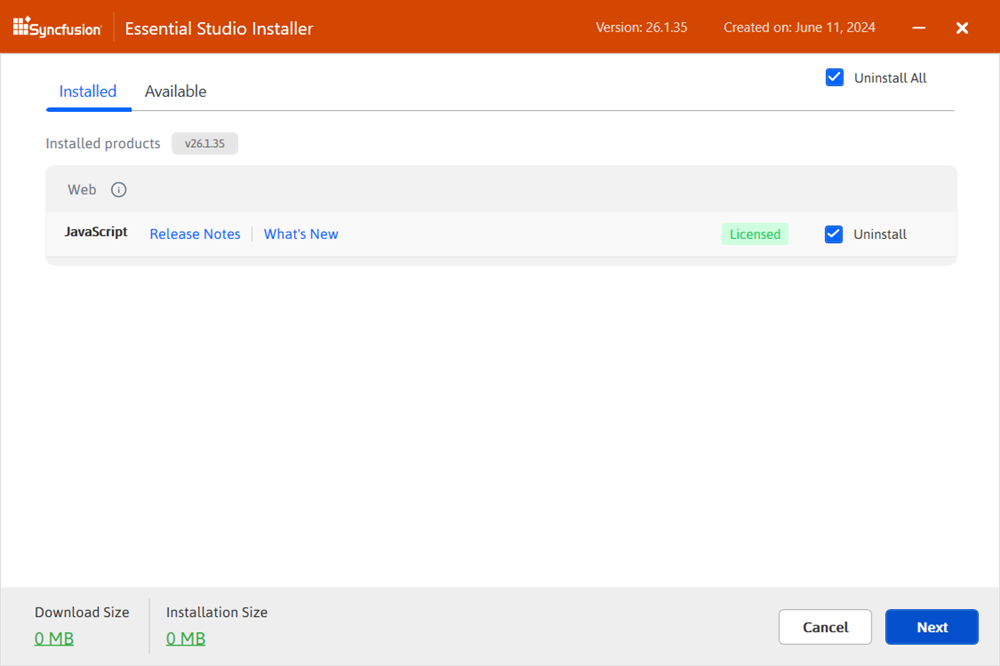

    You can also select the products to install from the **Available** tab. Click **Next**.

    **Available**

    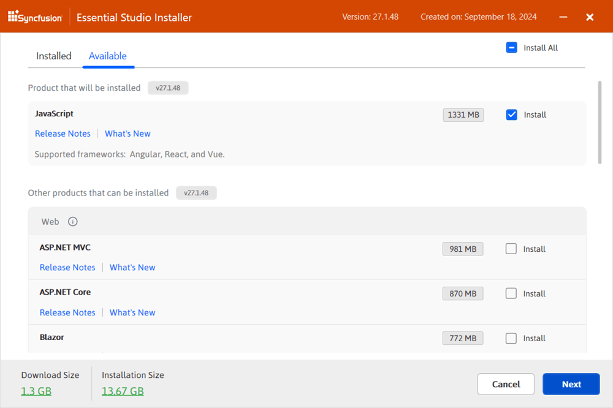

2. If other products are selected for installation, the Uninstall Previous Version wizard appears with previous versions installed for the selected products. Check **Uninstall All** to select all versions. Click **Next**.

    

3. A pop-up is displayed to confirm the uninstall of the selected previous versions.

    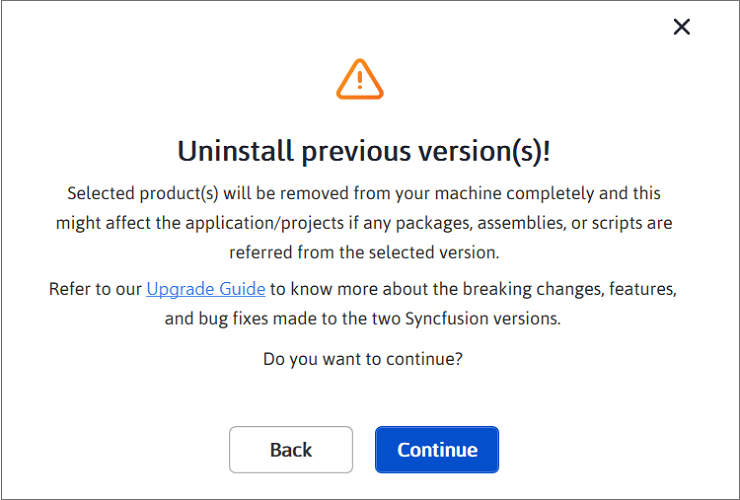

4. The Confirmation Wizard appears with the list of products to be installed and uninstalled. You can view and modify the list of products that will be installed and uninstalled from this page.

    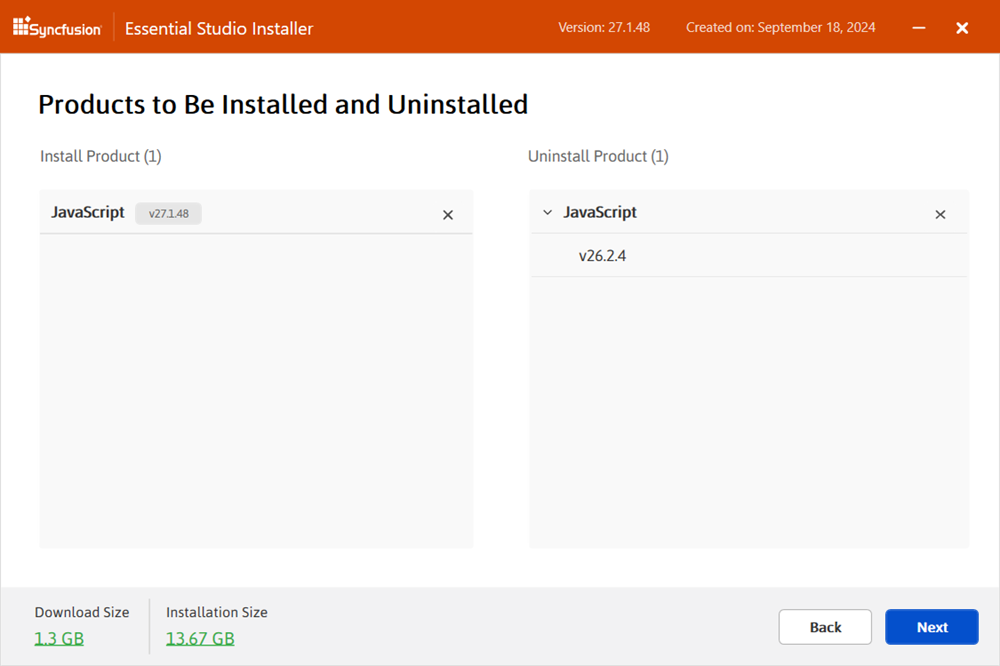

    > **Note:** By clicking the **Download Size** and **Installation Size** links, you can determine the approximate size of the download and installation.

5. The Configuration Wizard appears. Change **Download**, **Install**, and **Demos** locations if desired. Modify Additional Settings as needed. Click **Next** to proceed with the default settings.

    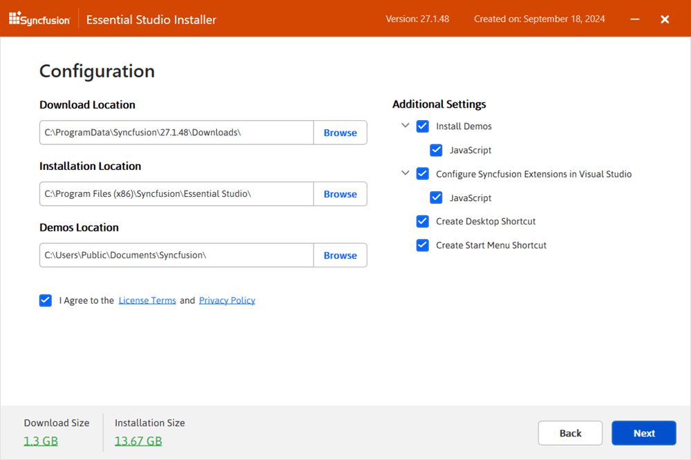

6. After reading the License Terms and Conditions, check the **I agree to the License Terms and Privacy Policy** check box. Click **Next**.

7. The Login Wizard appears. Enter your Syncfusion&reg; email address and password. If you do not already have a Syncfusion&reg; account, you can create one by selecting **Create an Account**. If you have forgotten your password, select **Forgot Password** to reset it. Click **Install**.

    

    > **Important:** The products you have chosen will be installed based on your Syncfusion&reg; license (Trial or Licensed).

8. The download, installation, and uninstallation progress is displayed.

    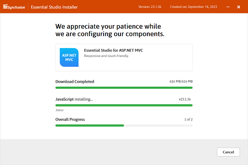

9. When the installation is finished, the **Summary** wizard appears. Here you can see the list of products that have been successfully and unsuccessfully installed or uninstalled. To close the Summary wizard, click **Finish**.

    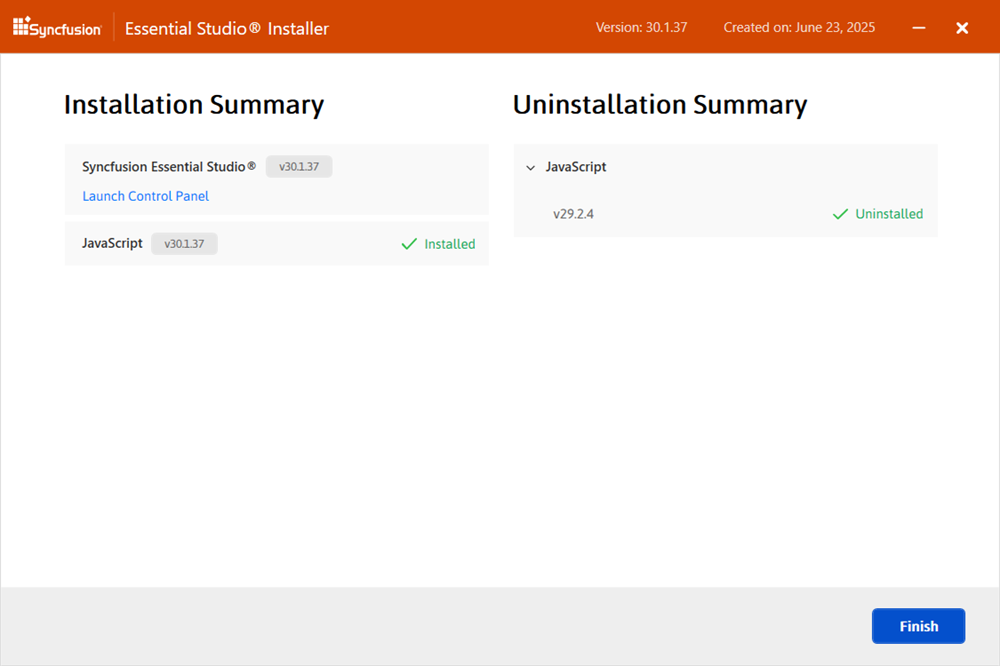

    * To open the Syncfusion&reg; Control Panel, click **Launch Control Panel**.

## Troubleshooting

| Issue | Possible Cause | Suggested Fix |
| --- | --- | --- |
| Installer fails with "Another installation is in progress." | Another MSI installation is currently running. | End the running `msiexec.exe` process in Task Manager, or wait for the other install to finish. See [Common Installation Errors](https://ej2.syncfusion.com/vue/documentation/installation-and-upgrade/common-installation-errors). |
| "Additional Software Required" alert blocks install. | A prerequisite such as Node.js, Visual Studio, or another runtime is missing. | Install the listed prerequisite and re-run the Web Installer, or continue and install the prerequisite later. |
| Installer cannot download products during install. | No internet connection, or a firewall is blocking the download. | Verify your connection and allow the installer through your firewall or proxy. |
| License warning appears after install. | The unlock key was not applied, or the trial expired. | Re-run the installer, sign in with the licensed account, or apply the unlock key. See [Common Installation Errors](https://ej2.syncfusion.com/vue/documentation/installation-and-upgrade/common-installation-errors). |
| Old version is still listed in the Control Panel after upgrade. | The previous version was not selected for uninstall during the install. | Re-run the installer, choose **Uninstall** for the old version, or remove it from **Apps & features** in Windows Settings. |

For additional help, see [Common Installation Errors](https://ej2.syncfusion.com/vue/documentation/installation-and-upgrade/common-installation-errors).