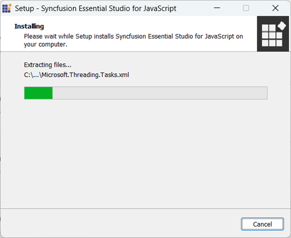
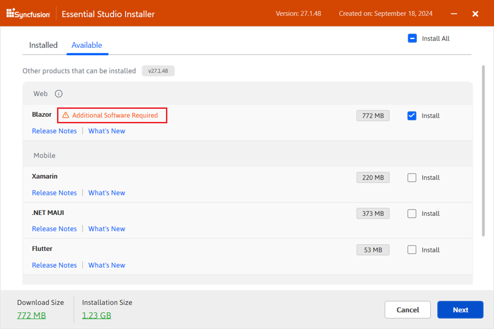
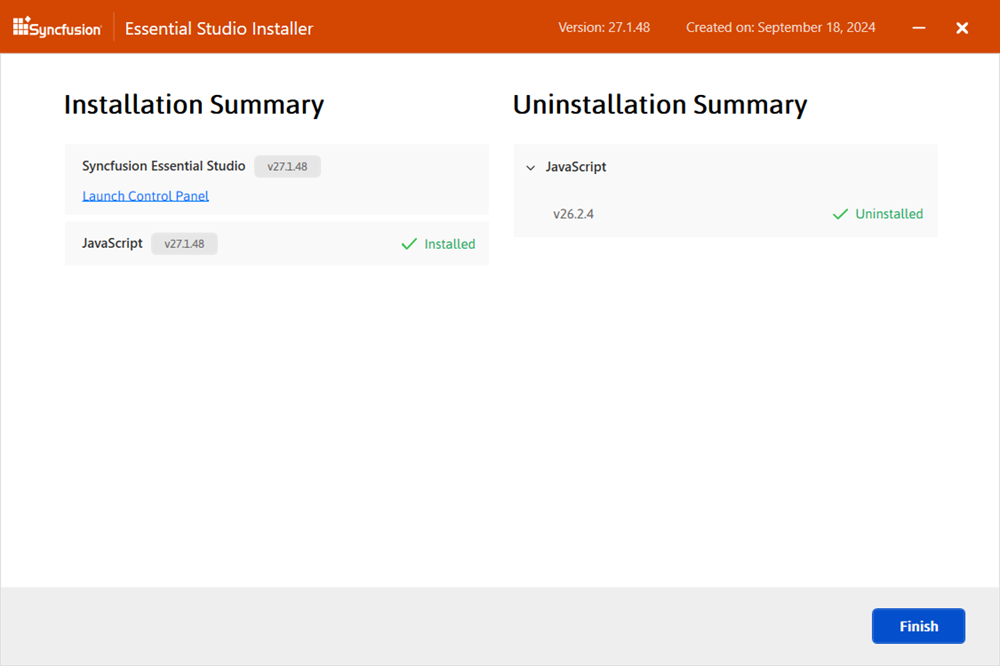

# Installation using Web Installer

You can refer to the [Download](https://ej2.syncfusion.com/vue/documentation/installation-and-upgrade/download) section to learn how to get the JavaScript – EJ2 trial or licensed installer.

## Overview

For the Essential&reg; Studio JavaScript – EJ2 product, Syncfusion&reg; offers a Web Installer. This installer reduces the download burden by providing a smaller installer that downloads and installs only the selected products. The most recent version of the Essential&reg; Studio Web Installer is available [here](https://www.syncfusion.com/account/downloads).

The frameworks supported by this installer:
* JavaScript
* Angular
* React
* Vue
* JavaScript (ES5)

## Installation

The steps below describe how to install Essential&reg; Studio JavaScript – EJ2 Web Installer.
1. Open the Syncfusion&reg; Essential&reg; Studio JavaScript – EJ2 Web Installer file from downloaded location by double-clicking it. The Installer Wizard automatically opens and extracts the package.

    

    > Note: The installer wizard displays a dialog showing the package extraction progress.

2. The Syncfusion&reg; JavaScript - EJ2 Web Installer's welcome wizard appears. Click Next.

    

3. The Platform Selection Wizard appears. Select products to install from the **Available** tab. Check **Install All** to install all products.

    **Available**

    

    If you have multiple products installed in the same version, they will be listed under the **Installed** tab. You can also select which products to uninstall from the same version. Click the Next button.

    **Installed**

    

    > Important: If required software for the selected product is not installed, the **Additional Software Required** alert appears. Installation can proceed, and required software can be installed later.

    **Required software**

    

4. If previous versions of the selected products are installed, the Uninstall Previous Version wizard appears. View the list of previously installed versions. Check **Uninstall All** to remove all previous versions. Click Next.

    

    > Note: Starting from 2021 Volume 1, Syncfusion&reg; provides the option to uninstall versions from 18.1 onward when installing a new version.

5. A pop-up appears to confirm uninstallation of selected previous versions.

    

6. The Confirmation Wizard will appear with the list of products to be installed/uninstalled. You can view and modify the list of products that will be installed and uninstalled from this page.

    

    >Note: By clicking the **Download Size and Installation** Size links, you can determine the approximate size of the download and installation

7. The Configuration Wizard will appear. You can change the Download, Install, and Demos locations from here. You can also change the Additional settings on a product-by-product basis. Click Next to install with the default settings.

    

    **Additional settings**
    * Select the **Install Demos** check box to install Syncfusion&reg; samples, or leave the check box unchecked, if you do not want to install Syncfusion&reg; samples
    * Select the **Configure Syncfusion&reg; Extensions controls in Visual Studio** checkbox to configure the Syncfusion&reg; Extensions in Visual Studio or clear this check box when you do not want to configure the Syncfusion&reg; Extensions in Visual Studio.
    * Check the **Create Desktop Shortcut** checkbox to add a desktop shortcut for Syncfusion&reg; Control Panel
    * Check the **Create Start Menu Shortcut** checkbox to add a shortcut to the start menu for Syncfusion&reg; Control Panel

8. After reading the License Terms and Conditions, check the **I agree to the License Terms and Privacy Policy** check box. Click the Next button.

9. The login wizard will appear. You must enter your Syncfusion&reg; email address and password. If you do not already have a Syncfusion&reg; account, you can create one by clicking on **Create an Account**. If you have forgotten your password, click **Forgot Password** to create a new one. Click the Install button.

    

    >Important: The products you have chosen will be installed based on your Syncfusion&reg; License (Trial or Licensed).

10. The download and installation/uninstallation progress will be displayed as shown below.

    

11. When the installation is finished, the **Summary** wizard will appear. Here you can see the list of products that have been installed successfully and those that have failed. To close the Summary wizard, click Finish.

    

    * To open the Syncfusion&reg; Control Panel, click **Launch Control** Panel.

12. After installation, there will be two Syncfusion&reg; control panel entries, as shown below. The Essential&reg; Studio entry will manage all Syncfusion&reg; products installed in the same version, while the Product entry will only uninstall the specific product setup.

    

## Uninstallation

Syncfusion&reg; JavaScript – EJ2 installer can be uninstalled in two ways.

* Uninstall the JavaScript – EJ2 using the Syncfusion&reg; JavaScript – EJ2 web installer
* Uninstall the JavaScript – EJ2 from Windows Control Panel

Follow either one of the option below to uninstall Syncfusion&reg; Essential&reg; Studio JavaScript – EJ2 installer

### Option 1: Uninstall the JavaScript–EJ2 using the Syncfusion&reg; JavaScript–EJ2 web installer

Syncfusion&reg; provides the option to uninstall products of the same version directly from the Web Installer application. Select the products to be uninstalled from the list, and Web Installer will uninstall them one by one.

Open the Syncfusion&reg; Essential&reg; Studio JavaScript – EJ2 Online Installer file from downloaded location by double-clicking it. The Installer Wizard automatically opens and extracts the package

The Syncfusion&reg; JavaScript – EJ2 Web Installer’s welcome wizard will be displayed. Click the Next button

### Option 2: Uninstall the JavaScript–EJ2 from windows control panel

You can uninstall all the installed products by selecting the **Syncfusion&reg; Essential&reg; Studio {version}** entry (element 1 in the below screenshot) from the Windows control panel, or you can uninstall JavaScript – EJ2 alone by selecting the **Syncfusion&reg; Essential&reg; Studio for JavaScript – EJ2 {version}** entry (element 2 in the below screenshot) from the Windows control panel.

>Note: If the **Syncfusion&reg; Essential&reg; Studio** for JavaScript **{version}** entry is selected from the Windows control panel, the Syncfusion&reg; Essential&reg; Studio JavaScript – EJ2 alone will be removed and the below default MSI uninstallation window will be displayed.

1. The Platform Selection Wizard will appear. From the **Installed** tab, select the products to be uninstalled. To select all products, check the **Uninstall All** checkbox. Click the Next button.

    **Installed**
    

    You can also select the products to be installed from the **Available** tab Click the Next button.

    **Available**
    

2. If other products are selected for installation, the Uninstall Previous Version wizard appears with previous versions installed for the selected products. Check **Uninstall All** to select all versions. Click Next.
    

3. Pop up screen will be displayed to get the confirmation to uninstall selected previous versions.

    

4. The Confirmation Wizard will appear with the list of products to be installed/uninstalled. Here you can view and modify the list of products that will be installed/uninstalled.

    

    >Note: By clicking the **Download Size and Installation** Size links, you can determine the approximate size of the download and installation

5. The Configuration Wizard appears. Change Download, Install, and Demos locations if desired. Modify Additional settings as needed. Click Next to proceed with default settings.

    

6. After reading the License Terms and Conditions, check the **I agree to the License Terms and Privacy Policy** check box. Click the Next button.

7. The login wizard will appear. You must enter your Syncfusion&reg; email address and password. If you do not already have a Syncfusion&reg; account, you can create one by clicking on **Create an Account**. If you have forgotten your password, click **Forgot Password** to create a new one. Click the Install button.

    

    >Important: The products you have chosen will be installed based on your Syncfusion&reg; License (Trial or Licensed).

8. Download, installation, and uninstallation progress is displayed.

    

9. When the installation is finished, the **Summary** wizard will appear. Here you can see the list of products that have been successfully and unsuccessfully installed/uninstalled. To close the Summary wizard, click Finish.

    

    * To open the Syncfusion&reg; Control Panel, click **Launch Control Panel**