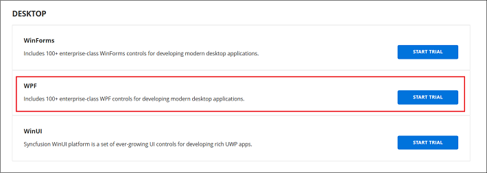

# Download JavaScript Linux installer

The Syncfusion&reg; JavaScript Linux installer can be downloaded from the [Syncfusion](https://www.syncfusion.com/) website. Download either the licensed installer or the trial installer depending on your license. The Linux installer is provided in `.zip` format and does not require an unlock key to install.

> After downloading, see [Installation Using the Linux Installer](https://ej2.syncfusion.com/vue/documentation/installation-and-upgrade/linux-installer/installation-using-linux-installer) for step-by-step installation instructions.

**Prerequisites**

* A registered Syncfusion&reg; account. To create one, see the [Syncfusion downloads page](https://www.syncfusion.com/downloads).
* A tool to extract `.zip` files, such as `unzip` on most distributions.
* For npm-based JavaScript components (the EJ2 packages): Node.js and npm installed.

This guide covers the following options:

* Trial Installer
* Licensed Installer

## Download the trial version

The 30-day trial can be downloaded in two ways:

* Download the free trial setup.
* Start trials if using components through [npm](https://www.npmjs.com/search?q=%40syncfusion%2Fej2-vue) (for Vue EJ2 packages) or [NuGet](https://www.nuget.org/packages?q=syncfusion) (for .NET EJ2 packages).

### Download free trial setup

1. Evaluate the 30-day free trial by visiting the [Download Free Trial](https://www.syncfusion.com/downloads) page and selecting the product.
2. After completing the required form or logging in with your registered Syncfusion&reg; account, download the trial installer from the confirmation page (as shown below).

   

3. With a trial license, only the latest version's trial installer can be downloaded.
4. An unlock key is not required to install the Syncfusion&reg; JavaScript Linux trial installer.
5. Before the trial expires, download the trial installer at any time from the [Trials & Downloads](https://www.syncfusion.com/account/manage-trials/downloads) page (as shown below).

   

6. Click the **More Download Options** button (element 2 in the screenshot above) to get the JavaScript Product Offline trial installer, available in `.zip` format.

   

### Start trials if using components through npm or NuGet

If you have already obtained components through [npm](https://www.npmjs.com/search?q=%40syncfusion%2Fej2-vue) (for Vue EJ2 packages) or [NuGet](https://www.nuget.org/packages?q=syncfusion) (for .NET EJ2 packages), initiate a trial as follows:

1. Start your 30-day free trial from the [Start Trial](https://www.syncfusion.com/account/manage-trials/start-trials) page in your account.

   N> You can generate the license key for your active trial products from the [Trials & Downloads](https://www.syncfusion.com/account/manage-trials/downloads) page. This license key is mandatory to use our trial products in your application. To know more about license keys, refer to the [licensing overview](https://help.syncfusion.com/common/essential-studio/licensing/overview).

   

2. To access this page, you must sign up or log in with your Syncfusion&reg; account.
3. Begin your trial by selecting the Syncfusion&reg; JavaScript product.

   N> If you've already used the trial products and they haven't expired, you won't be able to start the trial for the same product again.

4. After you've started the trial, go to the [Trials & Downloads](https://www.syncfusion.com/account/manage-trials/downloads) page to get the latest version trial installer. You can generate the [unlock key](https://www.syncfusion.com/kb/8069/how-to-generate-unlock-key-for-essentials-studio-products) and [license key](https://ej2.syncfusion.com/vue/documentation/licensing/license-key-generation) at any time before the trial period expires (as shown in the screenshot below).

   

5. You can find your current active trial products on the [Trials & Downloads](https://www.syncfusion.com/account/manage-trials/downloads) page.

## Download the license version

1. Syncfusion&reg; licensed products are available on the [License & Downloads](https://www.syncfusion.com/account/downloads) page under the registered Syncfusion&reg; account.
2. All licenses (both active and expired) associated with the account can be viewed.
3. Download the JavaScript Linux licensed installer by selecting **More Download Options** (element 3 in the screenshot below).

   

4. An unlock key is not required to install the Syncfusion&reg; JavaScript Linux licensed installer.
5. For Linux, the `.zip` format is available for download.

   

For step-by-step installation guidelines, refer to the [JavaScript Linux installer](https://ej2.syncfusion.com/vue/documentation/installation-and-upgrade/linux-installer/installation-using-linux-installer) documentation.

## Troubleshooting

| Issue | Possible Cause | Suggested Fix |
| --- | --- | --- |
| The Linux installer is not listed under **More Download Options**. | The signed-in account does not own a license, or the product filter is set to a different platform. | Confirm the account owns a JavaScript license, then filter the **More Download Options** list to the JavaScript / Linux platform. |
| `unzip` reports "command not found" while extracting the installer. | The `unzip` package is not installed on the Linux machine. | Install it with your distribution's package manager, for example `sudo apt install unzip` (Debian/Ubuntu) or `sudo dnf install unzip` (Fedora/RHEL). |
| The downloaded `.zip` fails to extract or is corrupted. | The download was incomplete, or the file was modified by a download manager. | Re-download the installer from the [License & Downloads](https://www.syncfusion.com/account/downloads) page and verify the file size against the value shown on the page. |
| License warning appears after install. | License key was not registered for the trial or licensed product. | Generate the license key from the [Trials & Downloads](https://www.syncfusion.com/account/manage-trials/downloads) or [License & Downloads](https://www.syncfusion.com/account/downloads) page and register it in the project. See [Common Installation Errors](https://ej2.syncfusion.com/vue/documentation/installation-and-upgrade/common-installation-errors). |