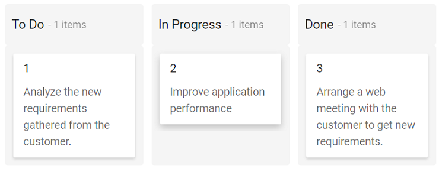
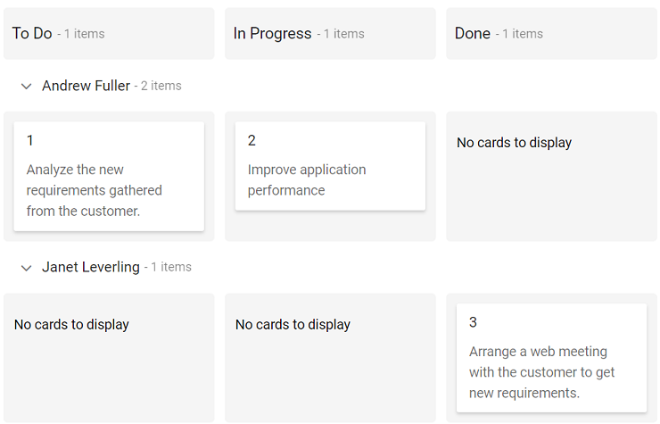

# Getting Started

This section explains how to use Syncfusion Vue Kanban component in Vue 3 application.

## Prerequisites

[System requirements for Syncfusion Vue UI components](https://ej2.syncfusion.com/vue/documentation/system-requirements/)

## Creating Vue application using Vue CLI

The easiest way to create a Vue application is to use the [`Vue CLI`](https://github.com/vuejs/vue-cli). Vue CLI versions above [`4.5.0`](https://v3.vuejs.org/guide/migration/introduction.html#vue-cli) are mandatory for creating applications using Vue 3. Use the following command to uninstall older versions of the Vue CLI.

```bash
npm uninstall vue-cli -g
```

Use the following commands to install the latest version of Vue CLI.

```bash
npm install -g @vue/cli
npm install -g @vue/cli-init
```

Create a new project using the command below.

```bash
vue create quickstart
cd quickstart
```

Initiating a new project prompts us to choose the type of project to be used for the current application. Select the option `Default (Vue 3)` from the menu.


## Adding Syncfusion Kanban package in the application

All the available Essential JS 2 packages are published in [`npmjs.com`](https://www.npmjs.com/~syncfusionorg) registry.

Install the `Kanban` component by using the below npm command.

```bash
npm install @syncfusion/ej2-vue-kanban --save
```

## Adding CSS reference for Syncfusion Vue Kanban component

Import the needed Css styles for the Kanban component along with dependency styles in the `<style>` section of the `src/App.vue` file as follows.

```
<style>
@import '../node_modules/@syncfusion/ej2-base/styles/material.css';
@import '../node_modules/@syncfusion/ej2-buttons/styles/material.css';
@import '../node_modules/@syncfusion/ej2-layouts/styles/material.css';
@import '../node_modules/@syncfusion/ej2-dropdowns/styles/material.css';
@import '../node_modules/@syncfusion/ej2-inputs/styles/material.css';
@import '../node_modules/@syncfusion/ej2-navigations/styles/material.css';
@import '../node_modules/@syncfusion/ej2-popups/styles/material.css';
@import '../node_modules/@syncfusion/ej2-vue-kanban/styles/material.css';
</style>
```

## Adding Syncfusion Vue Kanban component in the application

You have completed all the necessary configurations needed for rendering the Syncfusion Vue component. Now, you are going to add the Kanban component using following steps.

* Import the Kanban component in the `<script>` section of the `src/App.vue` file.

```
<script>
  import { KanbanComponent, ColumnsDirective, ColumnDirective } from "@syncfusion/ej2-vue-kanban";
</script>
```

* Register the Kanban component.

```javascript
import { KanbanComponent, ColumnsDirective, ColumnDirective } from "@syncfusion/ej2-vue-kanban";
//Component registration
export default {
  name: "App",
  components: {
    'ejs-kanban': KanbanComponent,
    'e-columns': ColumnsDirective,
    'e-column': ColumnDirective
  },
}
```

* Add the component definition in template section.

```
<template>
  <ejs-kanban id="kanban" keyField="Status">
    <e-columns>
      <e-column headerText="To Do" keyField="Open"></e-column>
      <e-column headerText="In Progress" keyField="InProgress"></e-column>
      <e-column headerText="Done" keyField="Close"></e-column>
    </e-columns>
  </ejs-kanban>
</template>
```

* Summarizing the above steps, update the `src/App.vue` file with following code.

```
<template>
  <ejs-kanban id="kanban" keyField="Status" :dataSource="kanbanData" :cardSettings="cardSettings">
    <e-columns>
      <e-column headerText="To Do" keyField="Open"></e-column>
      <e-column headerText="In Progress" keyField="InProgress"></e-column>
      <e-column headerText="Done" keyField="Close"></e-column>
    </e-columns>
  </ejs-kanban>
</template>

<script>
import { KanbanComponent, ColumnsDirective, ColumnDirective } from "@syncfusion/ej2-vue-kanban";

export default {
  name: "App",
  components: {
    'ejs-kanban': KanbanComponent,
    'e-columns': ColumnsDirective,
    'e-column': ColumnDirective
  },
  data() {
    return {
      kanbanData: [
        {
            Id: 1,
            Status: 'Open',
            Summary: 'Analyze the new requirements gathered from the customer.',
            Assignee: 'Andrew Fuller'
        },
        {
            Id: 2,
            Status: 'InProgress',
            Summary: 'Improve application performance',
            Assignee: 'Andrew Fuller'
        },
        {
            Id: 3,
            Status: 'Close',
            Summary: 'Arrange a web meeting with the customer to get new requirements.',
            Assignee: 'Janet Leverling'
        }
      ],
      cardSettings: {
        contentField: "Summary",
        headerField: "Id"
      }
    };
  },
};
</script>

<style>
@import '../node_modules/@syncfusion/ej2-base/styles/material.css';
@import '../node_modules/@syncfusion/ej2-buttons/styles/material.css';
@import '../node_modules/@syncfusion/ej2-layouts/styles/material.css';
@import '../node_modules/@syncfusion/ej2-dropdowns/styles/material.css';
@import '../node_modules/@syncfusion/ej2-inputs/styles/material.css';
@import '../node_modules/@syncfusion/ej2-navigations/styles/material.css';
@import '../node_modules/@syncfusion/ej2-popups/styles/material.css';
@import '../node_modules/@syncfusion/ej2-vue-kanban/styles/material.css';
</style>

```

## Running the application

Run the application using the following command.

```bash
npm run serve
```

Web server will be initiated, Open the quick start app in the browser at port `localhost:8080`.



## Enable swimlane

`Swimlane` can be enabled by mapping the fields `swimlaneSettings.keyField` to appropriate column name in dataSource. This enables the grouping of the cards based on the mapped column values.

```
<template>
  <ejs-kanban id="kanban" keyField="Status" :dataSource="kanbanData" :cardSettings="cardSettings" :swimlaneSettings="swimlaneSettings">
    <e-columns>
      <e-column headerText="To Do" keyField="Open"></e-column>
      <e-column headerText="In Progress" keyField="InProgress"></e-column>
      <e-column headerText="Done" keyField="Close"></e-column>
    </e-columns>
  </ejs-kanban>
</template>

<script>
import { KanbanComponent, ColumnsDirective, ColumnDirective } from "@syncfusion/ej2-vue-kanban";

export default {
  name: "App",
  components: {
    'ejs-kanban': KanbanComponent,
    'e-columns': ColumnsDirective,
    'e-column': ColumnDirective
  },
  data() {
    return {
      kanbanData: [
        {
          Id: 1,
          Status: 'Open',
          Summary: 'Analyze the new requirements gathered from the customer.',
          Assignee: 'Andrew Fuller'
        },
        {
          Id: 2,
          Status: 'InProgress',
          Summary: 'Improve application performance',
          Assignee: 'Andrew Fuller'
        },
        {
          Id: 3,
          Status: 'Close',
          Summary: 'Arrange a web meeting with the customer to get new requirements.',
          Assignee: 'Janet Leverling'
        }
      ],
      cardSettings: {
        contentField: "Summary",
        headerField: "Id"
      },
      swimlaneSettings: {
        keyField: "Assignee"
      },
    };
  },
};
</script>

<style>
@import '../node_modules/@syncfusion/ej2-base/styles/material.css';
@import '../node_modules/@syncfusion/ej2-buttons/styles/material.css';
@import '../node_modules/@syncfusion/ej2-layouts/styles/material.css';
@import '../node_modules/@syncfusion/ej2-dropdowns/styles/material.css';
@import '../node_modules/@syncfusion/ej2-inputs/styles/material.css';
@import '../node_modules/@syncfusion/ej2-navigations/styles/material.css';
@import '../node_modules/@syncfusion/ej2-popups/styles/material.css';
@import '../node_modules/@syncfusion/ej2-vue-kanban/styles/material.css';
</style>

```

