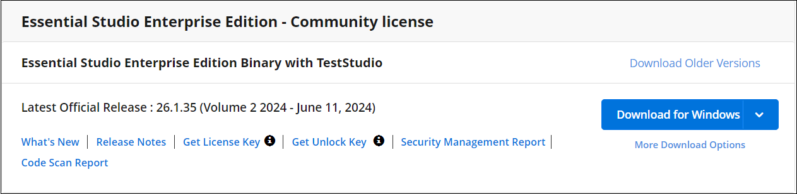

# Generate Syncfusion&reg; Vue License key

License keys can be generated from the [License & Downloads](https://syncfusion.com/account/downloads) or [Trial & Downloads](https://www.syncfusion.com/account/manage-trials/downloads) section of the Syncfusion&reg; website.

> * Syncfusion&reg; license keys are **version and platform specific**. Refer to the [KB](https://www.syncfusion.com/kb/8976/how-to-generate-license-key-for-licensed-products) to generate the license key for the required version and platform.
> * Refer to this [KB](https://www.syncfusion.com/kb/8951/which-version-syncfusion-license-key-should-i-use-in-my-application) to know which version of the Syncfusion&reg; license key should be used in the application.

## Claim license key

Syncfusion&reg; License keys can also be generated from the **"Claim License Key"** page based on the trial or valid license associated with your Syncfusion&reg; account.

You can get the license key, based on license availability in your Syncfusion&reg; account.

### Active license

If you have a Syncfusion&reg; account associated with valid license, license key will be generated from claim license key page.

### Active trial

If you have a Syncfusion&reg; account associated with valid trial license, license key will be generated from claim license key page with expiry date.

### Expired license

If you have a Syncfusion&reg; account with an expired license, your license subscription must be renewed in order to obtain a valid license key for the latest Essential Studio&reg; version. Meanwhile, a temporary license key with a five day validity period will be generated.

### No trial or no license or expired trial

If the Syncfusion&reg; account is not associated with a trial, license, or expired trial, you can try to claim either a trial or a valid license from claim license page.

## See also

* [How to register Syncfusion&reg; license key in the application?](https://ej2.syncfusion.com/vue/documentation/licensing/license-key-registration/)
* [Licensing FAQ](https://ej2.syncfusion.com/vue/documentation/licensing/licensing-troubleshoot/)