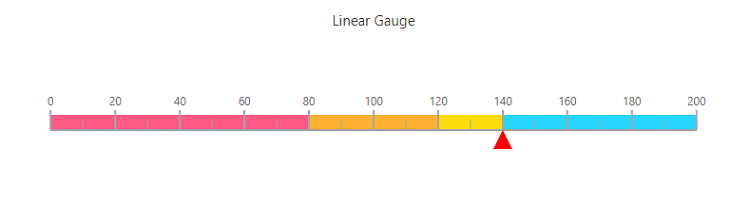

# Getting Started with the Vue Linear Gauge Component in Vue 3

This article provides a step-by-step guide for setting up a [Vite](https://vitejs.dev/) project with a JavaScript environment and integrating the Syncfusion Vue Linear Gauge component using the [Composition API](https://vuejs.org/guide/introduction.html#composition-api) / [Options API](https://vuejs.org/guide/introduction.html#options-api).

The `Composition API` is a new feature introduced in Vue.js 3 that provides an alternative way to organize and reuse component logic. It allows developers to write components as functions that use smaller, reusable functions called composition functions to manage their properties and behavior.

The `Options API` is the traditional way of writing Vue.js components, where the component logic is organized into a series of options that define the component's properties and behavior. These options include data, methods, computed properties, watchers, lifecycle hooks, and more.

## Prerequisites

[System requirements for Syncfusion Vue UI components](https://ej2.syncfusion.com/vue/documentation/system-requirements/)

## Set up the Vite project

A recommended approach for beginning with Vue is to scaffold a project using [Vite](https://vitejs.dev/). To create a new Vite project, use one of the commands that are specific to either NPM or Yarn.

```bash
npm create vite@latest
```

or

```bash
yarn create vite
```

Using one of the above commands will lead you to set up additional configurations for the project as below:

1.Define the project name: We can specify the name of the project directly. Let's specify the name of the project as `my-project` for this article.

```bash
? Project name: » my-project
```

2.Select `Vue` as the framework. It will create a Vue 3 project.

```bash
? Select a framework: » - Use arrow-keys. Return to submit.
Vanilla
> Vue
  React
  Preact
  Lit
  Svelte
  Others
```

3.Choose `JavaScript` as the framework variant to build this Vite project using JavaScript and Vue.

```bash
? Select a variant: » - Use arrow-keys. Return to submit.
> JavaScript
  TypeScript
  Customize with create-vue ↗
  Nuxt ↗
```

4.Upon completing the aforementioned steps to create the `my-project`, run the following command to install its dependencies:

```bash
cd my-project
npm install
```

or

```bash
cd my-project
yarn install
```

Now that `my-project` is ready to run with default settings, let's add Syncfusion components to the project.

## Add Syncfusion Vue packages

Syncfusion Vue component packages are available at [npmjs.com](https://www.npmjs.com/search?q=ej2-vue). To use Syncfusion Vue components in the project, install the corresponding npm package.

This article uses the [Vue Linear Gauge component](https://www.syncfusion.com/vue-components/vue-Linear-gauge) as an example. To use the Vue Linear Gauge component in the project, the `@syncfusion/ej2-vue-lineargauge` package needs to be installed using the following command:

```bash
npm install @syncfusion/ej2-vue-lineargauge --save
```

or

```bash
yarn add @syncfusion/ej2-vue-lineargauge
```

## Add Syncfusion Vue component

Follow the below steps to add the Vue Linear Gauge component using `Composition API` or `Options API`:

1.First, import and register the Linear Gauge component and its child directives in the `script` section of the **src/App.vue** file. If you are using the `Composition API`, you should add the `setup` attribute to the `script` tag to indicate that Vue will be using the `Composition API`.




<script setup>
import { LinearGaugeComponent as EjsLineargauge, AxesDirective as EAxes, AxisDirective as EAxis, PointersDirective as EPointers, PointerDirective as EPointer, RangesDirective as ERanges, RangeDirective as ERange } from '@syncfusion/ej2-vue-lineargauge';
</script>




<script>
import { LinearGaugeComponent, AxesDirective, AxisDirective, PointersDirective, PointerDirective, RangesDirective, RangeDirective } from '@syncfusion/ej2-vue-lineargauge';
//Component registration
export default {
  name: "App",
  components: {
        'ejs-lineargauge' : LinearGaugeComponent,
        'e-axes' : AxesDirective,
        'e-axis' : AxisDirective,
        'e-pointers': PointersDirective,
        'e-pointer' : PointerDirective,
        'e-ranges' : RangesDirective,
        'e-range' : RangeDirective
  }
}
</script>



   
2.In the `template` section, define the Linear Gauge component with the axis, pointer and range property definitions.




<template>
  <ejs-lineargauge :title ='title' orientation='Horizontal'>
        <e-axes>
            <e-axis minimum=0 maximum=200>
                <e-pointers>
                    <e-pointer value=140 color='red'></e-pointer>
                </e-pointers>
                <e-ranges>
                    <e-range start=0 end=80 startWidth=15 endWidth=15></e-range>
                    <e-range start=80 end=120 startWidth=15 endWidth=15></e-range>
                    <e-range start=120 end=140 startWidth=15 endWidth=15></e-range>
                    <e-range start=140 end=200 startWidth=15 endWidth=15></e-range>
                </e-ranges>
            </e-axis>
        </e-axes>
    </ejs-lineargauge>
</template>




3.In the `script` section, declare the values for the properties defined in the `template` section.



<script setup>
    const title = "Linear Gauge";
</script>




<script>
data() {
  return {
    title: 'Linear Gauge'
  };
}
</script>




Here is the summarized code for the above steps in the **src/App.vue** file:




<template>
    <ejs-lineargauge :title ='title' orientation='Horizontal'>
        <e-axes>
            <e-axis minimum=0 maximum=200>
                <e-pointers>
                    <e-pointer value=140 color='red'></e-pointer>
                </e-pointers>
                <e-ranges>
                    <e-range start=0 end=80 startWidth=15 endWidth=15></e-range>
                    <e-range start=80 end=120 startWidth=15 endWidth=15></e-range>
                    <e-range start=120 end=140 startWidth=15 endWidth=15></e-range>
                    <e-range start=140 end=200 startWidth=15 endWidth=15></e-range>
                </e-ranges>
            </e-axis>
        </e-axes>
    </ejs-lineargauge>
</template>

<script setup>
import { LinearGaugeComponent as EjsLineargauge, AxesDirective as EAxes, AxisDirective as EAxis, PointersDirective as EPointers, PointerDirective as EPointer, RangesDirective as ERanges, RangeDirective as ERange } from '@syncfusion/ej2-vue-lineargauge';
const title = "Linear Gauge";
</script>




<template>
    <ejs-lineargauge :title ='title' orientation='Horizontal'>
        <e-axes>
            <e-axis minimum=0 maximum=200>
                <e-pointers>
                    <e-pointer value=140 color='red'></e-pointer>
                </e-pointers>
                <e-ranges>
                    <e-range start=0 end=80 startWidth=15 endWidth=15></e-range>
                    <e-range start=80 end=120 startWidth=15 endWidth=15></e-range>
                    <e-range start=120 end=140 startWidth=15 endWidth=15></e-range>
                    <e-range start=140 end=200 startWidth=15 endWidth=15></e-range>
                </e-ranges>
            </e-axis>
        </e-axes>
    </ejs-lineargauge>
</template>

<script>
  import { LinearGaugeComponent, AxesDirective, AxisDirective, PointersDirective, PointerDirective, RangesDirective, RangeDirective } from '@syncfusion/ej2-vue-lineargauge';
  // Component registration
  export default {
    name: "App",
    // Declaring component and its directives
    components: {
        'ejs-lineargauge' : LinearGaugeComponent,
        'e-axes' : AxesDirective,
        'e-axis' : AxisDirective,
        'e-pointers': PointersDirective,
        'e-pointer' : PointerDirective,
        'e-ranges' : RangesDirective,
        'e-range' : RangeDirective
    },
    // Bound properties declarations
    data() {
      return {
        title: 'Linear Gauge'
      };
    }
  };
</script>




## Run the project

To run the project, use the following command:

```bash
npm run dev
```

or

```bash
yarn run dev
```

The output will appear as follows:



> **Sample**: [vue3-lineargauge-getting-started](https://github.com/SyncfusionExamples/vue3-lineargauge-getting-started).

For migrating from Vue 2 to Vue 3, refer to the [`migration`](https://ej2.syncfusion.com/vue/documentation/getting-started/vue3-tutorial/#migration-from-vue-2-to-vue-3) documentation.

## See also

* [Getting Started with Vue UI Components using Composition API and TypeScript](../getting-started/vue-3-ts-composition)
* [Getting Started with Vue UI Components using Options API and TypeScript](../getting-started/vue-3-ts-options)
