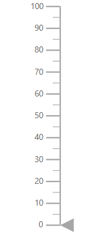

# Getting Started with Vue 3 Linear Gauge

This article provides a step-by-step guide to creating a [Vite](https://vite.dev/) JavaScript project and integrating the Syncfusion<sup style="font-size:70%">&reg;</sup> Vue Linear Gauge component using either the [Composition API](https://vuejs.org/guide/introduction.html#composition-api) or the [Options API](https://vuejs.org/guide/introduction.html#options-api).

The **Composition API** groups related logic into reusable functions. The **Options API** organizes component logic with options such as `data`, `methods`, and life cycle hooks. Choose the API that best fits the application's structure.

The Linear Gauge visualizes numeric values along a linear scale. It can display horizontal or vertical gauges, ranges, and marker or bar pointers.

## Prerequisites

Ensure that the development environment meets the [system requirements for Syncfusion<sup style="font-size:70%">&reg;</sup> Vue UI components](https://ej2.syncfusion.com/vue/documentation/system-requirements).

## Set Up the Vite Project

Create a Vite project using npm or yarn.

**npm**

```bash
npm create vite@latest my-app -- --template vue
```

**yarn**

```bash
yarn create vite my-app --template vue
```
If Vite prompts you to install dependencies and start the project immediately, select **No**. The project dependencies and Syncfusion package are installed in the following steps.

Navigate to the project directory:

```bash
cd my-app
```

Install the project dependencies using the selected package manager:

**npm**

```bash
npm install
```

**yarn**

```bash
yarn install
```

## Add the Syncfusion<sup style="font-size:70%">&reg;</sup> Vue Linear Gauge Package

Syncfusion<sup style="font-size:70%">&reg;</sup> packages are published on [npm](https://www.npmjs.com/search?q=ej2-vue).

Install the package using either npm or yarn.

**npm**

```bash
npm install @syncfusion/ej2-vue-lineargauge
```

**yarn**

```bash
yarn add @syncfusion/ej2-vue-lineargauge
```

## Add the Syncfusion<sup style="font-size:70%">&reg;</sup> Vue Linear Gauge Component

Follow these steps to add the Vue Linear Gauge component using the Composition API or Options API.

**Step 1:** Import and Register the Component

Import the Linear Gauge component in **src/App.vue**.

In the Composition API example, use the `<script setup>` syntax. The aliases correspond to the custom-element names in the template, and imported components are available without a `components` option.




<script setup>
import {
  LinearGaugeComponent as EjsLineargauge
} from '@syncfusion/ej2-vue-lineargauge';
</script>




<script>
import {
  LinearGaugeComponent
} from '@syncfusion/ej2-vue-lineargauge';

export default {
  name: 'App',
  components: {
    'ejs-lineargauge': LinearGaugeComponent
  }
};
</script>




**Step 2:** Define the Linear Gauge in the Template

Add the Linear Gauge to the `template` section of **src/App.vue**.




<template>
  <div id="app">
    <ejs-lineargauge></ejs-lineargauge>
  </div>
</template>




Here is the summarized code for the above steps. Replace the contents of **src/App.vue** with either the Composition API or Options API example.




<template>
  <div id="app">
    <ejs-lineargauge></ejs-lineargauge>
  </div>
</template>

<script setup>
import { LinearGaugeComponent as EjsLineargauge } from '@syncfusion/ej2-vue-lineargauge';
</script>




<template>
  <div id="app">
    <ejs-lineargauge></ejs-lineargauge>
  </div>
</template>

<script>
import { LinearGaugeComponent } from '@syncfusion/ej2-vue-lineargauge';

export default {
  name: 'App',
  components: {
    'ejs-lineargauge': LinearGaugeComponent
  }
};
</script>




## Run the Project

Save **src/App.vue**, and then start the development server:

**npm**

```bash
npm run dev
```

**yarn**

```bash
yarn run dev
```

Open the URL displayed in the terminal, commonly `http://localhost:5173`, and verify that the Linear Gauge is displayed correctly.



> **Sample:** Explore the [Vite-based Vue Linear Gauge getting-started sample](https://github.com/SyncfusionExamples/getting-started-with-the-vue-linear-gauge-component).

## Troubleshooting

- **The Linear Gauge is not rendered.** Verify that the component and all child directives are imported or registered correctly and check the browser console for package or runtime errors.
- **A module-not-found error occurs.** Ensure that the required Linear Gauge package is installed, and then restart the development server.
- **A package or Vue version error occurs.** Confirm that the installed package release supports Vue 3 and the project's Node.js version.

For additional assistance, refer to the [Vue Linear Gauge API documentation](https://ej2.syncfusion.com/vue/documentation/api/linear-gauge).

## See Also

- [Vue 3 Linear Gauge getting-started documentation](https://ej2.syncfusion.com/vue/documentation/linear-gauge/getting-started-vue-3)
- [Vue Linear Gauge examples](https://ej2.syncfusion.com/vue/demos/#/material3/linear-gauge/default-functionalities.html)
- [Vue Linear Gauge overview](https://www.syncfusion.com/vue-components/vue-linear-gauge)
- [Vue 3 Migration Guide](https://v3-migration.vuejs.org/)
- [Getting Started with Vue UI Components using the Composition API and TypeScript](https://ej2.syncfusion.com/vue/documentation/getting-started/vue-3-ts-composition)
- [Getting Started with Vue UI Components using the Options API and TypeScript](https://ej2.syncfusion.com/vue/documentation/getting-started/vue-3-ts-options)