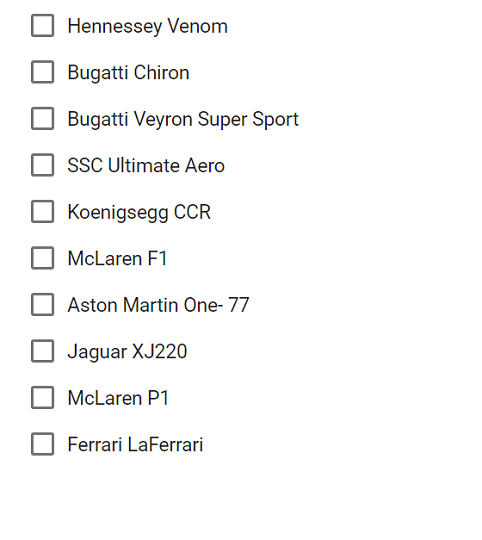

# Getting Started with Syncfusion ListView Component in Vue 3

This section explains how to use ListView component in Vue 3 application.

## Prerequisites

[System requirements for Syncfusion Vue UI components](https://ej2.syncfusion.com/vue/documentation/system-requirements/)

## Creating Vue application using Vue CLI

The easiest way to create a Vue application is to use the [`Vue CLI`](https://github.com/vuejs/vue-cli). Vue CLI versions above [`4.5.0`](https://v3.vuejs.org/guide/migration/introduction.html#vue-cli) are mandatory for creating applications using Vue 3. Use the following command to uninstall older versions of the Vue CLI.

```bash
npm uninstall vue-cli -g
```

Use the following commands to install the latest version of Vue CLI.

```bash
npm install -g @vue/cli
npm install -g @vue/cli-init
```

Create a new project using the command below.

```bash
vue create quickstart
cd quickstart
```

Initiating a new project prompts us to choose the type of project to be used for the current application. Select the option `Default (Vue 3)` from the menu.


## Adding Syncfusion ListView package in the application

Syncfusion Vue packages are maintained in the [`npmjs.com`](https://www.npmjs.com/~syncfusionorg) registry.
The ListView component will be used in this example. To install it use the following command.

```bash
npm install @syncfusion/ej2-vue-lists --save
```

## Adding CSS reference for Syncfusion Vue ListView component

Import the needed css styles for the  ListView component along with dependency styles in the `<style>` section of the `src/App.vue` file as follows.

```
<style>
@import "../node_modules/@syncfusion/ej2-base/styles/material.css";
@import "../node_modules/@syncfusion/ej2-vue-lists/styles/material.css";
</style>
```

## Adding Syncfusion Vue ListView component in the application

You have completed all the necessary configurations needed  for rendering the Syncfusion Vue component. Now, you are going to add the ListView component using following steps.

1. Import the ListView component in the `<script>` section of the `src/App.vue` file.

    ```
    <script>
    import { ListViewComponent } from "@syncfusion/ej2-vue-lists";
    </script>

    ```

2. Register the ListView component as like in the below code snippet

      ```js
      import { ListViewComponent } from "@syncfusion/ej2-vue-lists";
        //Component registeration
      export default {
          name: "App",
          components: {
            "ejs-listview": ListViewComponent
          }
      }
    ```

3. Add the component definition in template section.

    ```
    <template>
      <ejs-listview id='sample-list-flat' :dataSource='data' showCheckBox='true'></ejs-listview>
    </template>
    ```

4. Summarizing the above steps, update the `src/App.vue` file with following code.

    ```
    <template>
      <ejs-listview id='sample-list-flat' :dataSource='data' showCheckBox='true'></ejs-listview>
    </template>

    <script>
    import { ListViewComponent } from "@syncfusion/ej2-vue-lists";

    export default {
        name: "App",
        components: {
          "ejs-listview": ListViewComponent
        },
        data() {
        return {
          data: [
            { text: 'Hennessey Venom', id: 'list-01' },
            { text: 'Bugatti Chiron', id: 'list-02' },
            { text: 'Bugatti Veyron Super Sport', id: 'list-03' },
            { text: 'SSC Ultimate Aero', id: 'list-04' },
            { text: 'Koenigsegg CCR', id: 'list-05' },
            { text: 'McLaren F1', id: 'list-06' },
            { text: 'Aston Martin One- 77', id: 'list-07' },
            { text: 'Jaguar XJ220', id: 'list-08' },
            { text: 'McLaren P1', id: 'list-09' },
            { text: 'Ferrari LaFerrari', id: 'list-10' },
          ],
        };
      }
    }
    </script>
    <style>
    @import "../node_modules/@syncfusion/ej2-base/styles/material.css";
    @import "../node_modules/@syncfusion/ej2-vue-lists/styles/material.css";
    @import "../node_modules/@syncfusion/ej2-vue-buttons/styles/material.css";
    </style>
    ```

## Running the application

Run the application using the following command.

```bash
npm run serve
```

Web server will be initiated, Open the quick start app in the browser at port `localhost:8080`.


