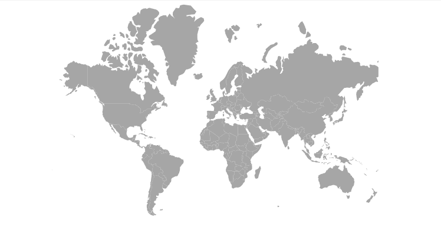

# Getting Started with the Vue Maps Component in Vue 3

This guide provides a step-by-step walkthrough for setting up a [Vite](https://vitejs.dev/) project with JavaScript and integrating the Syncfusion<sup style="font-size:70%">&reg;</sup> Vue Maps component using the [Composition API](https://vuejs.org/guide/introduction.html#composition-api) / [Options API](https://vuejs.org/guide/introduction.html#options-api). By the end, you'll have a working Maps component displaying geographic data with legends, tooltips, and data labels.

## Choosing Between Composition API and Options API

Vue 3 supports two patterns for organizing component logic:

- **Composition API** (`<script setup>`) - A modern, function-based approach that helps organize related logic into reusable functions and improves code maintainability.
- **Options API** - Traditional, object-based approach with separate sections for data, methods, computed properties, and lifecycle hooks. Familiar for developers transitioning from Vue 2.

## Prerequisites

Ensure that the development environment meets the required criteria listed in [System requirements for Syncfusion<sup style="font-size:70%">&reg;</sup> Vue UI components](https://ej2.syncfusion.com/vue/documentation/system-requirements).

## Set Up the Vite Project

[Vite](https://vitejs.dev/) provides a lightweight, fast development environment for Vue 3 projects. To create a new Vite project, run one of the following commands from the directory where you want the project to live:

**npm**

```bash
npm create vite@latest
```

**yarn**

```bash
yarn create vite
```

If you prefer the interactive flow, run `npm create vite@latest` (or `yarn create vite`) and answer the prompts as shown below.

**Step 1:** **Project name** - Enter `my-project` (or your preferred name):

```text
? Project name: » my-project
```

**Step 2:** **Framework selection** - Select `Vue`:

```text
? Select a framework: » - Use arrow-keys. Return to submit.
Vanilla
> Vue
  React
  Preact
  Lit
  Svelte
  Others
```

**Step 3:** **Variant selection** - Choose `JavaScript`:

```text
? Select a variant: » - Use arrow-keys. Return to submit.
> JavaScript
  TypeScript
  Customize with create-vue ↗
  Nuxt ↗
```

**Step 4:** **Install dependencies** - After the project is created, the CLI prompts you to install dependencies and start the development server:

```bash
? Install with <package-manager> and start now?
❯ Yes / No
```

Select **No** and navigate to the project directory:

```bash
cd my-project
```

Then install the base dependencies using either package manager:

**npm**

```bash
npm install
```

**yarn**

```bash
yarn install
```

Now that `my-project` is ready, add Syncfusion<sup style="font-size:70%">&reg;</sup> Vue components to the project.

## Add Syncfusion<sup style="font-size:70%">&reg;</sup> Vue Packages

Syncfusion<sup style="font-size:70%">&reg;</sup> Vue component packages are available at [npmjs.com](https://www.npmjs.com/search?q=ej2-vue). Install the required npm package to use Syncfusion components.

This guide uses the [Vue Maps component](https://www.syncfusion.com/vue-components/vue-maps) as an example. From the project root, install the `@syncfusion/ej2-vue-maps` package using either npm or Yarn:

**npm**

```bash
npm install @syncfusion/ej2-vue-maps
```

**yarn**

```bash
yarn add @syncfusion/ej2-vue-maps
```

> Note: npm v5+ saves packages to `dependencies` by default; the `--save` flag is not required.

## Add Syncfusion<sup style="font-size:70%">&reg;</sup> Vue Maps Component

**Step 1:** Import and register the Maps component and its child directives in the **src/App.vue** file. The import structure differs slightly between the two APIs:
   - **Composition API**: Use the `<script setup>` syntax.
   - **Options API**: Register the component and directives using the `components` option.




<script setup>
  import { MapsComponent as EjsMaps, LayersDirective as ELayers, LayerDirective as ELayer, MapAjax } from '@syncfusion/ej2-vue-maps';
</script>




<script>
import { MapsComponent, LayersDirective, LayerDirective, MapAjax } from '@syncfusion/ej2-vue-maps'
// Component registration
export default {
  name: "App",
  components: {
    'ejs-maps' : MapsComponent,
    'e-layers' : LayersDirective,
    'e-layer' : LayerDirective
  }
}
</script>



   
**Step 2:** Declare the property values referenced in the template:




<script setup>
    const shapeData = new MapAjax('https://cdn.syncfusion.com/maps/map-data/world-map.json');
</script>




<script>
data() {
  return {
    shapeData: new MapAjax('https://cdn.syncfusion.com/maps/map-data/world-map.json'),
  };
}
</script>




**Step 3:** Define the Maps component template and bind the `shapeData` property to the layer:




<template>
   <ejs-maps>
        <e-layers>
            <e-layer :shapeData='shapeData'></e-layer>
        </e-layers>
    </ejs-maps>
</template>




Here is the complete code combining all steps in the **src/App.vue** file:




<template>
    <ejs-maps>
        <e-layers>
            <e-layer :shapeData='shapeData'></e-layer>
        </e-layers>
    </ejs-maps>
</template>

<script setup>
import { MapsComponent as EjsMaps, LayersDirective as ELayers, LayerDirective as ELayer, MapAjax } from '@syncfusion/ej2-vue-maps';
const shapeData = new MapAjax('https://cdn.syncfusion.com/maps/map-data/world-map.json');
</script>




<template>
    <ejs-maps>
        <e-layers>
            <e-layer :shapeData='shapeData'></e-layer>
        </e-layers>
    </ejs-maps>
</template>

<script>
  import { MapsComponent, LayersDirective, LayerDirective, MapAjax } from '@syncfusion/ej2-vue-maps';
  // Component registration
  export default {
    name: "App",
    // Declaring component and its directives
    components: {
        'ejs-maps' : MapsComponent,
        'e-layers' : LayersDirective,
        'e-layer' : LayerDirective
    },
    // Bound properties declarations
    data() {
      return {
        shapeData: new MapAjax('https://cdn.syncfusion.com/maps/map-data/world-map.json'),
      };
    }
  };
</script>




## Run the Project

To run the project, use either npm or Yarn:

**npm**

```bash
npm run dev
```

**yarn**

```bash
yarn run dev
```

Vite starts the development server (default URL: `http://localhost:5173`). Open this URL in your browser to see the basic Maps component rendering the world map:



> **Sample**: You can explore the complete sample project in the [vue3-maps-getting-started](https://github.com/SyncfusionExamples/vue3-maps-getting-started) repository.

## Module Injection

The Vue Maps component uses a modular architecture where features are split into individual modules. To use advanced features such as tooltips, data labels, and the legend, inject the corresponding modules using the Vue `provide` option. The following example adds `MapsTooltip`, `DataLabel`, and `Legend` to the Composition API example:




<script setup>
import { MapsComponent as EjsMaps, LayersDirective as ELayers, LayerDirective as ELayer, MapAjax, Legend, DataLabel, MapsTooltip } from '@syncfusion/ej2-vue-maps';

const shapeData = new MapAjax('https://cdn.syncfusion.com/maps/map-data/world-map.json');
const legendSettings = { visible: true };
const dataLabelSettings = { visible: true, labelPath: 'name' };
const tooltipSettings = { visible: true };

provide('maps', [Legend, DataLabel, MapsTooltip]);
</script>




<script>
import { MapsComponent, LayersDirective, LayerDirective, MapAjax, Legend, DataLabel, MapsTooltip } from '@syncfusion/ej2-vue-maps';

export default {
  name: "App",
  components: {
    'ejs-maps' : MapsComponent,
    'e-layers' : LayersDirective,
    'e-layer' : LayerDirective
  },
  data() {
    return {
      shapeData: new MapAjax('https://cdn.syncfusion.com/maps/map-data/world-map.json'),
      legendSettings: { visible: true },
      dataLabelSettings: { visible: true, labelPath: 'name' },
      tooltipSettings: { visible: true }
    };
  },
  provide: {
    maps: [Legend, DataLabel, MapsTooltip]
  }
};
</script>




## Troubleshooting

The following are common issues you may encounter when getting started with the Maps component in Vue 3:

* **Blank map is displayed** — Confirm that `MapAjax` is constructed and passed to the [`shapeData`](https://ej2.syncfusion.com/vue/documentation/api/maps/layersettingsmodel#shapedata) property on `<e-layer>`, and that the template is wrapped in a single root element if Vite reports a multi-root warning.
* **CORS errors when loading the remote GeoJSON** — Self-host the `world-map.json` file in your `public/` folder and replace the URL with a relative path, or configure CORS on the host serving the JSON.
* **Module features do not render (tooltips, legend, data labels)** — Confirm the corresponding module is added to the `provide.maps` array (Options API) or passed to `provide('maps', [...])` (Composition API).

## See Also

* [Getting Started with Vue UI Components using Composition API and TypeScript](../getting-started/vue-3-ts-composition)
* [Getting Started with Vue UI Components using Options API and TypeScript](../getting-started/vue-3-ts-options)
