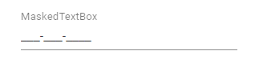
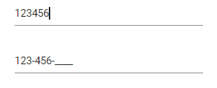

# Getting Started

This section explains how to use Syncfusion Vue MaskedTextBox components in Vue 3 application.

## Prerequisites

[System requirements for Syncfusion Vue UI components](https://ej2.syncfusion.com/vue/documentation/system-requirements/)

## Creating Vue application using Vue CLI

The easiest way to create a Vue application is to use the [`Vue CLI`](https://github.com/vuejs/vue-cli). Vue CLI versions above [`4.5.0`](https://v3.vuejs.org/guide/migration/introduction.html#vue-cli) are mandatory for creating applications using Vue 3. Use the following command to uninstall older versions of the Vue CLI.

```bash
npm uninstall vue-cli -g
```

Use the following commands to install the latest version of Vue CLI.

```bash
npm install -g @vue/cli
npm install -g @vue/cli-init
```

Create a new project using the command below.

```bash
vue create quickstart
```

Initiating a new project prompts us to choose the type of project to be used for the current application. Select the option `Default (Vue 3)` from the menu.


## Adding Syncfusion MaskedTextBox package in the application

 Syncfusion Vue packages are maintained in the [`npmjs.com`](https://www.npmjs.com/~syncfusionorg) registry.
The MaskedTextBox component will be used in this example. To install it use the following command.

```bash
npm install @syncfusion/ej2-vue-inputs --save
```

## Adding CSS reference for Syncfusion Vue MaskedTextBox component

Import the needed css styles for the MaskedTextBox component along with dependency styles in the `<style>` section of the `src/App.vue` file as follows.

```
<style>
    @import "../node_modules/@syncfusion/ej2-base/styles/material.css";
    @import "../node_modules/@syncfusion/ej2-vue-inputs/styles/material.css";
</style>
```

## Adding Syncfusion Vue MaskedTextBox component in the application

You have completed all the necessary configurations needed for rendering the Syncfusion Vue component. Now, you are going to add the MaskedTextBox component using following steps.

Import the MaskedTextBox component in the `<script>` section of the `src/App.vue` file.

```
<script>
import { MaskedTextBoxComponent } from "@syncfusion/ej2-vue-inputs";
</script>
```

Register the MaskedTextBox component.

 ```js
import { MaskedTextBoxComponent } from "@syncfusion/ej2-vue-inputs";
//Component registeration
export default {
    name: "App",
    components: {
        'ejs-maskedtextbox': MaskedTextBoxComponent,
    }
}
```

Add the component definition in template section.

```
<template>
    <div class="control_wrapper">
        <ejs-maskedtextbox></ejs-maskedtextbox>
    </div>
</template>
```

Summarizing the above steps, update the `src/App.vue` file with following code.

    ```
    <template>
        <div class="control_wrapper">
            <ejs-maskedtextbox></ejs-maskedtextbox>
        </div>
    </template>
    <script>
    import { MaskedTextBoxComponent } from "@syncfusion/ej2-vue-inputs";
    //Component registeration
    export default {
        name: 'App',
        components: {
            "ejs-maskedtextbox": MaskedTextBoxComponent
        }
    }
    </script>
    <style>
        @import "../node_modules/@syncfusion/ej2-base/styles/material.css";
        @import "../node_modules/@syncfusion/ej2-vue-inputs/styles/material.css";
        .control_wrapper {
            margin: 0 auto;
            width: 240px;
        }
    </style>
    ```

## Running the application

Run the application using the following command.

```bash
npm run serve
```

## Set the mask

You can set the mask to the MaskedTextBox to validate the user input by using the
[mask](https://ej2.syncfusion.com/vue/documentation/api/maskedtextbox#mask) property. To know more about
the usage of mask and configuration, refer to this [link](./mask-configuration/).

The following example demonstrates the usage of mask element 0 that allows any single digit from 0 to 9.

    ```
    <template>
        <div id="app">
            <div class='wrap'>
                <ejs-maskedtextbox mask='000-000-0000' placeholder='MaskedTextBox' floatLabelType='Always'></ejs-maskedtextbox>
            </div>
        </div>
    </template>
    <script>
    import { MaskedTextBoxComponent } from "@syncfusion/ej2-vue-inputs";
    //Component registeration
    export default {
        name: 'App',
        components: {
            "ejs-maskedtextbox": MaskedTextBoxComponent
        },
        data () {
            return {}
        }
    }
    </script>
    <style>
        @import "../node_modules/@syncfusion/ej2-base/styles/material.css";
        @import "../node_modules/@syncfusion/ej2-vue-inputs/styles/material.css";
        .wrap {
            margin: 0 auto;
            width: 240px;
        }
    </style>
    ```

Output be like the below.



## Model binding

In MaskedTextBox, the `value` property supports model binding functionality.

The following example demonstrates model binding functionality with the MaskedTextBox and HTML input element.

    ```
    <template>
        <div id="app">
            <div class='wrap'>
                <div class='e-input-group' style='margin-bottom:30px'>
                    <input class='e-input' type='text' v-model='value' placeholder='Mobile Number' />
                </div>
                <ejs-maskedtextbox v-model="value" :value="value" mask='000-000-0000'></ejs-maskedtextbox>
            </div>
        </div>
    </template>
    <script>
    import { MaskedTextBoxComponent } from "@syncfusion/ej2-vue-inputs";
    //Component registeration
    export default {
        name: 'App',
        components: {
            "ejs-maskedtextbox": MaskedTextBoxComponent
        },
        data () {
            return {
                value : ''
            }
        }
    }
    </script>
    <style>
        @import "../node_modules/@syncfusion/ej2-base/styles/material.css";
        @import "../node_modules/@syncfusion/ej2-vue-inputs/styles/material.css";
        .wrap {
            margin: 35px auto;
            width: 240px;
        }
    </style>
    ```

Output be like the below.



## See Also

* [How to perform custom validation using FormValidator](./how-to/perform-custom-validation-using-form-validator/)
* [How to customize the UI appearance of the control](./how-to/customize-the-ui-appearance-of-the-control/)
* [How to set cursor position while focus on the input textbox](./how-to/set-cursor-position-while-focus-on-the-input-textbox/)
* [How to display numeric keypad when focus on mobile devices](./how-to/display-numeric-keypad-when-focus-on-mobile-devices/)