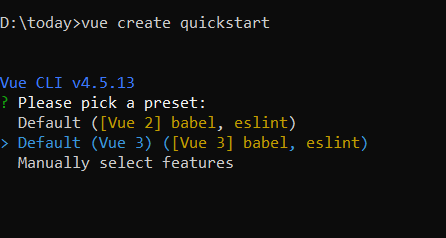

# Getting Started with the Vue Mention Component in Vue 2

This article provides a step-by-step guide for setting up a Vue 2 project using [Vue-CLI](https://cli.vuejs.org) and integrating the Syncfusion<sup style="font-size:70%">&reg;</sup> Vue Mention component.

To get started quickly with Vue Mention, check this video:



## Prerequisites

[System requirements for Syncfusion<sup style="font-size:70%">&reg;</sup> Vue UI components](https://ej2.syncfusion.com/vue/documentation/system-requirements)

## Setup the Vue 2 project

To generate a Vue 2 project using Vue-CLI, use the [vue create](https://cli.vuejs.org/#getting-started) command. Follow these steps to install Vue CLI and create a new project:

```bash
npm install -g @vue/cli
vue create quickstart
cd quickstart
npm run serve
```

or

```bash
yarn global add @vue/cli
vue create quickstart
cd quickstart
yarn run serve
```

When creating a new project, choose the option `Default ([Vue 2] babel, eslint)` from the menu.



Once the `quickstart` project is set up with default settings, proceed to add Syncfusion<sup style="font-size:70%">&reg;</sup> components to the project.

## Add Syncfusion<sup style="font-size:70%">&reg;</sup> Vue packages

Syncfusion<sup style="font-size:70%">&reg;</sup> packages are available at [npmjs.com](https://www.npmjs.com/search?q=ej2-vue). To use Vue components, install the required npm package.

This article uses the [Vue Mention component](https://www.syncfusion.com/vue-components/vue-mention) as an example. Install the `@syncfusion/ej2-vue-dropdowns` package by running the following command:

```bash
npm install @syncfusion/ej2-vue-dropdowns --save
```
or

```bash
yarn add @syncfusion/ej2-vue-dropdowns
```

## Import Syncfusion<sup style="font-size:70%">&reg;</sup> CSS styles

Syncfusion<sup style="font-size:70%">&reg;</sup> components require CSS stylesheets to display correctly. You can import themes in various ways, such as using CSS or SASS styles from npm packages, CDN, CRG, and [Theme Studio](https://ej2.syncfusion.com/vue/documentation/appearance/theme-studio). Refer to [themes topic](https://ej2.syncfusion.com/vue/documentation/appearance/theme) to learn more about built-in themes and different ways to reference themes in a Vue project.

In this article, the `Material3` theme is applied using CSS styles, which are available in installed packages. The necessary `Material3` CSS styles for the Mention component and its dependents were imported into the `<style>` section of the **src/App.vue** file.




<style>
@import "../node_modules/@syncfusion/ej2-base/styles/bootstrap5.css";
@import "../node_modules/@syncfusion/ej2-buttons/styles/bootstrap5.css";
@import "../node_modules/@syncfusion/ej2-popups/styles/bootstrap5.css";
@import "../node_modules/@syncfusion/ej2-lists/styles/bootstrap5.css";
@import "../node_modules/@syncfusion/ej2-vue-dropdowns/styles/bootstrap5.css";
</style>




> The order of CSS imports matters. Import base styles first, then component-specific styles. Missing CSS imports can result in misaligned layouts, buttons without styling, or missing visual elements in popups and dialogs.

## Add Syncfusion<sup style="font-size:70%">&reg;</sup> Vue component

Follow the below steps to add the Vue Mention component:

1\. First, import and register the Mention component in the `script` section of the **src/App.vue** file.




<script setup>
import { MentionComponent as EjsMention } from "@syncfusion/ej2-vue-dropdowns";
</script>




<script>
import { MentionComponent } from "@syncfusion/ej2-vue-dropdowns";
export default {
  components: {
    'ejs-mention': MentionComponent
  }
}
</script>




## Adding Mention component

Add the EJ2 Vue Mention using `<ejs-mention>` to the `<template>` section of the `App.vue` file in `src` directory. To use the Mention component properly, the [`target`](https://ej2.syncfusion.com/vue/documentation/api/mention/index-default#target) property should be configured so that it renders the Mention component in the configured element.




<template>
  <div id="app">
    <label id="comment" >Comments</label>
    <div id="mentionElement" placeholder = "Type @ and tag user"></div>
    <ejs-mention id='defaultMention' :target='mentionTarget'></ejs-mention>
  </div>
</template>

<script setup>
import { MentionComponent as EjsMention } from "@syncfusion/ej2-vue-dropdowns";
const mentionTarget = "#mentionElement";
</script>

<style>
  @import "../node_modules/@syncfusion/ej2-base/styles/bootstrap5.css";
  @import "../node_modules/@syncfusion/ej2-buttons/styles/bootstrap5.css";
  @import "../node_modules/@syncfusion/ej2-popups/styles/bootstrap5.css";
  @import "../node_modules/@syncfusion/ej2-lists/styles/bootstrap5.css";
  @import "../node_modules/@syncfusion/ej2-vue-dropdowns/styles/bootstrap5.css";
  
    #app {
        color: #008cff;
        height: 40px;
        left: 15%;
        position: absolute;
        top: 10%;
        width: 30%;
    }

    #comment {
        font-size: 15px;
        font-weight: 600;
    }

    #mentionElement {
        min-height: 100px;
        border: 1px solid #D7D7D7;
        border-radius: 4px;
        padding: 8px;
        font-size: 14px;
        width: 600px;
    }

    div#mentionElement[placeholder]:empty:before {
        content: attr(placeholder);
        color: #555;
    }
</style>





<template>
  <div id="app">
    <label id="comment" >Comments</label>
    <div id="mentionElement" placeholder = "Type @ and tag user"></div>
    <ejs-mention id='defaultMention' :target='mentionTarget'></ejs-mention>
  </div>
</template>

<script>
import { MentionComponent } from "@syncfusion/ej2-vue-dropdowns";

export default {
  components: {
    'ejs-mention': MentionComponent
  },
  name: 'app',
  data: function() {
      return {
        mentionTarget: "#mentionElement",
      };
  }
}
</script>

<style>
  @import "../node_modules/@syncfusion/ej2-base/styles/bootstrap5.css";
  @import "../node_modules/@syncfusion/ej2-buttons/styles/bootstrap5.css";
  @import "../node_modules/@syncfusion/ej2-popups/styles/bootstrap5.css";
  @import "../node_modules/@syncfusion/ej2-lists/styles/bootstrap5.css";
  @import "../node_modules/@syncfusion/ej2-vue-dropdowns/styles/bootstrap5.css";
  
    #app {
        color: #008cff;
        height: 40px;
        left: 15%;
        position: absolute;
        top: 10%;
        width: 30%;
    }

    #comment {
        font-size: 15px;
        font-weight: 600;
    }

    #mentionElement {
        min-height: 100px;
        border: 1px solid #D7D7D7;
        border-radius: 4px;
        padding: 8px;
        font-size: 14px;
        width: 600px;
    }

    div#mentionElement[placeholder]:empty:before {
        content: attr(placeholder);
        color: #555;
    }
</style>





## Binding data source

After initialization, populate the Mention with data using the [`dataSource`](https://ej2.syncfusion.com/vue/documentation/api/mention/index-default#datasource) property. Here, an array of string values is passed to the Mention component.




<template>
  <div id="app">
    <label id="comment" >Comments</label>
    <div id="mentionElement" placeholder = "Type @ and tag user"></div>
    <ejs-mention id='defaultMention' :target='mentionTarget' :dataSource='userData'></ejs-mention>
  </div>
</template>
<script setup>
import { MentionComponent as EjsMention } from "@syncfusion/ej2-vue-dropdowns";
const mentionTarget = "#mentionElement";
const userData = ['Selma Rose', 'Garth', 'Robert', 'William', 'Joseph'];
</script>
<style>
  @import "../node_modules/@syncfusion/ej2-base/styles/bootstrap5.css";
  @import "../node_modules/@syncfusion/ej2-buttons/styles/bootstrap5.css";
  @import "../node_modules/@syncfusion/ej2-popups/styles/bootstrap5.css";
  @import "../node_modules/@syncfusion/ej2-lists/styles/bootstrap5.css";
  @import "../node_modules/@syncfusion/ej2-vue-dropdowns/styles/bootstrap5.css";
  #app {
    color: #008cff;
    height: 40px;
    left: 15%;
    position: absolute;
    top: 10%;
    width: 30%;
  }
  #comment {
      font-size: 15px;
      font-weight: 600;
  }
  #mentionElement {
      min-height: 100px;
      border: 1px solid #D7D7D7;
      border-radius: 4px;
      padding: 8px;
      font-size: 14px;
      width: 600px;
  }
  div#mentionElement[placeholder]:empty:before {
      content: attr(placeholder);
      color: #555;
  }
</style>




<template>
  <div id="app">
    <label id="comment" >Comments</label>
    <div id="mentionElement" placeholder = "Type @ and tag user"></div>
    <ejs-mention id='defaultMention' :target='mentionTarget' :dataSource='userData'></ejs-mention>
  </div>
</template>
<script>
import { MentionComponent } from "@syncfusion/ej2-vue-dropdowns";
export default {
  components: {
    'ejs-mention': MentionComponent
  },
  name: 'app',
  data: function() {
    return {
      mentionTarget: "#mentionElement",
      userData: ['Selma Rose', 'Garth', 'Robert', 'William', 'Joseph']
    };
  }
}
</script>
<style>
  @import "../node_modules/@syncfusion/ej2-base/styles/bootstrap5.css";
  @import "../node_modules/@syncfusion/ej2-buttons/styles/bootstrap5.css";
  @import "../node_modules/@syncfusion/ej2-popups/styles/bootstrap5.css";
  @import "../node_modules/@syncfusion/ej2-lists/styles/bootstrap5.css";
  @import "../node_modules/@syncfusion/ej2-vue-dropdowns/styles/bootstrap5.css";
  #app {
    color: #008cff;
    height: 40px;
    left: 15%;
    position: absolute;
    top: 10%;
    width: 30%;
  }
  #comment {
      font-size: 15px;
      font-weight: 600;
  }
  #mentionElement {
      min-height: 100px;
      border: 1px solid #D7D7D7;
      border-radius: 4px;
      padding: 8px;
      font-size: 14px;
      width: 600px;
  }
  div#mentionElement[placeholder]:empty:before {
      content: attr(placeholder);
      color: #555;
  }
</style>




Here is the summarized code for the above steps in the **src/App.vue** file:










## Run the project

To run the project, use the following command:

```bash
npm run serve
```

or

```bash
yarn run serve
```
      


## Display Mention character

By using the [showMentionChar](https://ej2.syncfusion.com/vue/documentation/api/mention/index-default#showMentionChar) property, the text content can be displayed along with the mention character. You can customize the mention character by using the [mentionChar](https://ej2.syncfusion.com/vue/documentation/api/mention/index-default#mentionChar) property in the Mention component.

> By default, the [mentionChar](https://ej2.syncfusion.com/vue/documentation/api/mention/index-default#mentionChar) is `@` and the [showMentionChar](https://ej2.syncfusion.com/vue/documentation/api/mention/index-default#showMentionChar) property is disabled.

The following example displays the text content along with the mention character configured as `#`.









        
