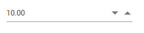
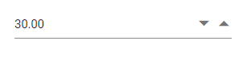
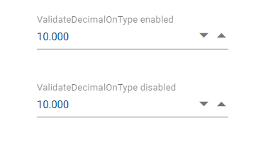
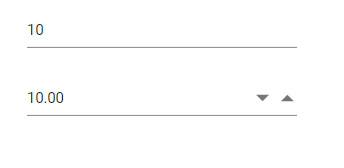

# Getting Started with the Vue NumericTextBox Component in Vue 3

This article provides a step-by-step guide for setting up a [Vite](https://vitejs.dev/) project with a JavaScript environment and integrating the Syncfusion<sup style="font-size:70%">&reg;</sup> Vue NumericTextBox component using the [Composition API](https://vuejs.org/guide/introduction.html#composition-api) / [Options API](https://vuejs.org/guide/introduction.html#options-api).

The `Composition API` is a new feature introduced in Vue.js 3 that provides an alternative way to organize and reuse component logic. It allows developers to write components as functions that use smaller, reusable functions called composition functions to manage their properties and behavior.

The `Options API` is the traditional way of writing Vue.js components, where the component logic is organized into a series of options that define the component's properties and behavior. These options include data, methods, computed properties, watchers, life-cycle hooks, and more.

## Prerequisites

[System requirements for Syncfusion<sup style="font-size:70%">&reg;</sup> Vue UI components](https://ej2.syncfusion.com/vue/documentation/system-requirements)

## Set up the Vite project

A recommended approach for beginning with Vue is to scaffold a project using [Vite](https://vitejs.dev/). To create a new Vite project, use one of the commands that are specific to either NPM or Yarn.

```bash
npm create vite@latest
```

or

```bash
yarn create vite
```

Using one of the above commands will lead you to set up additional configurations for the project as below:

1.Define the project name: We can specify the name of the project directly. Let's specify the name of the project as `my-project` for this article.

```bash
? Project name: » my-project
```

2.Select `Vue` as the framework. It will create a Vue 3 project.

```bash
? Select a framework: » - Use arrow-keys. Return to submit.
Vanilla
> Vue
  React
  Preact
  Lit
  Svelte
  Others
```

3.Choose `JavaScript` as the framework variant to build this Vite project using JavaScript and Vue.

```bash
? Select a variant: » - Use arrow-keys. Return to submit.
> JavaScript
  TypeScript
  Customize with create-vue ↗
  Nuxt ↗
```
4.Roll-down is Vite's new experimental faster bundler (rust-based, replacing roll-up). Choose `No` uses the stable, proven roll-up-based Vite (recommended for most users)

```bash
Use rolldown-vite (Experimental)? No
```

5.Install dependencies and start the dev server.

```bash
Install with npm and start now?: Yes
```

Since you selected `Yes`, the development server should start automatically. If you selected `No`, please follow these steps to set up and start the project manually:

```bash
cd my-project
npm install
```

or

```bash
cd my-project
yarn install
```

Now that `my-project` is ready to run with default settings, let's add Syncfusion<sup style="font-size:70%">&reg;</sup> components to the project.

## Add Syncfusion<sup style="font-size:70%">&reg;</sup> Vue packages

Syncfusion<sup style="font-size:70%">&reg;</sup> Vue component packages are available at [npmjs.com](https://www.npmjs.com/search?q=ej2-vue). To use Syncfusion<sup style="font-size:70%">&reg;</sup> Vue components in the project, install the corresponding npm package.

This article uses the [Vue NumericTextBox component](https://www.syncfusion.com/vue-components/vue-numeric-textbox) as an example. To use the Vue NumericTextBox component in the project, the `@syncfusion/ej2-vue-inputs` package needs to be installed using the following command:

```bash
npm install @syncfusion/ej2-vue-inputs --save
```

or

```bash
yarn add @syncfusion/ej2-vue-inputs
```

## Import Syncfusion<sup style="font-size:70%">&reg;</sup> CSS styles

Syncfusion<sup style="font-size:70%">&reg;</sup> components require CSS stylesheets to display correctly. You can import themes in various ways, such as using CSS or SASS styles from npm packages, CDN, CRG, and [Theme Studio](https://ej2.syncfusion.com/vue/documentation/appearance/theme-studio). Refer to [themes topic](https://ej2.syncfusion.com/vue/documentation/appearance/theme) to learn more about built-in themes and different ways to reference themes in a Vue project.

In this article, `Material3` theme is applied using CSS styles, which are available in installed packages. The necessary `Material3` CSS styles for the NumericTextBox component and its dependents were imported into the `<style>` section of **src/App.vue** file.




<style>
  @import "../node_modules/@syncfusion/ej2-base/styles/material.css";
  @import "../node_modules/@syncfusion/ej2-vue-inputs/styles/material.css";
</style>




> The order of CSS imports matters. Import base styles first, then component-specific styles. Missing CSS imports can result in misaligned layouts, buttons without styling, or missing visual elements in popups and dialogs.

## Add Syncfusion<sup style="font-size:70%">&reg;</sup> Vue component

Follow the below steps to add the Vue NumericTextBox component using `Composition API` or `Options API`:

  1.First, import and register the NumericTextBox component in the `script` section of the **src/App.vue** file. If you are using the `Composition API`, you should add the `setup` attribute to the `script` tag to indicate that Vue will be using the `Composition API`.





<script setup>
import { NumericTextBoxComponent as EjsNumerictextbox } from "@syncfusion/ej2-vue-inputs";
</script>





<script>
import { NumericTextBoxComponent } from "@syncfusion/ej2-vue-inputs";
//Component registeration
export default {
name: "App",
components: {
"ejs-numerictextbox'":NumericTextBoxComponent
},
}
</script>



   
2.In the `template` section, define the NumericTextBox component with the [dataSource](https://ej2.syncfusion.com/vue/documentation/api/numerictextbox#datasource) property and column definitions.




<template>
    <div class="control_wrapper">
        <ejs-numerictextbox value="10"></ejs-numerictextbox>
    </div>
</template>




Here is the summarized code for the above steps in the **src/App.vue** file:




<template>
    <div class="control_wrapper">
        <ejs-numerictextbox value="10"></ejs-numerictextbox>
    </div>
</template>
<script setup>
import { NumericTextBoxComponent as EjsNumerictextbox } from "@syncfusion/ej2-vue-inputs";

</script>
<style>
    @import "../node_modules/@syncfusion/ej2-base/styles/material.css";
    @import "../node_modules/@syncfusion/ej2-vue-inputs/styles/material.css";
    .control_wrapper {
        margin: 35px auto;
        width: 240px;
    }
</style>





<template>
    <div class="control_wrapper">
        <ejs-numerictextbox value="10"></ejs-numerictextbox>
    </div>
</template>
<script>
import { NumericTextBoxComponent } from "@syncfusion/ej2-vue-inputs";
//Component registeration
export default {
name: "App",
components: {
"ejs-numerictextbox":NumericTextBoxComponent
}
}
</script>
<style>
    @import "../node_modules/@syncfusion/ej2-base/styles/material.css";
    @import "../node_modules/@syncfusion/ej2-vue-inputs/styles/material.css";
    .control_wrapper {
        margin: 35px auto;
        width: 240px;
    }
</style>




## Run the project

To run the project, use the following command:

```bash
npm run dev
```

or

```bash
yarn run dev
```

The output will appear as follows:



## Range validation

You can set the minimum and maximum range of values in the NumericTextBox using the [`min`](https://ej2.syncfusion.com/vue/documentation/api/numerictextbox#min) and [`max`](https://ej2.syncfusion.com/vue/documentation/api/numerictextbox#max) properties, so the numeric value should be in the min and max range.

The validation behavior depends on the [`strictMode`](https://ej2.syncfusion.com/vue/documentation/api/numerictextbox#strictmode) property.




<template>
    <div id="app">
        <div class='wrap'>
            <ejs-numerictextbox id="numeric" ref="numeric_instance" :value="data[0].value" :step="data[0].step" :min="data[0].min" :max="data[0].max"></ejs-numerictextbox>
        </div>
    </div>
</template>
<script setup>
import { NumericTextBoxComponent } from "@syncfusion/ej2-vue-inputs";
import { NumericTextBoxComponent as EjsNumerictextbox } from "@syncfusion/ej2-vue-inputs";
  const data = [{ min: 1, 
                  max: 100, 
                  value:30,
                  step: 2}]
</script>
<style>
    @import "../node_modules/@syncfusion/ej2-base/styles/material.css";
    @import "../node_modules/@syncfusion/ej2-vue-inputs/styles/material.css";
    .wrap {
        margin: 0 auto;
        width: 240px;
    }
</style>




<template>
    <div id="app">
        <div class='wrap'>
            <ejs-numerictextbox id="numeric" ref="numeric_instance" :value="value" :step="step" :min="min" :max="max"></ejs-numerictextbox>
        </div>
    </div>
</template>
<script>
import { NumericTextBoxComponent } from "@syncfusion/ej2-vue-inputs";
//Component registeration
export default {
name: "App",
components: {
"ejs-numerictextbox":NumericTextBoxComponent
},
data () {
    return {
        min: 1,
        max: 100,
        value: 30,
        step: 2
    }
}
}
</script>
<style>
    @import "../node_modules/@syncfusion/ej2-base/styles/material.css";
    @import "../node_modules/@syncfusion/ej2-vue-inputs/styles/material.css";
    .wrap {
        margin: 0 auto;
        width: 240px;
    }
</style>




The output will appear as follows:



## Formatting the value

User can set the format of the NumericTextBox component using [`format`](https://ej2.syncfusion.com/vue/documentation/api/numerictextbox#format)
property. The value will be displayed in the specified format, when the component is in focused out state. For more information about formatting the value, refer to this [link](./formats).

The below example demonstrates format the value by using currency format value `c2`.





<template>
    <div id="app">
        <div class='wrap'>
            <ejs-numerictextbox id="numeric" ref="numeric_instance" :format="data[0].format" :value="data[0].value"></ejs-numerictextbox>
        </div>
    </div>
</template>
<script setup>
import { NumericTextBoxComponent as EjsNumerictextbox } from "@syncfusion/ej2-vue-inputs";
  const data = [{ format: 'c2',
                  // sets value to the NumericTextBox
                  value: 10}]
</script>
<style>
    @import "../node_modules/@syncfusion/ej2-base/styles/material.css";
    @import "../node_modules/@syncfusion/ej2-vue-inputs/styles/material.css";
    .wrap {
        margin: 0 auto;
        width: 240px;
    }
</style>





<template>
    <div id="app">
        <div class='wrap'>
            <ejs-numerictextbox id="numeric" ref="numeric_instance" :format="format" :value="value"></ejs-numerictextbox>
        </div>
    </div>
</template>
<script>
import { NumericTextBoxComponent } from "@syncfusion/ej2-vue-inputs";
//Component registeration
export default {
name: "App",
components: {
"ejs-numerictextbox":NumericTextBoxComponent
},
data () {
    return {
        format: 'c2',
        // sets value to the NumericTextBox
        value: 10
    }
}
}
</script>
<style>
    @import "../node_modules/@syncfusion/ej2-base/styles/material.css";
    @import "../node_modules/@syncfusion/ej2-vue-inputs/styles/material.css";
    .wrap {
        margin: 0 auto;
        width: 240px;
    }
</style>




The output will appear as follows:


## Precision of numbers

You can restrict the number of decimals to be entered in the NumericTextBox by using the [`decimals`](https://ej2.syncfusion.com/vue/documentation/api/numerictextbox#decimals) and [`validateDecimalOnType`](https://ej2.syncfusion.com/vue/documentation/api/numerictextbox#validatedecimalontype) properties.
So, you can't enter the number whose precision is greater than the mentioned decimals.

*If `validateDecimalOnType` is false, number of decimals will not be restricted. Else, number of decimals will be restricted while typing in the NumericTextBox.





<template>
    <div id="app">
        <div class='wrap'>
            <ejs-numerictextbox id="strict" :validateDecimalOnType='true' placeholder="ValidateDecimalOnType enabled" floatLabelType="Auto" format='n3' :value="value" :decimals="decimals"></ejs-numerictextbox>
        </div>
        <div class='wrap'>
            <ejs-numerictextbox id="allow" placeholder="ValidateDecimalOnType disabled" floatLabelType="Auto" format='n3' :value="value" :decimals="decimals"></ejs-numerictextbox>
        </div>
    </div>
</template>
<script setup>
import { NumericTextBoxComponent as EjsNumerictextbox } from "@syncfusion/ej2-vue-inputs";
  const data = [{ decimals: 3,
                  value: 10 }]
</script>
<style>
    @import "../node_modules/@syncfusion/ej2-base/styles/material.css";
    @import "../node_modules/@syncfusion/ej2-vue-inputs/styles/material.css";
    .wrap {
        margin: 35px auto;
        width: 240px;
    }
</style>





<template>
    <div id="app">
        <div class='wrap'>
            <ejs-numerictextbox id="strict" :validateDecimalOnType='true' placeholder="ValidateDecimalOnType enabled" floatLabelType="Auto" format='n3' :value="value" :decimals="decimals"></ejs-numerictextbox>
        </div>
        <div class='wrap'>
            <ejs-numerictextbox id="allow" placeholder="ValidateDecimalOnType disabled" floatLabelType="Auto" format='n3' :value="value" :decimals="decimals"></ejs-numerictextbox>
        </div>
    </div>
</template>
<script>
import { NumericTextBoxComponent } from "@syncfusion/ej2-vue-inputs";
//Component registeration
export default {
name: "App",
components: {
"ejs-numerictextbox":NumericTextBoxComponent
},
data () {
    return {
        // sets number of decimal places to be allowed by the NumericTextBox
        decimals: 3,
        value: 10,
    }
}
}
</script>
<style>
    @import "../node_modules/@syncfusion/ej2-base/styles/material.css";
    @import "../node_modules/@syncfusion/ej2-vue-inputs/styles/material.css";
    .wrap {
        margin: 35px auto;
        width: 240px;
    }
</style>




The output will appear as follows:



## Model binding

In NumericTextBox, the `value` property supports model binding functionality. The below example demonstrates model binding functionality with the NumericTextBox and HTML input element.





<template>
    <div id="app">
        <div class='wrap'>
            <div class='e-input-group' style='margin-bottom:30px'>
                <input class='e-input' type='text' v-model='value' placeholder='Enter a number'  />
            </div>
            <ejs-numerictextbox v-model="value" :value="value"></ejs-numerictextbox>
        </div>
    </div>
</template>

<script setup>
import { ref } from 'vue'
import { NumericTextBoxComponent as EjsNumerictextbox } from "@syncfusion/ej2-vue-inputs";
  const value = ref(10);
</script>

<style>
    @import "../node_modules/@syncfusion/ej2-base/styles/material.css";
    @import "../node_modules/@syncfusion/ej2-vue-inputs/styles/material.css";
    .wrap {
        margin: 35px auto;
        width: 240px;
    }
</style>





<template>
    <div id="app">
        <div class='wrap'>
            <div class='e-input-group' style='margin-bottom:30px'>
                <input class='e-input' type='text' v-model='value' placeholder='Enter a number'  />
            </div>
            <ejs-numerictextbox v-model="value" :value="value"></ejs-numerictextbox>
        </div>
    </div>
</template>

<script>
import { NumericTextBoxComponent } from "@syncfusion/ej2-vue-inputs";
//Component registeration
export default {
name: "App",
components: {
"ejs-numerictextbox":NumericTextBoxComponent
},
data () {
    return {
        value : 10
    }
}
}
</script>

<style>
    @import "../node_modules/@syncfusion/ej2-base/styles/material.css";
    @import "../node_modules/@syncfusion/ej2-vue-inputs/styles/material.css";
    .wrap {
        margin: 35px auto;
        width: 240px;
    }
</style>




The output will appear as follows:   



## See Also

* [How to perform custom validation using FormValidator](./how-to/perform-custom-validation-using-form-validator)
* [How to customize the UI appearance of the control](./how-to/customize-the-ui-appearance-of-the-control)
* [How to customize the spin button’s up and down arrow](./how-to/customize-the-spin-buttons-up-and-down-arrow)
* [How to customize the step value and hide spin buttons](./how-to/customize-the-step-value-and-hide-spin-buttons)
* [How to prevent nullable input in NumericTextBox](./how-to/prevent-nullable-input-in-numerictextbox)
* [How to maintain trailing zeros in NumericTextBox](./how-to/maintain-trailing-zeros-in-numerictextbox)