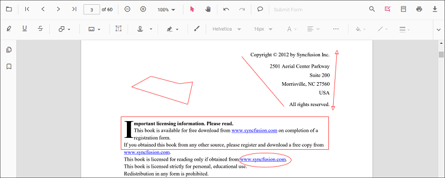
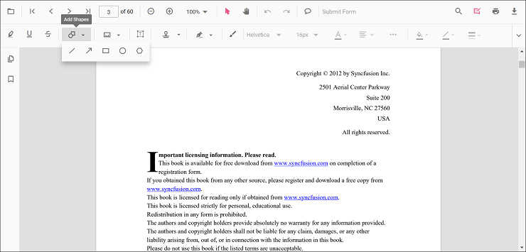
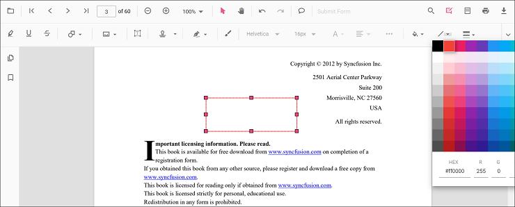
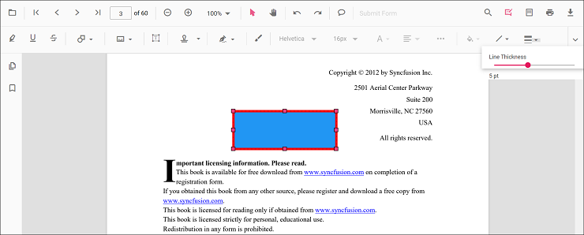
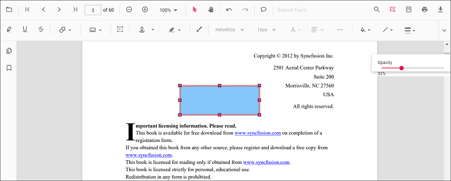
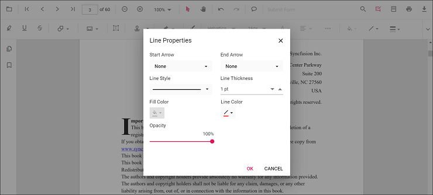

# Shape annotation in Vue Pdfviewer component

The PDF Viewer control provides the options to add, edit, and delete the shape annotations. The shape annotation types supported in the PDF Viewer control are:

* Line
* Arrow
* Rectangle
* Circle
* Polygon



## Adding a shape annotation to the PDF document

Shape annotations can be added to the PDF document using the annotation toolbar.

* Click the **Edit Annotation** button in the PDF Viewer toolbar. A toolbar appears below it.
* Click the **Shape Annotation** drop-down button. A drop-down pop-up will appear and shows the shape annotations to be added.
* Select the shape types to be added to the page in the drop-down pop-up. It enables the selected shape annotation mode.
* You can add the shapes over the pages of the PDF document.

In the pan mode, if the shape annotation mode is entered, the PDF Viewer control will switch to text select mode.



Refer to the following code sample to switch to the circle annotation mode.

```

<template>
    <div id="app">
        <button id="set">Circle</button>
        <ejs-pdfviewer
            id="pdfViewer"
            ref="pdfviewer"
            :serviceUrl="serviceUrl"
            :documentPath="documentPath"
            :documentLoad="documentLoad">
        </ejs-pdfviewer>
    </div>
</template>

<script>
import Vue from 'vue';
import { PdfViewerPlugin, Toolbar, Magnification, Navigation, LinkAnnotation, BookmarkView,
         ThumbnailView, Print, TextSelection, TextSearch, Annotation } from '@syncfusion/ej2-vue-pdfviewer';
Vue.use(PdfViewerPlugin);

var viewer;
export default {
  name: 'app',
  data () {
    return {
      serviceUrl:"https://ej2services.syncfusion.com/production/web-services/api/pdfviewer",
      documentPath:"PDF_Succinctly.pdf"
    };
  },
  provide: {
    PdfViewer: [Toolbar, Magnification, Navigation, LinkAnnotation, BookmarkView,
                ThumbnailView, Print, TextSelection, TextSearch, Annotation]},

  methods: {
    documentLoad() {
      viewer = this.$refs.pdfviewer.ej2Instances;
      document.getElementById('set').addEventListener('click', ()=> {
        viewer.annotation.setAnnotationMode('Circle');
      });
    }
  }
}
</script>

```

## Editing the properties of the shape annotation

The fill color, stroke color, thickness, and opacity of the shape annotation can be edited using the Edit color tool, Edit stroke color tool, Edit thickness tool, and Edit opacity tool in the annotation toolbar.

### Editing fill color

The fill color of the annotation can be edited using the color palette provided in the Edit Color tool.


### Editing stroke color

The stroke color of the annotation can be edited using the color palette provided in the Edit Stroke Color tool.



### Editing thickness

The thickness of the border of the annotation can be edited using the range slider provided in the Edit Thickness tool.



### Editing opacity

The opacity of the annotation can be edited using the range slider provided in the Edit Opacity tool.



### Editing the line properties

The properties of the line shapes such as line and arrow annotations can be edited using the Line Properties window. It can be opened by selecting the Properties option in the context menu that appears on right-clicking the line and arrow annotations.

Refer to the following code sample to set the default annotation settings.



## Setting default properties during the control initialization

The properties of the shape annotations can be set before creating the control using LineSettings, ArrowSettings, RectangleSettings, CircleSettings, and PolygonSettings.

```

<template>
    <div id="app">
        <ejs-pdfviewer
            id="pdfViewer"
            ref="pdfviewer"
            :serviceUrl="serviceUrl"
            :documentPath="documentPath"
            :lineSettings="lineSettings"
            :arrowSettings="arrowSettings"
            :rectangleSettings="rectangleSettings"
            :circleSettings="circleSettings"
            :polygonSettings="polygonSettings">
        </ejs-pdfviewer>
    </div>
</template>

<script>
import Vue from 'vue';
import { PdfViewerPlugin, Toolbar, Magnification, Navigation, LinkAnnotation, BookmarkView,
         ThumbnailView, Print, TextSelection, TextSearch, Annotation, SignStampItem } from '@syncfusion/ej2-vue-pdfviewer';
Vue.use(PdfViewerPlugin);

var viewer;
export default {
  name: 'app',
  data () {
    return {
      serviceUrl:"https://ej2services.syncfusion.com/production/web-services/api/pdfviewer",
      documentPath:"PDF_Succinctly.pdf",
      lineSettings: {fillColor: 'blue', opacity: 0.6, strokeColor: 'green'},
      arrowSettings: {fillColor: 'green', opacity: 0.6, strokeColor: 'blue'},
      rectangleSettings: {fillColor: 'yellow', opacity: 0.6, strokeColor: 'orange'},
      circleSettings: {fillColor: 'orange', opacity: 0.6, strokeColor: 'pink'},
      polygonSettings: {fillColor: 'pink', opacity: 0.6, strokeColor: 'yellow'}
    };
  },
  provide: {
    PdfViewer: [Toolbar, Magnification, Navigation, LinkAnnotation, BookmarkView,
                ThumbnailView, Print, TextSelection, TextSearch, Annotation]}

}
</script>

```