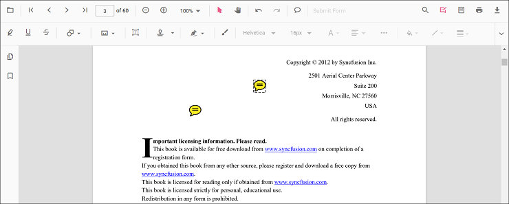
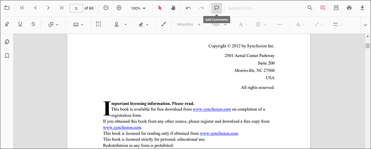
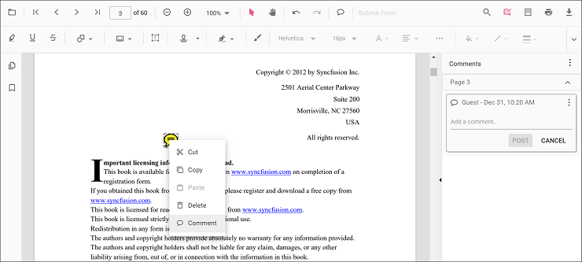
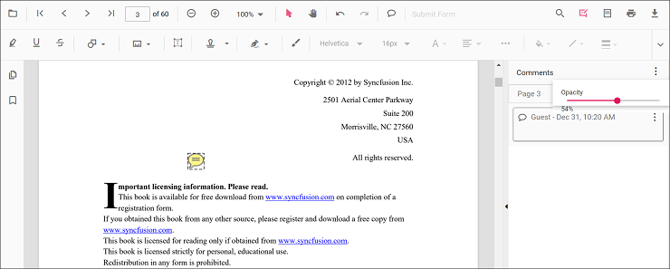
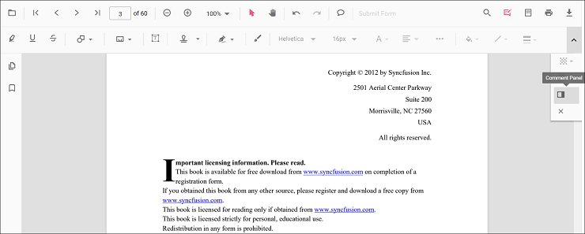
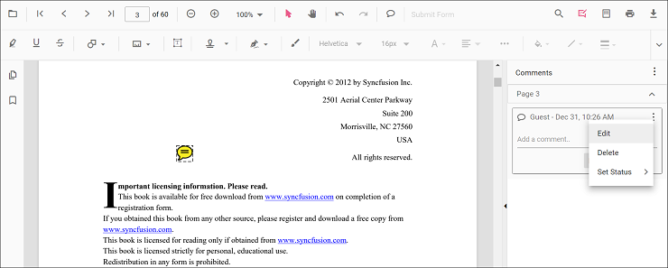

# Sticky notes annotation in Vue Pdfviewer component

The PDF Viewer control provides the options to add, edit, and delete the sticky note annotations in the PDF document.

## Adding a sticky note annotation to the PDF document

Sticky note annotations can be added to the PDF document using the annotation toolbar.

* Click the **Comments** button in the PDF Viewer toolbar. A toolbar appears below it.
* Click the position where you want to add sticky note annotation in the PDF document.
* Sticky note annotation will be added in the clicked positions.

Annotation comments can be added to the PDF document using the comment panel.

* Select a Sticky note annotation in the PDF document and right-click it.
* Select the Comment option in the context menu that appears.
* Now, you can add Comments, Reply, and Status using the Comment Panel.
* Now, you can add Comments, Reply, and Status using the Comment Panel.

## Adding a sticky note annotation to the PDF document Programmatically

With the PDF Viewer library, you can add a sticky note annotation to the PDF Viewer control programmatically using the [**addAnnotation()**](https://ej2.syncfusion.com/vue/documentation/api/pdfviewer/annotation/#addannotation) method.

Here's a example of how you can utilize the **addAnnotation()** method to include a sticky note annotation programmatically:




<template>
  

    <button v-on:click="addAnnotation">Add Annotation programatically</button>
    <ejs-pdfviewer id="pdfViewer" ref="pdfviewer" :documentPath="documentPath" :resourceUrl="resourceUrl">
    </ejs-pdfviewer>
  

</template>




<template>
  

    <button v-on:click="addAnnotation">Add Annotation programatically</button>
    <ejs-pdfviewer id="pdfViewer" ref="pdfviewer" :documentPath="documentPath" :resourceUrl="resourceUrl">
    </ejs-pdfviewer>
  

</template>




<template>
  

    <button v-on:click="addAnnotation">Add Annotation programatically</button>
    <ejs-pdfviewer id="pdfViewer" ref="pdfviewer" :documentPath="documentPath" :serviceUrl="serviceUrl">
    </ejs-pdfviewer>
  

</template>




<template>
  

    <button v-on:click="addAnnotation">Add Annotation programatically</button>
    <ejs-pdfviewer id="pdfViewer" ref="pdfviewer" :documentPath="documentPath" :serviceUrl="serviceUrl">
    </ejs-pdfviewer>
  

</template>




## Edit the existing sticky note annotation programmatically

To modify existing sticky note annotation in the Syncfusion&reg; PDF viewer programmatically, you can use the **editAnnotation()** method.

Here is an example of how you can use the **editAnnotation()** method:




<template>
  

    <button v-on:click="editAnnotation">Edit Annotation programatically</button>
    <ejs-pdfviewer id="pdfViewer" ref="pdfviewer" :documentPath="documentPath" :resourceUrl="resourceUrl">
    </ejs-pdfviewer>
  

</template>




<template>
  

    <button v-on:click="editAnnotation">Edit Annotation programatically</button>
    <ejs-pdfviewer id="pdfViewer" ref="pdfviewer" :documentPath="documentPath" :resourceUrl="resourceUrl">
    </ejs-pdfviewer>
  

</template>




<template>
  

    <button v-on:click="editAnnotation">Edit Annotation programatically</button>
    <ejs-pdfviewer id="pdfViewer" ref="pdfviewer" :documentPath="documentPath" :serviceUrl="serviceUrl">
    </ejs-pdfviewer>
  

</template>




<template>
  

    <button v-on:click="editAnnotation">Edit Annotation programatically</button>
    <ejs-pdfviewer id="pdfViewer" ref="pdfviewer" :documentPath="documentPath" :serviceUrl="serviceUrl">
    </ejs-pdfviewer>
  

</template>




## Editing the properties of the sticky note annotation

### Editing opacity

The opacity of the annotation can be edited using the range slider provided in the Edit Opacity tool.

### Editing comments

The comment, comment reply, and comment status of the annotation can be edited using the Comment Panel.

* Open the comment panel using the Comment Panel button showing in the annotation toolbar.

You can modify or delete the comments or comments replay and it’s status using the menu option provided in the comment panel.

## Setting default properties during the control initialization

The properties of the sticky note annotation can be set before creating the control using the StickyNoteSettings.

After editing the default opacity using the Edit Opacity tool, they will be changed to the selected values. Refer to the following code sample to set the default sticky note annotation settings.




<template>
  

    <ejs-pdfviewer id="pdfViewer" ref="pdfviewer" :documentPath="documentPath" :resourceUrl="resourceUrl"
      :stickyNotesSettings="stickyNotesSettings">
    </ejs-pdfviewer>
  

</template>




<template>
  

    <ejs-pdfviewer id="pdfViewer" ref="pdfviewer" :documentPath="documentPath" :resourceUrl="resourceUrl"
      :stickyNotesSettings="stickyNotesSettings">
    </ejs-pdfviewer>
  

</template>




<template>
  

    <ejs-pdfviewer id="pdfViewer" ref="pdfviewer" :serviceUrl="serviceUrl" :documentPath="documentPath"
      :stickyNotesSettings="stickyNotesSettings">
    </ejs-pdfviewer>
  

</template>




<template>
  

    <ejs-pdfviewer id="pdfViewer" ref="pdfviewer" :serviceUrl="serviceUrl" :documentPath="documentPath"
      :stickyNotesSettings="stickyNotesSettings">
    </ejs-pdfviewer>
  

</template>




## Disabling sticky note annotations

The PDF Viewer control provides an option to disable the sticky note annotations feature. The code sample for disabling the feature is as follows.




<template>
  

    <ejs-pdfviewer id="pdfViewer" ref="pdfviewer" :documentPath="documentPath" :resourceUrl="resourceUrl"
      :enableStickyNotesAnnotation="enableStickyNotesAnnotation">
    </ejs-pdfviewer>
  

</template>




<template>
  

    <ejs-pdfviewer id="pdfViewer" ref="pdfviewer" :documentPath="documentPath" :resourceUrl="resourceUrl"
      :enableStickyNotesAnnotation="enableStickyNotesAnnotation">
    </ejs-pdfviewer>
  

</template>




<template>
  

    <ejs-pdfviewer id="pdfViewer" ref="pdfviewer" :serviceUrl="serviceUrl" :documentPath="documentPath"
      :enableStickyNotesAnnotation="enableStickyNotesAnnotation">
    </ejs-pdfviewer>
  

</template>




<template>
  

    <ejs-pdfviewer id="pdfViewer" ref="pdfviewer" :serviceUrl="serviceUrl" :documentPath="documentPath"
      :enableStickyNotesAnnotation="enableStickyNotesAnnotation">
    </ejs-pdfviewer>
  

</template>


