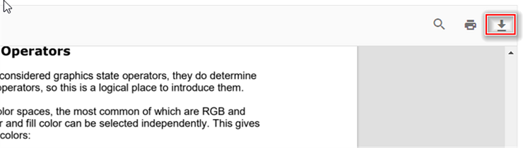

# Download in Vue Pdfviewer component

The PDF Viewer supports downloading the loaded PDF file. You can enable/disable the download using the following code snippet.

You can invoke download action using following code snippet.,




<template>
  

    <button v-on:click="downloadClicked">Download</button>
      <ejs-pdfviewer
        id="pdfViewer"
        ref="pdfviewer"
        :documentPath="documentPath"
        :documentLoad="documentLoad">
      </ejs-pdfviewer>

  

</template>




<template>
  

    <button v-on:click="downloadClicked">Download</button>
      <ejs-pdfviewer
        id="pdfViewer"
        ref="pdfviewer"
        :serviceUrl="serviceUrl"
        :documentPath="documentPath"
        :documentLoad="documentLoad">
      </ejs-pdfviewer>

  

</template>




## See also

* [Toolbar items](./toolbar)
* [Feature Modules](./feature-module)