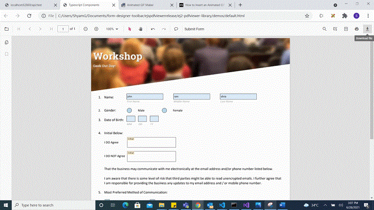
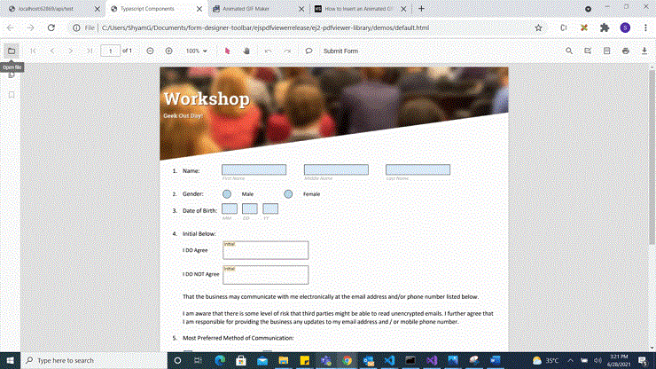

# Create programmatically in Vue Pdfviewer component

The PDF Viewer control provides the option to add, edit and delete the Form Fields. The Form Fields type supported by the PDF Viewer Control are:

    * Textbox
    * Password
    * CheckBox
    * RadioButton
    * ListBox
    * DropDown
    * SignatureField
    * InitialField

## Add a form field to PDF document programmatically

Using addFormField method, the form fields can be added to the PDF document programmatically. We need to pass two parameters in this method. They are Form Field Type and Properties of Form Field Type. To add form field programmatically, Use the following code.






        


## Edit or update form field programmatically

Using updateFormField method, Form Field can be updated programmatically. We should get the Form Field object/Id from FormFieldCollections property that you would like to edit and pass it as a parameter to updateFormField method. The second parameter should be the properties that you would like to update for Form Field programmatically. We have updated the value and background Color properties of Textbox Form Field.






        


## Delete form field programmatically

Using deleteFormField method, the form field can be deleted programmatically. We should retrieve the Form Field object/Id from FormFieldCollections property that you would like to delete and pass it as a parameter to deleteFormField method. To delete a Form Field programmatically, use the following code.






        


## Saving the form fields

When the download icon is selected on the toolbar, the Form Fields will be saved in the PDF document and this action will not affect the original document. Refer the below GIF for further reference.



You can invoke download action using following code snippet.

```

<template>
    <div id="app">
        <ejs-button ref="downloadBtn" v-on:click.native="downloadClicked"
            >Download</ejs-button
        >
        <ejs-pdfviewer
            id="pdfViewer"
            ref="pdfviewer"
            :serviceUrl="serviceUrl"
            :documentPath="documentPath"
            :documentLoad="documentLoad">
        </ejs-pdfviewer>
    </div>
</template>

<script>
import Vue from 'vue';
import { PdfViewerPlugin, Toolbar, Magnification, Annotation, Navigation, LinkAnnotation, BookmarkView,
         ThumbnailView, Print, TextSelection, TextSearch,Annotation, FormDesigner,FormFields } from '@syncfusion/ej2-vue-pdfviewer';
import { ButtonPlugin } from "@syncfusion/ej2-vue-buttons";
Vue.use(ButtonPlugin);
Vue.use(PdfViewerPlugin);

var viewer;
export default {
  name: 'app',
  data () {
    return {
      serviceUrl:"https://ej2services.syncfusion.com/production/web-services/api/pdfviewer"
      documentPath:"PDF_Succinctly.pdf"
    };
  },
  provide: {
    PdfViewer: [Toolbar, Magnification, Navigation, LinkAnnotation, Annotation, BookmarkView,
                ThumbnailView, Print, TextSelection, TextSearch, Annotation, FormDesigner,FormFields]},

  methods: {
    downloadClicked: function (args) {
       viewer.download();
    },
    documentLoad: function (args) {
      viewer = this.$refs.pdfviewer.ej2Instances;
    },
  }
}
</script>

```

## Printing the form fields

When the print icon is selected on the toolbar, the PDF document will be printed along with the Form Fields added to the pages and this action will not affect the original document. Refer the below GIF for further reference.


You can invoke print action using the following code snippet.,

```

<template>
    <div id="app">
        <ejs-button ref="printBtn" v-on:click.native="printClicked">Print</ejs-button>
        <ejs-pdfviewer
            id="pdfViewer"
            ref="pdfviewer"
            :serviceUrl="serviceUrl"
            :documentPath="documentPath"
            :documentLoad="documentLoad">
        </ejs-pdfviewer>
    </div>
</template>

<script>
import Vue from 'vue';
import { PdfViewerPlugin, Toolbar, Magnification, Navigation, LinkAnnotation, Annotation, BookmarkView,
         ThumbnailView, Print, TextSelection, TextSearch, Annotation, FormDesigner,FormFields } from '@syncfusion/ej2-vue-pdfviewer';
import { ButtonPlugin } from "@syncfusion/ej2-vue-buttons";
Vue.use(ButtonPlugin);
Vue.use(PdfViewerPlugin);

var viewer;
export default {
  name: 'app',
  data () {
    return {
      serviceUrl:"https://ej2services.syncfusion.com/production/web-services/api/pdfviewer"
      documentPath:"PDF_Succinctly.pdf"
    };
  },
  provide: {
    PdfViewer: [Toolbar, Magnification, Navigation, LinkAnnotation, BookmarkView, Annotation,
                ThumbnailView, Print, TextSelection, TextSearch, Annotation, FormDesigner,FormFields]},

  methods: {
    printClicked: function (args) {
      viewer.print();
    },
    documentLoad: function (args) {
      viewer = this.$refs.pdfviewer.ej2Instances;
    },
  }
}
</script>

```

## Open the existing PDF document

We can open the already saved PDF document contains Form Fields in it by clicking the open icon in the toolbar. Refer the below GIF for further reference.



## Validate form fields

The form fields in the PDF Document will be validated when the `enableFormFieldsValidation` is set to true and hook the validateFormFields. The validateFormFields will be triggered when the PDF document is downloaded or printed with the non-filled form fields. The non-filled fields will be obtained in the `nonFillableFields` property of the event arguments of validateFormFields.

Add the following code snippet to validate the form fields,

```

<template>
    <div id="app">
        <ejs-pdfviewer
            id="pdfViewer"
            ref="pdfviewer"
            :serviceUrl="serviceUrl"
            :documentPath="documentPath"
            :documentLoad="documentLoad"
            :enableFormFieldsValidation="true"
            :validateFormFields="validateFormFields">
        </ejs-pdfviewer>
    </div>
</template>

<script>
import Vue from 'vue';
import { PdfViewerPlugin, Toolbar, Magnification, Navigation, LinkAnnotation, BookmarkView,
         ThumbnailView, Print, TextSelection, TextSearch, Annotation, FormDesigner, FormFields } from '@syncfusion/ej2-vue-pdfviewer';
Vue.use(PdfViewerPlugin);

var viewer;
export default {
  name: 'app',
  data () {
    return {
      serviceUrl:"https://ej2services.syncfusion.com/production/web-services/api/pdfviewer",
      documentPath:"FormDesigner.pdf"
    };
  },
  provide: {
    PdfViewer: [Toolbar, Magnification, Navigation, LinkAnnotation, BookmarkView,
                ThumbnailView, Print, TextSelection, TextSearch, Annotation, FormDesigner, FormFields]},

  methods: {
    documentLoad: function (args) {
      viewer = this.$refs.pdfviewer.ej2Instances;
      viewer.formDesignerModule.addFormField("Textbox", { name: "Textbox", bounds: { X: 146, Y: 229, Width: 150, Height: 24 } });
    }
    validateFormFields: function(args){
      var nonfilledFormFields = args.nonFillableFields
    }
  }
}
</script>
<style>
@import '../node_modules/@syncfusion/ej2-base/styles/material.css';
@import '../node_modules/@syncfusion/ej2-buttons/styles/material.css';
@import '../node_modules/@syncfusion/ej2-dropdowns/styles/material.css';
@import '../node_modules/@syncfusion/ej2-inputs/styles/material.css';
@import '../node_modules/@syncfusion/ej2-navigations/styles/material.css';
@import '../node_modules/@syncfusion/ej2-popups/styles/material.css';
@import '../node_modules/@syncfusion/ej2-splitbuttons/styles/material.css';
@import '../node_modules/@syncfusion/ej2-lists/styles/material.css';
@import '../node_modules/@syncfusion/ej2-vue-pdfviewer/styles/material.css';
#pdfViewer {
  height: 640px;
}
</style>

```

## Export and import form fields

The PDF Viewer control provides the support to export and import the form field data in the following formats using the methods `importFormFields`, `exportFormFields`, `exportFormFieldsAsObject`.

* FDF
* XFDF
* JSON

### Export and import as FDF

Using the `exportFormFields` method, the form field data can be exported in the specified data format. This method accepts two parameters:

* The first one must be the destination path for the exported data. If path is not specified, it will ask for the location while exporting.
* The second parameter should be the format type of the form data.

The following code explains how to export and import the form field data as FDF.

```

<template>
    <div id="app">
        <ejs-button ref="exportFdf" v-on:click.native="exportFdf">Export FDF</ejs-button>
        <ejs-button ref="importFdf" v-on:click.native="importFdf">Import FDF</ejs-button>
        <ejs-pdfviewer
            id="pdfViewer"
            ref="pdfviewer"
            :serviceUrl="serviceUrl"
            :documentPath="documentPath">
        </ejs-pdfviewer>
    </div>
</template>

<script>
import Vue from 'vue';
import { PdfViewerPlugin, Toolbar, Magnification, Annotation, Navigation, LinkAnnotation, BookmarkView,
         ThumbnailView, Print, TextSelection, TextSearch } from '@syncfusion/ej2-vue-pdfviewer';
import { ButtonPlugin } from "@syncfusion/ej2-vue-buttons";
Vue.use(ButtonPlugin);
Vue.use(PdfViewerPlugin);

var viewer;
export default {
  name: 'app',
  data () {
    return {
      serviceUrl:"https://ej2services.syncfusion.com/production/web-services/api/pdfviewer"
      documentPath:"PDF_Succinctly.pdf"
    };
  },
  provide: {
    PdfViewer: [Toolbar, Magnification, Navigation, LinkAnnotation, Annotation, BookmarkView,
                ThumbnailView, Print, TextSelection, TextSearch]},
  methods: {
    // Event triggers on the Export FDF button click.
    exportFdf: function (args) {
      // Data must be the desired path for the exported document.
      viewer.exportFormFields('Data', FormFieldDataFormat.Fdf);
    },
    // Event triggers on the Import FDF button click.
    importFdf: function (args) {
      // The file for importing the form fields should be placed in the desired location and the path should be provided correctly
      viewer.importFormFields('File', FormFieldDataFormat.Fdf);
     },
  }
}
</script>

```

### Export and import as XFDF

The following code explains how to export and import the form field data as XFDF.

```

<template>
    <div id="app">
        <ejs-button ref="exportXfdf" v-on:click.native="exportXfdf" >Export XFDF</ejs-button>
        <ejs-button ref="importXfdf" v-on:click.native="importXfdf">Import XFDF</ejs-button>
        <ejs-pdfviewer
            id="pdfViewer"
            ref="pdfviewer"
            :serviceUrl="serviceUrl"
            :documentPath="documentPath">
        </ejs-pdfviewer>
    </div>
</template>

<script>
import Vue from 'vue';
import { PdfViewerPlugin, Toolbar, Magnification, Annotation, Navigation, LinkAnnotation, BookmarkView,
         ThumbnailView, Print, TextSelection, TextSearch } from '@syncfusion/ej2-vue-pdfviewer';
import { ButtonPlugin } from "@syncfusion/ej2-vue-buttons";
Vue.use(ButtonPlugin);
Vue.use(PdfViewerPlugin);

var viewer;
export default {
  name: 'app',
  data () {
    return {
      serviceUrl:"https://ej2services.syncfusion.com/production/web-services/api/pdfviewer"
      documentPath:"PDF_Succinctly.pdf"
    };
  },
  provide: {
    PdfViewer: [Toolbar, Magnification, Navigation, LinkAnnotation, Annotation, BookmarkView,
                ThumbnailView, Print, TextSelection, TextSearch]},

  methods: {
    // Event triggers on the Export XFDF button click.
    exportXfdf: function (args) {
      // Data must be the desired path for the exported document.
      viewer.exportFormFields('Data', FormFieldDataFormat.Xfdf);
    },

    // Event triggers on the Import XFDF button click.
    importXfdf: function (args) {
      // The file for importing the form fields should be placed in the desired location and the path should be provided correctly
      viewer.importFormFields('File', FormFieldDataFormat.Xfdf);
    },
  }
}
</script>

```

### Export and import as JSON

The following code explains how to export and import the form field data as JSON.

```

<template>
    <div id="app">
        <ejs-button ref="exportJson" v-on:click.native="exportJson">Export JSON</ejs-button>
        <ejs-button ref="importJson" v-on:click.native="importJson">Import JSON</ejs-button>
        <ejs-pdfviewer
            id="pdfViewer"
            ref="pdfviewer"
            :serviceUrl="serviceUrl"
            :documentPath="documentPath">
        </ejs-pdfviewer>
    </div>
</template>


<script>
import Vue from 'vue';
import { PdfViewerPlugin, Toolbar, Magnification, Annotation, Navigation, LinkAnnotation, BookmarkView,
         ThumbnailView, Print, TextSelection, TextSearch } from '@syncfusion/ej2-vue-pdfviewer';
import { ButtonPlugin } from "@syncfusion/ej2-vue-buttons";
Vue.use(ButtonPlugin);
Vue.use(PdfViewerPlugin);

var viewer;
export default {
  name: 'app',
  data () {
    return {
      serviceUrl:"https://ej2services.syncfusion.com/production/web-services/api/pdfviewer"
      documentPath:"PDF_Succinctly.pdf"
    };
  },
  provide: {
    PdfViewer: [Toolbar, Magnification, Navigation, LinkAnnotation, Annotation, BookmarkView,
                ThumbnailView, Print, TextSelection, TextSearch]},

  methods: {
    // Event triggers on the Export JSON button click.
    exportJson: function (args) {
      // Data must be the desired path for the exported document.
      viewer.exportFormFields('Data', FormFieldDataFormat.Json);
    },

    // Event triggers on the Import JSON button click.
    importJson: function (args) {
      // The file for importing the form fields should be placed in the desired location and the path should be provided correctly
      viewer.importFormFields('File', FormFieldDataFormat.Json);
    },
  }
}
</script>

```

### Export and import as Object

The PDF Viewer control supports exporting the form field data as an object, and the exported data will be imported into the current PDF document from the object.

The following code shows how to export the form field data as an object and import the form field data from that object into the current PDF document via a button click.

```

<template>
    <div id="app">
        <ejs-button ref="exportData" v-on:click.native="exportDataAsObject">Export Object</ejs-button>
        <ejs-button ref="importData" v-on:click.native="importData">Import Data</ejs-button>
        <ejs-pdfviewer
            id="pdfViewer"
            ref="pdfviewer"
            :serviceUrl="serviceUrl"
            :documentPath="documentPath">
        </ejs-pdfviewer>
    </div>
</template>

<script>
import Vue from 'vue';
import { PdfViewerPlugin, Toolbar, Magnification, Annotation, Navigation, LinkAnnotation, BookmarkView,
         ThumbnailView, Print, TextSelection, TextSearch } from '@syncfusion/ej2-vue-pdfviewer';
import { ButtonPlugin } from "@syncfusion/ej2-vue-buttons";
Vue.use(ButtonPlugin);
Vue.use(PdfViewerPlugin);

var viewer;
var exportedData;
export default {
  name: 'app',
  data () {
    return {
      serviceUrl:"https://ej2services.syncfusion.com/production/web-services/api/pdfviewer"
      documentPath:"PDF_Succinctly.pdf"
    };
  },
  provide: {
    PdfViewer: [Toolbar, Magnification, Navigation, LinkAnnotation, Annotation, BookmarkView,
                ThumbnailView, Print, TextSelection, TextSearch]},

  methods: {
    // Event triggers on the Export Object button click.
    exportDataAsObject: function (args) {
      // Export the form fields data to an FDF object.
      exportedData = viewer.exportFormFieldsAsObject(FormFieldDataFormat.Fdf);
      //// Export the form fields data to an XFDF object.
      //exportedData = viewer.exportFormFieldsAsObject(FormFieldDataFormat.Xfdf);
      //// Export the form fields data to an JSON object.
      //exportedData = viewer.exportFormFieldsAsObject(FormFieldDataFormat.Json);
    },

    // Event triggers on the Import Data button click.
    importData: function (args) {
      // Import the form fields data from the FDF object into the current PDF document.
      viewer.importFormFields(exportedData, FormFieldDataFormat.Fdf);
      //// Import the form fields data from the XFDF object into the current PDF document.
      //viewer.importFormFields(exportedData, FormFieldDataFormat.Xfdf);
      //// Import the form fields data from the JSON object into the current PDF document.
      //viewer.importFormFields(exportedData, FormFieldDataFormat.Json);
    },
  }
}
</script>

```

## Signature and initial fields settings

Using the `updateFormField` method, the form fields can be updated programmatically.

The following code example explains how to update the signature field properties on a button click.

```

<template>
    <div id="app">
        <ejs-button ref="updateProperties" v-on:click.native="updateProperties">Update Properties</ejs-button>
        <ejs-pdfviewer
            id="pdfViewer"
            ref="pdfviewer"
            :serviceUrl="serviceUrl"
            :documentPath="documentPath">
        </ejs-pdfviewer>
    </div>
</template>

<script>
import Vue from 'vue';
import { PdfViewerPlugin, Toolbar, Magnification, Annotation, Navigation, LinkAnnotation, BookmarkView,
         ThumbnailView, Print, TextSelection, TextSearch } from '@syncfusion/ej2-vue-pdfviewer';
import { ButtonPlugin } from "@syncfusion/ej2-vue-buttons";
Vue.use(ButtonPlugin);
Vue.use(PdfViewerPlugin);

var viewer;
var exportedData;
export default {
  name: 'app',
  data () {
    return {
      serviceUrl:"https://ej2services.syncfusion.com/production/web-services/api/pdfviewer"
      documentPath:"PDF_Succinctly.pdf"
    };
  },
  provide: {
    PdfViewer: [Toolbar, Magnification, Navigation, LinkAnnotation, Annotation, BookmarkView,
                ThumbnailView, Print, TextSelection, TextSearch]},

  methods: {
    // Event triggers on the Update Properties button click.
    updateProperties: function (args) {
      var formField = viewer.retrieveFormFields();
      viewer.formDesignerModule.updateFormField(formField[0], {
        name: 'Initial',
        isReadOnly: true,
        visibility: 'visible',
        isRequired: false,
        isPrint: true,
        tooltip: 'Initial',
        thickness: 4
     });
    },
  }
}
</script>

```

The following code example explains how to update the properties of the signature field added to the document from the form designer toolbar.

```ts
  // Properties to customize the signature field settings
  viewer.signatureFieldSettings = {
    // Set the name of the form field element.
    name: 'Signatute',
    // Specify whether the signature field is in read-only or read-write mode.
    isReadOnly: false,
    // Set the visibility of the form field.
    visibility: 'visible',
    // Specify whether the field is mandatory or not.
    isRequired: false,
    // Specify whether to print the signature field.
    isPrint: true,
    // Set the text to be displayed as a tooltip.
    tooltip: 'Signatute',
    // Set the thickness of the signature field. To hide the borders, set the value to 0 (zero).
    thickness: 4,
    // Specify the properties of the signature Dialog Settings in the signature field.
    signatureDialogSettings: {
      isplayMode: DisplayMode.Draw | DisplayMode.Upload | DisplayMode.Text,
      hideSaveSignature: false,
    },
    // Specify the properties of the signature indicator in the signature field.
    signatureIndicatorSettings: {
      opacity: 1,
      backgroundColor: '#237ba2',
      height: 50,
      fontSize: 15,
      text: 'Signature Field',
      color: 'white'
    },
  };

```


The following code example explains how to update the properties of the initial field added to the document from the form designer toolbar.

```ts
  // Properties to customize the initial field settings
  viewer.initialFieldSettings  = {
    // Set the name of the form field element.
    name: 'Initial',
    // Specify whether the initial field is in read-only or read-write mode.
    isReadOnly: false,
    // Set the visibility of the form field.
    visibility: 'visible',
    // Specify whether the field is mandatory or not.
    isRequired: false,
    // Specify whether to print the initial field.
    isPrint: true,
    // Set the text to be displayed as tooltip.
    tooltip: 'Initial',
    // Set the thickness of the initial field. To hide the borders, set the value to 0 (zero).
    thickness: 4,
    // Specify the properties of the initial indicator in the initial field.
    initialIndicatorSettings: {
      opacity: 1,
      backgroundColor: '#237ba2',
      height: 50,
      fontSize: 15,
      text: 'Initial Field',
      color: 'white'
    },
    // Specify the properties of the initial Dialog Settings in the intial field.
    initialDialogSettings: {
      displayMode: DisplayMode.Draw | DisplayMode.Upload | DisplayMode.Text,
      hideSaveSignature: false
    }
  };

```


