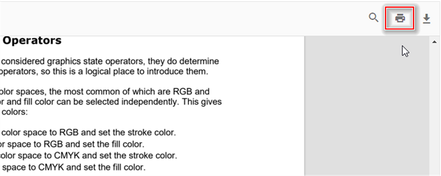

# Print in Vue Pdfviewer component

The PDF Viewer supports printing the loaded PDF file. You can enable/disable the print using the following code snippet.

```
<!DOCTYPE html>
<html lang="en">

<head>
    <title>Essential JS 2</title>
    <meta charset="utf-8" />
    <meta name="viewport" content="width=device-width, initial-scale=1.0, user-scalable=no" />
    <meta name="description" content="Essential JS 2" />
    <meta name="author" content="Syncfusion" />
    <link rel="shortcut icon" href="resources/favicon.ico" />
    <link href="https://maxcdn.bootstrapcdn.com/bootstrap/3.3.7/css/bootstrap.min.css" rel="stylesheet" />

    <!--style reference from app-->
    <link href="/styles/styles.css" rel="stylesheet" />

    <!--system js reference and configuration-->
    <script src="node_modules/systemjs/dist/system.src.js" type="text/javascript"></script>
    <script src="system.config.js" type="text/javascript"></script>
</head>

<body>
    <!--Element which will render as PdfViewer -->
    <div id="PdfViewer"></div>
</body>

</html>
```

```ts
import { PdfViewer, Toolbar, Magnification, Navigation, LinkAnnotation, Annotation, ThumbnailView,BookmarkView, TextSelection} from '@syncfusion/ej2-pdfviewer';

PdfViewer.Inject(Toolbar,Magnification,Navigation, LinkAnnotation, Annotation, ThumbnailView,BookmarkView, TextSelection);

let pdfviewer: PdfViewer = new PdfViewer({enablePrint: true, documentPath:'PDF_Succinctly.pdf'});
pdfviewer.serviceUrl = 'https://services.syncfusion.com/vue/production/api/pdfviewer';
pdfviewer.appendTo('#PdfViewer');

```



You can invoke print action using the following code snippet.,





<template>
  <div id="app">
    <button v-on:click="printClicked">Print</button>
    <ejs-pdfviewer id="pdfViewer" ref="pdfviewer" :documentPath="documentPath" :resourceUrl="resourceUrl">
    </ejs-pdfviewer>
  </div>
</template>

<script setup>
import {
  PdfViewerComponent as EjsPdfviewer, Toolbar, Magnification, Navigation,
  LinkAnnotation, BookmarkView, Annotation, ThumbnailView,
  Print, TextSelection, TextSearch, FormFields, FormDesigner
} from '@syncfusion/ej2-vue-pdfviewer';
import { provide, ref } from 'vue';

const pdfviewer = ref(null);
const documentPath = "https://cdn.syncfusion.com/content/pdf/pdf-succinctly.pdf";
const resourceUrl = "https://cdn.syncfusion.com/ej2/24.1.41/dist/ej2-pdfviewer-lib";

provide('PdfViewer', [Toolbar, Magnification, Navigation, LinkAnnotation, BookmarkView, Annotation,
  ThumbnailView, Print, TextSelection, TextSearch, FormFields, FormDesigner])

const printClicked = function (args) {
  pdfviewer.value.ej2Instances.print.print();
}

</script>




<template>
  <div id="app">
    <button v-on:click="printClicked">Print</button>
    <ejs-pdfviewer id="pdfViewer" ref="pdfviewer" :documentPath="documentPath" :resourceUrl="resourceUrl" >
    </ejs-pdfviewer>
  </div>
</template>

<script>
import {
  PdfViewerComponent, Toolbar, Magnification, Navigation,
  LinkAnnotation, BookmarkView, Annotation, ThumbnailView,
  Print, TextSelection, TextSearch, FormFields, FormDesigner
} from '@syncfusion/ej2-vue-pdfviewer';

export default {
  name: "App",
  components: {
    "ejs-pdfviewer": PdfViewerComponent
  },
  data() {
    return {
      documentPath: "https://cdn.syncfusion.com/content/pdf/pdf-succinctly.pdf",
      resourceUrl: "https://cdn.syncfusion.com/ej2/24.1.41/dist/ej2-pdfviewer-lib"
    };
  },
  provide: {
    PdfViewer: [Toolbar, Magnification, Navigation, LinkAnnotation, BookmarkView, Annotation,
      ThumbnailView, Print, TextSelection, TextSearch, FormFields, FormDesigner]
  },
  methods: {
    printClicked: function (args) {
      this.$refs.pdfviewer.ej2Instances.print.print();
    }
  }
}
</script>




<template>
  <div id="app">
    <button v-on:click="printClicked">Print</button>
    <ejs-pdfviewer id="pdfViewer" ref="pdfviewer" :serviceUrl="serviceUrl" :documentPath="documentPath">
    </ejs-pdfviewer>

  </div>
</template>

<script setup>
import {
  PdfViewerComponent as EjsPdfviewer, Toolbar, Magnification, Navigation,
  LinkAnnotation, BookmarkView, Annotation, ThumbnailView,
  Print, TextSelection, TextSearch, FormFields, FormDesigner
} from '@syncfusion/ej2-vue-pdfviewer';
import { provide, ref } from 'vue';

const pdfviewer = ref(null);
const serviceUrl = "https://services.syncfusion.com/vue/production/api/pdfviewer";
const documentPath = "https://cdn.syncfusion.com/content/pdf/pdf-succinctly.pdf";

provide('PdfViewer', [Toolbar, Magnification, Navigation, LinkAnnotation, BookmarkView, Annotation,
  ThumbnailView, Print, TextSelection, TextSearch, FormFields, FormDesigner])

const printClicked = function (args) {
  pdfviewer.value.ej2Instances.print.print();
}
</script>




<template>
  <div id="app">
    <button v-on:click="printClicked">Print</button>
    <ejs-pdfviewer id="pdfViewer" ref="pdfviewer" :serviceUrl="serviceUrl" :documentPath="documentPath">
    </ejs-pdfviewer>

  </div>
</template>

<script>
import {
  PdfViewerComponent, Toolbar, Magnification, Navigation,
  LinkAnnotation, BookmarkView, Annotation, ThumbnailView,
  Print, TextSelection, TextSearch, FormFields, FormDesigner
} from '@syncfusion/ej2-vue-pdfviewer';

export default {
  name: "App",
  components: {
    "ejs-pdfviewer": PdfViewerComponent
  },
  data() {
    return {
      serviceUrl: "https://services.syncfusion.com/vue/production/api/pdfviewer",
      documentPath: "https://cdn.syncfusion.com/content/pdf/pdf-succinctly.pdf"
    };
  },
  provide: {
    PdfViewer: [Toolbar, Magnification, Navigation, LinkAnnotation, BookmarkView, Annotation,
      ThumbnailView, Print, TextSelection, TextSearch, FormFields, FormDesigner]
  },

  methods: {
    printClicked: function (args) {
      this.$refs.pdfviewer.ej2Instances.print.print();
    }
  }
}
</script>




## See also

* [Toolbar items](./toolbar)
* [Feature Modules](./feature-module)