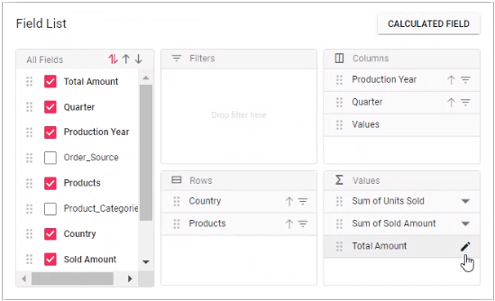
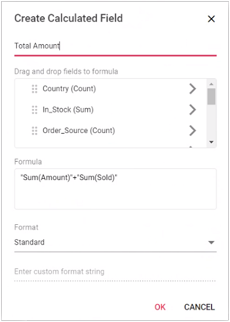
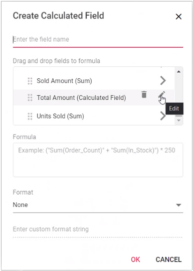
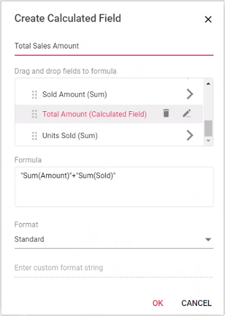
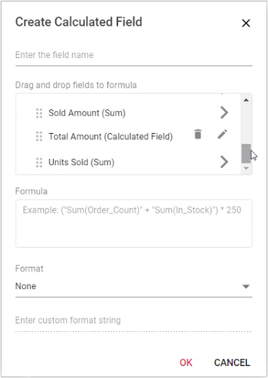
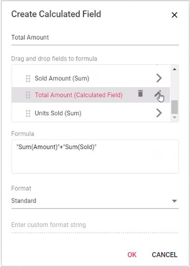
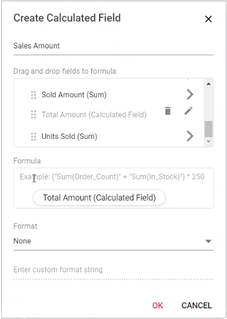
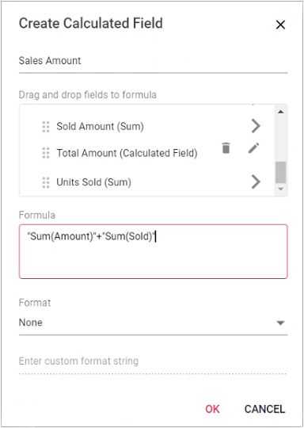
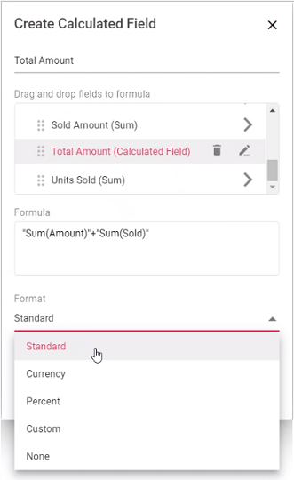
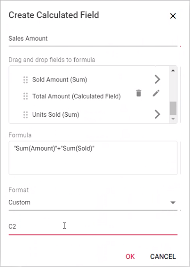

# Calculated field in Vue Pivot Table component

The calculated field feature enables users to create custom value fields using mathematical formulas and existing fields from their data source. Users can perform complex calculations with basic arithmetic operators and seamlessly integrate these custom fields into their pivot table for enhanced data visualization and reporting.

## Creating calculated fields

Users can create calculated fields in two convenient ways:
- **Interactive Method**: Using the built-in dialog accessible from the Field List UI.
- **Code-Based Method**: Configuring fields programmatically using the [`calculatedFieldSettings`](https://ej2.syncfusion.com/vue/documentation/api/pivotview/iCalculatedFieldSettings) property.

To enable the calculated field functionality, set the [`allowCalculatedField`](https://ej2.syncfusion.com/vue/documentation/api/pivotview/index-default#allowcalculatedfield) property to **true**. Once enabled, a "CALCULATED FIELD" button appears in the Field List UI. Clicking this button opens the calculated field dialog, where users can create and manage custom fields using an intuitive interface.

### Defining calculated fields programmatically

You can define calculated fields programmatically using the [`calculatedFieldSettings`](https://ej2.syncfusion.com/vue/documentation/api/pivotview/iCalculatedFieldSettings) property. This approach is ideal for pre-configuring specific calculations. The following properties are essential for creating a calculated field:

- [`name`](https://ej2.syncfusion.com/vue/documentation/api/pivotview/iCalculatedFieldSettings#name): Specifies a unique name for the calculated field.
- [`formula`](https://ej2.syncfusion.com/vue/documentation/api/pivotview/iCalculatedFieldSettings#formula): Defines the mathematical expression using existing field names and arithmetic operators.
- [`formatSettings`](https://ej2.syncfusion.com/vue/documentation/api/pivotview/iCalculatedFieldSettings#formatstring): Configures the number format for displaying calculated results.

To use the calculated field feature, you must inject the `CalculatedField` module into the pivot table.

> **Note**: The calculated field feature applies only to value fields. By default, calculated fields created programmatically are added to the field list and calculated field dialog UI. To display a calculated field in the pivot table UI, it must be added to the [`values`](https://ej2.syncfusion.com/vue/documentation/api/pivotview/dataSourceSettings#values) property, as shown in the code below.









        


## Opening the calculated field dialog programmatically

You can display the calculated field dialog by calling the [`createCalculatedFieldDialog`](https://ej2.syncfusion.com/vue/documentation/api/pivotview/index-default#createcalculatedfielddialog) method when an external button is clicked. This provides additional flexibility for accessing the calculated field functionality.









        


## Editing through the field list and grouping bar

You can easily modify existing calculated fields using the built-in edit option available in both the field list and grouping bar. This feature allows you to update formulas, change field names, or adjust formatting without recreating the entire calculated field.

To edit an existing calculated field:

1. Locate the calculated field button in either the field list or the grouping bar.
2. Click the **Edit** icon next to the calculated field name.
3. The calculated field dialog opens, displaying the current settings.
4. Make changes to the field name, formula, or format as needed.
5. Click **OK** to apply the changes.


<br/>



## Renaming an existing calculated field

You can rename any existing calculated field directly through the user interface at runtime. This option helps you maintain clear and meaningful names for your calculated fields as your analysis requirements evolve.

To rename a calculated field:

1. Locate the calculated field button in either the field list or the grouping bar.
2. Click the **Edit** icon next to the calculated field name.
3. The calculated field dialog opens, displaying the current field name in the text box at the top.
4. Replace the existing name with your preferred name.
5. Click **OK** to save the new name.


<br/>



## Editing an existing calculated field formula

This option allows you to modify the formulas of existing calculated fields directly through the user interface, ensuring your calculations remain accurate and up to date with changing requirements.

To edit an existing calculated field formula:

1. Open the calculated field dialog.
2. Select the calculated field you want to edit from the list.
3. Click the **Edit** icon next to the selected field.
4. The existing formula appears in a multiline text box at the bottom of the dialog.
5. Update the formula according to your requirements.
6. Click **OK** to save your changes.

The pivot table will automatically refresh to reflect the updated calculations.


<br/>



## Reusing an existing formula in a new calculated field

This option enables you to quickly create new calculated fields by reusing formulas from existing fields, saving time and ensuring consistency across your calculations.

To reuse an existing formula:

1. Open the calculated field dialog to create a new field.
2. Locate the existing calculated field whose formula you want to reuse.
3. Drag the existing calculated field from the tree view.
4. Drop it into the **Formula** section.
5. The formula from the existing field is automatically added to your new calculated field.
6. Modify the formula further if needed, or use it as is.
7. Click **OK** to create the new calculated field.


<br/>


<br/>



## Applying formatting to calculated field values

Formatting calculated field values enhances the readability and insight of your data in the pivot table. You can apply different formats using the calculated field dialog in the UI or programmatically through code.

To format calculated field values in your code, use the [`formatSettings`](https://ej2.syncfusion.com/vue/documentation/api/pivotview/formatSettings) property. For more information about supported number formats, refer to the documentation [here](https://ej2.syncfusion.com/vue/documentation/pivotview/number-formatting).

### Formatting through the user interface

To apply formatting to calculated field values via the user interface, use the built-in "Format" dropdown available in the calculated field dialog. This dropdown provides the following predefined format options:

* **Standard** - Displays numbers in their basic numeric form.
* **Currency** - Displays numbers as currency values.
* **Percent** - Displays numbers as percentage values.
* **Custom** - Allows you to specify a custom format pattern.
* **None** - Applies no formatting to the values.

> **Note:** By default, **None** is selected in the dropdown.



### Applying custom formatting

For specific formatting requirements, select the **Custom** option from the "Format" dropdown. This allows you to enter custom format patterns that meet your exact display needs.



## Supported operators and functions for the calculated field formula

Below is a list of operators and functions that can be used in the formula to create the calculated fields.

* `+` – addition operator.

   ```typescript
     Syntax: X + Y
   ```

* `-` – subtraction operator.

    ```typescript
       Syntax: X - Y
    ```

* `*` – multiplication operator.

    ```typescript
       Syntax: X * Y
    ```

* `/` – division operator.

    ```typescript
       Syntax: X / Y
    ```

* `^` – power operator.

    ```typescript
     Syntax: X^2
    ```

* `<` - less than operator.

    ```typescript
      Syntax: X < Y
    ```

* `<=` – less than or equal operator.

    ```typescript
      Syntax: X <= Y
    ```

* `>` – greater than operator.

    ```typescript
      Syntax: X > Y
    ```

* `>=` – greater than or equal operator.

    ```typescript
      Syntax: X >= Y
    ```

* `==` – equal operator.

    ```typescript
      Syntax: X == Y
    ```

* `!=` – not equal operator.

    ```typescript
     Syntax: X != Y
    ```

* `|` – OR operator.

    ```typescript
      Syntax: X | Y
    ```

* `&` – AND operator.

     ```typescript
      Syntax: X & Y
     ```

* `?` – conditional operator.

    ```typescript
     Syntax: condition ? then : else
   ```

* `isNaN` – function that checks if the value is not a number.

    ```typescript
    Syntax: isNaN(value)
   ```

* `!isNaN` – function that checks if the value is a number.

    ```typescript
      Syntax: isNaN(value)
    ```

* `abs` – function that returns the absolute value of a number.

    ```typescript
     Syntax: abs(number)
    ```

* `min` – function that returns the minimum value.

    ```typescript
     Syntax: min(number1, number2)
    ```

* `max` – function that returns the maximum value.

    ```typescript
     Syntax: max(number1, number2)
    ```

 > Also, you can use JavaScript [Math](https://developer.mozilla.org/en-US/docs/Web/JavaScript/Reference/Global_Objects/Math) object properties and methods directly to the formula.









        


## Event

### CalculatedFieldCreate

The [`calculatedFieldCreate`](https://ej2.syncfusion.com/vue/documentation/api/pivotview/index-default#calculatedfieldcreate) event enables you to validate and manage calculated field details before they are applied to the pivot table. This ensures data accuracy and prevents invalid configurations. The event is triggered when the "OK" button is clicked to close the calculated field dialog, allowing you to modify or validate the calculated field information before it is saved.

**Event Parameters:**

The event provides the following parameters to facilitate interaction with calculated field data:

* [`calculatedField`](https://ej2.syncfusion.com/vue/documentation/api/pivotview/calculatedFieldCreateEventArgs#calculatedfield): Contains the calculated field information (new or existing) that was entered in the dialog.

* [`calculatedFieldSettings`](https://ej2.syncfusion.com/vue/documentation/api/pivotview/iCalculatedFieldSettings): Provides access to the current [`calculatedFieldSettings`](https://ej2.syncfusion.com/vue/documentation/api/pivotview/iCalculatedFieldSettings) of the pivot table.

* [`cancel`](https://ej2.syncfusion.com/vue/documentation/api/pivotview/calculatedFieldCreateEventArgs#cancel): A boolean property that prevents the dialog changes from being applied when set to **true**.

* [`dataSourceSettings`](https://ej2.syncfusion.com/vue/documentation/api/pivotview/calculatedFieldCreateEventArgs#datasourcesettings): Contains the current data source configuration, including input data, rows, columns, values, filters, and format settings.

* [`fieldName`](https://ej2.syncfusion.com/vue/documentation/api/pivotview/calculatedFieldCreateEventArgs#fieldname): Specifies the name of the field being created or updated.

**Example:**

The following example shows how to prevent users from creating calculated fields without setting a format:









        


### ActionBegin

The [`actionBegin`](https://ej2.syncfusion.com/vue/documentation/api/pivotview/index-default#actionbegin) event allows you to control and monitor calculated field operations before they are executed, enabling you to validate or restrict user actions as needed.

This event is triggered when users interact with calculated field functionality in the following ways:
- Clicking the calculated field button
- Clicking the edit icon for an existing calculated field
- Using the context menu in the tree view within the calculated field dialog

The event provides the following parameters to help you handle these interactions:

**Event Parameters:**

- [`dataSourceSettings`](https://ej2.syncfusion.com/vue/documentation/api/pivotview/pivotActionBeginEventArgs#datasourcesettings): Contains the current data source configuration, including input data, rows, columns, values, filters, format settings, and other pivot table settings.

- [`actionName`](https://ej2.syncfusion.com/vue/documentation/api/pivotview/pivotActionBeginEventArgs#actionname): Identifies the specific action the user is attempting to perform. The table below lists the available actions and their corresponding names:

| User Action | Action Name |
|-------------|-------------|
| [Calculated field button click](./calculated-field#Calculated-Field) | Open calculated field dialog |
| [Edit icon click for calculated field](./calculated-field#Editing-through-the-field-list-and-the-grouping-bar) | Edit calculated field |
| [Context menu in calculated field dialog tree view](./calculated-field#Calculated-Field) | Calculated field context menu |

- [`fieldInfo`](https://ej2.syncfusion.com/vue/documentation/api/pivotview/pivotActionBeginEventArgs#fieldinfo): Provides information about the selected field when the action involves a specific field.

> **Note**: This parameter is available only when the action involves a specific field, such as filtering, sorting, removing a field from the grouping bar, editing, or changing the aggregation type.

- [`cancel`](https://ej2.syncfusion.com/vue/documentation/api/pivotview/pivotActionBeginEventArgs#cancel): A boolean property that allows you to prevent the current action from completing. Set this to **true** to stop the action from proceeding.

**Example:**

The example below illustrates how to prevent access to the calculated field dialog by canceling the action triggered when a user clicks the calculated field button. This is achieved by setting the **args.cancel** property to **true** within the [`actionBegin`](https://ej2.syncfusion.com/vue/documentation/api/pivotview/index-default#actionbegin) event:









        


### ActionComplete

The [`actionComplete`](https://ej2.syncfusion.com/vue/documentation/api/pivotview/index-default#actioncomplete) event enables you to track when calculated field operations are successfully completed in the Pivot Table. This event is useful for performing additional actions or logging activities after users create or modify calculated fields.

The event provides the following parameters to help you handle completed operations:

**Event Parameters:**

- [`dataSourceSettings`](https://ej2.syncfusion.com/vue/documentation/api/pivotview/pivotActionCompleteEventArgs#datasourcesettings): Contains the updated data source configuration, including input data, rows, columns, values, filters, format settings, and other pivot table settings after the operation is completed.

- [`actionName`](https://ej2.syncfusion.com/vue/documentation/api/pivotview/pivotActionCompleteEventArgs#actionname): Identifies the specific action completed by the user. The table below lists the available actions and their corresponding names:

| User Action | Action Name |
|-------------|-------------|
| [Creating calculated field](./calculated-field#calculated-field) | Calculated field applied |
| [Editing calculated field](./calculated-field#editing-through-the-field-list-and-the-grouping-bar) | Calculated field edited |

- [`fieldInfo`](https://ej2.syncfusion.com/vue/documentation/api/pivotview/pivotActionCompleteEventArgs#fieldinfo): Provides information about the selected field when the action involves a specific field.

> **Note**: This parameter is available only when the action involves a specific field, such as filtering, sorting, removing a field from the grouping bar, editing, or changing the aggregation type.

- [`actionInfo`](https://ej2.syncfusion.com/vue/documentation/api/pivotview/pivotActionCompleteEventArgs#actioninfo): Contains detailed information about the completed action. For calculated field operations, this includes the complete calculated field information, its formula, and the field name.

**Example:**

The example below demonstrates how to use the [`actionComplete`](https://ej2.syncfusion.com/vue/documentation/api/pivotview/index-default#actioncomplete) event to log information when calculated field operations are completed:









        


### ActionFailure

The [`actionFailure`](https://ej2.syncfusion.com/vue/documentation/api/pivotview/index-default#actionfailure) event is triggered when a UI action fails to produce the expected result. This event provides detailed information about the failure through the following parameters:

* [`actionName`](https://ej2.syncfusion.com/vue/documentation/api/pivotview/pivotActionFailureEventArgs#actionname): It holds the name of the current action failed. The following are the UI actions and their names:

   | Action | Action Name |
   |------|-------------|
   | [`Calculated field button`](./calculated-field#Calculated-Field)| Open calculated field dialog|
   | [`Edit icon in calculated field`](./calculated-field#Editing-through-the-field-list-and-the-grouping-bar)| Edit calculated field|
   | [`Context menu in the tree view inside the calculated field dialog`](./calculated-field#Calculated-Field)| Calculated field context menu|

* [`errorInfo`](https://ej2.syncfusion.com/vue/documentation/api/pivotview/pivotActionFailureEventArgs#errorinfo): It holds the error information of the current UI action.









        
