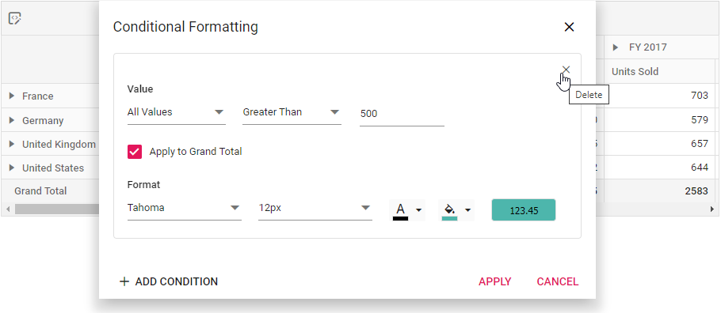

# Conditional formatting in Vue Pivotview component

Allows end user to change the appearance of the pivot table value cells with its background color, font color, font family, and font size based on specific conditions.

The conditional formatting can be applied at runtime through the built-in dialog, invoked from the toolbar. To do so, set [`allowConditionalFormatting`](https://ej2.syncfusion.com/vue/documentation/api/pivotview/#allowconditionalformatting) and [`showToolbar`](https://helpej2.syncfusion.com/vue/documentation/api/pivotview/#showtoolbar) properties in pivot table to **true**. Also, include the item **ConditionalFormatting** within the [`toolbar`](https://ej2.syncfusion.com/vue/documentation/api/pivotview/#toolbar) property in pivot table. End user can now see the "Conditional Formatting" icon in toolbar UI automatically, which on clicking will invoke the formatting dialog to perform necessary operations.






        


Conditional formatting can also be included in the pivot table through code-behind using the [`conditionalFormatSettings`](https://helpej2.syncfusion.com/vue/documentation/api/pivotview/iConditionalFormatSettings/#iconditionalformatsettings). The required properties to apply a new conditional formatting are,

* [`measure`](https://helpej2.syncfusion.com/vue/documentation/api/pivotview/iConditionalFormatSettings/#measure): Specifies the value field name for which style will be applied.
* [`conditions`](https://helpej2.syncfusion.com/vue/documentation/api/pivotview/iConditionalFormatSettings/#conditions): Specifies the operator type such as equals, greater than, less than, etc.
* [`value1`](https://helpej2.syncfusion.com/vue/documentation/api/pivotview/iConditionalFormatSettings/#value1): Specifies the start value.
* [`value2`](https://helpej2.syncfusion.com/vue/documentation/api/pivotview/iConditionalFormatSettings/#value2): Specifies the end value.
* [`style`](https://helpej2.syncfusion.com/vue/documentation/api/pivotview/iConditionalFormatSettings/#style): Specifies the style for the cell.

The available style properties in [`style`](https://helpej2.syncfusion.com/vue/documentation/api/pivotview/iConditionalFormatSettings/#style), to set in value cells are:

* [`backgroundColor`](https://helpej2.syncfusion.com/vue/documentation/api/pivotview/iStyle/#backgroundcolor): Specifies the background color.
* [`color`](https://helpej2.syncfusion.com/vue/documentation/api/pivotview/iStyle/#color): Specifies the font color.
* [`fontFamily`](https://helpej2.syncfusion.com/vue/documentation/api/pivotview/iStyle/#fontfamily): Specifies the font family.
* [`fontSize`](https://helpej2.syncfusion.com/vue/documentation/api/pivotview/iStyle/#fontsize): Specifies the font size.

Meanwhile, user can also view conditional formatting dialog in UI by invoking [`showConditionalFormattingDialog`](https://helpej2.syncfusion.com/vue/documentation/api/pivotview/#showconditionalformattingdialog) method on an external button click which is shown in the below code sample.






        


## Conditional formatting for all fields

Allows end user to apply conditional formatting commonly for all value fields just by ignoring the [`measure`](https://ej2.syncfusion.com/vue/documentation/api/pivotview/conditionalFormatSettings/#measure) property and setting rest of the properties in [`conditionalFormatSettings`](https://ej2.syncfusion.com/vue/documentation/api/pivotview/conditionalFormatSettings/).






        


## Conditional formatting for specific value field

Allows end user to apply conditional formatting to a specific value field by setting the [`Measure`](https://help.syncfusion.com/cr/blazor/Syncfusion.EJ2.Blazor~Syncfusion.EJ2.Blazor.PivotView.PivotViewConditionalFormatSetting~Measure.html) property with specific value field name in [`PivotViewConditionalFormatSetting`](https://help.syncfusion.com/cr/blazor/Syncfusion.EJ2.Blazor~Syncfusion.EJ2.Blazor.PivotView.PivotViewConditionalFormatSetting_properties.html) class.






        


## Editing and removing existing conditional format

Editing and removing existing conditional format can be done through the UI at runtime. To do so, open the conditional formatting dialog and edit the "Value", "Condition" and "Format" options based on user requirement and click "OK". To remove a conditional format, click the "Delete" icon besides the respective condition.  

## Event

### ConditionalFormatting

The event [`conditionalFormatting`](https://ej2.syncfusion.com/vue/documentation/api/pivotview/#conditionalformatting) is triggered initially while clicking the “ADD CONDITION” button inside the conditional formatting dialog in-order to fill user specific condition instead of default condition at runtime. To use this event, [`allowConditionalFormatting`](https://ej2.syncfusion.com/vue/documentation/api/pivotview/#allowconditionalformatting) property in PivotView must be set to **true**. It has following parameters -

* `applyGrandTotals` - boolean property, by setting this to true user can enable formatting to grand totals.
* `conditions` - condition to be filled in conditional formatting dialog.
* `label` - Label value for conditional formatting dialog.
* `measure` - measure value for the conditional formatting dialog.
* `style` - style property of the conditional formatting dialog.
* `value1` - value 1 for conditional formatting dialog.
* `value2` - value 2 for conditional formatting dialog, this is applicable only for selected conditions like **Between** and **NotBetween**.






        


## See Also

* [Apply conditional formatting for specific row or column](./how-to/apply-conditional-formatting-for-specific-row-or-column)