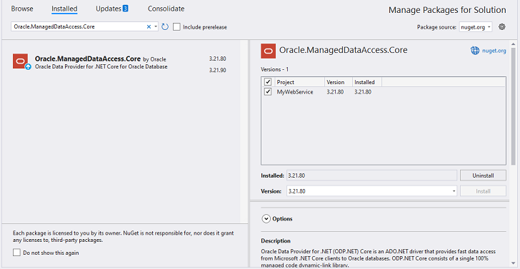

# Oracle in EJ2 Vue Pivot Table Component

This guide explains how to retrieve data from an Oracle database using the [Oracle Managed Data Access](https://www.nuget.org/packages/Oracle.ManagedDataAccess) library and bind it to the Pivot Table through a Web API controller.

## Creating a Web API Service to Fetch Oracle Data

Follow these steps to create a Web API service that retrieves data from an Oracle database and prepares it for the Pivot Table.

### Step 1: Create an ASP.NET Core Web Application
1. Open Visual Studio and create a new **ASP.NET Core Web App** project named **MyWebService**.
2. Follow the official [Microsoft documentation](https://learn.microsoft.com/en-us/visualstudio/get-started/csharp/tutorial-aspnet-core?view=vs-2022) for detailed instructions on creating an ASP.NET Core Web application.


### Step 2: Install the Oracle NuGet Package
To enable Oracle database connectivity:
1. Open the **NuGet Package Manager** in your project solution and search for [Oracle.ManagedDataAccess.Core](https://www.nuget.org/packages/Oracle.ManagedDataAccess.Core).
2. Install the [Oracle.ManagedDataAccess.Core](https://www.nuget.org/packages/Oracle.ManagedDataAccess.Core) package to add Oracle support.



### Step 3: Create a Web API Controller
1. Under the **Controllers** folder, create a new Web API controller named **PivotController.cs**.
2. This controller facilitates data communication between the Oracle database and the Pivot Table.

### Step 4: Connect to Oracle and Retrieve Data
In the **PivotController.cs** file, use the [Oracle Managed Data Access](https://www.nuget.org/packages/Oracle.ManagedDataAccess) library to connect to an Oracle database and retrieve data for the Pivot Table.

1. **Establish Connection**: Use **OracleConnection** with a valid connection string (e.g., `Data Source=localhost;User Id=myuser;Password=mypassword;`) to connect to the Oracle database.
2. **Query and Fetch Data**: Execute a SQL query (e.g., `SELECT * FROM EMPLOYEES`) using **OracleCommand** to retrieve data for the Pivot Table.
3. **Structure the Data**: Use **OracleDataAdapter**'s **Fill** method to populate query results into a **DataTable** for JSON serialization.

```csharp
     using Microsoft.AspNetCore.Mvc;
     using Newtonsoft.Json;
     using Oracle.ManagedDataAccess.Client;
     using System.Data;

     namespace MyWebService.Controllers
     {
          [ApiController]
          [Route("[controller]")]
          public class PivotController : ControllerBase
          {
               private static DataTable FetchOracleResult()
               {
                    // Replace with your own connection string.
                    string connectionString = "<Enter your valid connection string here>";
                    OracleConnection oracleConnection = new OracleConnection(connectionString);
                    oracleConnection.Open();
                    OracleCommand command = new OracleCommand("SELECT * FROM EMPLOYEES", oracleConnection);
                    OracleDataAdapter dataAdapter = new OracleDataAdapter(command);
                    DataTable dataTable = new DataTable();
                    dataAdapter.Fill(dataTable);
                    oracleConnection.Close();
                    return dataTable;
               }
          }
     }

```

### Step 5: Serialize Data to JSON
In the **PivotController.cs** file, define a **Get** method that calls **FetchOracleResult** to retrieve data from the Oracle database as a **DataTable**. Then, use **JsonConvert.SerializeObject** from the **Newtonsoft.Json** library to convert the **DataTable** into JSON format. This JSON data will be used by the Pivot Table component.

> Ensure the **Newtonsoft.Json** NuGet package is installed in your project to use **JsonConvert**.

```csharp
     using Microsoft.AspNetCore.Mvc;
     using Newtonsoft.Json;
     using Oracle.ManagedDataAccess.Client;
     using System.Data;

     namespace MyWebService.Controllers
     {
          [ApiController]
          [Route("[controller]")]
          public class PivotController : ControllerBase
          {
               [HttpGet(Name = "GetOracleResult")]
               public object Get()
               {
                    return JsonConvert.SerializeObject(FetchOracleResult());
               }

               private static DataTable FetchOracleResult()
               {
                    // Replace with your own connection string.
                    string connectionString = "<Enter your valid connection string here>";
                    OracleConnection oracleConnection = new OracleConnection(connectionString);
                    oracleConnection.Open();
                    OracleCommand command = new OracleCommand("SELECT * FROM EMPLOYEES", oracleConnection);
                    OracleDataAdapter dataAdapter = new OracleDataAdapter(command);
                    DataTable dataTable = new DataTable();
                    dataAdapter.Fill(dataTable);
                    oracleConnection.Close();
                    return dataTable;
               }
          }
     }

```

### Step 6: Run the Web API Service
1. Build and run the application.
2. The application will be hosted at `https://localhost:44346/` (the port number may vary based on your configuration).

### Step 7: Access the JSON Data
1. Access the Web API endpoint at `https://localhost:44346/Pivot` to view the JSON data retrieved from the Oracle database.
2. The browser will display the JSON data, as shown below.


## Connecting the Pivot Table to an Oracle Database Using the Web API Service

This section explains how to connect the Pivot Table component to an Oracle database by retrieving data from the Web API service created in the previous section.

### Step 1: Create a Pivot Table in Vue
1. Set up a basic Vue Pivot Table by following the [Getting Started](../getting-started) documentation.
2. Ensure your Vue project is configured with the necessary EJ2 Pivot Table dependencies.

### Step 2: Configure the Web API URL in the Pivot Table
1. In the **App.ts** (or **App.js**) file, map the Web API URL (`https://localhost:44346/Pivot`) to the Pivot Table using the [url](https://helpej2.syncfusion.com/vue/documentation/api/pivotview/iDataOptions#url) property within the [dataSourceSettings](https://ej2.syncfusion.com/vue/documentation/api/pivotview/dataSourceSettings).
2. Below is the sample code to configure the Pivot Table to fetch data from the Web API:

```typescript
<script setup>

import {
  FieldList,
  PivotViewComponent,
} from "@syncfusion/ej2-vue-pivotview";

export default {
  data() {
    return {
      dataSourceSettings: {
        url: 'https://localhost:44346/Pivot'
        //Other codes here...
      }
    };
  }
};
</script>
<style>
  //Syncfusion Angular controls styles
</style>

```

### Step 3: Define the Pivot Table Report
1. Configure the Pivot Table report in the **App.ts** (or **App.js**) file to structure the data retrieved from the Oracle database.
2. Add fields to the [rows](https://ej2.syncfusion.com/vue/documentation/api/pivotview/dataSourceSettings#rows), [columns](https://ej2.syncfusion.com/vue/documentation/api/pivotview/dataSourceSettings#columns), [values](https://ej2.syncfusion.com/vue/documentation/api/pivotview/dataSourceSettings#values), and [filters](https://ej2.syncfusion.com/vue/documentation/api/pivotview/dataSourceSettings#filters) properties of [dataSourceSettings](https://ej2.syncfusion.com/vue/documentation/api/pivotview/dataSourceSettings) to define the report structure, specifying how data fields are organized and aggregated in the Pivot Table.
3. Enable the field list by setting the [showFieldList](https://ej2.syncfusion.com/vue/documentation/api/pivotview/index-default#showfieldlist) property to **true** and including the `FieldList` module in the services section. This allows users to dynamically add or rearrange fields across the columns, rows, and values axes using an interactive user interface.

Here’s the updated sample code for **App.js** with the report configuration and field list support:

```typescript
<template>
  <div>
    <div class="control-section" style="overflow: auto">
      <div class="content-wrapper">
        <ejs-pivotview
          id="pivotview"
          ref="pivotview"
          :dataSourceSettings="dataSourceSettings"
          :showFieldList="showFieldList"
        ></ejs-pivotview>
      </div>
    </div>
  </div>
</template>
<script setup>
import { provide } from "vue";
  
  import {
    FieldList,
    PivotViewComponent,
  } from "@syncfusion/ej2-vue-pivotview";
  
  export default {
    data() {
      return {
        dataSourceSettings: {
          url: 'https://localhost:44346/Pivot',
          enableSorting: true,
          expandAll: false,
        columns: [
          { name: 'DEPARTMENT_ID', caption: 'Department ID' },
          { name: 'EMPLOYEE_NAME', caption: 'Employee Name' },
        ],
        rows: [
          { name: 'JOB', caption: 'Job' },
          { name: 'SALARY', caption: 'Salary' }
        ],
        values: [
          { name: 'EMPLOYEE_ID', caption: 'Employee ID' },
          { name: 'CC_EMPLOYEES', caption: 'Employees' },
          { name: 'CC_TAX_PERCENTAGE', caption: 'Percentage' },
        ],
        filters: []
        },
        showFieldList: true
      };
    },
    methods: {
    },
    provide('pivotview',  [FieldList]);
  };
</script>
<style>
  @import "../node_modules/@syncfusion/ej2-base/styles/tailwind3.css";
  @import "../node_modules/@syncfusion/ej2-inputs/styles/tailwind3.css";
  @import "../node_modules/@syncfusion/ej2-buttons/styles/tailwind3.css";
  @import "../node_modules/@syncfusion/ej2-splitbuttons/styles/tailwind3.css";
  @import "../node_modules/@syncfusion/ej2-dropdowns/styles/tailwind3.css";
  @import "../node_modules/@syncfusion/ej2-lists/styles/tailwind3.css";
  @import "../node_modules/@syncfusion/ej2-popups/styles/tailwind3.css";
  @import "../node_modules/@syncfusion/ej2-popups/styles/tailwind3.css";
  @import "../node_modules/@syncfusion/ej2-navigations/styles/tailwind3.css";
  @import "../node_modules/@syncfusion/ej2-grids/styles/tailwind3.css";
  @import "../node_modules/@syncfusion/ej2-pivotview/styles/tailwind3.css";
</style>
```

### Step 4: Run and Verify the Pivot Table
1. Run the Vue application.
2. The Pivot Table will display the data fetched from the Oracle database via the Web API, structured according to the defined report.
3. The resulting Pivot Table will look like this:


### Additional Resources
Explore a complete example of the Vue Pivot Table integrated with an ASP.NET Core Web Application to fetch data from an Oracle database in this [GitHub](https://github.com/SyncfusionExamples/how-to-bind-Oracle-database-to-pivot-table) repository.