# OLAP in Vue Pivot Table component

## Getting Started

This section explain steps to create a simple **Pivot Table** with OLAP data source in a Vue environment.

### Dependencies

Understanding the dependency structure helps you identify the required packages for implementing the Pivot Table component with OLAP data in your Vue application. The Pivot Table component relies on a structured hierarchy of dependencies that provide essential functionality for data processing, user interface elements, and export capabilities.

The following dependency tree shows the required packages for the Vue Pivot Table component:

```javascript
|-- @syncfusion/ej2-vue-pivotview
    |-- @syncfusion/ej2-pivotview
    |-- @syncfusion/ej2-base
    |-- @syncfusion/ej2-data
    |-- @syncfusion/ej2-excel-export
        |-- @syncfusion/ej2-file-utils
        |-- @syncfusion/ej2-compression
    |-- @syncfusion/ej2-pdf-export
        |-- @syncfusion/ej2-file-utils
        |-- @syncfusion/ej2-compression
    |-- @syncfusion/ej2-calendars
    |-- @syncfusion/ej2-charts
        |-- @syncfusion/ej2-svg-base
    |-- @syncfusion/ej2-inputs
    |-- @syncfusion/ej2-buttons
    |-- @syncfusion/ej2-dropdowns
    |-- @syncfusion/ej2-lists
    |-- @syncfusion/ej2-popups
    |-- @syncfusion/ej2-navigations
    |-- @syncfusion/ej2-grids
```

### Setup Vue Environment

You can use [Vue CLI](https://github.com/vuejs/vue-cli) to setup your vue application. To install Vue CLI use the following commands.

```bash
npm install -g @vue/cli

npm install -g @vue/cli-init
```

### Create a Vue Application

Create a new Vue application using below Vue CLI command.

```bash
vue init webpack-simple quickstart
```

Now, the application is created in the **quickstart** demo folder. Run the following command one-by-one to navigate to the **quickstart** demo folder, and install the required **npm** dependent packages.

```bash
cd quickstart

npm install
```

### Adding Syncfusion<sup style="font-size:70%">&reg;</sup> pivot table package

All the available Essential<sup style="font-size:70%">&reg;</sup> JS 2 packages are published in [npmjs.com](https://www.npmjs.com/~syncfusionorg) registry. To install pivot table component, use the following command.

```bash
npm install @syncfusion/ej2-vue-pivotview --save
```

> The **--save** will instruct NPM to include the pivot table package inside the **dependencies** section of the **package.json**.

### Registering pivot table Component

You can register the pivot table component in your application by using the `Vue.use()` in **App.vue** file as follows.

```ts
import { PivotViewPlugin } from '@syncfusion/ej2-vue-pivotview';

Vue.use(PivotViewPlugin);
```

> Registering `PivotViewPlugin` in vue, will register the pivot table component along with its required child directives globally.

### Adding CSS Reference

Import pivot table and its [dependent](#dependencies) components styles as given below in `<style>` section of the **App.vue** file.

```
<style>
<!-- Tailwind3 theme used for this sample -->
@import '../node_modules/@syncfusion/ej2-base/styles/tailwind3.css';
@import '../node_modules/@syncfusion/ej2-buttons/styles/tailwind3.css';
@import '../node_modules/@syncfusion/ej2-dropdowns/styles/tailwind3.css';
@import '../node_modules/@syncfusion/ej2-grids/styles/tailwind3.css';
@import '../node_modules/@syncfusion/ej2-inputs/styles/tailwind3.css';
@import '../node_modules/@syncfusion/ej2-lists/styles/tailwind3.css';
@import '../node_modules/@syncfusion/ej2-navigations/styles/tailwind3.css';
@import '../node_modules/@syncfusion/ej2-popups/styles/tailwind3.css';
@import '../node_modules/@syncfusion/ej2-calendars/styles/tailwind3.css';
@import "../node_modules/@syncfusion/ej2-pivotview/styles/tailwind3.css";
</style>
```

### Adding pivot table component

Add the EJ2 Vue pivot table using `<ejs-pivotview>` to the `<template>` section of the **App.vue** file in src directory. The properties of pivot table can be assigned in `<ejs-pivotview>` tag and that can be bounded under **data** section.

```
<template>
    <div id="app">
        <ejs-pivotview></ejs-pivotview>
    </div>
</template>

<script setup>

import { PivotViewComponent } from "@syncfusion/ej2-vue-pivotview";


export default {
  data () {
    return {
    }
  }
}
</script>
<style>
@import "@syncfusion/ej2-vue-pivotview/styles/tailwind3.css";
</style>
```

Next we need to add the the following code in **App.vue** file to populate pivot table with a sample OLAP data source. Refer [here](#data-binding) to know the more details about OLAP data binding.

```
<template>
    <div id="app">
        <ejs-pivotview :dataSourceSettings="dataSourceSettings"> </ejs-pivotview>
    </div>
</template>

<script setup>

import { PivotViewComponent } from "@syncfusion/ej2-vue-pivotview";


export default {
  data () {
    return {
      dataSourceSettings: {
            catalog: 'Adventure Works DW 2008 SE',
            cube: 'Adventure Works',
            providerType: 'SSAS',
            enableSorting: true,
            url: 'https://bi.syncfusion.com/olap/msmdpump.dll',
            localeIdentifier: 1033
      }
    }
  }
}
</script>
<style>
@import "@syncfusion/ej2-vue-pivotview/styles/tailwind3.css";
</style>
```

### Adding OLAP cube elements to row, column, value and filter axes

Now that pivot table is initialized and assigned with sample OLAP data source, will further move to showcase the component by organizing appropriate [OLAP cube elements](#olap-cube-elements) in [`rows`](https://ej2.syncfusion.com/vue/documentation/api/pivotview/iDataOptions/#rows), [`columns`](https://ej2.syncfusion.com/vue/documentation/api/pivotview/iDataOptions/#columns), [`values`](https://ej2.syncfusion.com/vue/documentation/api/pivotview/iDataOptions/#values) and [`filters`](https://ej2.syncfusion.com/vue/documentation/api/pivotview/iDataOptions/#filters) axes.

In [`dataSourceSettings`](https://ej2.syncfusion.com/vue/documentation/api/pivotview/#datasourcesettings) property, four major axes [`rows`](https://ej2.syncfusion.com/vue/documentation/api/pivotview/iDataOptions/#rows), [`columns`](https://ej2.syncfusion.com/vue/documentation/api/pivotview/iDataOptions/#columns), [`values`](https://ej2.syncfusion.com/vue/documentation/api/pivotview/iDataOptions/#values) and [`filters`](https://ej2.syncfusion.com/vue/documentation/api/pivotview/iDataOptions/#filters) plays a vital role in defining and organizing [OLAP cube elements](#olap-cube-elements) from the bound data source, to render the entire pivot table component in a desired format.

[`rows`](https://ej2.syncfusion.com/vue/documentation/api/pivotview/iDataOptions/#rows) – Collection of [OLAP cube elements](#olap-cube-elements) (such as Hierarchies, NamedSet, Calculated Members etc.,) that needs to be displayed in row axis of the pivot table.

[`columns`](https://ej2.syncfusion.com/vue/documentation/api/pivotview/iDataOptions/#columns) – Collection of [OLAP cube elements](#olap-cube-elements) (such as Hierarchies, NamedSet, Calculated Members etc.,) that needs to be displayed in column axis of the pivot table.

[`values`](https://ej2.syncfusion.com/vue/documentation/api/pivotview/iDataOptions/#values) – Collection of [OLAP cube elements](#olap-cube-elements) (such as Measures, Calculated Measures) that needs to be displayed as aggregated numeric values in the pivot table.

[`filters`](https://ej2.syncfusion.com/vue/documentation/api/pivotview/iDataOptions/#filters) - Collection of [OLAP cube elements](#olap-cube-elements) (such as Hierarchies and Calculated Members) that would act as master filter over the data bound in row, column and value axes of the pivot table.

In-order to define each [OLAP cube element](#olap-cube-elements) in the respective axis, the following basic properties should be set.

* [`name`](https://ej2.syncfusion.com/vue/documentation/api/pivotview/iFieldOptions/#name): It allows to set the unique name of the hierarchies, named set, measures, calculated members etc., from the bound OLAP data source. It’s casing should match exactly like in the data source and if not set properly, the pivot table will be rendered as empty.
* [`caption`](https://ej2.syncfusion.com/vue/documentation/api/pivotview/iFieldOptions/#caption): It allows to set the caption, which is the alias name of the unique name that needs to be displayed in the pivot table. If not provided, unique name will be displayed.

In this sample, "Product Categories" is added in column, "Customer Geography" in row, and "Customer Count" and "Internet Sales Amount" in value axes respectively.









        


### Applying formatting to measures

You can change how values in the Pivot Table are displayed by applying formatting. For example, you can display values as currency by using the **C** format string. To apply formatting, use the [`formatSettings`](https://ej2.syncfusion.com/vue/documentation/api/pivotview/iFormatSettings/#iformatsettings) property within [`dataSourceSettings`](https://ej2.syncfusion.com/vue/documentation/api/pivotview/dataSourceSettings/), and define both the [`name`](https://ej2.syncfusion.com/vue/documentation/api/pivotview/iFormatSettings/#name) (the value field to format) and the [`format`](https://ej2.syncfusion.com/vue/documentation/api/pivotview/iFormatSettings/#format) (the format to apply).

In the following example, the [`formatSettings`](https://ej2.syncfusion.com/vue/documentation/api/pivotview/formatSettings/) property is used to apply the **C0** format to the **[Measures].[Internet Sales Amount]** field. This causes its values to be displayed as currency, showing the currency symbol without any decimal places. You can add formatting for other value fields in a similar way by including them in the [`formatSettings`](https://ej2.syncfusion.com/vue/documentation/api/pivotview/iFormatSettings/#iformatsettings) array.

> Only fields from the value section containing numeric data can be formatted.









        


### Enable grouping bar

The Grouping Bar feature automatically populates [OLAP cube elements](#olap-cube-elements) from the bound data source and allows end users to drag [OLAP cube elements](#olap-cube-elements) between different axes such as [`rows`](https://ej2.syncfusion.com/vue/documentation/api/pivotview/iDataOptions/#rows), [`columns`](https://ej2.syncfusion.com/vue/documentation/api/pivotview/iDataOptions/#columns), [`values`](https://ej2.syncfusion.com/vue/documentation/api/pivotview/iDataOptions/#values) and [`filters`](https://ej2.syncfusion.com/vue/documentation/api/pivotview/iDataOptions/#filters), and change pivot view at runtime. Sorting, filtering and removing of elements is also possible. It can be enabled by setting the [`showGroupingBar`](https://ej2.syncfusion.com/vue/documentation/api/pivotview/#showgroupingbar) property to **true** and by injecting the **GroupingBar** module as follows.

> If the **GroupingBar** module is not injected, the grouping bar will not be rendered with the pivot table component.









        


### Enable pivot field list

The Pivot Table control includes a built-in Field List, similar to the one in Microsoft Excel. This Field List allows users to add or remove [OLAP cube elements](#olap-cube-elements), and to move them between different axes: [`rows`](https://ej2.syncfusion.com/vue/documentation/api/pivotview/iDataOptions/#rows), [`columns`](https://ej2.syncfusion.com/vue/documentation/api/pivotview/iDataOptions/#columns), [`values`](https://ej2.syncfusion.com/vue/documentation/api/pivotview/iDataOptions/#values), and [`filters`](https://ej2.syncfusion.com/vue/documentation/api/pivotview/iDataOptions/#filters). Users can also filter and sort these elements as needed, all during runtime.

To display the Field List, set the [`showFieldList`](https://ej2.syncfusion.com/vue/documentation/api/pivotview/#showfieldlist) property to **true** on the Pivot Table. It is also necessary to inject the [`FieldList`](https://ej2.syncfusion.com/vue/documentation/api/pivotview/FieldList/) module.

> Note: If the **FieldList** module is not injected, the Field List will not appear in the Pivot Table.









        


### Exploring filter axis

The filter axis in the Pivot Table allows users to control which data is displayed in the [`rows`](https://ej2.syncfusion.com/vue/documentation/api/pivotview/iDataOptions/#rows), [`columns`](https://ej2.syncfusion.com/vue/documentation/api/pivotview/iDataOptions/#columns) and [`values`](https://ej2.syncfusion.com/vue/documentation/api/pivotview/iDataOptions/#values)  axes. It includes various [OLAP cube elements](#olap-cube-elements), such as hierarchies and calculated members. When elements are placed in the filter axis, they act as master filters that refine the data shown in the Pivot Table.

Users can add [OLAP cube elements](#olap-cube-elements) and filter members to the filter axis either by updating the report in code behind or by dragging items from other axes to the filter axis using the grouping bar or field list at runtime. This makes it easy to filter data according to specific requirements directly within the Pivot Table interface.









        


### Calculated field

The calculated field allows user to insert or add a new calculated field based on the available [OLAP cube elements](#olap-cube-elements) from the bound data source. Calculated fields are nothing but customized dimensions or measures that are newly created based on the user-defined expression.

The two types of calculated fields are as follows:

* **Calculated Measure** – Creates a new measure through user-defined expression.
* **Calculated Dimension** – Creates a new dimension through user-defined expression.

It can be customized using the [`calculatedFieldsSettings`](https://ej2.syncfusion.com/vue/documentation/api/pivotview/iCalculatedFields/#icalculatedfields) property through code behind. The setting required for calculate field feature at code behind are:
* [`name`](https://ej2.syncfusion.com/vue/documentation/api/pivotview/iCalculatedFields/#name): It allows to set the unique name for new calculated field.
* [`formula`](https://ej2.syncfusion.com/vue/documentation/api/pivotview/iCalculatedFields/#formula): It allows to set the user-defined expression.
* [`hierarchyUniqueName`](https://ej2.syncfusion.com/vue/documentation/api/pivotview/iCalculatedFields/#hierarchyuniquename): It allows to specify dimension unique name whose hierarchies alone should be used in the expression. This will be applicable only for calculated dimension.
* [`formatString`](https://ej2.syncfusion.com/vue/documentation/api/pivotview/iCalculatedFields/#formatstring): It allows to set the format string for the resultant calculated field.

You need to set [`isCalculatedField`](https://ej2.syncfusion.com/vue/documentation/api/pivotview/iFieldOptions/#iscalculatedfield) property to true, while adding calculated fields to respective axis through code behind.

Also calculated fields can be added at run time through the built-in dialog. The dialog can be enabled by setting the [`allowCalculatedField`](https://ej2.syncfusion.com/vue/documentation/api/pivotview/#allowcalculatedfield) property to **true** and by injecting the **CalculatedField** module as follows. You will see a button enabled in the Field List UI automatically to invoke the calculated field dialog and perform necessary operation.

> If the **CalculatedField** module is not injected, the calculated field dialog will not be rendered with the pivot table component. Moreover calculated measure can be added only in value axis.









        


Users can add a calculated field at runtime using the built-in dialog by following these steps:

**Step 1:** Click the **CALCULATED FIELD** button in the field list dialog, located at the top right corner. The calculated field dialog appears. Enter the name for the new calculated field in the dialog.

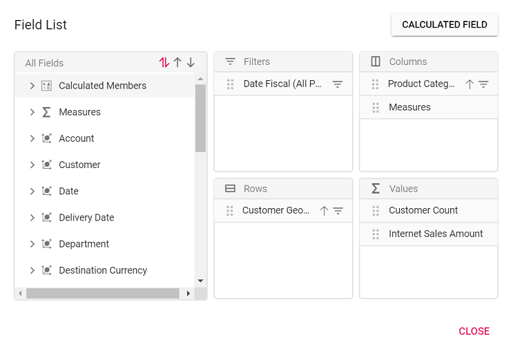

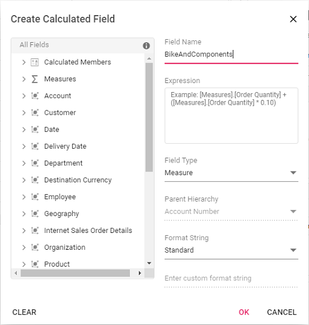

**Step 2:** Create the expression for your calculated field. To do this, drag and drop fields from the tree view on the left side of the dialog and use simple arithmetic operators.

**For example**: `IIF([Measures].[Internet Sales Amount]^0.5 > 100, [Measures].[Internet Sales Amount]*100, [Measures].[Internet Sales Amount]/100)`  
For more information about supported [`operators`](https://docs.microsoft.com/en-us/sql/mdx/operators-mdx-syntax?view=sql-server-ver15) and [`functions`](https://docs.microsoft.com/en-us/sql/mdx/functions-mdx-syntax?view=sql-server-ver15), see the Microsoft documentation.

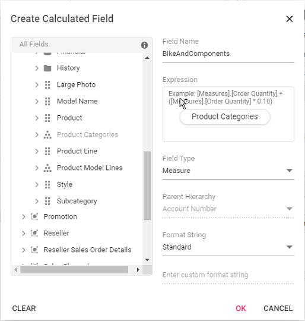

**Step 3:** Select the type for the new field, either calculated measure or calculated dimension.

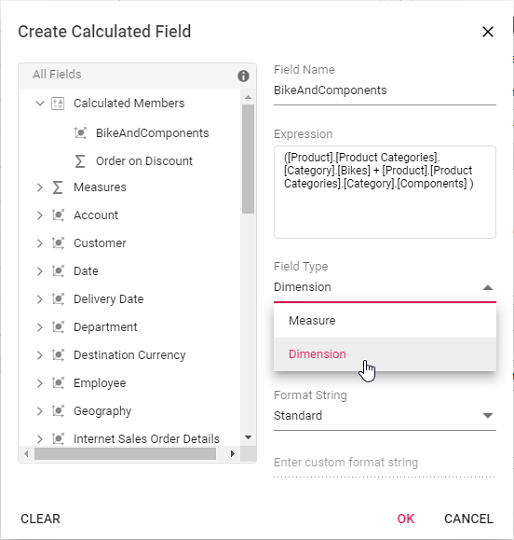

**Step 4:** If you are creating a calculated dimension, select its parent hierarchy from the drop-down list. This step is only required when adding a calculated dimension.

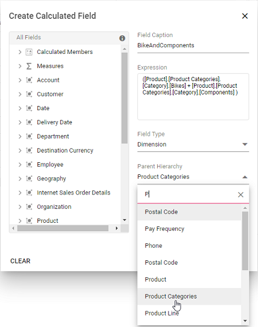

**Step 5:** Select a format string from the drop-down list and then click **OK** to finalize the calculated field.

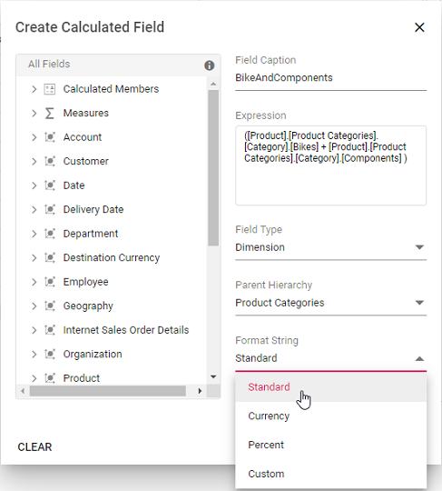

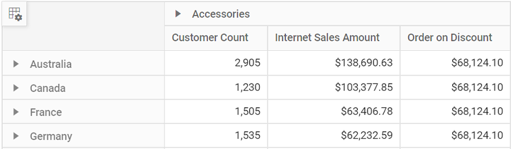

#### Format String

When creating a calculated field in the [Pivot Table](https://ej2.syncfusion.com/vue/documentation/api/pivotview/), you can choose the format for displaying values by selecting a format string. The available options are:

* **Standard** – Displays values as standard numbers.
* **Currency** – Displays values in currency format.
* **Percent** – Displays values as a percentage.
* **Custom** – Allows you to define your own format string. For example, entering "###0.##0#" will show the value "9584.3" as "9584.300".

By default, the **Standard** option is selected in the drop-down list.

This option helps users present calculated field results in the most suitable format for their needs.

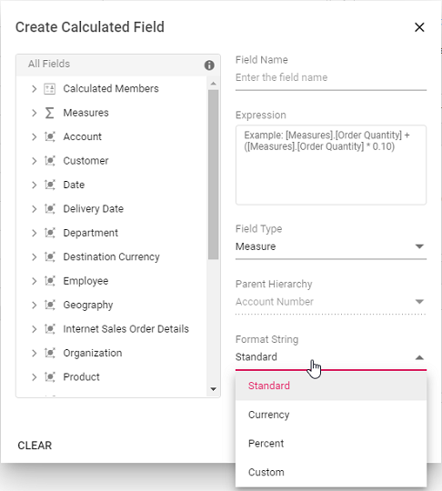

#### Renaming the Existing Calculated Field

You can rename any existing calculated field directly through the user interface at runtime. This option allows you to update calculated field names to keep them clear and meaningful as your analysis needs change.

To rename a calculated field:

1. Open the calculated field dialog in the Pivot Table.
2. Click the name of the field you want to rename. The current name will be shown in the text box at the top of the dialog.
3. Enter the new name in the text box.
4. Click **OK** to save the new name.

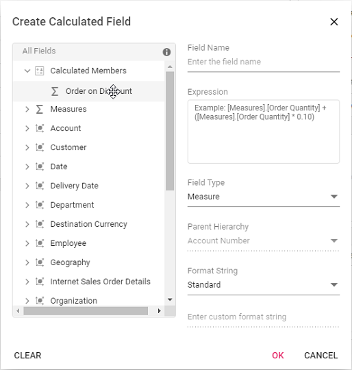

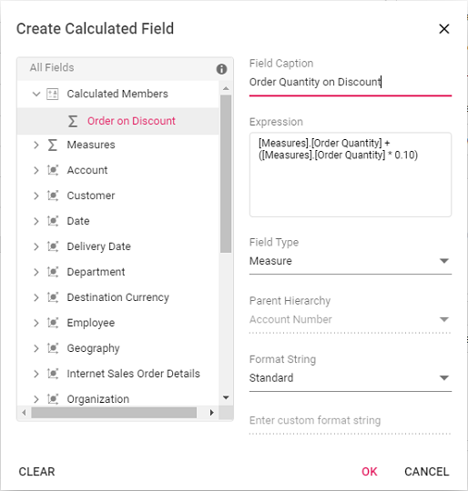

#### Editing an Existing Calculated Field Formula

You can edit an existing calculated field formula directly through the user interface at runtime. To do this:

1. Open the calculated field dialog in the Pivot Table.
2. From the list, select the calculated field you want to edit.
3. The current formula for the selected field will appear in the **Expression** section.
4. Modify the formula as needed based on your requirements.
5. Click **OK** to apply and save your changes.

The Pivot Table will automatically update to show the changes in the calculated values.


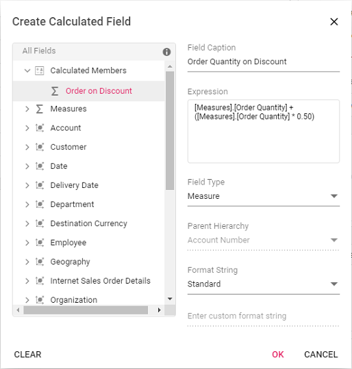

#### Reusing an Existing Formula in a New Calculated Field

This option allows you to easily create a new calculated field in the [Pivot Table](https://ej2.syncfusion.com/vue/documentation/api/pivotview/) by reusing a formula from an existing calculated field. This saves time and helps keep your calculations consistent.

To reuse an existing formula when working with the OLAP data source:

1. Open the calculated field dialog in the Pivot Table.
2. Find the existing calculated field that contains the formula you want to use again.
3. Drag the existing calculated field from the field list treeview.
4. Drop it into the **Expression** section. The formula from the selected field is then added automatically.
5. If needed, you can adjust the formula further or use it without changes.
6. Click **OK** to add your new calculated field.


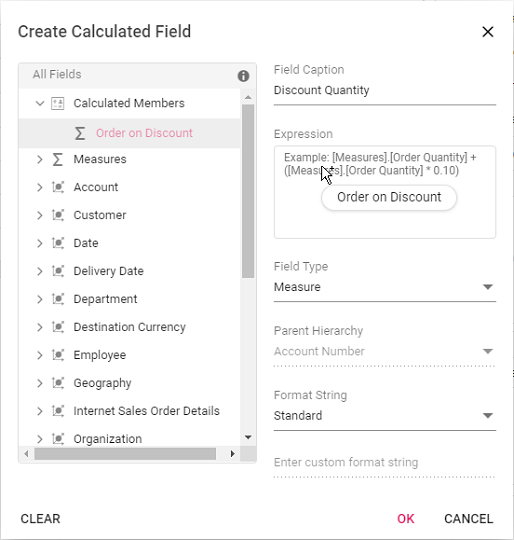

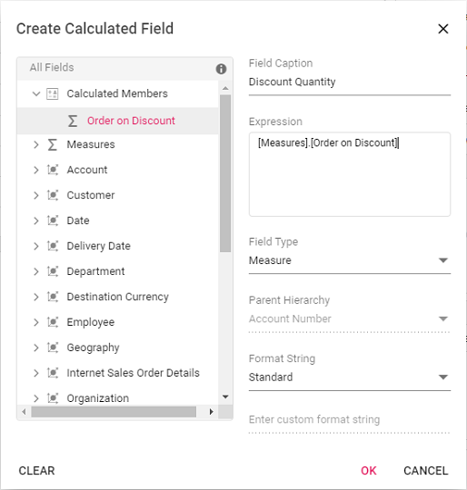

#### Modifying the Existing Format String

You can modify the format string of an existing calculated field at runtime through the user interface. To do this:

1. Open the calculated field dialog in the Pivot Table.
2. Click the name of the calculated field you want to edit.
3. The dialog will display the current format string in a drop-down list.
4. Select or enter a new format string based on your requirements.
5. Click **OK** to apply and save your changes.


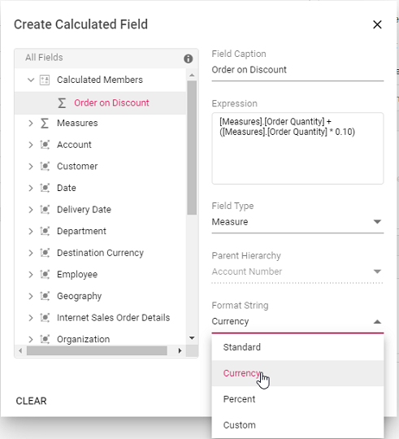

#### Clearing the changes while editing the calculated field

If you make edits while creating or modifying a calculated field, you can easily remove all the current changes by clicking the **Clear** button. This option is available in the bottom left corner of the calculated field dialog. Using the Clear button helps you start over without manually undoing each change, ensuring a smooth editing experience.

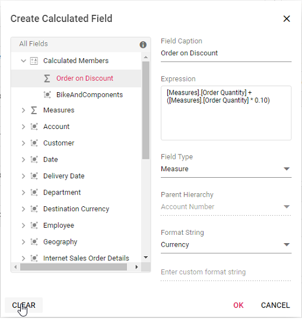

### Virtual Scrolling

Virtual scrolling helps you view large amounts of data smoothly in the Pivot Table. It loads and displays only the rows and columns currently visible in the viewport. As you scroll vertically or horizontally, new data is brought into view automatically, ensuring good performance even with a large data source.

To enable virtual scrolling, set the [`enableVirtualization`](https://ej2.syncfusion.com/vue/documentation/api/pivotview/#enablevirtualization) option to **true**. Also, be sure to inject the [`VirtualScroll`](https://ej2.syncfusion.com/vue/documentation/api/pivotview/#virtualscrollservice) module into the Pivot Table.










        


#### Limitations for virtual scrolling

* In virtual scrolling, the [columnWidth](https://ej2.syncfusion.com/vue/documentation/api/pivotview/gridSettings/#columnwidth) property in [gridSettings](https://ej2.syncfusion.com/vue/documentation/api/pivotview/gridSettings/) should be in pixels, and percentage values are not accepted.
* Resizing columns or setting width to individual columns affects the calculation used to pick the correct page on scrolling.
* When using OLAP data, subtotals and grand totals are only displayed when measures are bound at the last position in the [rows](https://ej2.syncfusion.com/vue/documentation/api/pivotview/dataSourceSettings/#rows) or [columns](https://ej2.syncfusion.com/vue/documentation/api/pivotview/dataSourceSettings/#columns) axis. Otherwise, the data from the pivot table will be shown without summary totals.
* When the pivot table's width and height are large, the loading data count in the current, previous, and next viewports (pages) will also increase, affecting performance.

## Run the application

The quickstart project is configured to compile and run the application in the browser. Use the following command to run the application.

```bash
npm run dev
```

Output will be displayed as follows.









        


## Data Binding

To bind OLAP datasource to the pivot table, you need to specify following properties under [`dataSourceSettings`](https://ej2.syncfusion.com/vue/documentation/api/pivotview/#datasourcesettings) option.

| Properties|Description |
|-----|-----|
| [`cube`](https://ej2.syncfusion.com/vue/documentation/api/pivotview/dataSourceSettings/#cube "cube")| Points the respective cube name from OLAP database.|
| [`providerType`](https://ej2.syncfusion.com/vue/documentation/api/pivotview/dataSourceSettings/#providertype "providerType")| Points the provider type for pivot table to identify the type of data source.|
| [`url`](https://ej2.syncfusion.com/vue/documentation/api/pivotview/dataSourceSettings/#url "url")| Contains the cube URL for establishing the connection (online).|
| [`catalog`](https://ej2.syncfusion.com/vue/documentation/api/pivotview/dataSourceSettings/#catalog "catalog")| Contains the database name (catalog name) to fetch the data.|









        


### Fields

#### Measures in row axis

By default, measures are shown on the columns axis in the Pivot Table. If you would like to display measures on the rows axis instead, you can do this using the [grouping bar](https://ej2.syncfusion.com/vue/documentation/api/pivotview/#showgroupingbar) or the [field list](https://ej2.syncfusion.com/vue/documentation/api/pivotview/#showfieldlist) UI. Simply drag the "Measures" button and drop it onto the rows axis.

Alternatively, you can set up the measure directly in your code by configuring the [`dataSourceSettings`](https://ej2.syncfusion.com/vue/documentation/api/pivotview/dataSourceSettings/) option, as shown in the code below:









        


#### Measures in different position

You can choose where to place measures on either the row or column axis through code behind or the user interface. In this example, the **measures** are set before the dimension field on the column axis. To achieve this, specify the order of the fields within the [`dataSourceSettings`](https://ej2.syncfusion.com/vue/documentation/api/pivotview/dataSourceSettings/#datasourcesettings) property.









        


### Named set

A named set is a multidimensional expression (MDX) that provides a predefined group of members from a dimension. It is created by combining cube data with arithmetic operators, numbers, or functions.

To display a named set in the Pivot Table, set its unique name using the [`name`](https://ej2.syncfusion.com/vue/documentation/api/pivotview/iFieldOptions/#name) property within either the row or column axis in [`dataSourceSettings`](https://ej2.syncfusion.com/vue/documentation/api/pivotview/dataSourceSettings/#datasourcesettings). Additionally, set the [`isNamedSet`](https://ej2.syncfusion.com/vue/documentation/api/pivotview/iFieldOptions/#isnamedset) property to **true**. In the example below, the "Core Product Group" named set is added to the column axis.









        


### Configuring authentication

To connect to an OLAP data source that requires authentication, users can provide basic authentication details through the [`authentication`](https://ej2.syncfusion.com/vue/documentation/api/pivotview/iDataOptions/#authentication) property within the [`dataSourceSettings`](https://ej2.syncfusion.com/vue/documentation/api/pivotview/dataSourceSettings/#datasourcesettings) option of the Pivot Table. The authentication options include:

* [`userName`](https://ej2.syncfusion.com/vue/documentation/api/pivotview/iAuthenticationInfo/#username): Enter the username required for access to the OLAP server.
* [`password`](https://ej2.syncfusion.com/vue/documentation/api/pivotview/iAuthenticationInfo/#password): Enter the password associated with the username.

> If authentication details are not provided, the browser will display a default pop-up window prompting users to enter the required information.

Below is an example of how to configure authentication settings in the Pivot Table:

```
<template>
    <div id="app">
        <ejs-pivotview :dataSourceSettings="dataSourceSettings" :height= "height" :showFieldList="showFieldList"> </ejs-pivotview>
    </div>
</template>

<script setup>
import { provide } from "vue";

import { PivotViewComponent, FieldList } from "@syncfusion/ej2-vue-pivotview";


export default {
  data () {
    return {
      dataSourceSettings: {
            catalog: 'Adventure Works DW 2008 SE',
            cube: 'Adventure Works',
            providerType: 'SSAS',
            enableSorting: true,
            url: 'https://bi.syncfusion.com/olap/msmdpump.dll',
            localeIdentifier: 1033,
            rows: [
                { name: '[Customer].[Customer Geography]', caption: 'Customer Geography' },
            ],
            columns: [
                { name: '[Product].[Product Categories]', caption: 'Product Categories' },
                { name: '[Measures]', caption: 'Measures' },
            ],
            values: [
                { name: '[Measures].[Customer Count]', caption: 'Customer Count' },
                { name: '[Measures].[Internet Sales Amount]', caption: 'Internet Sales Amount' }
            ],
            filters: [
                { name: '[Date].[Fiscal]', caption: 'Date Fiscal' },
            ],
            filterSettings: [
                {
                    name: '[Date].[Fiscal]', items: ['[Date].[Fiscal].[Fiscal Quarter].&[2002]&[4]',
                        '[Date].[Fiscal].[Fiscal Year].&[2005]'],
                    levelCount: 3
                }
            ],
            authentication: {
                userName: 'username',
                password: 'password'
            }
      },
      height: 350,
      showFieldList: true
    }
  },
  provide('pivotview',  [FieldList]);
}
</script>
<style>
@import "@syncfusion/ej2-vue-pivotview/styles/tailwind3.css";
</style>
```

### Roles

SQL Server Analysis Services (SSAS) uses [`roles`](https://learn.microsoft.com/en-us/analysis-services/multidimensional-models/roles-and-permissions-analysis-services?view=asallproducts-allversions) to control user access to the data inside an OLAP cube. Each role is defined with a set of permissions that can be assigned to individual users or groups. By assigning roles, you can restrict access to sensitive data and also determine who can view or modify information in the cube.

In the Syncfusion vue Pivot Table, you can specify roles using the [`roles`](https://ej2.syncfusion.com/vue/documentation/api/pivotview/iDataOptions/#roles) property within the [`dataSourceSettings`](https://ej2.syncfusion.com/vue/documentation/api/pivotview/#datasourcesettings) object. This allows you to provide one or more role names for connecting to an OLAP cube. If you want to use multiple roles, list them as a comma-separated string.

```
<template>
    <div id="app">
        <ejs-pivotview :dataSourceSettings="dataSourceSettings" :height= "height"> </ejs-pivotview>
    </div>
</template>

<script setup>
import { provide } from "vue";

import { PivotViewComponent } from "@syncfusion/ej2-vue-pivotview";


export default {
  data () {
    return {
      dataSourceSettings: {
        catalog: 'Adventure Works DW 2008 SE',
        cube: 'Adventure Works',
        providerType: 'SSAS',
        roles: 'Role1',
        url: 'https://bi.syncfusion.com/olap/msmdpump.dll',
        localeIdentifier: 1033,
        rows: [
            { name: '[Customer].[Customer Geography]', caption: 'Customer Geography' },
        ],
        columns: [
            { name: '[Product].[Product Categories]', caption: 'Product Categories' },
            { name: '[Measures]', caption: 'Measures' },
        ],
        values: [
            { name: '[Measures].[Customer Count]', caption: 'Customer Count' },
            { name: '[Measures].[Internet Sales Amount]', caption: 'Internet Sales Amount' }
        ]
      },
      height: 350
    }
  },
  provide('pivotview',  []);
}
</script>
<style>
@import "@syncfusion/ej2-vue-pivotview/styles/tailwind3.css";
</style>
```

## OLAP Cube: Elements

### Field List

The field list, also called the cube dimension browser, displays the cube elements from the selected OLAP cube in a tree view structure. It organizes elements such as dimensions, hierarchies, and measures into logical groups, making it easier for the user to explore and arrange data for analysis using the Pivot Table.

#### Types of Nodes in the Field List

- **Display folder**: Contains a set of similar cube elements grouped together.
- **Measure**: Represents the numeric values or quantities that users can analyze and summarize in the Pivot Table.
- **Dimension**: Groups related data and helps users to categorize and filter information in the cube.
- **Attribute hierarchy**: Shows data at different attribute levels within a dimension, allowing users to drill down for more specific analysis.
- **User-defined hierarchy**: Presents a custom arrangement of members within a dimension, structured in multiple levels for easier navigation and deeper data analysis.
- **Level**: Indicates a specific position or stage within a hierarchy for more focused data review.
- **Named set**: A saved collection of tuples or members that can be reused in analysis as part of the cube definition.

#### Measure

A measure in a cube refers to a numeric value that comes from a column in the cube’s fact table. Measures are the main values analyzed in the Pivot Table. They help users investigate metrics such as sales, costs, expenditures, or production counts. Users can select measures based on their analysis needs. In the field list, all available measures are grouped separately, making it easy to select or remove measures as required. When a user chooses a measure, it is displayed in the desired area of the [Pivot Table](https://ej2.syncfusion.com/vue/documentation/api/pivotview/) and participates in calculations and summary values.

#### Dimension

A dimension is an essential part of the OLAP cube in the Pivot Table. It holds key information, such as its name, hierarchies, levels, and members. To use a dimension, you specify its name, along with the desired hierarchy and the corresponding level. Each dimension contains detailed information about its hierarchies, and each hierarchy is made up of one or more levels. Within each level, there are members, and each member can also have child members. This structure helps users organize and explore data easily in the Pivot Table.

#### Hierarchy

A hierarchy organizes elements within a dimension into a series of parent-child relationships. Each parent member groups its child members, summarizing their data. These parent members can also be grouped under another parent for further summarization. For example, in a time dimension, the month of May 2005 can be grouped under Second Quarter 2005, which is then summarized under the year 2005.

#### Level

A level is a child element of a hierarchy in the field list. It contains a group of members that share the same rank within that hierarchy. For example, in a hierarchy representing geographical data, a level might include members like cities or states, all at the same depth.

#### Attribute Hierarchy

An attribute hierarchy in the Pivot Table organizes data into levels for easier analysis. It includes:

- **Leaf level**: This level contains unique attribute members, known as leaf members. Each leaf member represents a distinct data point.
- **Intermediate levels**: These exist in a parent-child hierarchy, connecting the leaf level to higher levels for structured data exploration.
- **Optional (all) level**: This level shows the combined total of all leaf members' values. The member at this level is called the (all) member.

#### User-Defined Hierarchy

A user-defined hierarchy arranges the members of a dimension into a structured, hierarchical format, making it easier to navigate and analyze data in the cube. For example, consider a dimension table with attributes like year, quarter, and month. These attributes can be combined to create a user-defined hierarchy named Calendar within the time dimension. This hierarchy connects all levels—year, quarter, and month—allowing users to explore data across different time periods seamlessly.

#### Differentiating User-Defined Hierarchy and Attribute Hierarchy

In the field list of the Pivot Table, hierarchies help users organize and analyze data in different ways. There are two main types of hierarchies:

- **User-defined hierarchy**: This type of hierarchy consists of two or more levels. Each level is created by combining related fields, which allows users to drill down through the data step by step—for example, from "Year" to "Quarter" to "Month" within a "Date" dimension. User-defined hierarchies use fields from the same dimension to create a logical path for navigation.
- **Attribute hierarchy**: In this type, there is only a single level. Each field in the dimension automatically forms an attribute hierarchy. For example, if "Country" is a field, it will appear as an attribute hierarchy with just one level, letting the user view data for each country individually.

#### Named Set

A named set is a group of specific tuples or members that can be defined and stored within the OLAP cube. Named sets are saved inside the sets folder under a dimension element in the field list, making them easy to locate. Users can add these named sets to the [`rows`](https://ej2.syncfusion.com/vue/documentation/api/pivotview/iDataOptions/#rows) or [`columns`](https://ej2.syncfusion.com/vue/documentation/api/pivotview/iDataOptions/#columns) axes through the grouping bar or the field list when working with the Pivot Table at runtime. Named sets are useful for handling long, complex, or frequently used expressions. The cube supports defining named sets using Multidimensional Expressions (MDX), which helps users manage these expressions more efficiently.

#### Calculated field

The calculated field allows user to insert or add a new calculated field based on the available OLAP cube elements from the bound data source. Calculated fields are nothing but customized dimensions or measures that are newly created based on the user-defined expression.

The two types of calculated fields are as follows:

* **Calculated Measure** – Creates a new measure through user-defined expression.
* **Calculated Dimension** – Creates a new dimension through user-defined expression.

#### Symbolic representation of the nodes inside field list

| Icon|Name | Node type | Is Draggable |
|-----|-----|-----------|--------------|
| | Display Folder| Display Folder| False|
| |Measure| Measure| False|
| | Dimension| Dimension| False|
| | User Defined Hierarchy| Hierarchy| True|
| | Attribute Hierarchy| Hierarchy| True|
| <br><br>| Levels (in order)| Level Element| True|
| | Named Set| Named Set| True|

## Events

### BeforeServiceInvoke

The [`beforeServiceInvoke`](https://ej2.syncfusion.com/vue/documentation/api/pivotview/pivotViewModel/#beforeserviceinvoke) event is triggered before initiating any service communication with the OLAP server in the Pivot Table and Field List components.

* This event allows you to inject custom properties or additional parameters dynamically before a request is made to the OLAP server.

* It is particularly useful for passing contextual data such as user tokens, custom filters, or localization information along with the original server request.

When the [`beforeServiceInvoke`](https://ej2.syncfusion.com/vue/documentation/api/pivotview/pivotViewModel/#beforeserviceinvoke) event is triggered, the event argument provides access to the request details and includes a [`customProperties`](https://ej2.syncfusion.com/vue/documentation/api/pivotview/beforeServiceInvokeEventArgs/#customproperties) field.









        


### AfterServiceInvoke

The [`afterServiceInvoke`](https://ej2.syncfusion.com/vue/documentation/api/pivotview/pivotViewModel/#afterserviceinvoke) event is triggered in the Pivot Table and Field List components during the onSuccess phase of every OLAP service request.

* This event is useful for performing post-processing, logging actions, or updating the UI after receiving a successful response from the OLAP server.

* You may use it to audit data, trigger notifications, or handle custom response-handling logic.

When the [`afterServiceInvoke`](https://ej2.syncfusion.com/vue/documentation/api/pivotview/pivotViewModel/#afterserviceinvoke) event is triggered, the event argument provides access to the server response details, including properties such as the action performed and the result data returned from the OLAP server.









        
