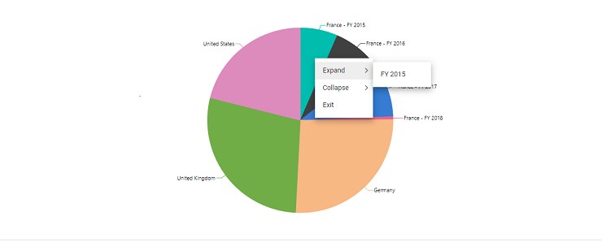

# Pivot chart in Vue Pivotview component

In pivot table component, pivot chart would act as an additional visualization component with its basic and important characteristic like drill down and drill up, 15+ chart types, series customization, axis customization, legend customization, export, print and tooltip. Its main purpose is to show the pivot data in graphical format.

To have a quick glance about Pivot Chart in the Vue Pivot Table, watch this video:



If user prefers, the pivot chart component can also be displayed individually with pivot values and can change the report dynamically with the help of field list and grouping bar. Using the [`displayOption`](https://ej2.syncfusion.com/vue/documentation/api/pivotview/#displayoption) property in pivot table, user can set the visibility of grid and chart in pivot table component. It holds below properties,

* [`view`](https://ej2.syncfusion.com/vue/documentation/api/pivotview/#displayoption): Specifies the pivot table component to display grid alone or chart alone or both.
* [`primary`](https://ej2.syncfusion.com/vue/documentation/api/pivotview/#displayoption): Specifies the pivot table to display either grid or chart as primary component during initial loading. It is applicable only when setting the property [`view`](https://ej2.syncfusion.com/vue/documentation/api/pivotview/#displayoption) to **Both**.

>You should inject the `PivotChart` module to make the its features available in the pivot table.

The below sample displays the pivot chart component based on the pivot report bound on it.






        


## Data binding

End user can bind both local and remote data binding options available in the component to feed the data. The [`dataSource`](https://ej2.syncfusion.com/vue/documentation/api/pivotview/iDataOptions/#datasource) property can be assigned either with an instance of `DataManager` or JavaScript object array collection.
For more information [`refer`](./data-binding) here.

## Chart Types

Supports 21 different types of charts as follows,

* Line
* Column
* Area
* Bar
* StepArea
* StackingLine
* StackingColumn
* StackingArea
* StackingBar
* StepLine
* Pareto
* Bubble
* Scatter
* Spline
* SplineArea
* StackingLine100
* StackingColumn100
* StackingBar100
* StackingArea100
* Polar
* Radar

**Line** is the default pivot chart type. User can change the pivot chart type by using the property [`type`](https://ej2.syncfusion.com/vue/documentation/api/pivotview/#chartsettings) in [`chartSeries`](https://ej2.syncfusion.com/vue/documentation/api/pivotview/#chartsettings).

In the below code sample, the pivot chart type is set as **Bar**.






        


## Accumulation Charts

Supports 4 different types of accumulation charts as follows,

* Pie
* Doughnut
* Funnel
* Pyramid

As like other chart types it can be changed using the property [`type`](https://ej2.syncfusion.com/vue/documentation/api/pivotview/#chartsettings) in [`chartSeries`](https://ej2.syncfusion.com/vue/documentation/api/pivotview/#chartsettings).

In the below code sample, the **Pie** chart is rendered, and the other accumulation charts can be switched using the drop-down list.






        


### Drill Down/Up

In the accumulation charts, drill down and drill up operations can be performed using the built-in context menu option. It will be shown while clicking on the chart series. The context menu has the following options:
* **Expand** - It is to drill down the corresponding series until the last level.
* **Collapse** - It is to drill up the corresponding series until the first level.
* **Exit** - It is to close the context menu.

> The drill operation in accumulation charts can be performed only for row headers.






        


### Column Headers and Delimiters

Unlike other chart types, the accumulation charts consider the values of a single column from the pivot table to be drawn. Preferably the first column of the pivot table is considered by default. But it can be changed by defining the column headers using the `columnHeader` property in [`chartSettings`](https://ej2.syncfusion.com/vue/documentation/api/pivotview/#chartsettings).

If the column has more than one header, then need to mention all the headers separated by the delimiter **-**, for example,**Germany-Road Bikes**. Using the property `columnDelimiter` in [`chartSettings`](https://ej2.syncfusion.com/vue/documentation/api/pivotview/#chartsettings), one can set the desired delimiter to separate the column headers.






        


### Label Customization

The data labels are visible by default showing header name. Its visibility can be modified using the [`visible`](https://ej2.syncfusion.com/vue/documentation/api/pivotview/#chartsettings) boolean property in `dataLabel`. With regard to the label arrangement, the **Smart Labels** options help to arrange labels efficiently without overlapping. It can be disabled by setting the `enableSmartLabels` property in [`chartSettings`](https://ej2.syncfusion.com/vue/documentation/api/pivotview/#chartsettings) as "false".
The `position` property in `dataLabel` allows to specify the position of the data label. The available options are,
* `Outside`: Positions the label outside the point. It is the default option.
* `Inside`: Positions the label inside the point.

In the following code sample, the data labels are placed inside.






        


The **Connector Line** will be visible when the data label is placed outside the chart. It can be customized using the `connectorStyle` property in `dataLabel` for its color, length, width etc. In the following code sample, the connector line is customized.






        


### Pie and Doughnut Customization

User can draw pie and doughnut charts within the specified range using the `startAngle` and `endAngle` properties in [`chartSeries`](https://ej2.syncfusion.com/vue/documentation/api/pivotview/#chartsettings). The default value of the `startAngle` property is **0**, and the `endAngle` property is **360**. By customizing these properties, user can draw semi pie and semi doughnut charts.






        


Users can get doughnut chart from pie chart and vice-versa using the `innerRadius` property in [`chartSeries`](https://ej2.syncfusion.com/vue/documentation/api/pivotview/#chartsettings). If the property is greater than **0** percent, the doughnut chart will appear from the pie chart.
> It takes the value only in percentage.






        


### Exploding Series Points

Exploding can be enabled by setting the `explode` property in [`chartSeries`](https://ej2.syncfusion.com/vue/documentation/api/pivotview/#chartsettings) to **true**. The series points will be exploded either on mouse click or touch.






        


## Field List

User can enable the field list by setting the property [`showFieldList`](https://ej2.syncfusion.com/vue/documentation/api/pivotview/#showfieldlist) in pivot table as **true**.
By using this, user can customize the report dynamically and view the result in pivot chart. For more information regarding the field list, refer the [field list](./field-list) topic.

In the following sample, the `Popup` mode of field list is enabled in the pivot chart.






        


## Grouping Bar

User can enable the grouping bar by setting the property [`showGroupingBar`](https://ej2.syncfusion.com/vue/documentation/api/pivotview/#showgroupingbar) in pivot table as **true**. The grouping bar in pivot chart shows a dropdown list in value axis instead of buttons. The dropdown list holds list of value fields bounded in the [`dataSourceSettings`](https://ej2.syncfusion.com/vue/documentation/api/pivotview/#datasourcesettings) and it can be switched to draw the pivot chart with the selected value field. This has been defined as the default behavior in the pivot chart component. For more information regarding the grouping bar, refer the [grouping bar](./grouping-bar) topic.

> For multiple axis support, buttons will be placed in value axis instead of dropdown list.






        


For accumulation charts alone, a drop-down list will be placed in the column axis instead of the buttons. The drop-down list shows the column headers available in the pivot table. Users can dynamically switch column headers with the help of the drop-down list, and the accumulation chart will be updated accordingly.






        


## Single Axis

By default, the pivot chart will be drawn with the value field (measure) which is set first in the report under value axis. But, user can change to specific value field using the property [`value`](https://ej2.syncfusion.com/vue/documentation/api/pivotview/#chartsettings) in [`chartSettings`](https://ej2.syncfusion.com/vue/documentation/api/pivotview/#chartsettings).






        


## Multiple Axis

User can draw the pivot chart with multiple value fields by setting the property [`enableMultipleAxis`](https://ej2.syncfusion.com/vue/documentation/api/pivotview/#chartsettings) to **true**. In the following sample, the pivot chart will be drawn with both the “Sold” and “Amount” value fields available in the data source.

> The multiple axis support is not applicable for the accumulation chart types like pie, doughnut, pyramid, and funnel.






        


If the user binds more value fields, the result will be multiple pivot charts, and each chart will shrink within the parent container height. To avoid this, set the [`enableScrollOnMultiAxis`](https://ej2.syncfusion.com/vue/documentation/api/pivotview/#chartsettings) property in [`chartSettings`](https://ej2.syncfusion.com/vue/documentation/api/pivotview/#chartsettings) to **true**. By doing so, each pivot chart will only shrink to a minimal "160px" - "180px" height showing a vertical scrollbar for a clear view.






        


Meanwhile, there is another way to display multiple values in a chart. In this approach, the series drawn from multiple values are grouped and displayed in a single chart. And, based on the values, multiple Y axis scales will be framed with different ranges. This can be achieved by setting the properties [`enableMultipleAxis`](https://ej2.syncfusion.com/vue/documentation/api/pivotview/#chartsettings) as **true** and [`multipleAxisMode`](https://ej2.syncfusion.com/vue/documentation/api/pivotview/#chartsettings) as `Single` in [`chartSettings`](https://ej2.syncfusion.com/vue/documentation/api/pivotview/#chartsettings).

In the following code sample, the pivot chart can be seen as a single chart with multiple value fields such as **Sold** and **Amount** that are drawn as multiple Y axis.






        


Additionally, to display chart series for multiple values within a single y-axis, set the properties [`enableMultipleAxis`](https://ej2.syncfusion.com/vue/documentation/api/pivotview/#chartsettings) to **true** and the [`multipleAxisMode`](https://ej2.syncfusion.com/vue/documentation/api/pivotview/#chartsettings) to **Combined**, in the [`chartSettings`](https://ej2.syncfusion.com/vue/documentation/api/pivotview/#chartsettings).

> The y-axis range values will be formatted using the first value field on the value axis. For example, if the first value field is in currency format and the remaining value fields are in different number formats or no format, the y-axis range values will be displayed in the currency format of the first value field.

The pivot chart in the following code sample can be seen as a single chart with multiple value fields such as **Sold** and **Amount** drawn as a single y-axis.






        


### Show point color based on members

When multiple axes are enabled, you can display the same color for each member in the column axis by setting the [`showPointColorByMembers`](https://ej2.syncfusion.com/vue/documentation/api/pivotview/#chartsettings) property to **true** in the [`chartSettings`](https://ej2.syncfusion.com/vue/documentation/api/pivotview/#chartsettings). As a result, the end user can easily identify each member across different measures in the entire chart.

Furthermore, end user can see or hide specific members across different measures in the entire chart with a single click on the legend item.






        


## Series customization

User can customize series of the pivot chart using [`chartSeries`](https://ej2.syncfusion.com/vue/documentation/api/pivotview/#chartsettings) in [`chartSettings`](https://ej2.syncfusion.com/vue/documentation/api/pivotview/#chartsettings). The changes handled in the property will be reflected commonly in all chart series.






        


User can also customize the pivot chart series individually using the [`chartSeriesCreated`](https://ej2.syncfusion.com/vue/documentation/api/pivotview/#chartseriescreated) event, which occurs after the pivot chart series has been created. You can customize each series individually by iterating them.

In the following sample, the even series are hidden in the pivot chart.






        


## Axis Customization

User can customize axis of the pivot chart using [`primaryXAxis`](https://ej2.syncfusion.com/vue/documentation/api/pivotview/#chartsettings) and [`primaryYAxis`](https://ej2.syncfusion.com/vue/documentation/api/pivotview/#chartsettings) properties in [`chartSettings`](https://ej2.syncfusion.com/vue/documentation/api/pivotview/#chartsettings).

In the following sample, title of y-axis and x-axis are customized.

> Axis customization is not applicable for the accumulation chart types like pie, doughnut, pyramid, and funnel.






        


## Legend customization

User can customize legend using [`legendSettings`](https://ej2.syncfusion.com/vue/documentation/api/pivotview/#chartsettings) in [`chartSettings`](https://ej2.syncfusion.com/vue/documentation/api/pivotview/#chartsettings). By default, legend will be visible and it can be hidden by setting the property [`visible`](https://ej2.syncfusion.com/vue/documentation/api/pivotview/#chartsettings) in [`legendSettings`](https://ej2.syncfusion.com/vue/documentation/api/pivotview/#chartsettings) as **false**.

The pivot chart support different types of legend shapes as follows,

* Circle
* Rectangle
* VerticalLine
* Pentagon
* InvertedTriangle
* SeriesType
* Triangle
* Diamond
* Cross
* HorizontalLine

Here **SeriesType** would act as the default shape and it can changed using the property [`LegendShape`](https://ej2.syncfusion.com/vue/documentation/api/pivotview/#chartsettings) in [`chartSeries`](https://ej2.syncfusion.com/vue/documentation/api/pivotview/#chartsettings).

Also user can set the position of the legend in pivot chart using the property [`position`](https://ej2.syncfusion.com/vue/documentation/api/pivotview/#chartsettings) in [`legendSettings`](https://ej2.syncfusion.com/vue/documentation/api/pivotview/#chartsettings). The available options to set the legend position are as follows,

* Auto: Places the legend based on area type. This is the default.
* Top: Displays the legend at the top of the pivot chart.
* Left: Displays the legend at the left of the pivot chart.
* Bottom: Displays the legend at the bottom of the pivot chart.
* Right: Displays the legend at the right of the pivot chart.
* Custom: Displays the legend based on the given x and y values.

> By default, the legend is not visible for the accumulation chart types like pie, doughnut, pyramid, and funnel.

In the following sample, the legend shape and its position can be customized.






        


## User interaction

### Marker and crossHair

User can enable and customize the marker and crosshair using [`marker`](https://ej2.syncfusion.com/vue/documentation/api/pivotview/#chartsettings) and [`crosshair`](https://ej2.syncfusion.com/vue/documentation/api/pivotview/#chartsettings) properties in [`chartSettings`](https://ej2.syncfusion.com/vue/documentation/api/pivotview/#chartsettings) respectively.

Also user can enable and customize the crosshair tooltip for axes using `crosshairTooltip`.

> Marker and crosshair is not applicable for the accumulation chart types like pie, doughnut, pyramid, and funnel.

In the following sample, the marker and crosshair can be enabled and customized.






        


### Zooming and panning

User can customize zooming and panning option using the property [`zoomSettings`](https://ej2.syncfusion.com/vue/documentation/api/pivotview/#chartsettings) in [`chartSettings`](https://ej2.syncfusion.com/vue/documentation/api/pivotview/#chartsettings).

The pivot chart support four types of zooming which can be set as follows,

* [`enablePinchZooming`](https://ej2.syncfusion.com/vue/documentation/api/pivotview/#chartsettings)
* [`enableSelectionZooming`](https://ej2.syncfusion.com/vue/documentation/api/pivotview/#chartsettings)
* [`enableDeferredZooming`](https://ej2.syncfusion.com/vue/documentation/api/pivotview/#chartsettings)
* [`enableMouseWheelZooming`](https://ej2.syncfusion.com/vue/documentation/api/pivotview/#chartsettings)

and three modes of zooming direction that specifies whether to zoom vertically or horizontally or in both ways which are,

* x: Pivot chart can be zoomed horizontally.
* y: Pivot chart can be zoomed  vertically.
* x,y: Pivot chart can be zoomed both vertically and horizontally.

This can be set using the property [`mode`](https://ej2.syncfusion.com/vue/documentation/api/pivotview/#chartsettings) in [`zoomSettings`](https://ej2.syncfusion.com/vue/documentation/api/pivotview/#chartsettings). By default, if the pivot chart is zoomed, a toolbar would display with the options - Zoom, ZoomIn, ZoomOut, Pan, Reset. User can also customize its option using the property [`toolbarItems`](https://ej2.syncfusion.com/vue/documentation/api/pivotview/#chartsettings) in [`zoomSettings`](https://ej2.syncfusion.com/vue/documentation/api/pivotview/#chartsettings).

> Zooming and panning is not applicable for the accumulation chart types like pie, doughnut, pyramid, and funnel.

In the following sample, all the four types of zooming are enabled with toolbar options.






        


### Tooltip

By default, tooltip for the pivot chart is enabled. User can customize it by using the property [`tooltip`](https://ej2.syncfusion.com/vue/documentation/api/pivotview/#chartsettings) in [`chartSettings`](https://ej2.syncfusion.com/vue/documentation/api/pivotview/#chartsettings).

> The tooltip can be disabled by setting the property [`enable`](https://ej2.syncfusion.com/vue/documentation/api/pivotview/#chartsettings) in [`tooltip`](https://ej2.syncfusion.com/vue/documentation/api/pivotview/#chartsettings) as **false**.

In the following sample, the default appearance of tooltip is modified.






        


## Export

The pivot chart can be exported using the [`chartExport`](https://ej2.syncfusion.com/vue/documentation/api/pivotview/#chartexport) method which holds parameters like export type, file name, PDF orientation, width, and height in the same order. The mandatory parameters for this method are export type and file name whereas other parameters are optional.

The following are the four export types:

* PNG
* JPEG
* SVG
* PDF

In the following sample, exporting can be done using an external button named as "Export".






        


## Print

The rendered pivot chart can be printed directly from the browser by calling [`printChart`](https://ej2.syncfusion.com/angular/documentation/api/pivotview#printchart) method.

In the following sample, printing can be done using an external button named as "Print".






        
