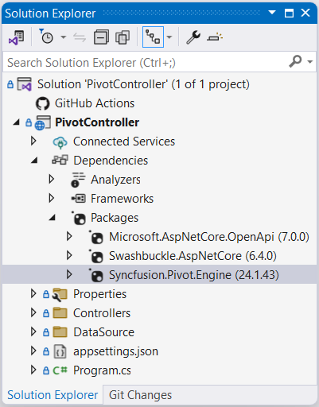
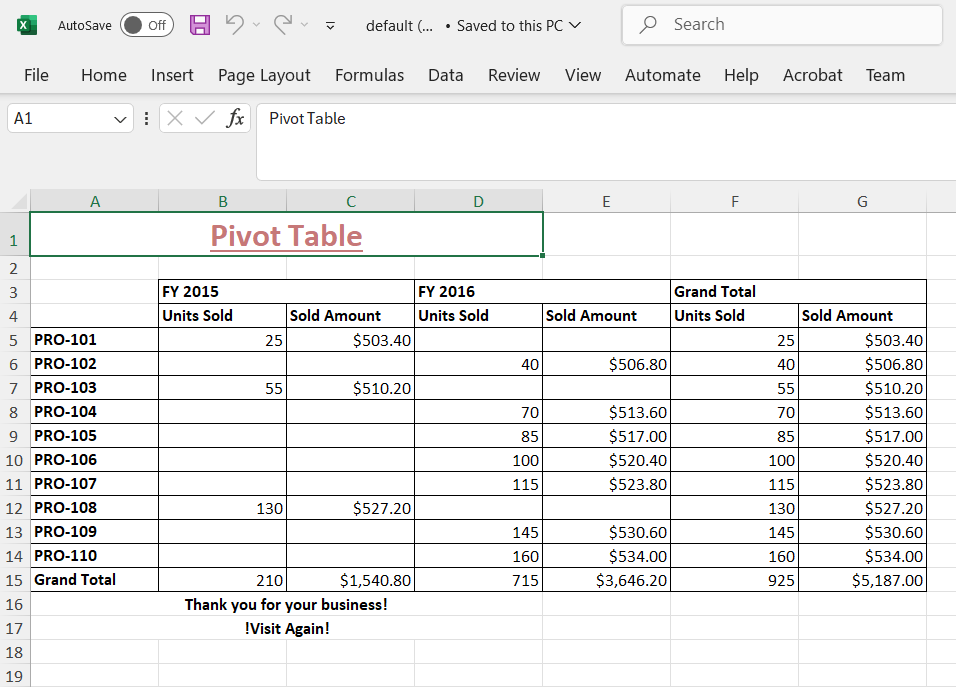
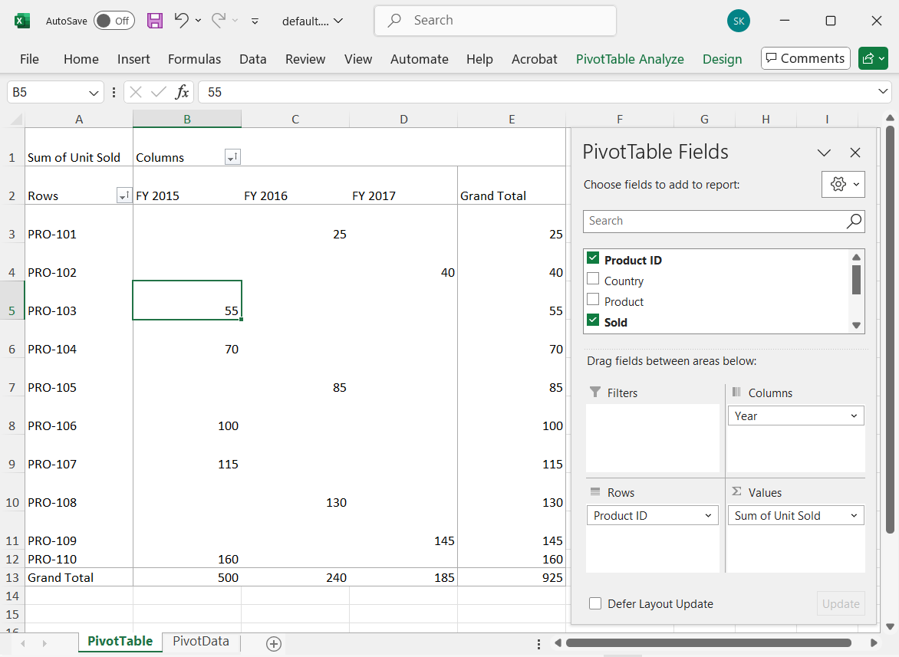

> In general, the Pivot Table is created using the built-in engine for given data source. This is an optional feature that allows you to create the Pivot Table with a server-side pivot engine and external data binding. And this option is applicable only for relational data source.

# Server side pivot engine in Vue Pivotview component

This section briefs the Syncfusion<sup style="font-size:70%">&reg;</sup> assembly [`Syncfusion.Pivot.Engine`](https://www.nuget.org/packages/Syncfusion.Pivot.Engine/), which is used in a server-side application to perform all Pivot calculations such as aggregation, filtering, sorting, grouping, and so on, and only the information to be displayed in the Pivot Table's viewport is passed to the client-side (browser) via web service (Web API) rather than the entire data source. It reduces network traffic and improves the rendering performance of the Pivot Table, especially when dealing with large amounts of data. It also works best with virtual scrolling enabled and supports all the Pivot Table's existing features.

## Quick steps to render the Pivot Table by using the server-side Pivot Engine

### Download and installing Server-side Pivot Engine

**1.** Download the ASP.NET Core-based stand-alone Pivot Table [`application`](https://github.com/SyncfusionExamples/server-side-pivot-engine-for-pivot-table) from the GitHub repository.

**2.** The **PivotController** (Server-side) application that is downloaded includes the following files.

* **PivotController.cs** file under **Controllers** folder – This helps to do data communication with Pivot Table.
* **DataSource.cs** file under **DataSource** folder – This file has model classes to define the structure of the data sources.
* The sample data source files **sales.csv** and **sales-analysis.json** under **DataSource** folder.

**3.** Open the **PivotController** application in Visual Studio where the Syncfusion<sup style="font-size:70%">&reg;</sup> library [`Syncfusion.Pivot.Engine`](https://www.nuget.org/packages/Syncfusion.Pivot.Engine/) will be downloaded automatically from the nuget.org site.



### Connecting Pivot Table to Server-side Pivot Engine

**1.** Run the **PivotController** (Server-side) application which will be hosted in IIS shortly.

**2.** Then in the Pivot Table sample, set the [`mode`](https://ej2.syncfusion.com/vue/documentation/api/pivotview/#datasourcesettings) property under [`dataSourceSettings`](https://ej2.syncfusion.com/vue/documentation/api/pivotview/#datasourcesettings) as **Server** and map the URL of the hosted Server-side application in [`URL`](https://ej2.syncfusion.com/vue/documentation/api/pivotview/iDataOptions/#url) property of `dataSourceSettings`.

```javascript
<script setup>

import { PivotViewComponent } from "@syncfusion/ej2-vue-pivotview";


export default {
  data () {
    return {
      dataSourceSettings: {
        url: 'https://localhost:44350/api/pivot/post',
        mode: 'Server',
      },
      height: 350
    }
  }
}
</script>
<style>
@import "@syncfusion/ej2-vue-pivotview/styles/material.css";
</style>

```

**3.** Frame and set the report based on the data source available in the **PivotController** application.

```javascript
<script setup>

import { PivotViewComponent } from "@syncfusion/ej2-vue-pivotview";


export default {
  data () {
    return {
      dataSourceSettings: {
        url: 'https://localhost:44350/api/pivot/post',
        mode: 'Server',
        rows: [{
            name: 'ProductID', caption: 'Product ID'
        }],
        formatSettings: [{
            name: 'Price', format: 'C'
        }],
        columns: [{
            name: 'Year', caption: 'Production Year'
        }],
        values: [
            { name: 'Sold', caption: 'Units Sold' },
            { name: 'Price', caption: 'Sold Amount' }
        ],
      },
      height: 350
    }
  }
}
</script>
<style>
@import "@syncfusion/ej2-vue-pivotview/styles/material.css";
</style>

```

**4.** Run the sample to get the following result.


## Available configurations in Server-side application

### Supportive Data Sources

The server-side Pivot Engine supports the following data sources,
* Collection
* JSON
* CSV
* DataTable
* Dynamic

#### Collection

The collection data sources such as List, IEnumerable, and so on are supported. This can be bound using the **GetData** controller method. Also, in the Pivot Table sample, set the [`type`](https://ej2.syncfusion.com/vue/documentation/api/pivotview/iFieldOptions/#type) property under [`dataSourceSettings`](https://ej2.syncfusion.com/vue/documentation/api/pivotview/#datasourcesettings) to **JSON**, which is also the default enumeration value.

In the server-side application **(PivotController)**, a collection type data source is framed in the **DataSource.cs** file as shown in the following.

```
public class PivotViewData
{
    public string ProductID { get; set; }
    public string Country { get; set; }
    public string Product { get; set; }
    public double Sold { get; set; }
    public double Price { get; set; }
    public string Year { get; set; }

    public List<PivotViewData> GetVirtualData()
    {
        List<PivotViewData> VirtualData = new List<PivotViewData>();

        for (int i = 1; i <= 10000; i++)
        {
            PivotViewData p = new PivotViewData
            {
                ProductID = "PRO-" + ((100 + i)%20),
                Year = (new string[] { "FY 2015", "FY 2016", "FY 2017", "FY 2018", "FY 2019" })[new Random().Next(5)],
                Country = (new string[] { "Canada", "France", "Australia", "Germany", "France" })[new Random().Next(5)],
                Product = (new string[] { "Car", "Van", "Bike", "Flight", "Bus" })[new Random().Next(5)],
                Price = (3.4 * i) + 500,
                Sold = (i * 15) + 10
            };
            VirtualData.Add(p);
        }
        return VirtualData;
    }
}

```

To bind the data source, set its model type **PivotViewData** to **TValue** of the **PivotEngine** class.

```
private PivotEngine<DataSource.PivotViewData> PivotEngine = new PivotEngine<DataSource.PivotViewData>();

```

Then call the data source in **GetData** method of **PivotController.cs** file.

```
public async Task<object> GetData(FetchData param)
{
    return await _cache.GetOrCreateAsync("dataSource" + param.Hash,
        async (cacheEntry) =>
        {
            cacheEntry.SetSize(1);
            cacheEntry.AbsoluteExpiration = DateTimeOffset.UtcNow.AddMinutes(60);

            // Here bind the collection type data source.
            return new DataSource.PivotViewData().GetVirtualData();

        });
}

```

Finally set the appropriate report to the Pivot Table sample based on the above data source.

```javascript

<script setup>

import { PivotViewComponent } from "@syncfusion/ej2-vue-pivotview";


export default {
  data () {
    return {
      dataSourceSettings: {
        url: 'https://localhost:44350/api/pivot/post',
        mode: 'Server',
        rows: [{
            name: 'ProductID', caption: 'Product ID'
        }],
        formatSettings: [{
            name: 'Price', format: 'C'
        }],
        columns: [{
            name: 'Year', caption: 'Production Year'
        }],
        values: [
            { name: 'Sold', caption: 'Units Sold' },
            { name: 'Price', caption: 'Sold Amount' }
        ],
      },
      height: 350
    }
  }
}
</script>
<style>
@import "@syncfusion/ej2-vue-pivotview/styles/material.css";
</style>

```


#### JSON

The JSON data from a local *.json file type can be connected to the Pivot Table. Here, the file can be read by the **StreamReader** option, which will give the result in the string format. The resultant string needs to be converted to collect data that can be bound to the Server-side pivot engine.

In the Server-side application, **sales-analysis.json** file is available under **DataSource** folder and its model type is defined in **DataSource.cs** file.

```
public class PivotJSONData
{
    public string Date { get; set; }
    public string Sector { get; set; }
    public string EnerType { get; set; }
    public string EneSource { get; set; }
    public int PowUnits { get; set; }
    public int ProCost { get; set; }

    public List<PivotJSONData> ReadJSONData(string url)
    {
        WebClient myWebClient = new WebClient();
        Stream myStream = myWebClient.OpenRead(url);
        StreamReader stream = new StreamReader(myStream);
        string result = stream.ReadToEnd();
        stream.Close();
        return Newtonsoft.Json.JsonConvert.DeserializeObject<List<PivotJSONData>>(result);
    }
}

```

To bind the data source, set its model type **PivotJSONData** to **TValue** of the **PivotEngine** class.

```
private PivotEngine<DataSource.PivotJSONData> PivotEngine = new PivotEngine<DataSource. PivotJSONData>();
```

Then call the data source in **GetData** method of **PivotController.cs** file.

```
public async Task<object> GetData(FetchData param)
{
    return await _cache.GetOrCreateAsync("dataSource" + param.Hash,
        async (cacheEntry) =>
        {
            cacheEntry.SetSize(1);
            cacheEntry.AbsoluteExpiration = DateTimeOffset.UtcNow.AddMinutes(60);

            // Here bind JSON type data source from the sales-analysis.json file.
            return new DataSource.PivotJSONData().ReadJSONData(_hostingEnvironment.ContentRootPath + "//DataSource//sales-analysis.json");
        });
}

```

Finally set the appropriate report to the Pivot Table sample based on the above data source.

```javascript
<script setup>

import { PivotViewComponent } from "@syncfusion/ej2-vue-pivotview";


export default {
  data () {
    return {
      dataSourceSettings: {
        url: 'https://localhost:44350/api/pivot/post',
        mode: 'Server',
        type: 'JSON',
        rows: [{
            name: 'EneSource', caption: 'Energy Source'
        }],
        formatSettings: [{
            name: 'ProCost', format: 'C'
        }],
        columns: [{
            name: 'EnerType', caption: 'Energy Type'
        }],
        values: [
            { name: 'PowUnits', caption: 'Units Sold' },
            { name: 'ProCost', caption: 'Sold Amount' }
        ],
      },
      height: 350
    }
  }
}
</script>
<style>
@import "@syncfusion/ej2-vue-pivotview/styles/material.css";
</style>

```


JSON data from any remote server, like a local JSON file, can also be supported. It accepts both directly downloadable files (*.json) and web service URLs. To bind this, the URL of the *.json file of a remote server has to be mapped under the **GetData** method. The rest of the configurations are the same as described above.

In the server-side application, the CDN link is used to connect the same **sales-analysis.json** file which is already hosted in the Syncfusion<sup style="font-size:70%">&reg;</sup> server.

```
public async Task<object> GetData(FetchData param)
{
    return await _cache.GetOrCreateAsync("dataSource" + param.Hash,
    async (cacheEntry) =>
    {
        cacheEntry.SetSize(1);
        cacheEntry.AbsoluteExpiration = DateTimeOffset.UtcNow.AddMinutes(60);

        // Here bind JSON type data source from remote server.
        return new DataSource.PivotJSONData().ReadJSONData("http://cdn.syncfusion.com/data/sales-analysis.json");
    });
}

```

#### CSV

The CSV data from a local *.csv file type can be connected to the Pivot Table. Here, the file can be read by the **StreamReader** option, which will give the result in the string format. The resultant string needs to be converted to collect data that can be bound to the server-side pivot engine. Also, in the Pivot Table sample, set the [`type`](https://ej2.syncfusion.com/vue/documentation/api/pivotview/iFieldOptions/#type) property under [`dataSourceSettings`](https://ej2.syncfusion.com/vue/documentation/api/pivotview/#datasourcesettings) as **CSV**.

In the server application, the **sales.csv** file is available under the **DataSource** folder, and its model type is defined in the **DataSource.cs** file.

```
public class PivotCSVData
{
    public string Region { get; set; }
    public string Country { get; set; }
    public string ItemType { get; set; }
    public string SalesChannel { get; set; }
    public string OrderPriority { get; set; }
    public string OrderDate { get; set; }
    public int OrderID { get; set; }
    public string ShipDate { get; set; }
    public int UnitsSold { get; set; }
    public double UnitPrice { get; set; }
    public double UnitCost { get; set; }
    public double TotalRevenue { get; set; }
    public double TotalCost { get; set; }
    public double TotalProfit { get; set; }


    public List<string[]> ReadCSVData(string url)
    {
        List<string[]> data = new List<string[]>();
        using (StreamReader reader = new StreamReader(new WebClient().OpenRead(url)))
        {
            string line;
            while ((line = reader.ReadLine()) != null)
            {
                line = line.Trim();

                if (!string.IsNullOrWhiteSpace(line))
                {
                    data.Add(line.Split(','));
                }
            }
            return data;
        }
    }
}

```

To bind the data source, set its model type **PivotCSVData** to **TValue** of the **PivotEngine** class.

```
private PivotEngine<DataSource.PivotCSVData> PivotEngine = new PivotEngine<DataSource. PivotCSVData>();
```

Then call the data source in **GetData** method of **PivotController.cs** file.

```
public async Task<object> GetData(FetchData param)
{
    return await _cache.GetOrCreateAsync("dataSource" + param.Hash,
        async (cacheEntry) =>
        {
            cacheEntry.SetSize(1);
            cacheEntry.AbsoluteExpiration = DateTimeOffset.UtcNow.AddMinutes(60);

            // Here bind CSV type data source from sales.csv file.
            return new DataSource.PivotCSVData().ReadCSVData(_hostingEnvironment.ContentRootPath + "//DataSource//sales.csv");
        });
}

```

Finally set the appropriate report to the Pivot Table sample based on the above data source.

```javascript

<script setup>

import { PivotViewComponent } from "@syncfusion/ej2-vue-pivotview";


export default {
  data () {
    return {
      dataSourceSettings: {
        url: 'https://localhost:44350/api/pivot/post',
        mode: 'Server',
        type: 'CSV',
        rows: [{
            name: 'ItemType', caption: 'Item Type'
        }],
        formatSettings: [{
            name: 'UnitPrice', format: 'C'
        }],
        columns: [{
            name: 'Region'
        }],
        values: [
            { name: 'UnitsSold', caption: 'Units Sold' },
            { name: 'UnitPrice', caption: 'Sold Amount' }
        ],
      },
      height: 350
    }
  }
}
</script>
<style>
@import "@syncfusion/ej2-vue-pivotview/styles/material.css";
</style>

```


CSV data from any remote server, like a local CSV file, can also be supported. It accepts both directly downloadable files (*.csv) and web service URLs. To bind this, the URL of the *.csv file of a remote server has to be mapped under **GetData** method. The rest of the configurations are the same as described above.

In the server application, the CDN link is used to connect the same **sales.csv** file which is already hosted in the Syncfusion<sup style="font-size:70%">&reg;</sup> server.

```
public async Task<object> GetData(FetchData param)
{
    return await _cache.GetOrCreateAsync("dataSource" + param.Hash,
        async (cacheEntry) =>
        {
            cacheEntry.SetSize(1);
            cacheEntry.AbsoluteExpiration = DateTimeOffset.UtcNow.AddMinutes(60);

            // Here bind CSV type data source from remote server.
            return new DataSource.PivotCSVData().ReadCSVData("http://cdn.syncfusion.com/data/sales-analysis.csv");
        });
}

```

#### DataTable

In the server-side application, there is a manually created DataTable **BusinessObjectsDataView** by mapping the model type **PivotViewData** in **DataSource.cs** file.

```
public class BusinessObjectsDataView
{
    public DataTable GetDataTable()
    {
        DataTable dt = new DataTable("BusinessObjectsDataTable");
        PropertyDescriptorCollection pdc = TypeDescriptor.GetProperties(typeof(PivotViewData));
        foreach (PropertyDescriptor pd in pdc)
        {
            dt.Columns.Add(new DataColumn(pd.Name, pd.PropertyType));
        }
        List<PivotViewData> list = new PivotViewData().GetVirtualData();
        foreach (PivotViewData bo in list)
        {
            DataRow dr = dt.NewRow();
            foreach (PropertyDescriptor pd in pdc)
            {
                dr[pd.Name] = pd.GetValue(bo);
            }
            dt.Rows.Add(dr);
        }
        return dt;
    }
}

```

To bind the data source, set its model type **PivotViewData** to **TValue** of the **PivotEngine** class.

```
private PivotEngine<DataSource.PivotViewData> PivotEngine = new PivotEngine<DataSource.PivotViewData>();

```

Then call the data source in **GetData** method of **PivotController.cs** file.

```
public async Task<object> GetData(FetchData param)
{
    return await _cache.GetOrCreateAsync("dataSource" + param.Hash,
        async (cacheEntry) =>
        {
            cacheEntry.SetSize(1);
            cacheEntry.AbsoluteExpiration = DateTimeOffset.UtcNow.AddMinutes(60);

            // Here bind the DataTable.
            return new DataSource.BusinessObjectsDataView().GetDataTable();
        });
}

```

Finally set the appropriate report to the Pivot Table sample based on the above data source.

```javascript
<script setup>

import { PivotViewComponent } from "@syncfusion/ej2-vue-pivotview";


export default {
  data () {
    return {
      dataSourceSettings: {
        url: 'https://localhost:44350/api/pivot/post',
        mode: 'Server',
        rows: [{
            name: 'ProductID', caption: 'Product ID'
        }],
        formatSettings: [{
            name: 'Price', format: 'C'
        }],
        columns: [{
            name: 'Year', caption: 'Production Year'
        }],
        values: [
            { name: 'Sold', caption: 'Units Sold' },
            { name: 'Price', caption: 'Sold Amount' }
        ],
      },
      height: 350
    }
  }
}
</script>
<style>
@import "@syncfusion/ej2-vue-pivotview/styles/material.css";
</style>

```


#### Dynamic

The model type has to be defined in the aforementioned data sources. However, there is no need to define a model type for the following data sources, which are also supported by the server-side pivot engine.

##### ExpandoObject

In the server-side application, an **ExpandoObject** type data source is available under the class **PivotExpandoData** in **DataSource.cs** file.

```
public class PivotExpandoData
{
    public List<ExpandoObject> Orders { get; set; } = new List<ExpandoObject>();
    public List<ExpandoObject> GetExpandoData()
    {
        Orders = Enumerable.Range(1, 75).Select((x) =>
        {
            dynamic d = new ExpandoObject();
            d.OrderID = 1000 + (x % 100);
            d.CustomerID = (new string[] { "ALFKI", "ANANTR", "ANTON", "BLONP", "BOLID" })[new Random().Next(5)];
            d.Freight = (new double[] { 2, 1, 4, 5, 3 })[new Random().Next(5)] * x;
            d.OrderDate = (new DateTime[] { new DateTime(2010, 11, 5), new DateTime(2018, 10, 3), new DateTime(1995, 9, 9), new DateTime(2012, 8, 2), new DateTime(2015, 4, 11) })[new Random().Next(5)];
            d.ShipCountry = (new string[] { "USA", "UK" })[new Random().Next(2)];
            d.Verified = (new bool[] { true, false })[new Random().Next(2)];

            return d;
        }).Cast<ExpandoObject>().ToList<ExpandoObject>();
        return Orders;
    }
}

```

To bind the data source, set its model type as **ExpandoObject** to **TValue** of the **PivotEngine** class.

```
private PivotEngine<ExpandoObject> PivotEngine = new PivotEngine<ExpandoObject>();

```

Then call the data source in **GetData** method of **PivotController.cs** file.

```
public async Task<object> GetData(FetchData param)
{
    return await _cache.GetOrCreateAsync("dataSource" + param.Hash,
        async (cacheEntry) =>
        {
            cacheEntry.SetSize(1);
            cacheEntry.AbsoluteExpiration = DateTimeOffset.UtcNow.AddMinutes(60);

            // Here returns ExpandoObject type data source.
            return new DataSource.PivotExpandoData().GetExpandoData();
        });
}

```

Finally set the appropriate report to the Pivot Table sample based on the above data source.

```javascript
<script setup>

import { PivotViewComponent } from "@syncfusion/ej2-vue-pivotview";


export default {
  data () {
    return {
      dataSourceSettings: {
        url: 'https://localhost:44350/api/pivot/post',
        mode: 'Server',
        rows: [{
            name: 'CustomerID', caption: 'Customer ID'
        }],
        columns: [{
            name: 'ShipCountry', caption: 'Ship Country'
        }],
        values: [
            { name: 'Freight', caption: 'Units Sold' }
        ],
      },
      height: 350
    }
  }
}
</script>
<style>
@import "@syncfusion/ej2-vue-pivotview/styles/material.css";
</style>

```


##### Dynamic Objects

In the server-side application, a data source is framed by dynamic objects which is available under the class **PivotDynamicData** in the **DataSource.cs** file.

```
public class PivotDynamicData
{
    public List<DynamicDictionary> Orders = new List<DynamicDictionary>() { };
    public List<DynamicDictionary> GetDynamicData()
    {
        Orders = Enumerable.Range(1, 100).Select((x) =>
        {
            dynamic d = new DynamicDictionary();
            d.OrderID = 100 + x;
            d.CustomerID = (new string[] { "ALFKI", "ANANTR", "ANTON", "BLONP", "BOLID" })[new Random().Next(5)];
            d.Freight = (new double[] { 2, 1, 4, 5, 3 })[new Random().Next(5)] * x;
            d.OrderDate = (new DateTime[] { new DateTime(2010, 11, 5), new DateTime(2018, 10, 3), new DateTime(1995, 9, 9), new DateTime(2012, 8, 2), new DateTime(2015, 4, 11) })[new Random().Next(5)];
            d.ShipCountry = (new string[] { "USA", "UK" })[new Random().Next(2)];
            d.Verified = (new bool[] { true, false })[new Random().Next(2)];
            return d;
        }).Cast<DynamicDictionary>().ToList<DynamicDictionary>();
        return Orders;
    }

    public class DynamicDictionary : System.Dynamic.DynamicObject
    {
        Dictionary<string, object> dictionary = new Dictionary<string, object>();
        public override bool TryGetMember(GetMemberBinder binder, out object result)
        {
            string name = binder.Name;
            return dictionary.TryGetValue(name, out result);
        }
        public override bool TrySetMember(SetMemberBinder binder, object value)
        {
            dictionary[binder.Name] = value;
            return true;
        }
        //The "GetDynamicMemberNames" method of the "DynamicDictionary" class must be overridden and return the property names to perform data operation and editing while using dynamic objects.
        public override System.Collections.Generic.IEnumerable<string> GetDynamicMemberNames()
        {
            return this.dictionary?.Keys;
        }
    }
}

```

To bind the data source, set its class **PivotDynamicData** to **TValue** of the **PivotEngine** class.

```
private PivotEngine<DataSource.PivotDynamicData> PivotEngine = new PivotEngine<DataSource.PivotDynamicData>();

```

Then call the data source in **GetData** method of **PivotController.cs** file.

```
public async Task<object> GetData(FetchData param)
{
    return await _cache.GetOrCreateAsync("dataSource" + param.Hash,
        async (cacheEntry) =>
        {
            cacheEntry.SetSize(1);
            cacheEntry.AbsoluteExpiration = DateTimeOffset.UtcNow.AddMinutes(60);

            // Here bind data source with dynamic objects.
            return new DataSource.PivotDynamicData().GetDynamicData();
        });
}

```

Finally set the appropriate report to the Pivot Table sample based on the above data source.

```javascript
<script setup>

import { PivotViewComponent } from "@syncfusion/ej2-vue-pivotview";


export default {
  data () {
    return {
      dataSourceSettings: {
        url: 'https://localhost:44350/api/pivot/post',
        mode: 'Server',
        rows: [{
            name: 'CustomerID', caption: 'Customer ID'
        }],
        columns: [{
            name: 'ShipCountry', caption: 'Ship Country'
        }],
        values: [
            { name: 'Freight', caption: 'Units Sold' }
        ],
      },
      height: 350
    }
  }
}
</script>
<style>
@import "@syncfusion/ej2-vue-pivotview/styles/material.css";
</style>

```


### Controller Configuration

#### Memory Cache

In the server-side application, the [`Memory Cache`](https://docs.microsoft.com/en-us/dotnet/api/system.runtime.caching.memorycache?view=dotnet-plat-ext-5.0) option is used to store the data source and engine properties in RAM, which will be used for UI operations. To improve performance, this limits the execution of all initial rendering code to regenerate the aggregated values during each UI operation. The codes below show how we use the memory cache option in the **GetEngine** method to store engine properties.

```
public async Task<EngineProperties> GetEngine(FetchData param)
{
    isRendered = false;
    // Engine properties are stored in memory cache with GUID "parem.Hash".
    return await _cache.GetOrCreateAsync("engine" + param.Hash,
        async (cacheEntry) =>
        {
            isRendered = true;
            cacheEntry.SetSize(1);
            // Memory cache expiration time can be set here.
            cacheEntry.AbsoluteExpiration = DateTimeOffset.UtcNow.AddMinutes(60);
            PivotEngine.Data = await GetData(param);
            return await PivotEngine.GetEngine(param);
        });
}

```

The engine properties are stored in RAM as a cache with a unique ID (GUID) that is transferred from the client-side source code. The GUID is generated at random and will be changed if the page containing the Pivot Table is refreshed or opened in a new tab/window. As a result, each GUID's memory cache contains unique information, and the component operates independently.

Meanwhile, the memory cache is set to expire after 60 minutes from RAM to free its memory. If the component is still running, the data will be generated and stored for another 60 minutes.

#### Methods and its needs

* **Post:** Allows to get the information from the client-side source and calls appropriate controller methods.
* **GetEngine:** Allows to store the engine properties in RAM as a cache which fires on initial rendering or when the memory cache is expired.
* **GetData:** Allows to store data source in RAM as a cache which fires on initial rendering or when the memory cache is expired.
* **GetMembers:** Allows to get the members of a field. This fires when the member editor is opened to do a filtering operation.
* **GetRawData:** Allows to get raw data of an aggregated value cell. This fires when the drill-through or editing dialog is opened.
* **GetPivotValues:** Allows to update the stored engine properties in-memory cache and returns the aggregated values to browser to render the Pivot Table. Here, the return value can be modified. The Pivot Table will be rendered browser-based on this.

## Excel Export

The server-side engine seamlessly supports Excel export functionality, enabling users to efficiently generate and download pivot table reports in Excel format directly from the server. To enable Excel export in the pivot table, set the [`allowExcelExport`](https://ej2.syncfusion.com/vue/documentation/api/pivotview/#allowexcelexport) as **true**. Once the API is set, the user needs to call the [`excelExport`](https://ej2.syncfusion.com/vue/documentation/api/pivotview/#excelexport) method to export the pivot table to Excel by clicking an external button.

N> The pivot table component can be exported to Excel format using options available in the toolbar. For more details [refer](./tool-bar) here.

```javascript
<template>
  <div class="control-section">
    <div style="margin-bottom: 5px">
      <ejs-button id="export-btn" v-on:click.native="btnClick" isPrimary="true">Export</ejs-button>
    </div>
    <div>
      <div class="content-wrapper">
        <ejs-pivotview
          id="pivotview"
          ref="pivotview"
          :dataSourceSettings="dataSourceSettings"
          :gridSettings="gridSettings"
          :width="width"
          :height="height"
          :allowExcelExport="allowExcelExport"
        >
        </ejs-pivotview>
      </div>
    </div>
  </div>
</template>
<script>
/* eslint-disable */
import Vue from 'vue';
import {
  PivotViewPlugin,
  GroupingBar,
  FieldList,
  IDataSet,
  VirtualScroll,
  CalculatedField,
  Toolbar,
  PDFExport,
  ExcelExport,
  ConditionalFormatting,
  NumberFormatting,
} from '@syncfusion/ej2-vue-pivotview';
import { ButtonPlugin } from '@syncfusion/ej2-vue-buttons';
import { extend, enableRipple } from '@syncfusion/ej2-base';

Vue.use(PivotViewPlugin);
Vue.use(ButtonPlugin);

export default {
  data() {
    return {
      dataSourceSettings: {
        url: 'https://localhost:44350/api/pivot/post',
        mode: 'Server',
        rows: [
          {
            name: 'ProductID',
            caption: 'Product ID',
          },
        ],
        formatSettings: [
          {
            name: 'Price',
            format: 'C',
          },
        ],
        columns: [
          {
            name: 'Year',
            caption: 'Production Year',
          },
        ],
        values: [
          { name: 'Sold', caption: 'Units Sold' },
          { name: 'Price', caption: 'Sold Amount' },
        ],
      },
      width: '100%',
      height: 450,
      gridSettings: { columnWidth: 140 },
      allowExcelExport: true,
    };
  },
  provide: {
    pivotview: [FieldList],
  },
  methods: {
    btnClick() {
      const pivotGridObj = this.$refs.pivotview.ej2Instances;
      pivotGridObj.excelExport();
    },
  },
};
</script>

<style>
@import '../node_modules/@syncfusion/ej2-base/styles/material.css';
@import '../node_modules/@syncfusion/ej2-buttons/styles/material.css';
@import '../node_modules/@syncfusion/ej2-grids/styles/material.css';
@import '../node_modules/@syncfusion/ej2-pivotview/styles/material.css';
</style>
```

To enable export functionality in a server-side controller, initialize the **ExcelExport** class to handle export file generation.

```csharp
 private ExcelExport excelExport = new ExcelExport();
```

Then, based on the **Action** parameter (**onExcelExport** or **onCsvExport**), invoke the **ExportToExcel** method in the **Post** method of the **PivotController.cs** file.

```csharp
        [Route("/api/pivot/post")]
        [HttpPost]
        public async Task<object> Post([FromBody] object args)
        {
            FetchData param = JsonConvert.DeserializeObject<FetchData>(args.ToString());
            if (param.Action == "fetchFieldMembers")
            {
                return await GetMembers(param);
            }
            else if (param.Action == "fetchRawData")
            {
                return await GetRawData(param);
            }
            else if (param.Action == "onExcelExport" || param.Action == "onCsvExport" ||
                  param.Action == "onPivotExcelExport" || param.Action == "onPivotCsvExport")
            {
                EngineProperties engine = await GetEngine(param);
                if (param.InternalProperties.EnableVirtualization && param.ExportAllPages)
                {
                    engine = await PivotEngine.PerformAction(engine, param);
                }
                if (param.Action == "onExcelExport")
                {
                    return excelExport.ExportToExcel("Excel", engine, null, param.ExcelExportProperties);
                }
                else
                {
                    return excelExport.ExportToExcel("CSV", engine, null, param.ExcelExportProperties);
                }
            }
            else
            {
                return await GetPivotValues(param);
            }
        }

```


### Add header and footer while exporting

The Excel export provides an option to include header and footer content for the excel document before exporting. In-order to add header and footer, define [header](https://ej2.syncfusion.com/vue/documentation/api/grid/excelExportProperties/#header) and [footer](https://ej2.syncfusion.com/vue/documentation/api/grid/excelExportProperties/#footer) properties in [ExcelExportProperties](https://ej2.syncfusion.com/vue/documentation/api/grid/excelExportProperties/) and pass it as a parameter to the [excelExport](https://ej2.syncfusion.com/vue/documentation/api/pivotview/#excelexport) method.

``` javascript
<template>
  <div class="control-section">
    <div style="margin-bottom: 5px">
      <ejs-button id="export-btn" v-on:click.native="btnClick" isPrimary="true">Export</ejs-button>
    </div>
    <div>
      <div class="content-wrapper">
        <ejs-pivotview
          id="pivotview"
          ref="pivotview"
          :dataSourceSettings="dataSourceSettings"
          :gridSettings="gridSettings"
          :width="width"
          :height="height"
          :allowExcelExport="allowExcelExport"
        >
        </ejs-pivotview>
      </div>
    </div>
  </div>
</template>
<script>
/* eslint-disable */
import Vue from 'vue';
import {
  PivotViewPlugin,
  GroupingBar,
  FieldList,
  IDataSet,
  VirtualScroll,
  CalculatedField,
  Toolbar,
  PDFExport,
  ExcelExport,
  ConditionalFormatting,
  NumberFormatting,
} from '@syncfusion/ej2-vue-pivotview';
import { ButtonPlugin } from '@syncfusion/ej2-vue-buttons';
import { extend, enableRipple } from '@syncfusion/ej2-base';

Vue.use(PivotViewPlugin);
Vue.use(ButtonPlugin);

export default {
  data() {
    return {
      dataSourceSettings: {
        url: 'https://localhost:44350/api/pivot/post',
        mode: 'Server',
        rows: [
          {
            name: 'ProductID',
            caption: 'Product ID',
          },
        ],
        formatSettings: [
          {
            name: 'Price',
            format: 'C',
          },
        ],
        columns: [
          {
            name: 'Year',
            caption: 'Production Year',
          },
        ],
        values: [
          { name: 'Sold', caption: 'Units Sold' },
          { name: 'Price', caption: 'Sold Amount' },
        ],
      },
      width: '100%',
      height: 450,
      gridSettings: { columnWidth: 140 },
      allowExcelExport: true,
    };
  },
  provide: {
    pivotview: [FieldList],
  },
  methods: {
    btnClick() {
      const pivotGridObj = this.$refs.pivotview.ej2Instances;
      let excelExportProperties = {
        header: {
          headerRows: 2,
          rows: [
            { cells: [{ colSpan: 4, value: "Pivot Table", style: { fontColor: '#C67878', fontSize: 20, hAlign: 'Center', bold: true, underline: true } }] }
          ]
        },
        footer: {
          footerRows: 4,
          rows: [
            { cells: [{ colSpan: 4, value: "Thank you for your business!", style: { hAlign: 'Center', bold: true } }] },
            { cells: [{ colSpan: 4, value: "!Visit Again!", style: { hAlign: 'Center', bold: true } }] }
          ]
        }
      };
      pivotGridObj.excelExport(excelExportProperties);
    },
  },
};
</script>

<style>
@import '../node_modules/@syncfusion/ej2-base/styles/material.css';
@import '../node_modules/@syncfusion/ej2-buttons/styles/material.css';
@import '../node_modules/@syncfusion/ej2-grids/styles/material.css';
@import '../node_modules/@syncfusion/ej2-pivotview/styles/material.css';
</style>

```


## CSV Export

The Excel export allows pivot table data to be exported in **CSV** file format as well. To enable CSV export in the pivot table, set the [`allowExcelExport`](https://ej2.syncfusion.com/vue/documentation/api/pivotview/#allowexcelexport) as **true**. Once the API is set, the user needs to call the [`excelExport`](https://ej2.syncfusion.com/vue/documentation/api/pivotview/#excelexport) method to export the pivot table to CSV by clicking an external button.

N> The pivot table component can be exported to CSV format using options available in the toolbar. For more details [refer](./tool-bar) here.

```javascript
<template>
  <div class="control-section">
    <div style="margin-bottom: 5px">
      <ejs-button id="export-btn" v-on:click.native="btnClick" isPrimary="true">Export</ejs-button>
    </div>
    <div>
      <div class="content-wrapper">
        <ejs-pivotview
          id="pivotview"
          ref="pivotview"
          :dataSourceSettings="dataSourceSettings"
          :gridSettings="gridSettings"
          :width="width"
          :height="height"
          :allowExcelExport="allowExcelExport"
        >
        </ejs-pivotview>
      </div>
    </div>
  </div>
</template>
<script>
/* eslint-disable */
import Vue from 'vue';
import {
  PivotViewPlugin,
  GroupingBar,
  FieldList,
  IDataSet,
  VirtualScroll,
  CalculatedField,
  Toolbar,
  PDFExport,
  ExcelExport,
  ConditionalFormatting,
  NumberFormatting,
} from '@syncfusion/ej2-vue-pivotview';
import { ButtonPlugin } from '@syncfusion/ej2-vue-buttons';
import { extend, enableRipple } from '@syncfusion/ej2-base';

Vue.use(PivotViewPlugin);
Vue.use(ButtonPlugin);

export default {
  data() {
    return {
      dataSourceSettings: {
        url: 'https://localhost:44350/api/pivot/post',
        mode: 'Server',
        rows: [
          {
            name: 'ProductID',
            caption: 'Product ID',
          },
        ],
        formatSettings: [
          {
            name: 'Price',
            format: 'C',
          },
        ],
        columns: [
          {
            name: 'Year',
            caption: 'Production Year',
          },
        ],
        values: [
          { name: 'Sold', caption: 'Units Sold' },
          { name: 'Price', caption: 'Sold Amount' },
        ],
      },
      width: '100%',
      height: 450,
      gridSettings: { columnWidth: 140 },
      allowExcelExport: true,
    };
  },
  provide: {
    pivotview: [FieldList],
  },
  methods: {
    btnClick() {
      const pivotGridObj = this.$refs.pivotview.ej2Instances;
      pivotGridObj.csvExport();
    },
  },
};
</script>
<style>
@import '../node_modules/@syncfusion/ej2-base/styles/material.css';
@import '../node_modules/@syncfusion/ej2-buttons/styles/material.css';
@import '../node_modules/@syncfusion/ej2-grids/styles/material.css';
@import '../node_modules/@syncfusion/ej2-pivotview/styles/material.css';
</style>
```

To enable export functionality in a server-side controller, initialize the **ExcelExport** class to handle export file generation.

```csharp
 private ExcelExport excelExport = new ExcelExport();
```

Then, based on the **Action** parameter (**onExcelExport** or **onCsvExport**), invoke the **ExportToExcel** method in the **Post** method of the **PivotController.cs** file.

```csharp
        [Route("/api/pivot/post")]
        [HttpPost]
        public async Task<object> Post([FromBody] object args)
        {
            FetchData param = JsonConvert.DeserializeObject<FetchData>(args.ToString());
            if (param.Action == "fetchFieldMembers")
            {
                return await GetMembers(param);
            }
            else if (param.Action == "fetchRawData")
            {
                return await GetRawData(param);
            }
            else if (param.Action == "onExcelExport" || param.Action == "onCsvExport" ||
                  param.Action == "onPivotExcelExport" || param.Action == "onPivotCsvExport")
            {
                EngineProperties engine = await GetEngine(param);
                if (param.InternalProperties.EnableVirtualization && param.ExportAllPages)
                {
                    engine = await PivotEngine.PerformAction(engine, param);
                }
                if (param.Action == "onExcelExport")
                {
                    return excelExport.ExportToExcel("Excel", engine, null, param.ExcelExportProperties);
                }
                else
                {
                    return excelExport.ExportToExcel("CSV", engine, null, param.ExcelExportProperties);
                }
            }
            else
            {
                return await GetPivotValues(param);
            }
        }

```


## Export as Pivot

You can export a Syncfusion PivotTable to an Excel file while preserving its native pivot structure using the server-side engine. The exported Excel document contains a fully interactive PivotTable, allowing users to dynamically modify configurations such as filtering, sorting, grouping, and aggregation directly in Microsoft Excel.

To enable native Excel pivot export in the PivotTable, the user must call the `exportAsPivot` method to export the PivotTable to Excel by clicking an external button, specifying the export type (**Excel** or **CSV**) as a parameter.

```javascript
<template>
  <div class="control-section">
    <div style="margin-bottom: 5px">
      <ejs-button id="export-btn" v-on:click.native="btnClick" isPrimary="true">Export</ejs-button>
    </div>
    <div>
      <div class="content-wrapper">
        <ejs-pivotview
          id="pivotview"
          ref="pivotview"
          :dataSourceSettings="dataSourceSettings"
          :gridSettings="gridSettings"
          :width="width"
          :height="height"
          :allowExcelExport="allowExcelExport"
        >
        </ejs-pivotview>
      </div>
    </div>
  </div>
</template>
<script>
/* eslint-disable */
import Vue from 'vue';
import {
  PivotViewPlugin,
  GroupingBar,
  FieldList,
  IDataSet,
  VirtualScroll,
  CalculatedField,
  Toolbar,
  PDFExport,
  ExcelExport,
  ConditionalFormatting,
  NumberFormatting,
} from '@syncfusion/ej2-vue-pivotview';
import { ButtonPlugin } from '@syncfusion/ej2-vue-buttons';
import { extend, enableRipple } from '@syncfusion/ej2-base';

Vue.use(PivotViewPlugin);
Vue.use(ButtonPlugin);

export default {
  data() {
    return {
      dataSourceSettings: {
        url: 'https://localhost:44350/api/pivot/post',
        mode: 'Server',
        rows: [
          {
            name: 'ProductID',
            caption: 'Product ID',
          },
        ],
        formatSettings: [
          {
            name: 'Price',
            format: 'C',
          },
        ],
        columns: [
          {
            name: 'Year',
            caption: 'Production Year',
          },
        ],
        values: [
          { name: 'Sold', caption: 'Units Sold' },
        ],
      },
      width: '100%',
      height: 450,
      gridSettings: { columnWidth: 140 },
      allowExcelExport: true,
    };
  },
  provide: {
    pivotview: [FieldList, ExcelExport],
  },
  methods: {
    btnClick() {
      const pivotGridObj = this.$refs.pivotview.ej2Instances;
      pivotGridObj.exportAsPivot();
    },
  },
};
</script>

<style>
@import '../node_modules/@syncfusion/ej2-base/styles/material.css';
@import '../node_modules/@syncfusion/ej2-buttons/styles/material.css';
@import '../node_modules/@syncfusion/ej2-grids/styles/material.css';
@import '../node_modules/@syncfusion/ej2-pivotview/styles/material.css';
</style>
```

To enable native Excel pivot export functionality in a server-side controller, initialize the **PivotExportEngine** class to handle export file generation.

```csharp
    private PivotExportEngine<PivotData> pivotExport = new PivotExportEngine<PivotData>();
```

Then, based on the **Action** parameter (**onPivotExcelExport** or **onPivotCsvExport**), invoke the **ExportAsPivot** method in the **Post** method of the **PivotController.cs** file.

```csharp
        [Route("/api/pivot/post")]
        [HttpPost]
        public async Task<object> Post([FromBody] object args)
        {
            FetchData param = JsonConvert.DeserializeObject<FetchData>(args.ToString());
            if (param.Action == "fetchFieldMembers")
            {
                return await GetMembers(param);
            }
            else if (param.Action == "fetchRawData")
            {
                return await GetRawData(param);
            }
            else if (param.Action == "onExcelExport" || param.Action == "onCsvExport" ||
                    param.Action == "onPivotExcelExport" || param.Action == "onPivotCsvExport")
            {
                EngineProperties engine = await GetEngine(param);
                if (param.InternalProperties.EnableVirtualization && param.ExportAllPages)
                {
                    engine = await PivotEngine.PerformAction(engine, param);
                }
                if (param.Action == "onExcelExport")
                {
                    return excelExport.ExportToExcel("Excel", engine, null, param.ExcelExportProperties);
                }
                else if (param.Action == "onPivotExcelExport" || param.Action == "onPivotCsvExport")
                {
                    return pivotExport.ExportAsPivot(param.Action == "onPivotExcelExport" ? ExportType.Excel : ExportType.CSV, engine, param);
                }
                else
                {
                    return excelExport.ExportToExcel("CSV", engine, null, param.ExcelExportProperties);
                }
            }
            else
            {
                return await GetPivotValues(param);
            }
        }
```


