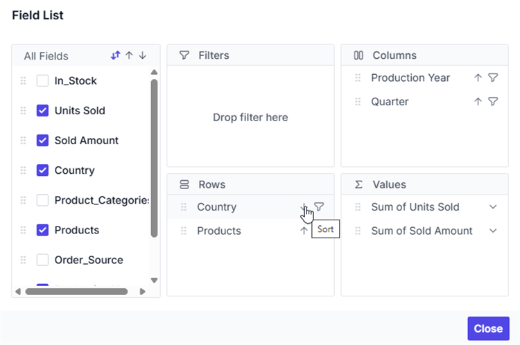
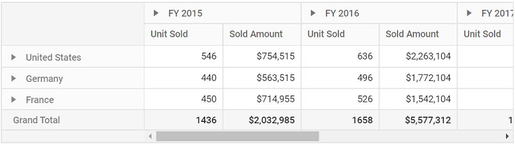

# Sorting in Vue Pivot Table Component

To have a quick glance on how to sort data in the Vue Pivot Table, watch this video:



## Member Sorting

The Member Sorting functionality enables you to arrange field members in the rows and columns of a pivot table in either **ascending** or **descending** order. By default, field members are sorted in ascending order.

### Enabling Member Sorting

To enable member sorting, set the [`enableSorting`](https://ej2.syncfusion.com/vue/documentation/api/pivotview/iDataOptions#enablesorting) property in [`dataSourceSettings`](https://ej2.syncfusion.com/vue/documentation/api/pivotview/index-default#datasourcesettings) to **true**. Once enabled, you can click the sort icon next to each field in the row or column axis within the **Field List** or **Grouping Bar** UI to reorder members in ascending or descending order.

> By default the [`enableSorting`](https://ej2.syncfusion.com/vue/documentation/api/pivotview/iDataOptions#enablesorting) property in [`dataSourceSettings`](https://ej2.syncfusion.com/vue/documentation/api/pivotview/index-default#datasourcesettings) set as **true**. If we set it as **false**, then the field members arrange in pivot table as its data source order. And, the sort icons in grouping bar and field list buttons will be removed.

#### Visual Reference

- **Field List Sort Icon**:  
  

- **Grouping Bar Sort Icon**:  
  

- **Sorted Pivot Table**:  
  

### Configuring Member Sorting Code Behind

You can also configure member sorting during initial rendering using the [`sortSettings`](https://ej2.syncfusion.com/vue/documentation/api/pivotview/iSort) property in code behind. The required settings are:

* [`name`](https://ej2.syncfusion.com/vue/documentation/api/pivotview/iSort#name): Specifies the name of the field to sort.
* [`order`](https://ej2.syncfusion.com/vue/documentation/api/pivotview/iSort#order): Defines the sort direction, either **Ascending** or **Descending**.

> By default the [`order`](https://ej2.syncfusion.com/vue/documentation/api/pivotview/iSort#order) property in the [`sortSettings`](https://ej2.syncfusion.com/vue/documentation/api/pivotview/iSort) set as **Ascending**. Meanwhile, we can arrange the field members as its order in data source by setting it as **None** where the sort icons in grouping bar and field list buttons for the corresponding field will be removed.

The following example demonstrates how to configure the Pivot Table to enable member sorting and set the "Year" field to sort in descending order:









        


### Alphanumeric Sorting

Usually, string sorting is applied to field members even if their names start with numbers. To sort field members numerically based on the numbers at the beginning of their names, you can set the [`dataType`](https://ej2.syncfusion.com/vue/documentation/api/pivotview/iFieldOptions#datatype) property to **number** for the specific field. This enables numeric sorting instead of alphabetical sorting, allowing for better logical ordering of numbered items.

When [`dataType`](https://ej2.syncfusion.com/vue/documentation/api/pivotview/iFieldOptions#datatype) is set to **number**, the component intelligently sorts members like '71-AJ', '209-FB', '36-SW' in the correct numerical sequence (36-SW, 71-AJ, 209-FB) rather than alphabetical order (209-FB, 36-SW, 71-AJ).









        


### Custom Sorting

Custom sorting allows you to sort field members (also referred to as headers) in rows and columns based on a user-defined order rather than an alphabetical or numerical sequence. This functionality is configured using the [`membersOrder`](https://ej2.syncfusion.com/vue/documentation/api/pivotview/iSort#membersorder) property within the [`sortSettings`](https://ej2.syncfusion.com/vue/documentation/api/pivotview/iSort#isort) during component initialization.

To set up custom sorting, use the following properties:

- [`name`](https://ej2.syncfusion.com/vue/documentation/api/pivotview/iSort#name): Specifies the field name to apply custom sorting.
- [`membersOrder`](https://ej2.syncfusion.com/vue/documentation/api/pivotview/iSort#membersorder): An array of member values arranged in the user-defined sequence.
- [`order`](https://ej2.syncfusion.com/vue/documentation/api/pivotview/iSort#order): Determines whether the specified member array should be arranged in ascending or descending order.









        


## Value Sorting

Value sorting allows users to sort a specific value field and its aggregated values in either the row or column axis, in ascending or descending order. To enable this functionality, set the [`enableValueSorting`](https://ej2.syncfusion.com/vue/documentation/api/pivotview/index-default#enablevaluesorting) property to **true**. Once enabled, users can sort values by clicking the header of a value field in the pivot table's row or column axis.

You can also configure value sorting programmatically using the [`valueSortSettings`](https://ej2.syncfusion.com/vue/documentation/api/pivotview/iValueSortSettings) option. The required settings are:

* [`headerText`](https://ej2.syncfusion.com/vue/documentation/api/pivotview/iValueSortSettings#headertext): It allows to set the header names with delimiters, that is used for value sorting. The header names are arranged from Level 1 to Level N, down the hierarchy with a delimiter for better specification.
* [`headerDelimiter`](https://ej2.syncfusion.com/vue/documentation/api/pivotview/iValueSortSettings#headerdelimiter): It allows to set the delimiters string to separate the header text between levels.
* [`sortOrder`](https://ej2.syncfusion.com/vue/documentation/api/pivotview/iValueSortSettings#sortorder): It allows to set the sort direction of the value field.

> Value fields are set to the column axis by default. In such cases, the value sorting applied will have an effect on the column alone. You need to place the value fields in the row axis to do so in row wise. For more information, please [`refer here`](https://ej2.syncfusion.com/vue/documentation/pivotview/data-binding#values-in-row-axis).









        


### Multiple Axis Sorting

Multiple axis sorting allows simultaneous sorting of value fields in both row and column axes for more flexible and precise data analysis. Apply this functionality using the following settings in [`valueSortSettings`](https://ej2.syncfusion.com/vue/documentation/api/pivotview/valueSortSettingsModel):

* [`columnHeaderText`](https://ej2.syncfusion.com/vue/documentation/api/pivotview/valueSortSettingsModel#columnheadertext): Specifies the column header hierarchy for value sorting. Header levels are defined from Level 1 to N using a delimiter for clarity.
* [`headerDelimiter`](https://ej2.syncfusion.com/vue/documentation/api/pivotview/iValueSortSettings#headerdelimiter): It allows to set the delimiters string to separate the header text between levels.
* [`columnSortOrder`](https://ej2.syncfusion.com/vue/documentation/api/pivotview/valueSortSettingsModel#columnsortorder): Determines the sorting direction for the specified column header.
* [`rowHeaderText`](https://ej2.syncfusion.com/vue/documentation/api/pivotview/valueSortSettingsModel#rowheadertext): Defines the specific row header for which the value sorting should be applied.
* [`rowSortOrder`](https://ej2.syncfusion.com/vue/documentation/api/pivotview/valueSortSettingsModel#rowsortorder): Determines the sorting direction for the specified row header.

> Note: This feature is applicable only to relational data sources and operates exclusively with client-side engine.









        


## Event

### OnHeadersSort

The [`onHeadersSort`](https://ej2.syncfusion.com/vue/documentation/api/pivotview/index-default#onheaderssort) event is triggered each time a row or column header cell is rendered after sorting is applied. This event enables users to customize the order of headers(also referred to as members) in the pivot table. It provides the following parameters:

* [`fieldName`](https://ej2.syncfusion.com/vue/documentation/api/pivotview/headersSortEventArgs#fieldname): It holds the field name where the sort settings applied.

* [`sortOrder`](https://ej2.syncfusion.com/vue/documentation/api/pivotview/headersSortEventArgs#sortorder): It holds the current sort order of the field.

* [`members`](https://ej2.syncfusion.com/vue/documentation/api/pivotview/headersSortEventArgs#members): It holds the sorted headers according to the specified sort order.

* [`levelName`](https://ej2.syncfusion.com/vue/documentation/api/pivotview/headersSortEventArgs#levelname): It holds the specific field's unique level name. **Note:** This option is applicable only for OLAP data.

* [`isOrderChanged`](https://ej2.syncfusion.com/vue/documentation/api/pivotview/headersSortEventArgs#isorderchanged): By setting this boolean property to **true**, it allows to display the modified members order.

The example below demonstrates how to use the [`onHeadersSort`](https://ej2.syncfusion.com/vue/documentation/api/pivotview/index-default#onheaderssort) event in the Pivot Table component to customize the header order for specific fields, such as **Country** and **Year**.









        


### ActionBegin

The [`actionBegin`](https://ej2.syncfusion.com/vue/documentation/api/pivotview/index-default#actionbegin) event is triggered when the user clicks the value sort icon or the sort icon in a field button, available in both the grouping bar and field list UI. This event allows the user to detect the current action being performed at runtime. The event argument includes the following properties:

* [`dataSourceSettings`](https://ej2.syncfusion.com/vue/documentation/api/pivotview/pivotActionBeginEventArgs#datasourcesettings): Contains the current data source settings, including input data, rows, columns, values, filters, format settings, and more.
* [`actionName`](https://ej2.syncfusion.com/vue/documentation/api/pivotview/pivotActionBeginEventArgs#actionname): Indicates the name of the action that has begun. The possible UI actions and corresponding names are:

   | Action | Action Name|
   |------|-------------|
   | [`Sort field`](./sorting#member-sorting) | Sort field |
   | [`Value sort icon`](./sorting#value-sorting) | Sort value |

* [`fieldInfo`](https://ej2.syncfusion.com/vue/documentation/api/pivotview/pivotActionBeginEventArgs#fieldinfo): Provides information about the selected field.
* [`cancel`](https://ej2.syncfusion.com/vue/documentation/api/pivotview/pivotActionBeginEventArgs#cancel): Set this property to **true** to prevent the current action.

> Note: This event is triggered only when field-based UI actions such as filtering, sorting, removing fields from the grouping bar, editing, or changing the aggregation type are performed.

In the sample below, the sort action is restricted by setting the **args.cancel** property to **true** in the [`actionBegin`](https://ej2.syncfusion.com/vue/documentation/api/pivotview/index-default#actionbegin) event handler.









        


### ActionComplete

The event [`actionComplete`](https://ej2.syncfusion.com/vue/documentation/api/pivotview/index-default#actioncomplete) triggers when the UI actions such as value sorting or sorting via the field button, which is present in both grouping bar and field list UI, is completed. This allows user to identify the current UI actions being completed at runtime. The event argument includes the following properties:

* [`dataSourceSettings`](https://ej2.syncfusion.com/vue/documentation/api/pivotview/pivotActionCompleteEventArgs#datasourcesettings): Contains the current data source settings, including input data, rows, columns, values, filters, format settings, and more.
* [`actionName`](https://ej2.syncfusion.com/vue/documentation/api/pivotview/pivotActionCompleteEventArgs#actionname): Indicates the name of the completed action. The possible UI actions and corresponding names are:

   | Action | Action Name|
   |------|-------------|
   | [`Sort field`](./sorting#member-sorting) | Field sorted |
   | [`Value sort icon`](./sorting#value-sorting) | Value sorted |

* [`fieldInfo`](https://ej2.syncfusion.com/vue/documentation/api/pivotview/pivotActionCompleteEventArgs#fieldinfo): Provides information about the selected field.
* [`actionInfo`](https://ej2.syncfusion.com/vue/documentation/api/pivotview/pivotActionCompleteEventArgs#actioninfo): It holds the unique information about the current UI action. For example, if sorting is completed, the event argument contains information such as sort order and the field name.

> Note: This event is triggered only when field-based UI actions such as filtering, sorting, removing fields from the grouping bar, editing, or changing the aggregation type are performed.









        


### ActionFailure

The [`actionFailure`](https://ej2.syncfusion.com/vue/documentation/api/pivotview/index-default#actionfailure) event is triggered when a UI action fails to produce the expected result. This event provides detailed information about the failure through the following parameters:

* [`actionName`](https://ej2.syncfusion.com/vue/documentation/api/pivotview/pivotActionFailureEventArgs#actionname): It holds the name of the current action failed. The following are the UI actions and their names:

    | Action | Action Name|
    |------|-------------|
    | [`Sort field`](./sorting#member-sorting)| Sort field |
    | [`Value sort icon`](./sorting#value-sorting)| Sort value|

* [`errorInfo`](https://ej2.syncfusion.com/vue/documentation/api/pivotview/pivotActionFailureEventArgs#errorinfo): It holds the error information of the current UI action.









        
