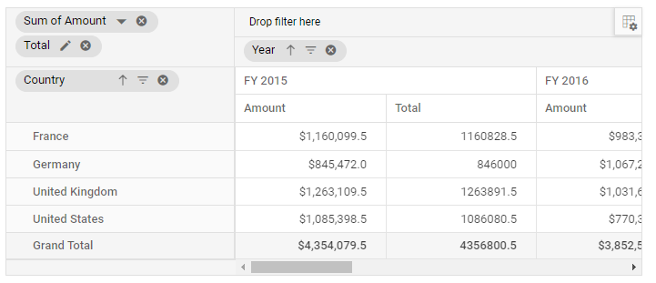

# Getting Started with the Vue Pivot Table component in Vue 3

This article provides a step-by-step guide for setting up a [Vite](https://vitejs.dev/) project with a JavaScript environment and integrating the Syncfusion Vue Pivotview component using the [Composition API](https://vuejs.org/guide/introduction.html#composition-api) / [Options API](https://vuejs.org/guide/introduction.html#options-api).

The `Composition API` is a new feature introduced in Vue.js 3 that provides an alternative way to organize and reuse component logic. It allows developers to write components as functions that use smaller, reusable functions called composition functions to manage their properties and behavior.

The `Options API` is the traditional way of writing Vue.js components, where the component logic is organized into a series of options that define the component's properties and behavior. These options include data, methods, computed properties, watchers, lifecycle hooks, and more.

## Prerequisites

[System requirements for Syncfusion Vue UI components](https://ej2.syncfusion.com/vue/documentation/system-requirements/)

## Set up the Vite project

A recommended approach for beginning with Vue is to scaffold a project using [Vite](https://vitejs.dev/). To create a new Vite project, use one of the commands that are specific to either NPM or Yarn.

```bash
npm create vite@latest
```

or

```bash
yarn create vite
```

Using one of the above commands will lead you to set up additional configurations for the project as below:

**1.** Define the project name: We can specify the name of the project directly. Let's specify the name of the project as `my-project` for this article.

```bash
? Project name: » my-project
```

**2.** Select `Vue` as the framework. It will create a Vue 3 project.

```bash
? Select a framework: » - Use arrow-keys. Return to submit.
Vanilla
> Vue
  React
  Preact
  Lit
  Svelte
  Others
```

**3.** Choose `JavaScript` as the framework variant to build this Vite project using JavaScript and Vue.

```bash
? Select a variant: » - Use arrow-keys. Return to submit.
> JavaScript
  TypeScript
  Customize with create-vue ↗
  Nuxt ↗
```

**4.** Upon completing the aforementioned steps to create the `my-project`, run the following command to install its dependencies:

```bash
cd my-project
npm install
```

or

```bash
cd my-project
yarn install
```

Now that `my-project` is ready to run with default settings, let's add Syncfusion components to the project.

## Add Syncfusion Vue packages

Syncfusion Vue component packages are available at [npmjs.com](https://www.npmjs.com/search?q=ej2-vue). To use Syncfusion Vue components in the project, install the corresponding npm package.
This article uses the [Vue Pivotview component](https://www.syncfusion.com/vue-components/vue-pivot-table) as an example. To use the Vue Pivotview component in the project, the `@syncfusion/ej2-vue-pivotview` package needs to be installed using the following command:
```bash
npm install @syncfusion/ej2-vue-pivotview --save
```
or
```bash
yarn add @syncfusion/ej2-vue-pivotview
```

## Import Syncfusion CSS styles

You can import themes for the Syncfusion Vue component in various ways, such as using CSS or SASS styles from npm packages, CDN, [CRG](https://ej2.syncfusion.com/javascript/documentation/common/custom-resource-generator/) and [Theme Studio](https://ej2.syncfusion.com/vue/documentation/appearance/theme-studio/). Refer to [themes topic](https://ej2.syncfusion.com/vue/documentation/appearance/theme/) to know more about built-in themes and different ways to refer to themes in a Vue project.

In this article, `Material` theme is applied using CSS styles, which are available in installed packages. The necessary `Material` CSS styles for the Pivotview component and its dependents were imported into the `<style>` section of **src/App.vue** file.




<style>
  @import "../node_modules/@syncfusion/ej2-base/styles/material.css";
  @import "../node_modules/@syncfusion/ej2-inputs/styles/material.css";
  @import "../node_modules/@syncfusion/ej2-buttons/styles/material.css";
  @import "../node_modules/@syncfusion/ej2-dropdowns/styles/material.css";
  @import "../node_modules/@syncfusion/ej2-lists/styles/material.css";
  @import "../node_modules/@syncfusion/ej2-popups/styles/material.css";
  @import "../node_modules/@syncfusion/ej2-navigations/styles/material.css";
  @import "../node_modules/@syncfusion/ej2-grids/styles/material.css";
  @import "../node_modules/@syncfusion/ej2-vue-pivotview/styles/material.css";
</style>




> The order of importing CSS styles should be in line with its dependency graph.

## Add Syncfusion Vue component

Follow the below steps to add the Vue Pivotview component using `Composition API` or `Options API`:

**1.** First, import and register the Pivotview component and its child directives in the `script` section of the **src/App.vue** file. If you are using the `Composition API`, you should add the `setup` attribute to the `script` tag to indicate that Vue will be using the `Composition API`.




<script setup>
  import { PivotViewComponent, FieldList, GroupingBar, CalculatedField } from "@syncfusion/ej2-vue-pivotview";
</script>




<script>
  import { PivotViewComponent, FieldList, GroupingBar, CalculatedField } from "@syncfusion/ej2-vue-pivotview";
  //Component registeration.
  export default {
    name: "App",
    components: {
      "ejs-pivotview": PivotViewComponent
    }
  }
</script>




**2.** In the `template` section, define the Pivotview component with the [dataSource](https://ej2.syncfusion.com/vue/documentation/api/pivotview/iDataOptions/#datasource) property and column definitions.




<template>
  <ejs-pivotview :height="height" :width="width" :dataSourceSettings="dataSourceSettings" :showFieldList="showFieldList" :showGroupingBar="showGroupingBar" :allowCalculatedField="allowCalculatedField"></ejs-pivotview>
</template>




**3.** Declare the values for the `dataSource` property in the `script` section.




<script setup>
  const dataSource = [
    { Amount: 5100, Country: "Canada", Date: "FY 2006", Product: "Car", Quantity: 21, State: "Alberta" },
    { Amount: 1900, Country: "France", Date: "FY 2007", Product: "Car", Quantity: 23, State: "Alberta" },
    { Amount: 1000, Country: "Germany", Date: "FY 2008", Product: "Car", Quantity: 29, State: "Alberta" },
    { Amount: 2060, Country: "Canada", Date: "FY 2006", Product: "Car", Quantity: 93, State: "British Columbia" },
    { Amount: 6200, Country: "France", Date: "FY 2007", Product: "Car", Quantity: 36, State: "British Columbia" },
    { Amount: 2000, Country: "Germany", Date: "FY 2008", Product: "Car", Quantity: 31, State: "British Columbia" },
    { Amount: 1300, Country: "Canada", Date: "FY 2005", Product: "Car", Quantity: 45, State: "Brunswick" },
    { Amount: 3400, Country: "France", Date: "FY 2006", Product: "Car", Quantity: 47, State: "Brunswick" },
    { Amount: 2300, Country: "Germany", Date: "FY 2007", Product: "Car", Quantity: 43, State: "Brunswick" },
  ]
</script>




<script>
  data() {
    return {
      dataSourceSettings: {
        dataSource: [
          { Amount: 5100, Country: "Canada", Date: "FY 2006", Product: "Car", Quantity: 21, State: "Alberta" },
          { Amount: 1900, Country: "France", Date: "FY 2007", Product: "Car", Quantity: 23, State: "Alberta" },
          { Amount: 1000, Country: "Germany", Date: "FY 2008", Product: "Car", Quantity: 29, State: "Alberta" },
          { Amount: 2060, Country: "Canada", Date: "FY 2006", Product: "Car", Quantity: 93, State: "British Columbia" },
          { Amount: 6200, Country: "France", Date: "FY 2007", Product: "Car", Quantity: 36, State: "British Columbia" },
          { Amount: 2000, Country: "Germany", Date: "FY 2008", Product: "Car", Quantity: 31, State: "British Columbia" },
          { Amount: 1300, Country: "Canada", Date: "FY 2005", Product: "Car", Quantity: 45, State: "Brunswick" },
          { Amount: 3400, Country: "France", Date: "FY 2006", Product: "Car", Quantity: 47, State: "Brunswick" },
          { Amount: 2300, Country: "Germany", Date: "FY 2007", Product: "Car", Quantity: 43, State: "Brunswick" },
        ],
        rows: [{ name: 'Country' }],
        columns: [{ name: 'Date' }],
        values: [{ name: 'Amount' }, { name: 'Total', type: 'CalculatedField' }],
        formatSettings: [{ name: 'Amount', format: 'C1' }],
        calculatedFieldSettings: [{ name: 'Total', formula: '"Sum(Amount)"+"Sum(Quantity)"' }]
      },
      showFieldList: true,
      showGroupingBar: true,
      allowCalculatedField: true,
      height: '350px',
      width: '100%'
    };
  }
</script>




Here is the summarized code for the above steps in the **src/App.vue** file:




<template>
  <ejs-pivotview :height="height" :width="width" :dataSourceSettings="dataSourceSettings" :showFieldList="showFieldList" :showGroupingBar="showGroupingBar" :allowCalculatedField="allowCalculatedField"></ejs-pivotview>
</template>

<script setup>
  export default {
    data() {
      return {
        dataSourceSettings: {
          dataSource: [
            { Amount: 5100, Country: "Canada", Date: "FY 2006", Product: "Car", Quantity: 21, State: "Alberta" },
            { Amount: 1900, Country: "France", Date: "FY 2007", Product: "Car", Quantity: 23, State: "Alberta" },
            { Amount: 1000, Country: "Germany", Date: "FY 2008", Product: "Car", Quantity: 29, State: "Alberta" },
            { Amount: 2060, Country: "Canada", Date: "FY 2006", Product: "Car", Quantity: 93, State: "British Columbia" },
            { Amount: 6200, Country: "France", Date: "FY 2007", Product: "Car", Quantity: 36, State: "British Columbia" },
            { Amount: 2000, Country: "Germany", Date: "FY 2008", Product: "Car", Quantity: 31, State: "British Columbia" },
            { Amount: 1300, Country: "Canada", Date: "FY 2005", Product: "Car", Quantity: 45, State: "Brunswick" },
            { Amount: 3400, Country: "France", Date: "FY 2006", Product: "Car", Quantity: 47, State: "Brunswick" },
            { Amount: 2300, Country: "Germany", Date: "FY 2007", Product: "Car", Quantity: 43, State: "Brunswick" },
          ],
          rows: [{ name: 'Country' }],
          columns: [{ name: 'Date' }],
          values: [{ name: 'Amount' }, { name: 'Total', type: 'CalculatedField' }],
          formatSettings: [{ name: 'Amount', format: 'C1' }],
          calculatedFieldSettings: [{ name: 'Total', formula: '"Sum(Amount)"+"Sum(Quantity)"' }]
        },
        showFieldList: true,
        showGroupingBar: true,
        allowCalculatedField: true,
        height: '350px',
        width: '100%'
      };
    }
  };
</script>

<style>
  @import "../node_modules/@syncfusion/ej2-base/styles/material.css";
  @import "../node_modules/@syncfusion/ej2-inputs/styles/material.css";
  @import "../node_modules/@syncfusion/ej2-buttons/styles/material.css";
  @import "../node_modules/@syncfusion/ej2-dropdowns/styles/material.css";
  @import "../node_modules/@syncfusion/ej2-lists/styles/material.css";
  @import "../node_modules/@syncfusion/ej2-popups/styles/material.css";
  @import "../node_modules/@syncfusion/ej2-navigations/styles/material.css";
  @import "../node_modules/@syncfusion/ej2-grids/styles/material.css";
  @import "../node_modules/@syncfusion/ej2-vue-pivotview/styles/material.css";
</style>




<template>
  <ejs-pivotview :height="height" :width="width" :dataSourceSettings="dataSourceSettings" :showFieldList="showFieldList" :showGroupingBar="showGroupingBar" :allowCalculatedField="allowCalculatedField">
  </ejs-pivotview>
</template>

<script>
  import { PivotViewComponent, FieldList, GroupingBar, CalculatedField } from "@syncfusion/ej2-vue-pivotview";

  export default {
    name: "App",
    // Declaring component and its directives.
    components: {
      "ejs-pivotview": PivotViewComponent
    },
    // Bound properties declaration.
    data() {
      return {
        dataSourceSettings: {
          dataSource: [
            { Amount: 5100, Country: "Canada", Date: "FY 2006", Product: "Car", Quantity: 21, State: "Alberta" },
            { Amount: 1900, Country: "France", Date: "FY 2007", Product: "Car", Quantity: 23, State: "Alberta" },
            { Amount: 1000, Country: "Germany", Date: "FY 2008", Product: "Car", Quantity: 29, State: "Alberta" },
            { Amount: 2060, Country: "Canada", Date: "FY 2006", Product: "Car", Quantity: 93, State: "British Columbia" },
            { Amount: 6200, Country: "France", Date: "FY 2007", Product: "Car", Quantity: 36, State: "British Columbia" },
            { Amount: 2000, Country: "Germany", Date: "FY 2008", Product: "Car", Quantity: 31, State: "British Columbia" },
            { Amount: 1300, Country: "Canada", Date: "FY 2005", Product: "Car", Quantity: 45, State: "Brunswick" },
            { Amount: 3400, Country: "France", Date: "FY 2006", Product: "Car", Quantity: 47, State: "Brunswick" },
            { Amount: 2300, Country: "Germany", Date: "FY 2007", Product: "Car", Quantity: 43, State: "Brunswick" },
          ],
          rows: [{ name: 'Country' }],
          columns: [{ name: 'Date' }],
          values: [{ name: 'Amount' }, { name: 'Total', type: 'CalculatedField' }],
          formatSettings: [{ name: 'Amount', format: 'C1' }],
          calculatedFieldSettings: [{ name: 'Total', formula: '"Sum(Amount)"+"Sum(Quantity)"' }]
        },
        showFieldList: true,
        showGroupingBar: true,
        allowCalculatedField: true,
        height: '350px',
        width: '100%'
      };
    },
    // Injecting the required modules for additional features.
    pivotview: [GroupingBar, FieldList, CalculatedField]
  };
</script>

<style>
  @import "../node_modules/@syncfusion/ej2-base/styles/material.css";
  @import "../node_modules/@syncfusion/ej2-inputs/styles/material.css";
  @import "../node_modules/@syncfusion/ej2-buttons/styles/material.css";
  @import "../node_modules/@syncfusion/ej2-dropdowns/styles/material.css";
  @import "../node_modules/@syncfusion/ej2-lists/styles/material.css";
  @import "../node_modules/@syncfusion/ej2-popups/styles/material.css";
  @import "../node_modules/@syncfusion/ej2-navigations/styles/material.css";
  @import "../node_modules/@syncfusion/ej2-grids/styles/material.css";
  @import "../node_modules/@syncfusion/ej2-vue-pivotview/styles/material.css";
</style>




## Run the project

To run the project, use the following command:

```bash
npm run dev
```

or

```bash
yarn run dev
```

The output will appear as follows:



### Using template properties in the component

The following sample uses the HTML elements to showcase each cell with custom format using the Pivot Table's `cellTemplate` property.




<template>
  <ejs-pivotview id="pivotview" ref="pivotview" :dataSourceSettings="dataSourceSettings" :height="height" :dataBound="trend" :cellTemplate="cellTemplate">
  </ejs-pivotview>
</template>

<script setup>
  import { PivotViewComponent as EjsPivotview } from "@syncfusion/ej2-vue-pivotview";
  import { createApp } from 'vue';
  const app = createApp();

  var dataSourceSettings = {
    dataSource: [
      { Amount: 5100, Country: "Canada", Date: "FY 2006", Product: "Car", Quantity: 21, State: "Alberta" },
      { Amount: 1900, Country: "France", Date: "FY 2007", Product: "Car", Quantity: 23, State: "Alberta" },
      { Amount: 1000, Country: "Germany", Date: "FY 2008", Product: "Car", Quantity: 29, State: "Alberta" },
      { Amount: 2060, Country: "Canada", Date: "FY 2006", Product: "Car", Quantity: 93, State: "British Columbia" },
      { Amount: 6200, Country: "France", Date: "FY 2007", Product: "Car", Quantity: 36, State: "British Columbia" },
      { Amount: 2000, Country: "Germany", Date: "FY 2008", Product: "Car", Quantity: 31, State: "British Columbia" },
      { Amount: 1300, Country: "Canada", Date: "FY 2005", Product: "Car", Quantity: 45, State: "Brunswick" },
      { Amount: 3400, Country: "France", Date: "FY 2006", Product: "Car", Quantity: 47, State: "Brunswick" },
      { Amount: 2300, Country: "Germany", Date: "FY 2007", Product: "Car", Quantity: 43, State: "Brunswick" },
    ],
    rows: [{ name: "Country" }],
    columns: [{ name: "Date" }],
    values: [{ name: "Amount" }, { name: "Total", type: 'CalculatedField' }],
    formatSettings: [{ name: "Amount", format: "C1" }],
    calculatedFieldSettings: [{ name: 'Total', formula: '"Sum(Amount)"+"Sum(Quantity)"' }]
  };

  var colVue = app.component("cellTemplate", {
    data() {
      return {
        data: {},
      };
    },
    methods: {
      getCellContent: function () {
        return '<span class="tempwrap sb-icon-neutral pv-icons"></span>';
      },
    },
    template: `<span class="template-wrap"><span class="tempwrap sb-icon-neutral pv-icons"></span></span>`,
  });

  const cellTemplate = () => {
    return { template: colVue };
  };

  const trend = () => {
    let pivotGridObj = this.$refs.pivotview.ej2Instances;
    var cTable = document.getElementsByClassName("e-table");
    var colLen = pivotGridObj.pivotValues[3].length;
    var cLen = cTable[3].children[0].children.length;
    var rLen = cTable[3].children[1].children.length;
    for (let k = 0; k < rLen; k++) {
      if (
        pivotGridObj.pivotValues[k] &&
        pivotGridObj.pivotValues[k][0] !== undefined
      ) {
        break;
      }
    }
    var rowHeaders = [].slice.call(
      cTable[2].children[1].querySelectorAll("td")
    );
    var rows = pivotGridObj.dataSourceSettings.rows;
    if (rowHeaders.length > 1) {
      for (var i = 0, Cnt = rows; i < Cnt.length; i++) {
        var fields = {};
        var fieldHeaders = [];
        for (var j = 0, Lnt = rowHeaders; j < Lnt.length; j++) {
          var header = rowHeaders[j];
          if (
            header.className.indexOf("e-gtot") === -1 &&
            header.className.indexOf("e-rowsheader") > -1 &&
            header.getAttribute("fieldname") === rows[i].name
          ) {
            fields[rowHeaders[j].textContent] = j;
            fieldHeaders.push(rowHeaders[j].textContent);
          }
        }
        if (i === 0) {
          for (var rnt = 0, Lnt1 = fieldHeaders; rnt < Lnt1.length; rnt++) {
            if (rnt !== 0) {
              var row = fields[fieldHeaders[rnt]];
              var prevRow = fields[fieldHeaders[rnt - 1]];
              for (var k = 0, ci = 1; k < cLen && ci < colLen; k++, ci++) {
                var node = cTable[3].children[1].children[row].childNodes[k];
                var prevNode =
                  cTable[3].children[1].children[prevRow].childNodes[k];
                var ri = node.getAttribute("index");
                var prevRi = prevNode.getAttribute("index");
                if (ri < pivotGridObj.pivotValues.length) {
                  if (
                    pivotGridObj.pivotValues[prevRi][ci].value >
                      pivotGridObj.pivotValues[ri][ci].value &&
                    node.querySelector(".tempwrap")
                  ) {
                    var trendElement = node.querySelector(".tempwrap");
                    trendElement.className = trendElement.className.replace(
                      "sb-icon-neutral",
                      "sb-icon-loss"
                    );
                  } else if (
                    pivotGridObj.pivotValues[prevRi][ci].value <
                      pivotGridObj.pivotValues[ri][ci].value &&
                    node.querySelector(".tempwrap")
                  ) {
                    var trendElement1 = node.querySelector(".tempwrap");
                    trendElement1.className = trendElement1.className.replace(
                      "sb-icon-neutral",
                      "sb-icon-profit"
                    );
                  }
                }
              }
            }
          }
        }
      }
    }
  };
</script>

<style scoped>
  @import "../node_modules/@syncfusion/ej2-base/styles/material.css";
  @import "../node_modules/@syncfusion/ej2-inputs/styles/material.css";
  @import "../node_modules/@syncfusion/ej2-buttons/styles/material.css";
  @import "../node_modules/@syncfusion/ej2-dropdowns/styles/material.css";
  @import "../node_modules/@syncfusion/ej2-lists/styles/material.css";
  @import "../node_modules/@syncfusion/ej2-popups/styles/material.css";
  @import "../node_modules/@syncfusion/ej2-navigations/styles/material.css";
  @import "../node_modules/@syncfusion/ej2-grids/styles/material.css";
  @import "../node_modules/@syncfusion/ej2-vue-pivotview/styles/material.css";

  #pivotview {
    width: 100%;
  }

  @font-face {
    font-family: "e-pivot";
    src: /* To get the output shown below, add the resource containing font data from the below reference sample. */
    font-weight: normal;
    font-style: normal;
  }

  .pv-icons {
    font-family: "e-pivot";
    font-style: normal;
    font-variant: normal;
    font-weight: normal;
    text-transform: none;
    line-height: 1;
  }

  .sb-icon-profit::before {
    content: "\e234";
    padding-left: 30px;
    margin: auto !important;
    color: #219122;
    size: 20px;
  }

  .sb-icon-neutral::before {
    content: "\e84d";
    padding-left: 30px;
    margin: auto !important;
    color: #82b5e9;
  }

  .sb-icon-loss::before {
    content: "\e239";
    padding-left: 30px;
    margin: auto !important;
    color: #ff2222;
  }

  .sb-sample-content-area {
    min-height: 255px !important;
  }

  .control-section {
    min-height: 255px !important;
  }

  .e-columnsheader .tempwrap.sb-icon-neutral.pv-icons{
    display: none !important;
  }

  .e-rowsheader .tempwrap.sb-icon-neutral.pv-icons {
    display: none !important;
  }

  .e-pivotview .e-grid .e-rowcell {
    font-size: 13px;
    padding-left: 8px;
  }

  .e-cellvalue {
    margin-top: 8px;
    display: flex;
    margin-left: 30px;
  }
</style>




<template>
  <ejs-pivotview id="pivotview" ref="pivotview" :dataSourceSettings="dataSourceSettings" :height="height" :dataBound="trend" :cellTemplate="cellTemplate"></ejs-pivotview>
</template>

<script>
  import { PivotViewComponent } from "@syncfusion/ej2-vue-pivotview";
  import { createApp } from 'vue/dist/vue.esm-bundler';

  const app = createApp();

  // Template declaration.
  var colVue = app.component("cellTemplate", {
    data() {
      return {
        data: {},
      };
    },
    methods: {
      getCellContent: function () {
        return '<span class="tempwrap sb-icon-neutral pv-icons"></span>';
      },
    },
    template: `<span class="template-wrap"><span class="tempwrap sb-icon-neutral pv-icons"></span></span>`,
  });

  export default {
    name: "App",
    components: {
      "ejs-pivotview": PivotViewComponent,
    },
    data() {
      return {
        dataSourceSettings: {
          dataSource: [
            { Amount: 5100, Country: "Canada", Date: "FY 2006", Product: "Car", Quantity: 21, State: "Alberta" },
            { Amount: 1900, Country: "France", Date: "FY 2007", Product: "Car", Quantity: 23, State: "Alberta" },
            { Amount: 1000, Country: "Germany", Date: "FY 2008", Product: "Car", Quantity: 29, State: "Alberta" },
            { Amount: 2060, Country: "Canada", Date: "FY 2006", Product: "Car", Quantity: 93, State: "British Columbia" },
            { Amount: 6200, Country: "France", Date: "FY 2007", Product: "Car", Quantity: 36, State: "British Columbia" },
            { Amount: 2000, Country: "Germany", Date: "FY 2008", Product: "Car", Quantity: 31, State: "British Columbia" },
            { Amount: 1300, Country: "Canada", Date: "FY 2005", Product: "Car", Quantity: 45, State: "Brunswick" },
            { Amount: 3400, Country: "France", Date: "FY 2006", Product: "Car", Quantity: 47, State: "Brunswick" },
            { Amount: 2300, Country: "Germany", Date: "FY 2007", Product: "Car", Quantity: 43, State: "Brunswick" },
          ],
          rows: [{ name: "Country" }],
          columns: [{ name: "Date" }],
          values: [{ name: "Amount" }, { name: "Total", type: 'CalculatedField' }],
          formatSettings: [{ name: "Amount", format: "C1" }],
          calculatedFieldSettings: [{ name: 'Total', formula: '"Sum(Amount)"+"Sum(Quantity)"' }]
        },
        height: 350,
        cellTemplate: function () {
          return { template: colVue };
        },
      };
    },
    methods: {
      trend: function () {
        let pivotGridObj = this.$refs.pivotview.ej2Instances;
        var cTable = document.getElementsByClassName("e-table");
        var colLen = pivotGridObj.pivotValues[3].length;
        var cLen = cTable[3].children[0].children.length;
        var rLen = cTable[3].children[1].children.length;
        for (let k = 0; k < rLen; k++) {
          if (
            pivotGridObj.pivotValues[k] &&
            pivotGridObj.pivotValues[k][0] !== undefined
          ) {
            break;
          }
        }
        var rowHeaders = [].slice.call(
          cTable[2].children[1].querySelectorAll("td")
        );
        var rows = pivotGridObj.dataSourceSettings.rows;
        if (rowHeaders.length > 1) {
          for (var i = 0, Cnt = rows; i < Cnt.length; i++) {
            var fields = {};
            var fieldHeaders = [];
            for (var j = 0, Lnt = rowHeaders; j < Lnt.length; j++) {
              var header = rowHeaders[j];
              if (
                header.className.indexOf("e-gtot") === -1 &&
                header.className.indexOf("e-rowsheader") > -1 &&
                header.getAttribute("fieldname") === rows[i].name
              ) {
                fields[rowHeaders[j].textContent] = j;
                fieldHeaders.push(rowHeaders[j].textContent);
              }
            }
            if (i === 0) {
              for (var rnt = 0, Lnt1 = fieldHeaders; rnt < Lnt1.length; rnt++) {
                if (rnt !== 0) {
                  var row = fields[fieldHeaders[rnt]];
                  var prevRow = fields[fieldHeaders[rnt - 1]];
                  for (var k = 0, ci = 1; k < cLen && ci < colLen; k++, ci++) {
                    var node = cTable[3].children[1].children[row].childNodes[k];
                    var prevNode =
                      cTable[3].children[1].children[prevRow].childNodes[k];
                    var ri = node.getAttribute("index");
                    var prevRi = prevNode.getAttribute("index");
                    if (ri < pivotGridObj.pivotValues.length) {
                      if (
                        pivotGridObj.pivotValues[prevRi][ci].value >
                          pivotGridObj.pivotValues[ri][ci].value &&
                        node.querySelector(".tempwrap")
                      ) {
                        var trendElement = node.querySelector(".tempwrap");
                        trendElement.className = trendElement.className.replace(
                          "sb-icon-neutral",
                          "sb-icon-loss"
                        );
                      } else if (
                        pivotGridObj.pivotValues[prevRi][ci].value <
                          pivotGridObj.pivotValues[ri][ci].value &&
                        node.querySelector(".tempwrap")
                      ) {
                        var trendElement1 = node.querySelector(".tempwrap");
                        trendElement1.className = trendElement1.className.replace(
                          "sb-icon-neutral",
                          "sb-icon-profit"
                        );
                      }
                    }
                  }
                }
              }
            }
          }
        }
      },
    },
  };
</script>

<style scoped>
  @import "../node_modules/@syncfusion/ej2-base/styles/material.css";
  @import "../node_modules/@syncfusion/ej2-inputs/styles/material.css";
  @import "../node_modules/@syncfusion/ej2-buttons/styles/material.css";
  @import "../node_modules/@syncfusion/ej2-dropdowns/styles/material.css";
  @import "../node_modules/@syncfusion/ej2-lists/styles/material.css";
  @import "../node_modules/@syncfusion/ej2-popups/styles/material.css";
  @import "../node_modules/@syncfusion/ej2-navigations/styles/material.css";
  @import "../node_modules/@syncfusion/ej2-grids/styles/material.css";
  @import "../node_modules/@syncfusion/ej2-vue-pivotview/styles/material.css";

  /deep/ #pivotview {
    width: 100%;
  }

  @font-face {
    font-family: "e-pivot";
    src: /* To get the output shown below, add the resource containing font data from the below reference sample. */
    font-weight: normal;
    font-style: normal;
  }

  /deep/ .pv-icons {
    font-family: "e-pivot";
    font-style: normal;
    font-variant: normal;
    font-weight: normal;
    text-transform: none;
    line-height: 1;
  }

  /deep/ .sb-icon-profit::before {
    content: "\e234";
    padding-left: 30px;
    margin: auto !important;
    color: #219122;
    size: 20px;
  }

  /deep/ .sb-icon-neutral::before {
    content: "\e84d";
    padding-left: 30px;
    margin: auto !important;
    color: #82b5e9;
  }

  /deep/ .sb-icon-loss::before {
    content: "\e239";
    padding-left: 30px;
    margin: auto !important;
    color: #ff2222;
  }

  /deep/ .sb-sample-content-area {
    min-height: 255px !important;
  }

  /deep/ .control-section {
    min-height: 255px !important;
  }

  /deep/ .e-columnsheader .tempwrap.sb-icon-neutral.pv-icons{
    display: none !important;
  }

  /deep/ .e-rowsheader .tempwrap.sb-icon-neutral.pv-icons {
    display: none !important;
  }

  /deep/ .e-pivotview .e-grid .e-rowcell {
      font-size: 13px;
      padding-left: 8px;
  }

  /deep/ .e-cellvalue {
    margin-top: 8px;
    display: flex;
    margin-left: 30px;
  }
</style>




The output will appear as follows:


Refer the following sample, [vue3-pivottable-celltemplate](https://github.com/SyncfusionExamples/vue3-pivottable-celltemplate).

> **Sample**: [vue-3-pivottable-getting-started](https://github.com/SyncfusionExamples/vue3-pivottable-getting-started).
For migrating from Vue 2 to Vue 3, refer to the [`migration`](https://ej2.syncfusion.com/vue/documentation/getting-started/vue3-tutorial/#migration-from-vue-2-to-vue-3) documentation.

## See also

* [Getting Started with Vue UI Components using Composition API and TypeScript](../getting-started/vue-3-ts-composition.md)
* [Getting Started with Vue UI Components using Options API and TypeScript](../getting-started/vue-3-ts-options.md)