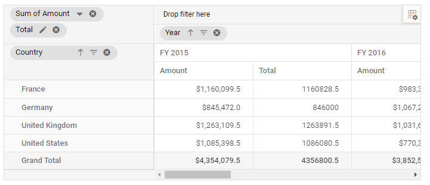

# Getting Started with the Vue Pivot Table component in Vue 3

This article provides a step-by-step guide for setting up a [Vite](https://vitejs.dev/) project with a JavaScript environment and integrating the Syncfusion<sup style="font-size:70%">&reg;</sup> Vue Pivotview component using the [Composition API](https://vuejs.org/guide/introduction.html#composition-api) / [Options API](https://vuejs.org/guide/introduction.html#options-api).

The `Composition API` is a new feature introduced in Vue.js 3 that provides an alternative way to organize and reuse component logic. It allows developers to write components as functions that use smaller, reusable functions called composition functions to manage their properties and behavior.

The `Options API` is the traditional way of writing Vue.js components, where the component logic is organized into a series of options that define the component's properties and behavior. These options include data, methods, computed properties, watchers, life cycle hooks, and more.

## Prerequisites

[System requirements for Syncfusion<sup style="font-size:70%">&reg;</sup> Vue UI components](https://ej2.syncfusion.com/vue/documentation/system-requirements)

## Set up the Vite project

A recommended approach for beginning with Vue is to scaffold a project using [Vite](https://vitejs.dev/). To create a new Vite project, use one of the commands that are specific to either NPM or Yarn.

```bash
npm create vite@latest
```

or

```bash
yarn create vite
```

Using one of the above commands will lead you to set up additional configurations for the project as below:

**1.** Define the project name: We can specify the name of the project directly. Let's specify the name of the project as `my-project` for this article.

```bash
? Project name: » my-project
```

**2.** Select `Vue` as the framework. It will create a Vue 3 project.

```bash
? Select a framework: » - Use arrow-keys. Return to submit.
Vanilla
> Vue
  React
  Preact
  Lit
  Svelte
  Others
```

**3.** Choose `JavaScript` as the framework variant to build this Vite project using JavaScript and Vue.

```bash
? Select a variant: » - Use arrow-keys. Return to submit.
> JavaScript
  TypeScript
  Customize with create-vue ↗
  Nuxt ↗
```

4.Install dependencies and start the development server.

```bash
Install with npm and start now?: Yes
```

Since you selected `Yes`, the development server should start automatically. If you selected `No`, please follow these steps to set up and start the project manually:

```bash
cd my-project
npm install
```

or

```bash
cd my-project
yarn install
```

Now that `my-project` is ready to run with default settings, let's add Syncfusion<sup style="font-size:70%">&reg;</sup> components to the project.

## Add Syncfusion<sup style="font-size:70%">&reg;</sup> Vue PivotTable packages

To install the PivotTable component, run the following command:

```bash
npm install @syncfusion/ej2-vue-pivotview --save
```
or

```bash
yarn add @syncfusion/ej2-vue-pivotview
```

## Import Syncfusion<sup style="font-size:70%">&reg;</sup> CSS styles

The following CSS files are available in the ../node_modules/@syncfusion package folder. Add them as references in **src/App.vue**.




<style>
  @import "../node_modules/@syncfusion/ej2-base/styles/tailwind3.css";
  @import "../node_modules/@syncfusion/ej2-inputs/styles/tailwind3.css";
  @import "../node_modules/@syncfusion/ej2-buttons/styles/tailwind3.css";
  @import "../node_modules/@syncfusion/ej2-dropdowns/styles/tailwind3.css";
  @import "../node_modules/@syncfusion/ej2-lists/styles/tailwind3.css";
  @import "../node_modules/@syncfusion/ej2-popups/styles/tailwind3.css";
  @import "../node_modules/@syncfusion/ej2-navigations/styles/tailwind3.css";
  @import "../node_modules/@syncfusion/ej2-grids/styles/tailwind3.css";
  @import "../node_modules/@syncfusion/ej2-vue-pivotview/styles/tailwind3.css";
</style>




## Adding Pivot Table component

The PivotTable code should be added to the **src/App.vue** file.




<template>
  <div id="app">
    <ejs-pivotview :height="height" :width="width" :dataSourceSettings="dataSourceSettings"></ejs-pivotview>
  </div>
</template>

<script setup>
import { provide } from "vue";
import { PivotViewComponent as EjsPivotview } from "@syncfusion/ej2-vue-pivotview";

const dataSourceSettings = {
  dataSource: [
      { 'Sold': 31, 'Amount': 52824, 'Country': 'France', 'Products': 'Mountain Bikes', 'Year': 'FY 2025', 'Quarter': 'Q1' },
      { 'Sold': 51, 'Amount': 86904, 'Country': 'France', 'Products': 'Mountain Bikes', 'Year': 'FY 2025', 'Quarter': 'Q2' },
      { 'Sold': 90, 'Amount': 153360, 'Country': 'France', 'Products': 'Mountain Bikes', 'Year': 'FY 2025', 'Quarter': 'Q3' },
      { 'Sold': 25, 'Amount': 42600, 'Country': 'France', 'Products': 'Mountain Bikes', 'Year': 'FY 2025', 'Quarter': 'Q4' }
  ],
  expandAll: true,
  columns: [{ name: 'Year' }, { name: 'Quarter' }],
  rows: [{ name: 'Country' }, { name: 'Products' }],
  values: [{ name: 'Amount', caption: 'Sold Amount' }, { name: 'Sold', caption: 'Units Sold' }],
  formatSettings: [{ name: 'Amount', format: 'C0' }]
};
const height = 350;
const width = '100%';

</script>
<style>
@import "../node_modules/@syncfusion/ej2-base/styles/tailwind3.css";
@import "../node_modules/@syncfusion/ej2-inputs/styles/tailwind3.css";
@import "../node_modules/@syncfusion/ej2-buttons/styles/tailwind3.css";
@import "../node_modules/@syncfusion/ej2-dropdowns/styles/tailwind3.css";
@import "../node_modules/@syncfusion/ej2-lists/styles/tailwind3.css";
@import "../node_modules/@syncfusion/ej2-popups/styles/tailwind3.css";
@import "../node_modules/@syncfusion/ej2-navigations/styles/tailwind3.css";
@import "../node_modules/@syncfusion/ej2-grids/styles/tailwind3.css";
@import "../node_modules/@syncfusion/ej2-vue-pivotview/styles/tailwind3.css";
</style>




<template>
  <ejs-pivotview :height="height" :width="width" :dataSourceSettings="dataSourceSettings"></ejs-pivotview>
</template>

<script>
import { PivotViewComponent } from "@syncfusion/ej2-vue-pivotview";

export default {
  name: "App",
  // Declaring component and its directives.
  components: {
    "ejs-pivotview": PivotViewComponent
  },
  // Bound properties declaration.
  data() {
    return {
      dataSourceSettings: {
        dataSource: [
          { 'Sold': 31, 'Amount': 52824, 'Country': 'France', 'Products': 'Mountain Bikes', 'Year': 'FY 2025', 'Quarter': 'Q1' },
          { 'Sold': 51, 'Amount': 86904, 'Country': 'France', 'Products': 'Mountain Bikes', 'Year': 'FY 2025', 'Quarter': 'Q2' },
          { 'Sold': 90, 'Amount': 153360, 'Country': 'France', 'Products': 'Mountain Bikes', 'Year': 'FY 2025', 'Quarter': 'Q3' },
          { 'Sold': 25, 'Amount': 42600, 'Country': 'France', 'Products': 'Mountain Bikes', 'Year': 'FY 2025', 'Quarter': 'Q4' }
        ],
        expandAll: true,
        columns: [{ name: 'Year' }, { name: 'Quarter' }],
        rows: [{ name: 'Country' }, { name: 'Products' }],
        values: [{ name: 'Amount', caption: 'Sold Amount' }, { name: 'Sold', caption: 'Units Sold' }],
        formatSettings: [{ name: 'Amount', format: 'C0' }]
      },
      height: '350px',
      width: '100%'
    };
  },
};
</script>

<style>
@import "../node_modules/@syncfusion/ej2-base/styles/tailwind3.css";
@import "../node_modules/@syncfusion/ej2-inputs/styles/tailwind3.css";
@import "../node_modules/@syncfusion/ej2-buttons/styles/tailwind3.css";
@import "../node_modules/@syncfusion/ej2-dropdowns/styles/tailwind3.css";
@import "../node_modules/@syncfusion/ej2-lists/styles/tailwind3.css";
@import "../node_modules/@syncfusion/ej2-popups/styles/tailwind3.css";
@import "../node_modules/@syncfusion/ej2-navigations/styles/tailwind3.css";
@import "../node_modules/@syncfusion/ej2-grids/styles/tailwind3.css";
@import "../node_modules/@syncfusion/ej2-vue-pivotview/styles/tailwind3.css";
</style>




## Run the project

To run the project, use the following command:

```bash
npm run dev
```

or

```bash
yarn run dev
```

The output will appear as follows:



## See also

* [Getting Started with Vue UI Components using Composition API and TypeScript](../getting-started/vue-3-ts-composition.md)
* [Getting Started with Vue UI Components using Options API and TypeScript](../getting-started/vue-3-ts-options.md)
* [Data Binding](./data-binding)
* [Field List](./field-list)
* [Grouping Bar](./grouping-bar)