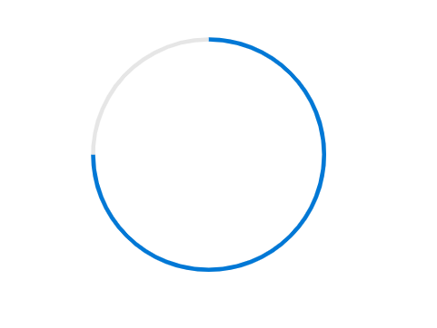

# Getting Started with Vue Progress Bar

This section provides a step-by-step guide to creating a Vue 2 application using [Vue CLI](https://cli.vuejs.org) and integrating the Syncfusion<sup style="font-size:70%">&reg;</sup> Vue Progress Bar component. It explains how to configure a project and render an animated circular Progress Bar.

## Prerequisites

Ensure that the development environment meets the requirements listed in [system requirements for Syncfusion Vue UI components](https://ej2.syncfusion.com/vue/documentation/system-requirements).

This guide uses the Vue 2 Options API. Use a supported Node.js version and a Vue CLI version that allows creating Vue 2 projects.

## Dependencies

The following are the minimum dependencies required to use the Vue Progress Bar component:

```
|-- @syncfusion/ej2-vue-progressbar
  |-- @syncfusion/ej2-base
  |-- @syncfusion/ej2-data
  |-- @syncfusion/ej2-svg-base
```

Only the `@syncfusion/ej2-vue-progressbar` package must be installed directly. Its required dependencies are installed automatically.

## Set Up the Vue 2 Project

Install Vue CLI globally using either npm or Yarn, and create a project with the [`vue create`](https://cli.vuejs.org) command.

**npm**

```bash
npm install -g @vue/cli
vue create quickstart
```

**Yarn**

```bash
yarn global add @vue/cli
vue create quickstart
```

When creating the project, select `Default ([Vue 2] babel, eslint)` from the menu. If this option is unavailable, manually select Vue 2 when configuring the project.


After the project is created, navigate to its directory:

```bash
cd quickstart
```

Use either npm or Yarn consistently throughout the project to avoid generating multiple lock files.

## Add the Syncfusion<sup style="font-size:70%">&reg;</sup> Vue Package

Syncfusion Vue packages are available on [npmjs.com](https://www.npmjs.com/search?q=ej2-vue).

Install the `@syncfusion/ej2-vue-progressbar` package using either npm or Yarn.

**npm**

```bash
npm install @syncfusion/ej2-vue-progressbar
```

**Yarn**

```bash
yarn add @syncfusion/ej2-vue-progressbar
```

> **Note:** npm v5 and later save installed packages to the `dependencies` section of `package.json` by default. The `--save` option is not required.

## Add the Syncfusion<sup style="font-size:70%">&reg;</sup> Vue Progress Bar Component

Import and register the Progress Bar component, and then define it in the template of the **src/App.vue** file.

The following example renders a circular Progress Bar with a value of `75`.




<template>
  <div id="container">
    <ejs-progressbar
      id="percentage"
      type="Circular"
      :value="value"
    ></ejs-progressbar>
  </div>
</template>

<script>
import { ProgressBarComponent } from '@syncfusion/ej2-vue-progressbar';

export default {
  name: 'App',
  components: {
    'ejs-progressbar': ProgressBarComponent
  },
  data() {
    return {
      value: 75
    };
  }
};
</script>




The example uses the following properties:

- [`type`](https://ej2.syncfusion.com/vue/documentation/api/progressbar#type) specifies the Progress Bar type. Supported types include `Linear` and `Circular`.
- [`value`](https://ej2.syncfusion.com/vue/documentation/api/progressbar#value) specifies the current progress value.
Ensure that the `value` is within the range defined by the component's [`minimum`](https://ej2.syncfusion.com/vue/documentation/api/progressbar#minimum) and [`maximum`](https://ej2.syncfusion.com/vue/documentation/api/progressbar#maximum) properties.

## Run the Project

Save the changes and start the development server using either npm or Yarn.

**npm**

```bash
npm run serve
```

**Yarn**

```bash
yarn run serve
```

Open the local URL displayed in the terminal, such as http://localhost:8080, in a browser. The application displays an circular Progress Bar with a value of `75`.



## Module Injection

The Progress Bar component is divided into feature-specific modules. Register only the modules required by the application using the component's `provide` option.

The `ProgressAnnotation` module enables annotation support in the Progress Bar.

The following example registers the annotation service:

```javascript

import { ProgressBarComponent, ProgressAnnotation } from "@syncfusion/ej2-vue-progressbar";

export default {
  components: {
    'ejs-progressbar': ProgressBarComponent
  },
  provide: {
    progressbar: [ProgressAnnotation]
  }
};

```

Register `ProgressAnnotation` only when annotations are used.

> **Note:** Register only the modules required by the application to keep the bundle size smaller.

## Troubleshooting

- **The Progress Bar is not rendered.** Verify that `ProgressBarComponent` is imported, and the browser console does not contain component resolution or package errors.

- **The Progress Bar package cannot be resolved.** Confirm that `@syncfusion/ej2-vue-progressbar` is listed in the `dependencies` section of `package.json`, and reinstall the project dependencies if necessary.

- **The displayed progress is incorrect.** Verify that `value` is within the range specified by `minimum` and `maximum`.

## See Also

* [Getting Started with Vue 3 Progress Bar](vue-3-getting-started)