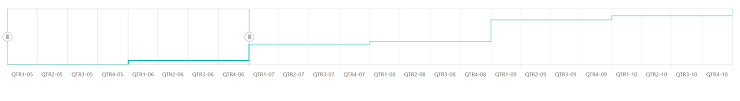

# Getting Started with the Vue Range Navigator Component in Vue 3

This article provides a step-by-step guide for setting up a [Vite](https://vitejs.dev/) project with a JavaScript environment and integrating the Syncfusion<sup style="font-size:70%">&reg;</sup> Vue Range Navigator component using the [Composition API](https://vuejs.org/guide/introduction.html#composition-api) / [Options API](https://vuejs.org/guide/introduction.html#options-api).

The `Composition API` is a new feature introduced in Vue.js 3 that provides an alternative way to organize and reuse component logic. It allows developers to write components as functions that use smaller, reusable functions called composition functions to manage their properties and behavior.

The `Options API` is the traditional way of writing Vue.js components, where the component logic is organized into a series of options that define the component's properties and behavior. These options include data, methods, computed properties, watchers, lifecycle hooks, and more.

## Prerequisites

[System requirements for Syncfusion<sup style="font-size:70%">&reg;</sup> Vue UI components](https://ej2.syncfusion.com/vue/documentation/system-requirements/)

## Set up the Vite project

A recommended approach for beginning with Vue is to scaffold a project using [Vite](https://vitejs.dev/). To create a new Vite project, use one of the commands that are specific to either NPM or Yarn.

```bash
npm create vite@latest
```

or

```bash
yarn create vite
```

Using one of the above commands will lead you to set up additional configurations for the project as below:

1.Define the project name: We can specify the name of the project directly. Let's specify the name of the project as `my-project` for this article.

```bash
? Project name: » my-project
```

2.Select `Vue` as the framework. It will create a Vue 3 project.

```bash
? Select a framework: » - Use arrow-keys. Return to submit.
Vanilla
> Vue
  React
  Preact
  Lit
  Svelte
  Others
```

3.Choose `JavaScript` as the framework variant to build this Vite project using JavaScript and Vue.

```bash
? Select a variant: » - Use arrow-keys. Return to submit.
> JavaScript
  TypeScript
  Customize with create-vue ↗
  Nuxt ↗
```

4.Upon completing the aforementioned steps to create the `my-project`, run the following command to install its dependencies:

```bash
cd my-project
npm install
```

or

```bash
cd my-project
yarn install
```

Now that `my-project` is ready to run with default settings, let's add Syncfusion<sup style="font-size:70%">&reg;</sup> components to the project.

## Add Syncfusion<sup style="font-size:70%">&reg;</sup> Vue packages

Syncfusion<sup style="font-size:70%">&reg;</sup> Vue component packages are available at [npmjs.com](https://www.npmjs.com/search?q=ej2-vue). To use Syncfusion<sup style="font-size:70%">&reg;</sup> Vue components in the project, install the corresponding npm package.

This article uses the [Vue Range Navigator component](https://www.syncfusion.com/vue-components/vue-range-selector) as an example. To use the Vue Range Navigator component in the project, the `@syncfusion/ej2-vue-charts` package needs to be installed using the following command:

```bash
npm install @syncfusion/ej2-vue-charts --save
```

or

```bash
yarn add @syncfusion/ej2-vue-charts
```

## Add Syncfusion<sup style="font-size:70%">&reg;</sup> Vue component

Follow the below steps to add the Vue Range Navigator component using `Composition API` or `Options API`:

1.First, import and register the Range Navigator component and its child directives in the `script` section of the **src/App.vue** file. If you are using the `Composition API`, you should add the `setup` attribute to the `script` tag to indicate that Vue will be using the `Composition API`.




<script setup>
import { RangeNavigatorComponent as EjsRangenavigator, StepLineSeries, DateTime, RangenavigatorSeriesCollectionDirective as ERangenavigatorSeriesCollection, RangenavigatorSeriesDirective as ERangenavigatorSeries} from "@syncfusion/ej2-vue-charts";
</script>




<script>
import { RangeNavigatorComponent, StepLineSeries, DateTime, RangenavigatorSeriesCollectionDirective,
RangenavigatorSeriesDirective } from "@syncfusion/ej2-vue-charts";
//Component registration
export default {
  name: "App",
  components: {
    "ejs-rangenavigator": RangeNavigatorComponent,
    "e-rangenavigator-series-collection": RangenavigatorSeriesCollectionDirective,
    "e-rangenavigator-series":  RangenavigatorSeriesDirective
  }
}
</script>




2.In the `template` section, define the Range Navigator component with the [dataSource](https://helpej2.syncfusion.com/vue/documentation/api/range-navigator#datasource) property.




<template>
    <ejs-rangenavigator :valueType='valueType' :value='value' :labelFormat='labelFormat'>
        <e-rangenavigator-series-collection>
            <e-rangenavigator-series :dataSource='data' type='StepLine' xName='Date' yName='Close' width=2>
            </e-rangenavigator-series>
        </e-rangenavigator-series-collection>
    </ejs-rangenavigator>
</template>




3.Declare the values for the `dataSource` property in the `script` section.




<script setup>
const data = [
    { Date: new Date("2005-01-01"), Close: 21 },
    { Date: new Date("2006-01-01"), Close: 24 },
    { Date: new Date("2007-01-01"), Close: 36 },
    { Date: new Date("2008-01-01"), Close: 38 },
    { Date: new Date("2009-01-01"), Close: 54 },
    { Date: new Date("2010-01-01"), Close: 57 },
    { Date: new Date("2011-01-01"), Close: 62 }
];
const valueType = 'DateTime';
const value = [new Date("2008-01-01"), new Date("2010-01-01")];
const labelFormat = 'MMM-yy';
</script>




<script>
data() {
    return {
        data: [
            { Date: new Date("2005-01-01"), Close: 21 },
            { Date: new Date("2006-01-01"), Close: 24 },
            { Date: new Date("2007-01-01"), Close: 36 },
            { Date: new Date("2008-01-01"), Close: 38 },
            { Date: new Date("2009-01-01"), Close: 54 },
            { Date: new Date("2010-01-01"), Close: 57 },
            { Date: new Date("2011-01-01"), Close: 62 }
        ],
        valueType: 'DateTime',
        value: [new Date("2008-01-01"), new Date("2010-01-01")],
        labelFormat: 'MMM-yy'
    };
}
</script>




Here is the summarized code for the above steps in the **src/App.vue** file:




<template>
    <ejs-rangenavigator :valueType='valueType' :value='value' :labelFormat='labelFormat'>
        <e-rangenavigator-series-collection>
            <e-rangenavigator-series :dataSource='data' type='StepLine' xName='Date' yName='Close' width=2>
            </e-rangenavigator-series>
        </e-rangenavigator-series-collection>
    </ejs-rangenavigator>
</template>

<script setup>
import { provide } from 'vue';
import { RangeNavigatorComponent as EjsRangenavigator, StepLineSeries, DateTime, RangenavigatorSeriesCollectionDirective as ERangenavigatorSeriesCollection, RangenavigatorSeriesDirective as ERangenavigatorSeries} from "@syncfusion/ej2-vue-charts";

const data = [
    { Date: new Date("2005-01-01"), Close: 21 },
    { Date: new Date("2006-01-01"), Close: 24 },
    { Date: new Date("2007-01-01"), Close: 36 },
    { Date: new Date("2008-01-01"), Close: 38 },
    { Date: new Date("2009-01-01"), Close: 54 },
    { Date: new Date("2010-01-01"), Close: 57 },
    { Date: new Date("2011-01-01"), Close: 62 }
];
const valueType = 'DateTime';
const value = [new Date("2008-01-01"), new Date("2010-01-01")];
const labelFormat = 'MMM-yy';
const rangeNavigator = [ DateTime, StepLineSeries ];
provide('rangeNavigator', rangeNavigator);
</script>




<template>
    <ejs-rangenavigator :valueType='valueType' :value='value' :labelFormat='labelFormat'>
        <e-rangenavigator-series-collection>
            <e-rangenavigator-series :dataSource='data' type='StepLine' xName='Date' yName='Close' width=2>
            </e-rangenavigator-series>
        </e-rangenavigator-series-collection>
    </ejs-rangenavigator>
</template>

<script>
import { RangeNavigatorComponent, StepLineSeries, DateTime, RangenavigatorSeriesCollectionDirective,
RangenavigatorSeriesDirective } from "@syncfusion/ej2-vue-charts";
//Component registration
export default {
  name: "App",
  components: {
    "ejs-rangenavigator": RangeNavigatorComponent,
    "e-rangenavigator-series-collection": RangenavigatorSeriesCollectionDirective,
    "e-rangenavigator-series":  RangenavigatorSeriesDirective
  },
    data() {
    return {
        data: [
            { Date: new Date("2005-01-01"), Close: 21 },
            { Date: new Date("2006-01-01"), Close: 24 },
            { Date: new Date("2007-01-01"), Close: 36 },
            { Date: new Date("2008-01-01"), Close: 38 },
            { Date: new Date("2009-01-01"), Close: 54 },
            { Date: new Date("2010-01-01"), Close: 57 },
            { Date: new Date("2011-01-01"), Close: 62 }
        ],
        valueType: 'DateTime',
        value: [new Date("2008-01-01"), new Date("2010-01-01")],
        labelFormat: 'MMM-yy'
    };
 },
    provide: {
        rangeNavigator: [ DateTime, StepLineSeries ]
    },
};
</script>




## Run the project

To run the project, use the following command:

```bash
npm run dev
```

or

```bash
yarn run dev
```

The output will appear as follows:



> **Sample**: [vue-3-range-navigator-getting-started](https://github.com/SyncfusionExamples/vue3-range-navigator-getting-started).
For migrating from Vue 2 to Vue 3, refer to the [`migration`](https://ej2.syncfusion.com/vue/documentation/getting-started/vue3-tutorial/#migration-from-vue-2-to-vue-3) documentation.

## See also

* [Getting Started with Vue UI Components using Composition API and TypeScript](../getting-started/vue-3-ts-composition.md)
* [Getting Started with Vue UI Components using Options API and TypeScript](../getting-started/vue-3-ts-options.md)