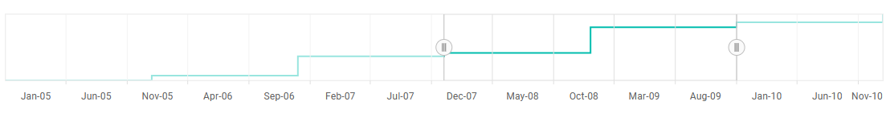

# Getting Started with Vue 3 Range Navigator

This article provides a step-by-step guide to setting up a [Vite](https://vitejs.dev) project using JavaScript and integrating the Syncfusion<sup style="font-size:70%">&reg;</sup> Vue Range Navigator component with either the [Composition API](https://vuejs.org/guide/introduction.html#composition-api) or the [Options API](https://vuejs.org/guide/introduction.html#options-api).

The **Composition API** groups related logic into reusable functions and is recommended for larger, composition-friendly code bases. The **Options API** uses `data`, `methods`, and life cycle options and may be preferable for smaller components or teams familiar with Vue 2 patterns. Choose the API that best fits your project's structure and long-term maintainability.

## Prerequisites

Ensure your development environment meets the following requirements as listed in https://ej2.syncfusion.com/vue/documentation/system-requirements.

## Set Up the Vite Project

Create a Vite project using either npm or yarn.

**npm**

```bash
npm create vite@latest my-app -- --template vue
```

**yarn**

```bash
yarn create vite my-app --template vue
```

If Vite prompts you to install dependencies and start the project immediately, select **No**. The Syncfusion package is installed in a later step.

Navigate to the project directory:

```bash
cd my-app
```

Install the project dependencies using either npm or yarn.

**npm**

```bash
npm install
```

**yarn**

```bash
yarn install
```

> **Note:** To create a TypeScript project, use `npm create vite@latest my-app -- --template vue-ts` or `yarn create vite my-app --template vue-ts`.

## Add Syncfusion<sup style="font-size:70%">&reg;</sup> Vue Package

Syncfusion<sup style="font-size:70%">&reg;</sup> Vue component packages are available at [npm](https://www.npmjs.com/search?q=ej2-vue). To use Syncfusion<sup style="font-size:70%">&reg;</sup> Vue components in the project, install the corresponding npm package.

 To use the Vue Range Navigator component in the project, install the `@syncfusion/ej2-vue-charts` package using either npm or yarn. The package is compatible with Vue 3.0 and later versions.

**npm**

```bash
npm install @syncfusion/ej2-vue-charts
```

**yarn**

```bash
yarn add @syncfusion/ej2-vue-charts
```

> **Note:** For TypeScript projects, refer to [Vue 3 with the Composition API and TypeScript](https://ej2.syncfusion.com/vue/documentation/getting-started/vue-3-ts-composition) or [Vue 3 with the Options API and TypeScript](https://ej2.syncfusion.com/vue/documentation/getting-started/vue-3-ts-options).

## Add Syncfusion<sup style="font-size:70%">&reg;</sup> Vue Range Navigator Component

Follow the steps below to add the Vue Range Navigator component using the `Composition API` or `Options API`.

**Step 1:** First, import and register the Range Navigator component and its child directives in the `script` section of **src/App.vue**. If using the `Composition API`, add the `setup` attribute to the `script` tag.




<script setup>
import { RangeNavigatorComponent as EjsRangenavigator, StepLineSeries, DateTime, RangenavigatorSeriesCollectionDirective as ERangenavigatorSeriesCollection, RangenavigatorSeriesDirective as ERangenavigatorSeries} from '@syncfusion/ej2-vue-charts';
</script>




<script>
import { RangeNavigatorComponent, StepLineSeries, DateTime, RangenavigatorSeriesCollectionDirective,
RangenavigatorSeriesDirective } from '@syncfusion/ej2-vue-charts';
// Register Range Navigator component and its child directives
export default {
  name: "App",
  components: {
    "ejs-rangenavigator": RangeNavigatorComponent,
    "e-rangenavigator-series-collection": RangenavigatorSeriesCollectionDirective,
    "e-rangenavigator-series": RangenavigatorSeriesDirective
  }
}
</script>




**Step 2:** Declare the data source and component configuration values in the `script` section.




<script setup>
const data = [
  { x: new Date('2005-01-01'), y: 21 },
  { x: new Date('2006-01-01'), y: 24 },
  { x: new Date('2007-01-01'), y: 36 },
  { x: new Date('2008-01-01'), y: 38 },
  { x: new Date('2009-01-01'), y: 54 },
  { x: new Date('2010-01-01'), y: 57 },
  { x: new Date('2011-01-01'), y: 62 }
];

const valueType = 'DateTime';
const value = [new Date('2008-01-01'), new Date('2010-01-01')];
const labelFormat = 'MMM-yy';
</script>




<script>
export default {
  data() {
    return {
      data: [
        { x: new Date('2005-01-01'), y: 21 },
        { x: new Date('2006-01-01'), y: 24 },
        { x: new Date('2007-01-01'), y: 36 },
        { x: new Date('2008-01-01'), y: 38 },
        { x: new Date('2009-01-01'), y: 54 },
        { x: new Date('2010-01-01'), y: 57 },
        { x: new Date('2011-01-01'), y: 62 }
      ],
      valueType: 'DateTime',
      value: [new Date('2008-01-01'), new Date('2010-01-01')],
      labelFormat: 'MMM-yy'
    };
  }
}
</script>




**Step 3:** In the `template` section, define the Range Navigator component and configure a series with the [`dataSource`](https://ej2.syncfusion.com/vue/documentation/api/range-navigator#datasource), [`xName`](https://ej2.syncfusion.com/vue/documentation/api/range-navigator/rangeNavigatorSeries#xname), and [`yName`](https://ej2.syncfusion.com/vue/documentation/api/range-navigator/rangeNavigatorSeries#yname) properties.




<template>
    <ejs-rangenavigator :valueType="valueType" :value="value" :labelFormat="labelFormat">
        <e-rangenavigator-series-collection>
            <e-rangenavigator-series :dataSource="data" type="StepLine" xName="x" yName="y" :width="2">
            </e-rangenavigator-series>
        </e-rangenavigator-series-collection>
    </ejs-rangenavigator>
</template>




Here is the summarized code for the above steps in the **src/App.vue** file.

> **Note:** The Composition API example uses an import alias for `RangeNavigatorComponent`, while the Options API example uses `RangeNavigatorComponent` directly. The names shown in each example match the corresponding imports.




<template>
    <ejs-rangenavigator :valueType="valueType" :value="value" :labelFormat="labelFormat">
        <e-rangenavigator-series-collection>
            <e-rangenavigator-series :dataSource="data" type="StepLine" xName="x" yName="y" :width="2">
            </e-rangenavigator-series>
        </e-rangenavigator-series-collection>
    </ejs-rangenavigator>
</template>

<script setup>
import { provide } from 'vue';
import { RangeNavigatorComponent as EjsRangenavigator, StepLineSeries, DateTime, RangenavigatorSeriesCollectionDirective as ERangenavigatorSeriesCollection, RangenavigatorSeriesDirective as ERangenavigatorSeries} from '@syncfusion/ej2-vue-charts';

const data = [
    { x: new Date('2005-01-01'), y: 21 },
    { x: new Date('2006-01-01'), y: 24 },
    { x: new Date('2007-01-01'), y: 36 },
    { x: new Date('2008-01-01'), y: 38 },
    { x: new Date('2009-01-01'), y: 54 },
    { x: new Date('2010-01-01'), y: 57 },
    { x: new Date('2011-01-01'), y: 62 }
];
const valueType = 'DateTime';
const value = [new Date('2008-01-01'), new Date('2010-01-01')];
const labelFormat = 'MMM-yy';
const rangeNavigator = [ DateTime, StepLineSeries ];
provide('rangeNavigator', rangeNavigator);
</script>




<template>
    <ejs-rangenavigator :valueType="valueType" :value="value" :labelFormat="labelFormat">
        <e-rangenavigator-series-collection>
            <e-rangenavigator-series :dataSource="data" type="StepLine" xName="x" yName="y" :width="2">
            </e-rangenavigator-series>
        </e-rangenavigator-series-collection>
    </ejs-rangenavigator>
</template>

<script>
import { RangeNavigatorComponent, StepLineSeries, DateTime, RangenavigatorSeriesCollectionDirective,
RangenavigatorSeriesDirective } from '@syncfusion/ej2-vue-charts';
//Component registration
export default {
  name: "App",
  components: {
    "ejs-rangenavigator": RangeNavigatorComponent,
    "e-rangenavigator-series-collection": RangenavigatorSeriesCollectionDirective,
    "e-rangenavigator-series":  RangenavigatorSeriesDirective
  },
    data() {
    return {
        data: [
            { x: new Date('2005-01-01'), y: 21 },
            { x: new Date('2006-01-01'), y: 24 },
            { x: new Date('2007-01-01'), y: 36 },
            { x: new Date('2008-01-01'), y: 38 },
            { x: new Date('2009-01-01'), y: 54 },
            { x: new Date('2010-01-01'), y: 57 },
            { x: new Date('2011-01-01'), y: 62 }
        ],
        valueType: 'DateTime',
        value: [new Date('2008-01-01'), new Date('2010-01-01')],
        labelFormat: 'MMM-yy'
    };
 },
    provide: {
        rangeNavigator: [ DateTime, StepLineSeries ]
    },
};
</script>




## Run the Project

To run the project, use either npm or yarn:

**npm**

```bash
npm run dev
```

**yarn**

```bash
yarn run dev
```

- Open the project URL shown in the terminal (usually `http://localhost:5173`) and verify that the Range Navigator displays.

The output will appear as follows:



> **Sample:** You can explore the complete sample project in the https://github.com/SyncfusionExamples/vue3-range-navigator-getting-started repository.

For migration information from Vue 2 to Vue 3, refer to the https://v3-migration.vuejs.org.

## Troubleshooting

- **The Range Navigator is not rendered.** Ensure that the required modules (`DateTime`, `StepLineSeries`) are injected using `provide()` in the Composition API or the `provide` option in the Options API. Verify that the data source is correctly assigned and check the browser console for any runtime errors.

- **The series type is not registered.** Confirm that the required series module, such as `StepLineSeries`, is imported from `@syncfusion/ej2-vue-charts` and added to the `rangeNavigator` collection in the `provide` configuration.

- **No data is displayed.** Verify that [`dataSource`](https://ej2.syncfusion.com/vue/documentation/api/range-navigator/rangeNavigatorSeries#datasource) contains records, ensure that [`xName`](https://ej2.syncfusion.com/vue/documentation/api/range-navigator/rangeNavigatorSeries#xname)and [`yName`](https://ej2.syncfusion.com/vue/documentation/api/range-navigator/rangeNavigatorSeries#yname) match the field names in the data source, and confirm that the field specified in `yName` contains numeric values.

- **Date-time values are not displayed correctly.** Set the [`valueType`](https://ej2.syncfusion.com/vue/documentation/api/range-navigator/rangeNavigatorModel#valuetype) property to `DateTime`, import and inject the `DateTime` module, and ensure that the data source contains valid JavaScript `Date` objects.

- **Console errors are displayed.** Verify that the `@syncfusion/ej2-vue-charts` package is installed correctly, ensure that the development server is running, and review the browser developer tools for import or runtime errors.

For additional assistance, refer to the [Vue Range Navigator API Documentation](https://ej2.syncfusion.com/vue/documentation/api/range-navigator).

## See Also

* [Getting Started with Vue UI Components using Composition API and TypeScript](https://ej2.syncfusion.com/vue/documentation/getting-started/vue-3-ts-composition)
* [Getting Started with Vue UI Components using Options API and TypeScript](https://ej2.syncfusion.com/vue/documentation/getting-started/vue-3-ts-options)