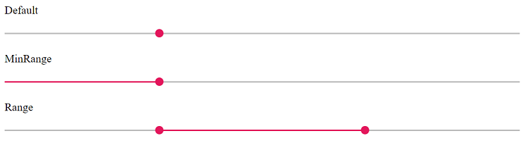
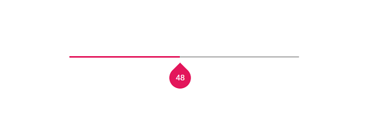
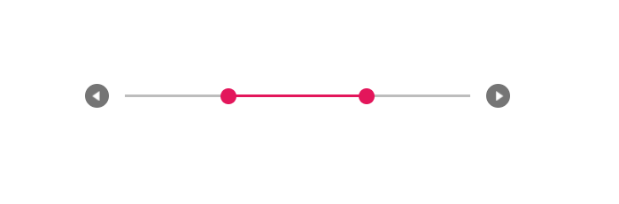

# Getting Started with Syncfusion Range Slider Component in Vue 3

This section explains how to use Range Slider component in Vue 3 application.

## Prerequisites

[System requirements for Syncfusion Vue UI components](https://ej2.syncfusion.com/vue/documentation/system-requirements/)

## Creating Vue application using Vue CLI

The easiest way to create a Vue application is to use the [`Vue CLI`](https://github.com/vuejs/vue-cli). Vue CLI versions above [`4.5.0`](https://v3.vuejs.org/guide/migration/introduction.html#vue-cli) are mandatory for creating applications using Vue 3. Use the following command to uninstall older versions of the Vue CLI.

```bash
npm uninstall vue-cli -g
```

Use the following commands to install the latest version of Vue CLI.

```bash
npm install -g @vue/cli
npm install -g @vue/cli-init
```

Create a new project using the command below.

```bash
vue create quickstart

```

Initiating a new project prompts us to choose the type of project to be used for the current application. Select the option `Default (Vue 3)` from the menu.


## Adding Syncfusion Range Slider package in the application

Syncfusion Vue packages are maintained in the [`npmjs.com`](https://www.npmjs.com/~syncfusionorg) registry.

The Range Slider component will be used in this example. To install it use the following command.

```bash
npm install @syncfusion/ej2-vue-inputs --save
```

## Adding CSS reference for Syncfusion Vue Range Slider component

Import the needed CSS styles for the Range Slider component along with dependency styles in the `<style>` section of the `src/App.vue` file as follows.

    ```
      <style>
        @import "../node_modules/@syncfusion/ej2-base/styles/material.css";
        @import "../node_modules/@syncfusion/ej2-buttons/styles/material.css";
        @import "../node_modules/@syncfusion/ej2-popups/styles/material.css";
        @import "../node_modules/@syncfusion/ej2-vue-inputs/styles/material.css";
      </style>
    ```

>Note: Range Slider component use other Syncfusion components too, the dependent component's CSS references need to be added for using all the Range Slider functionalities.

## Adding Syncfusion Vue Range Slider component in the application

You have completed all the necessary configurations needed for rendering the Syncfusion Vue component. Now, you are going to add the Range Slider component using following steps.

  1. Import the Range Slider component in the `<script>` section of the `src/App.vue` file.

     ```
      <script>
      import { SliderComponent } from '@syncfusion/ej2-vue-inputs';
      </script>
     ```
  2. Register the Range Slider component in `src/App.vue` file which are used in this example.

     ```js
      import { SliderComponent } from '@syncfusion/ej2-vue-inputs';
        //Component registeration
      export default {
          name: "App",
          components: {
            'ejs-slider' : SliderComponent
          }
      }
     ```
     In the above code snippet, you have registered Range Slider component.

  3. Add the component definition in template section.

     ```
      <template>
          <ejs-slider id='default' :value='value'></ejs-slider>
      </template>

     ```

     Above is the Range Slider component definition, with `value` property binding definition.

  4. Declare the bound properties in the `script` section and specify the value property in `data` method.

     ```js
      export default {
        name: 'App',
        components: {
          'ejs-slider' : SliderComponent
        },
        data() {
          return {
            value: 30
          };
        },
      };
     ```
  
  5. Summarizing the above steps, update the `src/App.vue` file with following code.

     ```
      <template>
        <div id="app">
          <ejs-slider id='default' :value='value'></ejs-slider>
        </div>
      </template>
      <script>
      import { SliderComponent } from '@syncfusion/ej2-vue-inputs';

      export default {
        name: 'App',
        components: {
          'ejs-slider' : SliderComponent
        },
        data() {
          return {
            value: 30
          };
        },
      };
      </script>
      <style>
        @import "../node_modules/@syncfusion/ej2-base/styles/material.css";
        @import "../node_modules/@syncfusion/ej2-buttons/styles/material.css";
        @import "../node_modules/@syncfusion/ej2-popups/styles/material.css";
        @import "../node_modules/@syncfusion/ej2-vue-inputs/styles/material.css";
      </style>
     ```

## Running the application

Run the application using the following command.

```bash
npm run serve
```

Web server will be initiated, Open the quick start app in the browser at port `localhost:8080`.


## Types

The types of Range Slider are as follows:

| **Types** | **Usage** |
| --- | --- |
| Default | Shows a default Range Slider to select a single value. |
| MinRange | Displays the shadow from the start value to the current selected value. |
| Range | Selects a range of values. It also displays the shadow in-between the selection range. |

>Both the Default Slider and Min-Range Slider have same behavior that is used to select a single value. In Min-Range Slider, a shadow is considered from the start value to current handle position. But the Range Slider contains two handles that is used to select a range of values and a shadow is considered in between the two handles.

In the following example demonstrates all types in Range Slider component.

    ```
      <template>
        <div id="app">
          <label class="labeltext">Default</label>
          <ejs-slider id='default' :value='minvalue'></ejs-slider>
          <label class="labeltext">MinRange</label>
          <ejs-slider id='default' :value='minvalue' :type="mintype"></ejs-slider>
          <label class="labeltext">Range</label>
          <ejs-slider id='type' :value='value' :type="type"></ejs-slider>
        </div>
      </template>
      <script>
      import { SliderComponent } from '@syncfusion/ej2-vue-inputs';

      export default {
        name: 'App',
        components: {
          'ejs-slider' : SliderComponent
        },
        data() {
          return {
            value: [30, 70],
            type: 'Range',
            mintype: 'MinRange',
            minvalue: 30
          };
        },
      };
      </script>
      <style>
        @import "../node_modules/@syncfusion/ej2-base/styles/material.css";
        @import "../node_modules/@syncfusion/ej2-buttons/styles/material.css";
        @import "../node_modules/@syncfusion/ej2-popups/styles/material.css";
        @import "../node_modules/@syncfusion/ej2-vue-inputs/styles/material.css";
      </style>
      ```

You can get the following output while using above code blocks in Range Slider component.



## Customization

### Orientation

The Range Slider can be displayed, either in horizontal or vertical orientation. By default, the Range Slider renders in horizontal orientation.

In the following example, `orientation` property set as `Vertical` in Range Slider component.

    ```
      <template>
        <div id="app">
          <ejs-slider id='orientation' :value='value' :orientation="orientation"></ejs-slider>
        </div>
      </template>
      <script>
      import { SliderComponent } from '@syncfusion/ej2-vue-inputs';

      export default {
        name: 'App',
        components: {
          'ejs-slider' : SliderComponent
        },
        data() {
          return {
            orientation: 'Vertical',
            value: 30
          };
        },
      };
      </script>
      <style>
        @import "../node_modules/@syncfusion/ej2-base/styles/material.css";
        @import "../node_modules/@syncfusion/ej2-buttons/styles/material.css";
        @import "../node_modules/@syncfusion/ej2-popups/styles/material.css";
        @import "../node_modules/@syncfusion/ej2-vue-inputs/styles/material.css";
        #app {
          color: #008cff;
          height: 340px;
          left: 30%;
          position: absolute;
          width: 50%;
        }
      </style>
      ```

You can get the following output while using above code blocks in Range Slider component.


### Tooltip

The Range Slider displays the tooltip to indicate the current value by clicking the Range Slider bar or drag the Range Slider handle. The Tooltip position can be customized by using the `placement` property. Also decides the tooltip display mode on a page, i.e., on hovering, focusing, or clicking on the Range Slider handle. Tooltip always remains/displays on the page.

In the following example, `tooltip` property is enabled in Range Slider component.

    ```
      <template>
        <div id="app">
          <ejs-slider id='tooltip' :value='value' :tooltip="tooltip" :type="type"></ejs-slider>
        </div>
      </template>
      <script>
      import { SliderComponent } from '@syncfusion/ej2-vue-inputs';

      export default {
        name: 'App',
        components: {
          'ejs-slider' : SliderComponent
        },
        data() {
          return {
            tooltip: { placement: 'After', isVisible: true, showOn: 'Always' },
            value: 30,
            type: 'MinRange'
          };
        },
      };
      </script>
      <style>
        @import "../node_modules/@syncfusion/ej2-base/styles/material.css";
        @import "../node_modules/@syncfusion/ej2-buttons/styles/material.css";
        @import "../node_modules/@syncfusion/ej2-popups/styles/material.css";
        @import "../node_modules/@syncfusion/ej2-vue-inputs/styles/material.css";
        #app {
          color: #008cff;
          height: 40px;
          left: 30%;
          position: absolute;
          top: 40%;
          width: 50%;
        }
      </style>
      ```

You can get the following output while using above code blocks in Range Slider component.



### Buttons

The Range Slider value can be changed by using the Increase and Decrease buttons. In Range Range Slider, by default the first handle value will be changed while clicking the button. Change the handle focus and press the button to change the last focused handle value.

> After enabling the Range Slider buttons if the 'Tab' key is pressed, the focus goes to the handle and not to the button.

In the following example, `showButtons` property is enabled in Range Slider component.

    ```
      <template>
        <div id="app">
          <ejs-slider id='buttons' :value='value' :showButtons="showButtons" :type="type"></ejs-slider>
        </div>
      </template>
      <script>
      import { SliderComponent } from '@syncfusion/ej2-vue-inputs';

      export default {
        name: 'App',
        components: {
          'ejs-slider' : SliderComponent
        },
        data() {
          return {
            showButtons: true,
            value: [30, 70],
            type: 'Range'
          };
        },
      };
      </script>
      <style>
        @import "../node_modules/@syncfusion/ej2-base/styles/material.css";
        @import "../node_modules/@syncfusion/ej2-buttons/styles/material.css";
        @import "../node_modules/@syncfusion/ej2-popups/styles/material.css";
        @import "../node_modules/@syncfusion/ej2-vue-inputs/styles/material.css";
        #app {
          color: #008cff;
          height: 40px;
          left: 30%;
          position: absolute;
          top: 40%;
          width: 50%;
        }
      </style>
      ```

You can get the following output while using above code blocks in Range Slider component.


