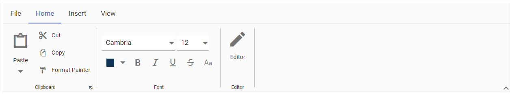

# Getting Started with Syncfusion Ribbon Component in Vue 3

This article provides a step-by-step guide for setting up a [Vite](https://vitejs.dev/) project with a JavaScript environment and integrating the Syncfusion Vue Ribbon component using the [Composition API](https://vuejs.org/guide/introduction.html#composition-api) / [Options API](https://vuejs.org/guide/introduction.html#options-api).

The `Composition API` is a new feature introduced in Vue.js 3 that provides an alternative way to organize and reuse component logic. It allows developers to write components as functions that use smaller, reusable functions called composition functions to manage their properties and behavior.

The `Options API` is the traditional way of writing Vue.js components, where the component logic is organized into a series of options that define the component's properties and behavior. These options include data, methods, computed properties, watchers, lifecycle hooks, and more.

## Prerequisites

[System requirements for Syncfusion Vue UI components](https://ej2.syncfusion.com/vue/documentation/system-requirements/)

## Set up the Vite project

A recommended approach for beginning with Vue is to scaffold a project using [Vite](https://vitejs.dev/). To create a new Vite project, use one of the commands that are specific to either NPM or Yarn.

```bash
npm create vite@latest
```

or

```bash
yarn create vite
```

Using one of the above commands will lead you to set up additional configurations for the project as below:

1.Define the project name: We can specify the name of the project directly. Let's specify the name of the project as `my-project` for this article.

```bash
? Project name: » my-project
```

2.Select `Vue` as the framework. It will create a Vue 3 project.

```bash
? Select a framework: » - Use arrow-keys. Return to submit.
Vanilla
> Vue
  React
  Preact
  Lit
  Svelte
  Others
```

3.Choose `JavaScript` as the framework variant to build this Vite project using JavaScript and Vue.

```bash
? Select a variant: » - Use arrow-keys. Return to submit.
> JavaScript
  TypeScript
  Customize with create-vue ↗
  Nuxt ↗
```

4.Upon completing the aforementioned steps to create the `my-project`, run the following command to install its dependencies:

```bash
cd my-project
npm install
```

or

```bash
cd my-project
yarn install
```

Now that `my-project` is ready to run with default settings, let's add Syncfusion components to the project.

## Add Syncfusion Vue packages

Syncfusion Vue component packages are available at [npmjs.com](https://www.npmjs.com/search?q=ej2-vue). To use Syncfusion Vue components in the project, install the corresponding npm package.

This article uses the [Vue Ribbon component](https://www.syncfusion.com/vue-components/vue-ribbon) as an example. To use the Vue Ribbon component in the project, the `@syncfusion/ej2-vue-ribbon` package needs to be installed using the following command:

```bash
npm install @syncfusion/ej2-vue-ribbon --save
```

or

```bash
yarn add @syncfusion/ej2-vue-ribbon
```

## Import Syncfusion CSS styles

You can import themes for the Syncfusion Vue component in various ways, such as using CSS or SASS styles from npm packages, CDN, [CRG](https://ej2.syncfusion.com/javascript/documentation/common/custom-resource-generator/) and [Theme Studio](https://ej2.syncfusion.com/vue/documentation/appearance/theme-studio/). Refer to [themes topic](https://ej2.syncfusion.com/vue/documentation/appearance/theme/) to know more about built-in themes and different ways to refer to themes in a Vue project.

In this article, `Material` theme is applied using CSS styles, which are available in installed packages. The necessary `Material` CSS styles for the Button component and its dependents were imported into the `<style>` section of **src/App.vue** file.




<style>
  @import "../node_modules/@syncfusion/ej2-base/styles/material.css";
  @import "../node_modules/@syncfusion/ej2-buttons/styles/material.css";  
  @import "../node_modules/@syncfusion/ej2-popups/styles/material.css";
  @import "../node_modules/@syncfusion/ej2-splitbuttons/styles/material.css";
  @import "../node_modules/@syncfusion/ej2-inputs/styles/material.css";
  @import "../node_modules/@syncfusion/ej2-lists/styles/material.css";
  @import "../node_modules/@syncfusion/ej2-dropdowns/styles/material.css";
  @import "../node_modules/@syncfusion/ej2-navigations/styles/material.css";
  @import "../node_modules/@syncfusion/ej2-vue-ribbon/styles/material.css";
</style>




## Add Syncfusion Vue component

Follow the below steps to add the Vue Ribbon component using `Composition API` or `Options API`:

### Importing the component, directives and required modules

First, import and register the Ribbon component, Ribbon directives and inject the required modules in the `<script>` section of the **src/App.vue** file.If you are using the `Composition API`, you should add the `setup` attribute to the `script` tag to indicate that Vue will be using the `Composition API`.




<script setup> 
  //Component, Directives registeration
  import { RibbonComponent as EjsRibbon, RibbonGroupDirective as ERibbonGroup, RibbonGroupsDirective as ERibbonGroups, RibbonCollectionsDirective as ERibbonCollections, RibbonCollectionDirective as ERibbonCollection, RibbonItemsDirective as ERibbonItems, RibbonItemDirective as ERibbonItems, RibbonTabsDirective as ERibbonTabs, RibbonTabDirective as ERibbonTab, RibbonFileMenu, RibbonColorPicker } from "@syncfusion/ej2-vue-ribbon";
  import { provide } from "vue";
  const ribbon = [RibbonFileMenu, RibbonColorPicker];
  provide('ribbon', ribbon);
</script> 




<script> 
  import { RibbonComponent, RibbonGroupDirective, RibbonGroupsDirective, RibbonCollectionsDirective, RibbonCollectionDirective, RibbonItemsDirective, RibbonItemDirective, RibbonTabsDirective, RibbonTabDirective,RibbonFileMenu, RibbonColorPicker } from "@syncfusion/ej2-vue-ribbon";
    //Component, Directives registeration
  export default {
      components: {
        'ejs-ribbon' : RibbonComponent,
        'e-ribbon-tabs': RibbonTabsDirective,
        'e-ribbon-tab': RibbonTabDirective,
        'e-ribbon-groups': RibbonGroupsDirective,
        'e-ribbon-group': RibbonGroupDirective,
        'e-ribbon-collections': RibbonCollectionsDirective,
        'e-ribbon-collection': RibbonCollectionDirective,
        'e-ribbon-items': RibbonItemsDirective,
        'e-ribbon-item': RibbonItemDirective
      },
      provide: {
      ribbon: [RibbonFileMenu, RibbonColorPicker]
    }
  }
</script> 




### Adding the Ribbon component

Add the component definition in `template` section.




<template>
  <ejs-ribbon id="ribbon"></ejs-ribbon>
</template>

<script setup>
  import { RibbonComponent as EjsRibbon} from "@syncfusion/ej2-vue-ribbon";
</script>
<style>
  @import "../node_modules/@syncfusion/ej2-base/styles/material.css";
  @import "../node_modules/@syncfusion/ej2-buttons/styles/material.css";  
  @import "../node_modules/@syncfusion/ej2-popups/styles/material.css";
  @import "../node_modules/@syncfusion/ej2-splitbuttons/styles/material.css";
  @import "../node_modules/@syncfusion/ej2-inputs/styles/material.css";
  @import "../node_modules/@syncfusion/ej2-lists/styles/material.css";
  @import "../node_modules/@syncfusion/ej2-dropdowns/styles/material.css";
  @import "../node_modules/@syncfusion/ej2-navigations/styles/material.css";
  @import "../node_modules/@syncfusion/ej2-vue-ribbon/styles/material.css";
</style>



<template>
  <ejs-ribbon id="ribbon"></ejs-ribbon>
</template>

<script>
  import { RibbonComponent } from "@syncfusion/ej2-vue-ribbon";
  export default {
    components: {
      "ejs-ribbon": RibbonComponent
    }
  }
</script>
<style>
  @import "../node_modules/@syncfusion/ej2-base/styles/material.css";
  @import "../node_modules/@syncfusion/ej2-buttons/styles/material.css";  
  @import "../node_modules/@syncfusion/ej2-popups/styles/material.css";
  @import "../node_modules/@syncfusion/ej2-splitbuttons/styles/material.css";
  @import "../node_modules/@syncfusion/ej2-inputs/styles/material.css";
  @import "../node_modules/@syncfusion/ej2-lists/styles/material.css";
  @import "../node_modules/@syncfusion/ej2-dropdowns/styles/material.css";
  @import "../node_modules/@syncfusion/ej2-navigations/styles/material.css";
  @import "../node_modules/@syncfusion/ej2-vue-ribbon/styles/material.css";
</style>




### Adding Ribbon Tab



<template>
  <ejs-ribbon id="ribbon">
    <e-ribbon-tabs>
      <e-ribbon-tab header="Home"></e-ribbon-tab>
    </e-ribbon-tabs>
  </ejs-ribbon>
</template>

<script setup>
  import { RibbonComponent as EjsRibbon, RibbonTabsDirective as ERibbonTabs, RibbonTabDirective as ERibbonTab } from "@syncfusion/ej2-vue-ribbon";
</script>
<style>
  @import "../node_modules/@syncfusion/ej2-base/styles/material.css";
  @import "../node_modules/@syncfusion/ej2-buttons/styles/material.css";  
  @import "../node_modules/@syncfusion/ej2-popups/styles/material.css";
  @import "../node_modules/@syncfusion/ej2-splitbuttons/styles/material.css";
  @import "../node_modules/@syncfusion/ej2-inputs/styles/material.css";
  @import "../node_modules/@syncfusion/ej2-lists/styles/material.css";
  @import "../node_modules/@syncfusion/ej2-dropdowns/styles/material.css";
  @import "../node_modules/@syncfusion/ej2-navigations/styles/material.css";
  @import "../node_modules/@syncfusion/ej2-vue-ribbon/styles/material.css";
</style>



<template>
  <ejs-ribbon id="ribbon">
    <e-ribbon-tabs>
      <e-ribbon-tab header="Home"></e-ribbon-tab>
    </e-ribbon-tabs>
  </ejs-ribbon>
</template>

<script>
  import { RibbonComponent, RibbonTabsDirective, RibbonTabDirective } from "@syncfusion/ej2-vue-ribbon";
  export default {
    components: {
      "ejs-ribbon": RibbonComponent,
      'e-ribbon-tabs': RibbonTabsDirective,
      'e-ribbon-tab': RibbonTabDirective
    }
  }
</script>
<style>
  @import "../node_modules/@syncfusion/ej2-base/styles/material.css";
  @import "../node_modules/@syncfusion/ej2-buttons/styles/material.css";  
  @import "../node_modules/@syncfusion/ej2-popups/styles/material.css";
  @import "../node_modules/@syncfusion/ej2-splitbuttons/styles/material.css";
  @import "../node_modules/@syncfusion/ej2-inputs/styles/material.css";
  @import "../node_modules/@syncfusion/ej2-lists/styles/material.css";
  @import "../node_modules/@syncfusion/ej2-dropdowns/styles/material.css";
  @import "../node_modules/@syncfusion/ej2-navigations/styles/material.css";
  @import "../node_modules/@syncfusion/ej2-vue-ribbon/styles/material.css";
</style>




### Adding Ribbon Group




<template>
  <ejs-ribbon id="ribbon">
    <e-ribbon-tabs>
      <e-ribbon-tab header="Home">
        <e-ribbon-groups>
          <e-ribbon-group header="Clipboard" orientation="Row"></e-ribbon-group>
        </e-ribbon-groups>
      </e-ribbon-tab>
    </e-ribbon-tabs>
  </ejs-ribbon>
</template>

<script setup>
  import { RibbonComponent as EjsRibbon, RibbonTabsDirective as EjsTabs, RibbonTabDirective as EjsTab, RibbonGroupDirective as EjsRibbonGroup, RibbonGroupsDirective as EjsRibbonGroups } from "@syncfusion/ej2-vue-ribbon";
</script>
<style>
  @import "../node_modules/@syncfusion/ej2-base/styles/material.css";
  @import "../node_modules/@syncfusion/ej2-buttons/styles/material.css";  
  @import "../node_modules/@syncfusion/ej2-popups/styles/material.css";
  @import "../node_modules/@syncfusion/ej2-splitbuttons/styles/material.css";
  @import "../node_modules/@syncfusion/ej2-inputs/styles/material.css";
  @import "../node_modules/@syncfusion/ej2-lists/styles/material.css";
  @import "../node_modules/@syncfusion/ej2-dropdowns/styles/material.css";
  @import "../node_modules/@syncfusion/ej2-navigations/styles/material.css";
  @import "../node_modules/@syncfusion/ej2-vue-ribbon/styles/material.css";
</style>




<template>
  <ejs-ribbon id="ribbon">
    <e-ribbon-tabs>
      <e-ribbon-tab header="Home">
        <e-ribbon-groups>
          <e-ribbon-group header="Clipboard" orientation="Row"></e-ribbon-group>
        </e-ribbon-groups>
      </e-ribbon-tab>
    </e-ribbon-tabs>
  </ejs-ribbon>
</template>

<script>
  import { RibbonComponent, RibbonTabsDirective, RibbonTabDirective, RibbonGroupDirective, RibbonGroupsDirective } from "@syncfusion/ej2-vue-ribbon";
  export default {
    components: {
      "ejs-ribbon": RibbonComponent,
      'e-ribbon-tabs': RibbonTabsDirective,
      'e-ribbon-tab': RibbonTabDirective,
      'e-ribbon-groups': RibbonGroupsDirective,
      'e-ribbon-group': RibbonGroupDirective
    }
  }
</script>
<style>
  @import "../node_modules/@syncfusion/ej2-base/styles/material.css";
  @import "../node_modules/@syncfusion/ej2-buttons/styles/material.css";  
  @import "../node_modules/@syncfusion/ej2-popups/styles/material.css";
  @import "../node_modules/@syncfusion/ej2-splitbuttons/styles/material.css";
  @import "../node_modules/@syncfusion/ej2-inputs/styles/material.css";
  @import "../node_modules/@syncfusion/ej2-lists/styles/material.css";
  @import "../node_modules/@syncfusion/ej2-dropdowns/styles/material.css";
  @import "../node_modules/@syncfusion/ej2-navigations/styles/material.css";
  @import "../node_modules/@syncfusion/ej2-vue-ribbon/styles/material.css";
</style>




The `orientation` property of ribbon group defines whether the collection of items will be rendered column-wise or row-wise.

### Adding Ribbon Items




<template>
  <ejs-ribbon id="ribbon">
    <e-ribbon-tabs>
      <e-ribbon-tab header="Home">
        <e-ribbon-groups>
          <e-ribbon-group header="Clipboard" orientation="Column">
            <e-ribbon-collections>
              <e-ribbon-collection id="paste-collection">
                <e-ribbon-items>
                  <e-ribbon-item type="SplitButton" :splitButtonSettings="pasteSettings"></e-ribbon-item>
                </e-ribbon-items>
              </e-ribbon-collection>
              <e-ribbon-collection id="cutcopy-collection">
                <e-ribbon-items>
                  <e-ribbon-item type="Button" :buttonSettings="cutButton"></e-ribbon-item>
                  <e-ribbon-item type="Button" :buttonSettings="copyButton"></e-ribbon-item>
                </e-ribbon-items>
              </e-ribbon-collection>
            </e-ribbon-collections>
          </e-ribbon-group>
        </e-ribbon-groups>
      </e-ribbon-tab>
    </e-ribbon-tabs>
  </ejs-ribbon>
</template>

<script setup>
  import { RibbonComponent as EjsRibbon, RibbonTabsDirective as ERibbonTabs, RibbonTabDirective as ERibbonTab, RibbonGroupDirective as ERibbonGroup, RibbonGroupsDirective as ERibbonGroups, RibbonCollectionsDirective as ERibbonCollections, RibbonCollectionDirective as ERibbonCollection, RibbonItemsDirective as ERibbonItems, RibbonItemDirective as ERibbonItem } from "@syncfusion/ej2-vue-ribbon";

  const pasteSettings = { 
    iconCss: "e-icons e-paste", content: "Paste",
    items: [{ text: "Keep Source Format" },
    { text: "Merge format" },
    { text: "Keep text only" }]
  }

  const cutButton = { iconCss: "e-icons e-cut", content: "Cut" }
  const copyButton = { iconCss: "e-icons e-copy", content: "Copy" }
  
</script>
<style>
  @import "../node_modules/@syncfusion/ej2-base/styles/material.css";
  @import "../node_modules/@syncfusion/ej2-buttons/styles/material.css";  
  @import "../node_modules/@syncfusion/ej2-popups/styles/material.css";
  @import "../node_modules/@syncfusion/ej2-splitbuttons/styles/material.css";
  @import "../node_modules/@syncfusion/ej2-inputs/styles/material.css";
  @import "../node_modules/@syncfusion/ej2-lists/styles/material.css";
  @import "../node_modules/@syncfusion/ej2-dropdowns/styles/material.css";
  @import "../node_modules/@syncfusion/ej2-navigations/styles/material.css";
  @import "../node_modules/@syncfusion/ej2-vue-ribbon/styles/material.css";
</style>




<template>
  <ejs-ribbon id="ribbon">
    <e-ribbon-tabs>
      <e-ribbon-tab header="Home">
        <e-ribbon-groups>
          <e-ribbon-group header="Clipboard" orientation="Column">
            <e-ribbon-collections>
              <e-ribbon-collection id="paste-collection">
                <e-ribbon-items>
                  <e-ribbon-item type="SplitButton" :splitButtonSettings="pasteSettings"></e-ribbon-item>
                </e-ribbon-items>
              </e-ribbon-collection>
              <e-ribbon-collection id="cutcopy-collection">
                <e-ribbon-items>
                  <e-ribbon-item type="Button" :buttonSettings="cutButton"></e-ribbon-item>
                  <e-ribbon-item type="Button" :buttonSettings="copyButton"></e-ribbon-item>
                </e-ribbon-items>
              </e-ribbon-collection>
            </e-ribbon-collections>
          </e-ribbon-group>
        </e-ribbon-groups>
      </e-ribbon-tab>
    </e-ribbon-tabs>
  </ejs-ribbon>
</template>

<script>
  import { RibbonComponent, RibbonTabsDirective, RibbonTabDirective, RibbonGroupDirective, RibbonGroupsDirective, RibbonCollectionsDirective, RibbonCollectionDirective, RibbonItemsDirective, RibbonItemDirective } from "@syncfusion/ej2-vue-ribbon";
  export default {
    components: {
      "ejs-ribbon": RibbonComponent,
      'e-ribbon-tabs': RibbonTabsDirective,
      'e-ribbon-tab': RibbonTabDirective,
      'e-ribbon-groups': RibbonGroupsDirective,
      'e-ribbon-group': RibbonGroupDirective,
      'e-ribbon-collections': RibbonCollectionsDirective,
      'e-ribbon-collection': RibbonCollectionDirective,
      'e-ribbon-items': RibbonItemsDirective,
      'e-ribbon-item': RibbonItemDirective
    },    
    data: function () {
      return {
        pasteSettings:{ 
          iconCss: "e-icons e-paste", content: "Paste",
          items: [{ text: "Keep Source Format" }, { text: "Merge format" }, { text: "Keep text only" }]
        },
        cutButton:  { iconCss: "e-icons e-cut", content: "Cut" },
        copyButton:  { iconCss: "e-icons e-copy", content: "Copy" },
      };
    }
  }
  
</script>
<style>
  @import "../node_modules/@syncfusion/ej2-base/styles/material.css";
  @import "../node_modules/@syncfusion/ej2-buttons/styles/material.css";  
  @import "../node_modules/@syncfusion/ej2-popups/styles/material.css";
  @import "../node_modules/@syncfusion/ej2-splitbuttons/styles/material.css";
  @import "../node_modules/@syncfusion/ej2-inputs/styles/material.css";
  @import "../node_modules/@syncfusion/ej2-lists/styles/material.css";
  @import "../node_modules/@syncfusion/ej2-dropdowns/styles/material.css";
  @import "../node_modules/@syncfusion/ej2-navigations/styles/material.css";
  @import "../node_modules/@syncfusion/ej2-vue-ribbon/styles/material.css";
</style>




The `type` property to specify the type of component to be rendered, like a button, a drop-down button, a combo box, and more.

Here is the summarized code for the above steps in the **src/App.vue** file:




<template>
  <ejs-ribbon :fileMenu="fileSettings">
    <e-ribbon-tabs>
      <e-ribbon-tab header="Home">
        <e-ribbon-groups>
          <e-ribbon-group header="Clipboard" groupIconCss="e-icons e-paste" :showLauncherIcon="true" >
            <e-ribbon-collections>
              <e-ribbon-collection>
                <e-ribbon-items>
                  <e-ribbon-item type="SplitButton" :allowedSizes="largeSize" :splitButtonSettings="pasteSettings" >
                  </e-ribbon-item>
                </e-ribbon-items>
              </e-ribbon-collection>
              <e-ribbon-collection>
                <e-ribbon-items>
                  <e-ribbon-item type="Button" :buttonSettings="cutButton">
                  </e-ribbon-item>
                  <e-ribbon-item type="Button" :buttonSettings="copyButton">
                  </e-ribbon-item>
                  <e-ribbon-item type="Button" :buttonSettings="formatButton">
                  </e-ribbon-item>
                </e-ribbon-items>
              </e-ribbon-collection>
            </e-ribbon-collections>
          </e-ribbon-group>
          <e-ribbon-group header="Font" orientation="Row" :enableGroupOverflow="true" :isCollapsible="false" groupIconCss="e-icons e-bold" cssClass="font-group" >
            <e-ribbon-collections>
              <e-ribbon-collection>
                <e-ribbon-items>
                  <e-ribbon-item type="ComboBox" :comboBoxSettings="styleOptions" >
                  </e-ribbon-item>
                  <e-ribbon-item type="ComboBox" :comboBoxSettings="sizeOptions">
                  </e-ribbon-item>
                </e-ribbon-items>
              </e-ribbon-collection>
              <e-ribbon-collection>
                <e-ribbon-items>
                  <e-ribbon-item type="ColorPicker" displayOptions="Simplified" :allowedSizes="smallSize" :colorPickerSettings="colorPicker" >
                  </e-ribbon-item>
                  <e-ribbon-item type="Button" :allowedSizes="smallSize" :buttonSettings="boldButton" >
                  </e-ribbon-item>
                  <e-ribbon-item type="Button" :allowedSizes="smallSize" :buttonSettings="italicButton">
                  </e-ribbon-item>
                  <e-ribbon-item type="Button" :allowedSizes="smallSize" :buttonSettings="underlineButton" >
                  </e-ribbon-item>
                  <e-ribbon-item type="Button" :allowedSizes="smallSize" :buttonSettings="strikethroughButton">
                  </e-ribbon-item>
                  <e-ribbon-item type="Button" :allowedSizes="smallSize" :buttonSettings="caseButton" >
                  </e-ribbon-item>
                </e-ribbon-items>
              </e-ribbon-collection>
            </e-ribbon-collections>
          </e-ribbon-group>
          <e-ribbon-group header="Editor" :isCollapsible="false" groupIconCss="e-icons e-edit" >
            <e-ribbon-collections>
              <e-ribbon-collection>
                <e-ribbon-items>
                  <e-ribbon-item type="Button" :allowedSizes="largeSize" :buttonSettings="editButton">
                  </e-ribbon-item>
                </e-ribbon-items>
              </e-ribbon-collection>
            </e-ribbon-collections>
          </e-ribbon-group>
        </e-ribbon-groups>
      </e-ribbon-tab>
      <e-ribbon-tab header="Insert">
        <e-ribbon-groups>
          <e-ribbon-group header="Tables" :isCollapsible=false>
            <e-ribbon-collections>
              <e-ribbon-collection>
                <e-ribbon-items>
                  <e-ribbon-item type="DropDown" :allowedSizes="largeSize" :dropDownSettings="tableSettings">
                  </e-ribbon-item>
                </e-ribbon-items>
              </e-ribbon-collection>
            </e-ribbon-collections>
          </e-ribbon-group>
          <e-ribbon-group header="Illustrations" id="illustration" orientation="Row" :enableGroupOverflow=true groupIconCss="e-icons e-image">
            <e-ribbon-collections>
              <e-ribbon-collection>
                <e-ribbon-items>
                  <e-ribbon-item type="Button" :buttonSettings="chartSettings">
                  </e-ribbon-item>
                </e-ribbon-items>
              </e-ribbon-collection>
            </e-ribbon-collections>
          </e-ribbon-group>
          <e-ribbon-group header="Media" :isCollapsible=false>
            <e-ribbon-collections>
              <e-ribbon-collection>
                <e-ribbon-items>
                  <e-ribbon-item type="Template" :itemTemplate="'ribbonTemplate'">
                    <template v-slot:ribbonTemplate = "{data}">
                      <span v-bind:class="'ribbonTemplate ' + data.activeSize"><span class="e-icons e-video"></span><span class="text">Video</span></span>
                    </template>
                  </e-ribbon-item>
                </e-ribbon-items>
              </e-ribbon-collection>
            </e-ribbon-collections>
          </e-ribbon-group>
        </e-ribbon-groups>
      </e-ribbon-tab>
      <e-ribbon-tab header="View">
        <e-ribbon-groups>
          <e-ribbon-group header="Views" orientation="Row" groupIconCss="e-icons e-print">
            <e-ribbon-collections>
              <e-ribbon-collection>
                <e-ribbon-items>
                  <e-ribbon-item type="Button" :buttonSettings="printSettings">
                  </e-ribbon-item>
                  <e-ribbon-item type="Button" :buttonSettings="layoutSettings">
                  </e-ribbon-item>
                </e-ribbon-items>
              </e-ribbon-collection>
            </e-ribbon-collections>
          </e-ribbon-group>
          <e-ribbon-group header="show" :isCollapsible=false>
            <e-ribbon-collections>
              <e-ribbon-collection>
                <e-ribbon-items>
                  <e-ribbon-item type="CheckBox" :checkBoxSettings="rulerSettings">
                  </e-ribbon-item>
                  <e-ribbon-item type="CheckBox" :checkBoxSettings="gridSettings">
                  </e-ribbon-item>
                  <e-ribbon-item type="CheckBox" :checkBoxSettings="navigationSettings">
                  </e-ribbon-item>
                </e-ribbon-items>
              </e-ribbon-collection>
            </e-ribbon-collections>
          </e-ribbon-group>
        </e-ribbon-groups>
      </e-ribbon-tab>
    </e-ribbon-tabs>
  </ejs-ribbon>
</template>

<script setup>
  import { RibbonComponent as EjsRibbon, RibbonFileMenu, RibbonItemSize, RibbonColorPicker, RibbonGroupDirective as ERibbonGroup, RibbonGroupsDirective as ERibbonGroups, RibbonCollectionsDirective as ERibbonCollections, RibbonCollectionDirective as ERibbonCollection, RibbonItemsDirective as ERibbonItems, RibbonItemDirective as ERibbonItem, RibbonTabsDirective as ERibbonTabs, RibbonTabDirective as ERibbonTab} from "@syncfusion/ej2-vue-ribbon";
  import { provide } from "vue";
  const ribbon = [RibbonFileMenu, RibbonColorPicker];
  provide('ribbon', ribbon);
  
  const largeSize = RibbonItemSize.Large;
  const smallSize = RibbonItemSize.Small;
  const fileSettings = {
    visible: true,
    menuItems: [
      { text: "New", iconCss: "e-icons e-file-new", id: "new" },
      { text: "Open", iconCss: "e-icons e-folder-open", id: "open" },
      { text: "Rename", iconCss: "e-icons e-rename", id: "rename" },
      { text: "Save as", iconCss: "e-icons e-save", id: "save" }
    ]
  };
  const pasteSettings = { 
    iconCss: "e-icons e-paste", content: "Paste",
    items: [{ text: "Keep Source Format" }, { text: "Merge format" }, { text: "Keep text only" }]
  };
  const cutButton = { iconCss: "e-icons e-cut", content: "Cut" };
  const copyButton = { iconCss: "e-icons e-copy", content: "Copy" };
  const formatButton = { iconCss: "e-icons e-format-painter", content: "Format Painter" };
  const styleOptions = {
    dataSource: ["Algerian", "Arial", "Calibri", "Cambria", "Cambria Math", "Courier New", "Candara", "Georgia", "Impact", "Segoe Print", "Segoe Script", "Segoe UI", "Symbol", "Times New Roman", "Verdana", "Windings" ],
    index: 3,
    width: "150px",
    allowFiltering: true
  };
  const sizeOptions = {
    dataSource: ["8", "9", "10", "11", "12", "14", "16", "18", "20", "22", "24", "26", "28", "36", "48", "72", "96" ],
    index: 4,
    width: "65px"
  };
  const boldButton = { iconCss: "e-icons e-bold", content: "Bold", isToggle: "true" };
  const italicButton = { iconCss: "e-icons e-italic", content: "Italic", isToggle: "true" };
  const underlineButton = { iconCss: "e-icons e-underline", content: "Underline", isToggle: "true" };
  const strikethroughButton = { iconCss: "e-icons e-strikethrough", content: "Strikethrough", isToggle: "true" };
  const caseButton = { iconCss: "e-icons e-change-case", content: "Change Case", isToggle: "true" };
  const colorPicker = { value: "#123456" };
  const editButton = { iconCss: "e-icons e-edit", content: "Editor" };
  const tableSettings = { 
    iconCss: "e-icons e-table", content: "Table", isDropDownButton: true,
    items: [{ text: "Insert Table" }, { text: "Draw Table" }, { text: "Convert Table" }, { text: "Excel SpreadSheet" }]
  };
  const chartSettings = { iconCss: "e-icons e-chart", content: "Chart" };
  const  printSettings = { iconCss: "e-icons e-print-layout", content: "Print Layout" };
  const  layoutSettings = { iconCss: "e-icons e-web-layout", content: "Web Layout" };
  const  rulerSettings =  { label: "Ruler", checked: false };
  const  gridSettings =  { label: "Gridlines", checked: false };
  const  navigationSettings =  { label: "Navigation Pane", checked: true };   

</script>

<style>
  @import "../node_modules/@syncfusion/ej2-base/styles/material.css";
  @import "../node_modules/@syncfusion/ej2-buttons/styles/material.css";  
  @import "../node_modules/@syncfusion/ej2-popups/styles/material.css";
  @import "../node_modules/@syncfusion/ej2-splitbuttons/styles/material.css";
  @import "../node_modules/@syncfusion/ej2-inputs/styles/material.css";
  @import "../node_modules/@syncfusion/ej2-lists/styles/material.css";
  @import "../node_modules/@syncfusion/ej2-dropdowns/styles/material.css";
  @import "../node_modules/@syncfusion/ej2-navigations/styles/material.css";
  @import "../node_modules/@syncfusion/ej2-vue-ribbon/styles/material.css";
  
  .ribbonTemplate {
    display: flex;
    align-items: center;
    justify-content: center;
    cursor: pointer;
  }

  .ribbonTemplate.Large {
    flex-direction: column;
  }

  .ribbonTemplate.Large .e-icons {
    font-size: 35px;
  }

  .ribbonTemplate.Medium .e-icons,
  .ribbonTemplate.Small .e-icons{
    font-size: 20px;
    margin: 15px 5px;
  }

  .ribbonTemplate.Small .text {
    display:none;
  }

  .font-group .e-ribbon-group-content {
    justify-content: center;
  }

</style>




<template>
  <ejs-ribbon :fileMenu="fileSettings">
    <e-ribbon-tabs>
      <e-ribbon-tab header="Home">
        <e-ribbon-groups>
          <e-ribbon-group header="Clipboard" groupIconCss="e-icons e-paste" :showLauncherIcon="true" >
            <e-ribbon-collections>
              <e-ribbon-collection>
                <e-ribbon-items>
                  <e-ribbon-item type="SplitButton" :allowedSizes="largeSize" :splitButtonSettings="pasteSettings" >
                  </e-ribbon-item>
                </e-ribbon-items>
              </e-ribbon-collection>
              <e-ribbon-collection>
                <e-ribbon-items>
                  <e-ribbon-item type="Button" :buttonSettings="cutButton">
                  </e-ribbon-item>
                  <e-ribbon-item type="Button" :buttonSettings="copyButton">
                  </e-ribbon-item>
                  <e-ribbon-item type="Button" :buttonSettings="formatButton">
                  </e-ribbon-item>
                </e-ribbon-items>
              </e-ribbon-collection>
            </e-ribbon-collections>
          </e-ribbon-group>
          <e-ribbon-group header="Font" orientation="Row" :enableGroupOverflow="true" :isCollapsible="false" groupIconCss="e-icons e-bold" cssClass="font-group" >
            <e-ribbon-collections>
              <e-ribbon-collection>
                <e-ribbon-items>
                  <e-ribbon-item type="ComboBox" :comboBoxSettings="styleOptions" >
                  </e-ribbon-item>
                  <e-ribbon-item type="ComboBox" :comboBoxSettings="sizeOptions">
                  </e-ribbon-item>
                </e-ribbon-items>
              </e-ribbon-collection>
              <e-ribbon-collection>
                <e-ribbon-items>
                  <e-ribbon-item type="ColorPicker" displayOptions="Simplified" :allowedSizes="smallSize" :colorPickerSettings="colorPicker" >
                  </e-ribbon-item>
                  <e-ribbon-item type="Button" :allowedSizes="smallSize" :buttonSettings="boldButton" >
                  </e-ribbon-item>
                  <e-ribbon-item type="Button" :allowedSizes="smallSize" :buttonSettings="italicButton">
                  </e-ribbon-item>
                  <e-ribbon-item type="Button" :allowedSizes="smallSize" :buttonSettings="underlineButton" >
                  </e-ribbon-item>
                  <e-ribbon-item type="Button" :allowedSizes="smallSize" :buttonSettings="strikethroughButton">
                  </e-ribbon-item>
                  <e-ribbon-item type="Button" :allowedSizes="smallSize" :buttonSettings="caseButton" >
                  </e-ribbon-item>
                </e-ribbon-items>
              </e-ribbon-collection>
            </e-ribbon-collections>
          </e-ribbon-group>
          <e-ribbon-group header="Editor" :isCollapsible="false" groupIconCss="e-icons e-edit" >
            <e-ribbon-collections>
              <e-ribbon-collection>
                <e-ribbon-items>
                  <e-ribbon-item type="Button" :allowedSizes="largeSize" :buttonSettings="editButton">
                  </e-ribbon-item>
                </e-ribbon-items>
              </e-ribbon-collection>
            </e-ribbon-collections>
          </e-ribbon-group>
        </e-ribbon-groups>
      </e-ribbon-tab>
      <e-ribbon-tab header="Insert">
        <e-ribbon-groups>
          <e-ribbon-group header="Tables" :isCollapsible=false>
            <e-ribbon-collections>
              <e-ribbon-collection>
                <e-ribbon-items>
                  <e-ribbon-item type="DropDown" :allowedSizes="largeSize" :dropDownSettings="tableSettings">
                  </e-ribbon-item>
                </e-ribbon-items>
              </e-ribbon-collection>
            </e-ribbon-collections>
          </e-ribbon-group>
          <e-ribbon-group header="Illustrations" id="illustration" orientation="Row" :enableGroupOverflow=true groupIconCss="e-icons e-image">
            <e-ribbon-collections>
              <e-ribbon-collection>
                <e-ribbon-items>
                  <e-ribbon-item type="Button" :buttonSettings="chartSettings">
                  </e-ribbon-item>
                </e-ribbon-items>
              </e-ribbon-collection>
            </e-ribbon-collections>
          </e-ribbon-group>
          <e-ribbon-group header="Media" :isCollapsible=false>
            <e-ribbon-collections>
              <e-ribbon-collection>
                <e-ribbon-items>
                  <e-ribbon-item type="Template" :itemTemplate="'ribbonTemplate'">
                    <template v-slot:ribbonTemplate = "{data}">
                      <span v-bind:class="'ribbonTemplate ' + data.activeSize"><span class="e-icons e-video"></span><span class="text">Video</span></span>
                    </template>
                  </e-ribbon-item>
                </e-ribbon-items>
              </e-ribbon-collection>
            </e-ribbon-collections>
          </e-ribbon-group>
        </e-ribbon-groups>
      </e-ribbon-tab>
      <e-ribbon-tab header="View">
        <e-ribbon-groups>
          <e-ribbon-group header="Views" orientation="Row" groupIconCss="e-icons e-print">
            <e-ribbon-collections>
              <e-ribbon-collection>
                <e-ribbon-items>
                  <e-ribbon-item type="Button" :buttonSettings="printSettings">
                  </e-ribbon-item>
                  <e-ribbon-item type="Button" :buttonSettings="layoutSettings">
                  </e-ribbon-item>
                </e-ribbon-items>
              </e-ribbon-collection>
            </e-ribbon-collections>
          </e-ribbon-group>
          <e-ribbon-group header="show" :isCollapsible=false>
            <e-ribbon-collections>
              <e-ribbon-collection>
                <e-ribbon-items>
                  <e-ribbon-item type="CheckBox" :checkBoxSettings="rulerSettings">
                  </e-ribbon-item>
                  <e-ribbon-item type="CheckBox" :checkBoxSettings="gridSettings">
                  </e-ribbon-item>
                  <e-ribbon-item type="CheckBox" :checkBoxSettings="navigationSettings">
                  </e-ribbon-item>
                </e-ribbon-items>
              </e-ribbon-collection>
            </e-ribbon-collections>
          </e-ribbon-group>
        </e-ribbon-groups>
      </e-ribbon-tab>
    </e-ribbon-tabs>
  </ejs-ribbon>
</template>

<script>
  import { RibbonComponent, RibbonFileMenu, RibbonItemSize, RibbonColorPicker, RibbonGroupDirective, RibbonGroupsDirective, RibbonCollectionsDirective, RibbonCollectionDirective, RibbonItemsDirective, RibbonItemDirective, RibbonTabsDirective, RibbonTabDirective } from "@syncfusion/ej2-vue-ribbon";
  export default {
    components: {
      "ejs-ribbon": RibbonComponent,
      'e-ribbon-tabs': RibbonTabsDirective,
      'e-ribbon-tab': RibbonTabDirective,
      'e-ribbon-groups': RibbonGroupsDirective,
      'e-ribbon-group': RibbonGroupDirective,
      'e-ribbon-collections': RibbonCollectionsDirective,
      'e-ribbon-collection': RibbonCollectionDirective,
      'e-ribbon-items': RibbonItemsDirective,
      'e-ribbon-item': RibbonItemDirective
    },
    provide: {
      ribbon: [RibbonFileMenu, RibbonColorPicker]
    },  
    data: function () {
      return {
        largeSize: RibbonItemSize.Large,
        smallSize: RibbonItemSize.Small,
        fileSettings: {
          visible: true,
          menuItems: [
            { text: "New", iconCss: "e-icons e-file-new", id: "new" },
            { text: "Open", iconCss: "e-icons e-folder-open", id: "open" },
            { text: "Rename", iconCss: "e-icons e-rename", id: "rename" },
            { text: "Save as", iconCss: "e-icons e-save", id: "save" }
          ]
        },
        pasteSettings:{ 
          iconCss: "e-icons e-paste", content: "Paste",
          items: [{ text: "Keep Source Format" }, { text: "Merge format" }, { text: "Keep text only" }]
        },
        cutButton:  { iconCss: "e-icons e-cut", content: "Cut" },
        copyButton:  { iconCss: "e-icons e-copy", content: "Copy" },
        formatButton:  { iconCss: "e-icons e-format-painter", content: "Format Painter" },
        styleOptions: {
          dataSource: ["Algerian", "Arial", "Calibri", "Cambria", "Cambria Math", "Courier New", "Candara", "Georgia", "Impact", "Segoe Print", "Segoe Script", "Segoe UI", "Symbol", "Times New Roman", "Verdana", "Windings" ],
          index: 3,
          width: "150px",
          allowFiltering: true
        },
        sizeOptions: {
          dataSource: ["8", "9", "10", "11", "12", "14", "16", "18", "20", "22", "24", "26", "28", "36", "48", "72", "96" ],
          index: 4,
          width: "65px"
        },
        boldButton:  { iconCss: "e-icons e-bold", content: "Bold", isToggle: "true" },
        italicButton:  { iconCss: "e-icons e-italic", content: "Italic", isToggle: "true" },
        underlineButton:  { iconCss: "e-icons e-underline", content: "Underline", isToggle: "true" },
        strikethroughButton:  { iconCss: "e-icons e-strikethrough", content: "Strikethrough", isToggle: "true" },
        caseButton:  { iconCss: "e-icons e-change-case", content: "Change Case", isToggle: "true" },
        colorPicker: {value: "#123456" },
        editButton: { iconCss: "e-icons e-edit", content: "Editor" },
        tableSettings:{ 
          iconCss: "e-icons e-table", content: "Table", isDropDownButton: true,
          items: [{ text: "Insert Table" }, { text: "Draw Table" }, { text: "Convert Table" }, { text: "Excel SpreadSheet" }]
        },
        chartSettings: { iconCss: "e-icons e-chart", content: "Chart" },
        printSettings: { iconCss: "e-icons e-print-layout", content: "Print Layout" },
        layoutSettings: { iconCss: "e-icons e-web-layout", content: "Web Layout" },
        rulerSettings:  { label: "Ruler", checked: false },
        gridSettings:  { label: "Gridlines", checked: false },
        navigationSettings:  { label: "Navigation Pane", checked: true },      
      };
    }
  };
</script>

<style>
  @import "../node_modules/@syncfusion/ej2-base/styles/material.css";
  @import "../node_modules/@syncfusion/ej2-buttons/styles/material.css";  
  @import "../node_modules/@syncfusion/ej2-popups/styles/material.css";
  @import "../node_modules/@syncfusion/ej2-splitbuttons/styles/material.css";
  @import "../node_modules/@syncfusion/ej2-inputs/styles/material.css";
  @import "../node_modules/@syncfusion/ej2-lists/styles/material.css";
  @import "../node_modules/@syncfusion/ej2-dropdowns/styles/material.css";
  @import "../node_modules/@syncfusion/ej2-navigations/styles/material.css";
  @import "../node_modules/@syncfusion/ej2-vue-ribbon/styles/material.css";
  
  .ribbonTemplate {
    display: flex;
    align-items: center;
    justify-content: center;
    cursor: pointer;
  }

  .ribbonTemplate.Large {
    flex-direction: column;
  }

  .ribbonTemplate.Large .e-icons {
    font-size: 35px;
  }

  .ribbonTemplate.Medium .e-icons,
  .ribbonTemplate.Small .e-icons{
    font-size: 20px;
    margin: 15px 5px;
  }

  .ribbonTemplate.Small .text {
    display:none;
  }

  .font-group .e-ribbon-group-content {
    justify-content: center;
  }

</style>

## Run the project

To run the project, use the following command:

```bash
npm run dev
```

or

```bash
yarn run dev
```

The output will appear as follows:




For migrating from Vue 2 to Vue 3, refer to the [migration](https://ej2.syncfusion.com/vue/documentation/getting-started/vue3-tutorial/#migration-from-vue-2-to-vue-3) documentation.

## See also

* [Getting Started with Vue UI Components using Composition API and TypeScript](../getting-started/vue-3-ts-composition.md)
* [Getting Started with Vue UI Components using Options API and TypeScript](../getting-started/vue-3-ts-options.md)
