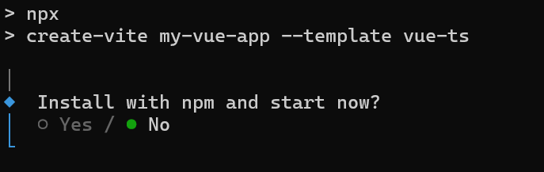

# Getting Started with Vue Rich Text Editor

The [Vue Rich Text Editor](https://www.syncfusion.com/vue-components/vue-wysiwyg-rich-text-editor) is a WYSIWYG (What You See Is What You Get) editor that enables users to create, edit, and format rich text content with features like multimedia insertion, lists, and links. This article provides a step-by-step guide for setting up a [Vite](https://vitejs.dev/) project with a TypeScript environment and integrating the Vue Rich Text Editor component using the [Composition API](https://vuejs.org/guide/introduction.html#composition-api).

To get started quickly with the Vue Rich Text Editor, refer to this video tutorial:



## Prerequisites

This guide uses Vite as the bundler and development environment. Install Node.js 24.13.0 or higher before proceeding. For detailed information about Vite’s capabilities and configuration options, refer to the [Vite documentation](https://vitejs.dev/).

## Create a Vue Application

To set-up a Vue application , run the following command.

```bash
npm create vite@latest my-app -- --template vue-ts
```
This command will prompt you to install the required packages and start the application. Select the options as shown below.



As Syncfusion packages are not installed yet, currently, the `No` option will be selected. Then, navigate to the project directory and install the dependencies using the following commands:

```
cd my-app
npm install
```

## Adding Syncfusion Rich Text Editor package

All available Essential JS 2 packages are published in the [npmjs.com](https://www.npmjs.com/search?q=ej2-vue) registry. Install the Vue Rich Text Editor component with the following command:


```bash
npm install @syncfusion/ej2-vue-richtexteditor
```

## Adding CSS reference

Syncfusion provides multiple themes for the Rich Text Editor component. For a complete list of available themes, refer to the [themes packages](https://ej2.syncfusion.com/vue/documentation/appearance/theme#theme-packages). 

To apply the [Tailwind 3](https://www.npmjs.com/package/@syncfusion/ej2-tailwind3-theme) theme, install the corresponding theme package by using the following command:

```bash
npm install @syncfusion/ej2-tailwind3-theme
```

The installed theme package includes an `index.css` file that automatically imports all the required dependency styles. Import the following stylesheet into `src/style.css`.

```css
@import '../node_modules/@syncfusion/ej2-tailwind3-theme/styles/rich-text-editor/index.css';
```

I> To apply the application-specific styles correctly remove all the default styles from **src/style.css**.

## Module Injection

The following modules provide the basic features of the Rich Text Editor.

* **HtmlEditor** - Inject this module to use Rich Text Editor as html editor.
* **Image** - Inject this module to use image feature in Rich Text Editor.
* **Link** - Inject this module to use link feature in Rich Text Editor.
* **QuickToolbar** - Inject this module to use quick toolbar feature for the target element.
* **Toolbar** - Inject this module to use Toolbar feature.

I> Additional feature modules are available [here](https://ej2.syncfusion.com/vue/documentation/rich-text-editor/module).

## Adding Rich Text Editor component

Now, you can start adding Vue Rich Text Editor component in the application. For getting started, add the Rich Text Editor component in **src/App.vue** file using following sample.















## Run the application

Use the following command to run the application in the browser.

```bash
npm run dev
```

## See also

* [Accessibility in Rich text editor](https://ej2.syncfusion.com/vue/documentation/rich-text-editor/accessibility)
* [Keyboard support in Rich text editor](https://ej2.syncfusion.com/vue/documentation/rich-text-editor/keyboard-support)
* [Globalization in Rich text editor](https://ej2.syncfusion.com/vue/documentation/rich-text-editor/globalization)

For migrating from Vue 2 to Vue 3, refer to the [`migration`](https://ej2.syncfusion.com/vue/documentation/getting-started/vue-3-vue-cli#migration-from-vue-2-to-vue-3) documentation.

N> Looking for the full Vue Rich Text Editor component overview, features, pricing, and documentation? Visit the [Vue Rich Text Editor](https://www.syncfusion.com/vue-components/vue-wysiwyg-rich-text-editor) page.