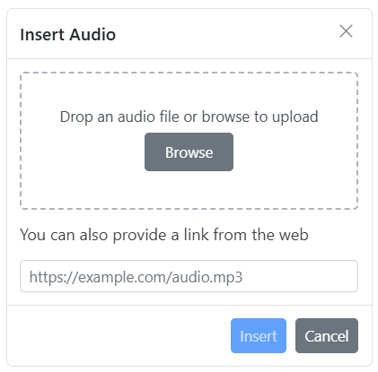
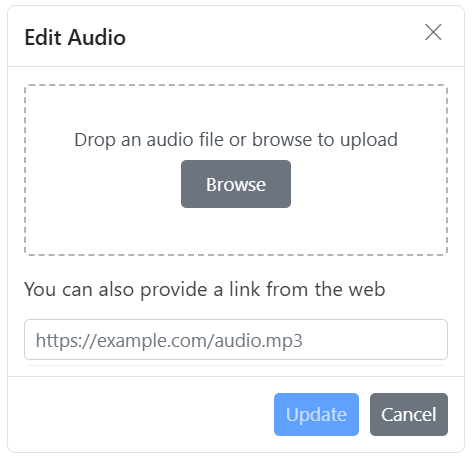
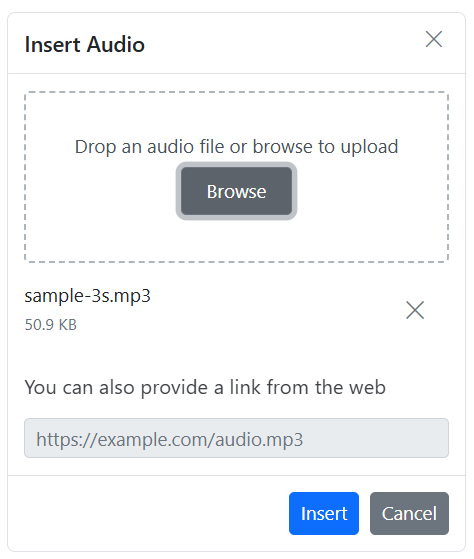

# Audios in Vue Rich Text Editor Component

The Rich Text Editor allows you to insert audio from online sources and local computers and then insert them into your content. You can insert the audio with the following list of options in the [insertAudioSettings](https://ej2.syncfusion.com/vue/documentation/api/rich-text-editor/#insertaudiosettings) property.

## Configuring the audio tool in the toolbar

You can add an `Audio` tool in the Rich Text Editor toolbar using the `toolbarSettings` [items](https://ej2.syncfusion.com/vue/documentation/api/rich-text-editor/toolbarSettings/#items) property.

> Rich Text Editor features are segregated into individual feature-wise modules. To use audio, inject the `Audio` module in `provides` section.

To configure the `Audio` toolbar item, refer to the below code.









        


## Audio save formats

The audio files can be saved as `Blob` or `Base64` URL by using the [insertAudioSettings.saveFormat](https://ej2.syncfusion.com/vue/documentation/api/rich-text-editor/audioSettingsModel/#saveformat) property, which is of enum type, and the generated URL will be set to the `src` attribute of the `<source>` tag.

> The default `saveFormat` property is set to `Blob` format.

```HTML

<audio>
    <source src="blob:http://ej2.syncfusion.com/3ab56a6e-ec0d-490f-85a5-f0aeb0ad8879" type="audio/mp3" >
</audio>

<audio>
    <source src="data:audio/mp3;base64,iVBORw0KGgoAAAANSUhEUgAAADAAAAAwCAYAAABXAvmHA" type="audio/mp3" >
</audio>

```

## Insert audio from the Web

You can insert audio from either the hosted link or the local machine, by clicking the audio button in the editor's toolbar. On clicking the audio button, a dialog opens, which allows you to insert audio from the web URL.

### Inserting audio from web URLs

By default, the audio tool opens the audio dialog, allowing you to insert audio from an online source. Inserting the URL will be added to the `src` attribute of the `<source>` tag.



## Uploading audio from local machine

You can use the `browse` option on the audio dialog, to select the audio from the local machine and insert it into the Rich Text Editor content.

If the path field is not specified in the [insertAudioSettings](https://ej2.syncfusion.com/vue/documentation/api/rich-text-editor/#insertaudiosettings), the audio will be converted into the `Blob` URL or `Base64` and inserted inside the Rich Text Editor.

## Saving audio to the server 

[saveFormat](https://ej2.syncfusion.com/vue/documentation/api/rich-text-editor/audioSettings/#saveformat) Sets the default save format of the audio element when inserted. Possible options are: `Blob` and `Base64`.

[saveUrl](https://ej2.syncfusion.com/vue/documentation/api/rich-text-editor/audioSettings/#saveurl) provides URL to map the action result method to save the audio.

[removeUrl](https://ej2.syncfusion.com/vue/documentation/api/rich-text-editor/audioSettings/#removeurl) provides URL to map the action result method to remove the audio.

### Server-side action

The selected audio can be uploaded to the required destination using the controller action below. Map this method name in [insertAudioSettings.saveUrl](https://ej2.syncfusion.com/vue/documentation/api/rich-text-editor/audioSettingsModel/#saveurl) and provide the required destination path through [insertAudioSettings.path](https://ej2.syncfusion.com/vue/documentation/api/rich-text-editor/audioSettingsModel/#path) properties.

> If you want to insert lower-sized audio files in the editor and don't want a specific physical location for saving the audio, you can opt to save the format as `Base64`.

In the following code blocks, the audio module has been injected and can insert the audio files saved in the specified path.


```
<template>
    <div>
        <div class="control-section">
            <div class="sample-container">
                <div class="default-section">
                    <ejs-richtexteditor ref="rteObj" :height="340" :toolbarSettings="toolbarSettings"
                        :insertAudioSettings="insertAudioSettings">
                    </ejs-richtexteditor>
                </div>
            </div>
        </div>
    </div>
</template>

<script setup>
import { provide } from 'vue';
import { RichTextEditorComponent as EjsRichtexteditor, Toolbar, Link, Audio, HtmlEditor, QuickToolbar } from "@syncfusion/ej2-vue-richtexteditor";

const toolbarSettings = {
    items: ['Audio']
};
const insertAudioSettings = {
    saveUrl: "[SERVICE_HOSTED_PATH]/api/uploadbox/SaveFiles",
    path: "[SERVICE_HOSTED_PATH]/Files/"
};
provide('richtexteditor', [Toolbar, Link, Audio, HtmlEditor, QuickToolbar]);
</script>

<style>
@import '../node_modules/@syncfusion/ej2-base/styles/material.css';  
@import '../node_modules/@syncfusion/ej2-buttons/styles/material.css';  
@import '../node_modules/@syncfusion/ej2-calendars/styles/material.css';  
@import '../node_modules/@syncfusion/ej2-dropdowns/styles/material.css';  
@import '../node_modules/@syncfusion/ej2-inputs/styles/material.css';
@import '../node_modules/@syncfusion/ej2-navigations/styles/material.css';
@import '../node_modules/@syncfusion/ej2-lists/styles/material.css';
@import '../node_modules/@syncfusion/ej2-layouts/styles/material.css';
@import '../node_modules/@syncfusion/ej2-popups/styles/material.css';
@import '../node_modules/@syncfusion/ej2-splitbuttons/styles/material.css';
@import '../node_modules/@syncfusion/ej2-grids/styles/material.css';
@import '../node_modules/@syncfusion/ej2-richtexteditor/styles/material.css';
@import '../node_modules/@syncfusion/ej2-treegrid/styles/material.css';
@import "../node_modules/@syncfusion/ej2-vue-gantt/styles/material.css";
</style>

```

```c#

using System;
using System.IO;
using FileUpload.Models;
using System.Diagnostics;
using System.Net.Http.Headers;
using Microsoft.AspNetCore.Mvc;
using Microsoft.AspNetCore.Http;
using System.Collections.Generic;
using Microsoft.AspNetCore.Hosting;

namespace FileUpload.Controllers
{
    public class HomeController : Controller
    {
        private IHostingEnvironment hostingEnv;

        public HomeController(IHostingEnvironment env)
        {
            hostingEnv = env;
        }

        public IActionResult Index()
        {
            return View();
        }

        [AcceptVerbs("Post")]
        public void SaveFiles(IList<IFormFile> UploadFiles)
        {
            try
            {
                foreach (IFormFile file in UploadFiles)
                {
                    if (UploadFiles != null)
                    {
                        string filename = ContentDispositionHeaderValue.Parse(file.ContentDisposition).FileName.Trim('"');
                        filename = hostingEnv.WebRootPath + "\\Files" + $@"\{filename}";

                        // Create a new directory, if it does not exists
                        if (!Directory.Exists(hostingEnv.WebRootPath + "\\Files"))
                        {
                            Directory.CreateDirectory(hostingEnv.WebRootPath + "\\Files");
                        }

                        if (!System.IO.File.Exists(filename))
                        {
                            using (FileStream fs = System.IO.File.Create(filename))
                            {
                                file.CopyTo(fs);
                                fs.Flush();
                            }
                            Response.StatusCode = 200;
                        }
                    }
                }
            }
            catch (Exception)
            {
                Response.StatusCode = 204;
            }
        }

        [ResponseCache(Duration = 0, Location = ResponseCacheLocation.None, NoStore = true)]
        public IActionResult Error()
        {
            return View(new ErrorViewModel { RequestId = Activity.Current?.Id ?? HttpContext.TraceIdentifier });
        }
    }
}

```

### Renaming audio before inserting

You can use the [insertAudioSettings](https://ej2.syncfusion.com/vue/documentation/api/rich-text-editor/#insertaudiosettings) property, to specify the server handler to upload the selected audio. Then by binding the [fileUploadSuccess](https://ej2.syncfusion.com/vue/documentation/api/rich-text-editor/#fileuploadsuccess) event, you can receive the modified file name from the server and update it in the Rich Text Editor's insert audio dialog.

```
<template>
    <div>
        <div class="control-section">
            <div class="sample-container">
                <div class="default-section">
                    <ejs-richtexteditor ref="rteObj" :height="340" :insertAudioSettings="insertAudioSettings"
                        :toolbarSettings="toolbarSettings" :fileUploadSuccess="onFileUploadSuccess" :value="rteValue">
                        </ejs-richtexteditor>
                </div>
            </div>
        </div>
    </div>
</template>

<script setup>
import { provide } from 'vue';
import { RichTextEditorComponent as EjsRichtexteditor, Toolbar, Link, Audio, HtmlEditor, QuickToolbar } from "@syncfusion/ej2-vue-richtexteditor";

const  rteValue= `<p>The Syncfudion Rich Text Editor, a WYSIWYG (what you see is what you get) editor, is a user interface that allows you to create, edit, and format rich text content. You can try out a demo of this editor here.</p><p><b>Key features:</b></p><ul><li><p>Provides &lt;IFRAME&gt; and &lt;DIV&gt; modes.</p></li><li><p>Bulleted and numbered lists.</p></li><li><p>Handles images, hyperlinks, videos, hyperlinks, uploads, etc.</p></li><li><p>Contains undo/redo manager. </p></li></ul><div style='display: inline-block; width: 60%; vertical-align: top; cursor: auto;'></div>`,
const toolbarSettings = {
    items: ['Audio']
};
const insertAudioSettings = {
    saveUrl: "[SERVICE_HOSTED_PATH]/api/uploadbox/Rename",
    path: "[SERVICE_HOSTED_PATH]/Files/"
};
const onFileUploadSuccess = (args) => {
    alert("Get the new file name here");
    if (args.e.currentTarget.getResponseHeader('name') != null) {
        args.file.name = args.e.currentTarget.getResponseHeader('name');
        let filename = document.querySelectorAll(".e-file-name")[0];
        filename.innerHTML = args.file.name.replace(document.querySelectorAll(".e-file-type")[0].innerHTML, '');
        filename.title = args.file.name;
    }
}
provide('richtexteditor', [Toolbar, Link, Audio, HtmlEditor, QuickToolbar]);
</script>

<style>
@import '../node_modules/@syncfusion/ej2-base/styles/material.css';  
@import '../node_modules/@syncfusion/ej2-buttons/styles/material.css';  
@import '../node_modules/@syncfusion/ej2-calendars/styles/material.css';  
@import '../node_modules/@syncfusion/ej2-dropdowns/styles/material.css';  
@import '../node_modules/@syncfusion/ej2-inputs/styles/material.css';
@import '../node_modules/@syncfusion/ej2-navigations/styles/material.css';
@import '../node_modules/@syncfusion/ej2-lists/styles/material.css';
@import '../node_modules/@syncfusion/ej2-layouts/styles/material.css';
@import '../node_modules/@syncfusion/ej2-popups/styles/material.css';
@import '../node_modules/@syncfusion/ej2-splitbuttons/styles/material.css';
@import '../node_modules/@syncfusion/ej2-grids/styles/material.css';
@import '../node_modules/@syncfusion/ej2-richtexteditor/styles/material.css';
@import '../node_modules/@syncfusion/ej2-treegrid/styles/material.css';
@import "../node_modules/@syncfusion/ej2-vue-gantt/styles/material.css";
</style>

```

To configure the server-side handler, refer to the below code.

```c#
int x = 0;
string file;
[AcceptVerbs("Post")]
public void Rename()
{
    try
    {
        var httpPostedFile = System.Web.HttpContext.Current.Request.Files["UploadFiles"];
        fileName = httpPostedFile.FileName;
        if (httpPostedFile != null)
        {
            var fileSave = System.Web.HttpContext.Current.Server.MapPath("~/Files");
            if (!Directory.Exists(fileSave))
            {
                Directory.CreateDirectory(fileSave);
            }
            var fileName = Path.GetFileName(httpPostedFile.FileName);
            var fileSavePath = Path.Combine(fileSave, fileName);
            while (System.IO.File.Exists(fileSavePath))
            {
                fileName = "rteFiles" + x + "-" + fileName;
                fileSavePath = Path.Combine(fileSave, fileName);
                x++;
            }
            if (!System.IO.File.Exists(fileSavePath))
            {
                httpPostedFile.SaveAs(fileSavePath);
                HttpResponse Response = System.Web.HttpContext.Current.Response;
                Response.Clear();
                Response.Headers.Add("name", fileName);
                Response.ContentType = "application/json; charset=utf-8";
                Response.StatusDescription = "File uploaded succesfully";
                Response.End();
            }
        }
    }
    catch (Exception e)
    {
        HttpResponse Response = System.Web.HttpContext.Current.Response;
        Response.Clear();
        Response.ContentType = "application/json; charset=utf-8";
        Response.StatusCode = 204;
        Response.Status = "204 No Content";
        Response.StatusDescription = e.Message;
        Response.End();
    }
}

```

### Restricting audio by size

You can restrict the audio uploaded from the local machine when the uploaded audio file size is greater than the allowed size by using the [fileUploading](https://ej2.syncfusion.com/vue/documentation/api/rich-text-editor/#fileuploading) event.

> The file size in the argument will be returned in `bytes`.

In the following illustration, the audio size has been validated before uploading, and it is determined whether the audio has been uploaded or not.

```
<template>
    <div>
        <div class="control-section">
            <div class="sample-container">
                <div class="default-section">
                    <ejs-richtexteditor ref="rteObj" :height="340" :insertAudioSettings="insertAudioSettings"
                        :toolbarSettings="toolbarSettings" :fileUploading="onFileUpload">
                    </ejs-richtexteditor>
                </div>
            </div>
        </div>
    </div>
</template>

<script setup>
import { provide } from 'vue';
import { RichTextEditorComponent as EjsRichtexteditor, Toolbar, Link, Audio, HtmlEditor, QuickToolbar } from "@syncfusion/ej2-vue-richtexteditor";

const toolbarSettings = {
    items: ['Audio']
};
const insertAudioSettings = {
    saveUrl: 'https://ej2.syncfusion.com/services/api/uploadbox/Save',
    removeUrl: 'https://ej2.syncfusion.com/services/api/uploadbox/Remove'
};
const onFileUpload = (args) => {
    let sizeInBytes = args.fileData.size;
    let fileSize = 500000;
    if (fileSize < sizeInBytes) {
        args.cancel = true;
    }
};
provide('richtexteditor', [Toolbar, Link, Audio, HtmlEditor, QuickToolbar]);
</script>

<style>
@import 'https://ej2.syncfusion.com/vue/documentation/node_modules/@syncfusion/ej2-base/styles/material.css';  
@import '../node_modules/@syncfusion/ej2-buttons/styles/material.css';  
@import '../node_modules/@syncfusion/ej2-calendars/styles/material.css';  
@import '../node_modules/@syncfusion/ej2-dropdowns/styles/material.css';  
@import '../node_modules/@syncfusion/ej2-inputs/styles/material.css';
@import '../node_modules/@syncfusion/ej2-navigations/styles/material.css';
@import '../node_modules/@syncfusion/ej2-lists/styles/material.css';
@import '../node_modules/@syncfusion/ej2-layouts/styles/material.css';
@import '../node_modules/@syncfusion/ej2-popups/styles/material.css';
@import '../node_modules/@syncfusion/ej2-splitbuttons/styles/material.css';
@import '../node_modules/@syncfusion/ej2-grids/styles/material.css';
@import '../node_modules/@syncfusion/ej2-richtexteditor/styles/material.css';
@import '../node_modules/@syncfusion/ej2-treegrid/styles/material.css';
@import "../node_modules/@syncfusion/ej2-vue-gantt/styles/material.css";
</style>

```

### Uploading audio with authentication

You can add additional data with the audio uploaded from the Rich Text Editor on the client side, which can even be received on the server side by using the [fileUploading](https://ej2.syncfusion.com/vue/documentation/api/rich-text-editor/#fileuploading) event and its `customFormData` argument, you can pass parameters to the controller action. On the server side, you can fetch the custom headers by accessing the form collection from the current request, which retrieves the values sent using the POST method.

> By default, it doesn't support the `UseDefaultCredentials` property; we need to manually append the default credentials with the upload request.

```
<template>
    <div>
        <div class="control-section">
            <div class="sample-container">
                <div class="default-section">
                    <ejs-richtexteditor ref="rteObj" :height="340" :insertAudioSettings="insertAudioSettings"
                        :toolbarSettings="toolbarSettings" :fileUploading="onFileUpload">
                    </ejs-richtexteditor>
                </div>
            </div>
        </div>
    </div>
</template>

<script setup>
import { provide } from 'vue';
import { RichTextEditorComponent as EjsRichtexteditor, Toolbar, Link, Audio, HtmlEditor, QuickToolbar } from "@syncfusion/ej2-vue-richtexteditor";

const toolbarSettings = {
    items: ['Audio']
};
const insertAudioSettings = {
    saveUrl: "[SERVICE_HOSTED_PATH]/api/uploadbox/SaveFiles",
    path: "[SERVICE_HOSTED_PATH]/Files/"
};
const onFileUpload = (args) => {
    alert("Get the new file name here");
    var accessToken = "Authorization_token";
    // adding custom Form Data
    args.customFormData = [{ 'Authorization': accessToken }];
};
provide('richtexteditor', [Toolbar, Link, Audio, HtmlEditor, QuickToolbar]);
</script>

<style>
@import '../node_modules/@syncfusion/ej2-base/styles/material.css';  
@import '../node_modules/@syncfusion/ej2-buttons/styles/material.css';  
@import '../node_modules/@syncfusion/ej2-calendars/styles/material.css';  
@import '../node_modules/@syncfusion/ej2-dropdowns/styles/material.css';  
@import '../node_modules/@syncfusion/ej2-inputs/styles/material.css';
@import '../node_modules/@syncfusion/ej2-navigations/styles/material.css';
@import '../node_modules/@syncfusion/ej2-lists/styles/material.css';
@import '../node_modules/@syncfusion/ej2-layouts/styles/material.css';
@import '../node_modules/@syncfusion/ej2-popups/styles/material.css';
@import '../node_modules/@syncfusion/ej2-splitbuttons/styles/material.css';
@import '../node_modules/@syncfusion/ej2-grids/styles/material.css';
@import '../node_modules/@syncfusion/ej2-richtexteditor/styles/material.css';
@import '../node_modules/@syncfusion/ej2-treegrid/styles/material.css';
@import "../node_modules/@syncfusion/ej2-vue-gantt/styles/material.css";
</style>

```

```c#
public void SaveFiles(IList<IFormFile> UploadFiles)
{
    string currentPath = Request.Form["Authorization"].ToString();
}
```

## Audio replacement functionality

Once an audio file has been inserted, you can change it using the Rich Text Editor [quickToolbarSettings](https://ej2.syncfusion.com/vue/documentation/api/rich-text-editor/quickToolbarSettings/#quicktoolbarsettings) `audioReplace` option. You can replace the audio file using the web URL or the browse option in the audio dialog.



## Deleting audios

To remove audio from the Rich Text Editor content, select the audio and click the `audioRemove` button from the quick toolbar. It will delete the audio from the Rich Text Editor content as well as from the service location if the [insertAudioSettings.removeUrl](https://ej2.syncfusion.com/vue/documentation/api/rich-text-editor/audioSettingsModel/#removeurl) is given.

Once you select the audio from the local machine, the URL for the audio will be generated. You can remove the audio from the service location by clicking the cross icon.



## Configuring audio display position

Sets the default display property for audio when it is inserted in the Rich Text Editor using the [insertAudioSettings.layoutOption](https://ej2.syncfusion.com/vue/documentation/api/rich-text-editor/audioSettingsModel/#layoutOption) property. It has two possible options: `Inline` and `Break`. When updating the display positions, it updates the audio elements’ layout position.

> The default `layoutOption` property is set to `Inline`.

```
<template>
    <div>
        <div class="control-section">
            <div class="sample-container">
                <div class="default-section">
                    <ejs-richtexteditor ref="rteObj" :height="340" :insertAudioSettings="insertAudioSettings"
                        :toolbarSettings="toolbarSettings">
                    </ejs-richtexteditor>
                </div>
            </div>
        </div>

    </div>
</template>

<script setup>
import { provide } from 'vue';
import { RichTextEditorComponent as EjsRichtexteditor, Toolbar, Link, Audio, HtmlEditor, QuickToolbar } from "@syncfusion/ej2-vue-richtexteditor";

const toolbarSettings = {
    items: ['Audio']
};
const insertAudioSettings = {
    layoutOption: 'Inline'
};
provide('richtexteditor', [Toolbar, Link, Audio, HtmlEditor, QuickToolbar]);
</script>

<style>
@import 'https://ej2.syncfusion.com/vue/documentation/node_modules/@syncfusion/ej2-base/styles/material.css';  
@import '../node_modules/@syncfusion/ej2-buttons/styles/material.css';  
@import '../node_modules/@syncfusion/ej2-calendars/styles/material.css';  
@import '../node_modules/@syncfusion/ej2-dropdowns/styles/material.css';  
@import '../node_modules/@syncfusion/ej2-inputs/styles/material.css';
@import '../node_modules/@syncfusion/ej2-navigations/styles/material.css';
@import '../node_modules/@syncfusion/ej2-lists/styles/material.css';
@import '../node_modules/@syncfusion/ej2-layouts/styles/material.css';
@import '../node_modules/@syncfusion/ej2-popups/styles/material.css';
@import '../node_modules/@syncfusion/ej2-splitbuttons/styles/material.css';
@import '../node_modules/@syncfusion/ej2-grids/styles/material.css';
@import '../node_modules/@syncfusion/ej2-richtexteditor/styles/material.css';
@import '../node_modules/@syncfusion/ej2-treegrid/styles/material.css';
@import "../node_modules/@syncfusion/ej2-vue-gantt/styles/material.css";
</style>

```

## See also

* [Audio Quick Toolbar](../toolbar/quick-toolbar#audio-quick-toolbar)
* [How to Use the Video Editing Option in Toolbar Items](https://ej2.syncfusion.com/vue/documentation/rich-text-editor/video)
* [How to Use the Image Editing Option in Toolbar Items](https://ej2.syncfusion.com/vue/documentation/rich-text-editor/insert-image)