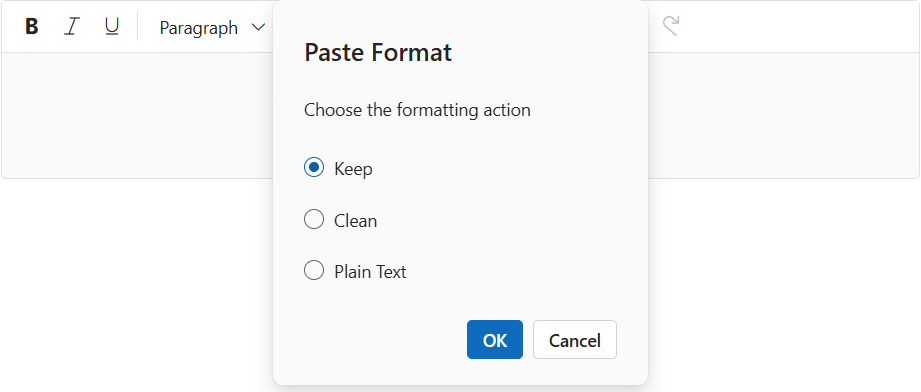

# Paste Cleanup in Vue Rich Text Editor Component

The Rich Text Editor simplifies the conversion of Microsoft Word content to HTML format, preserving formatting and styles. The `pasteCleanup` settings property allows you to control the formatting and styles when pasting content into the editor. The following settings are available to clean up the content:

| API | Description | Default Value | Type |
|:----------------:|:---------:|:-----------------------------:|:---------:|
| [prompt](https://ej2.syncfusion.com/vue/documentation/api/rich-text-editor/pasteCleanupSettingsModel/#prompt) | Displays a dialog box when content is pasted, allowing users to choose how the content should be inserted—either as plain text, with formatting, or cleaned HTML. | false | boolean |
| [plainText](https://ej2.syncfusion.com/vue/documentation/api/rich-text-editor/pasteCleanupSettingsModel/#plaintext) | Paste the content as plain text | false | boolean |
| [keepFormat](https://ej2.syncfusion.com/vue/documentation/api/rich-text-editor/pasteCleanupSettingsModel/#keepformat) | Retains the original formatting of the pasted content, including styles, fonts, and structure.| true | boolean |
| [deniedTags](https://ej2.syncfusion.com/vue/documentation/api/rich-text-editor/pasteCleanupSettingsModel/#deniedtags) | Specifies a list of HTML tags to be removed from the pasted content, such as `<script>`, `<iframe>`, or `<style>`. Helps eliminate unwanted or unsafe elements. | null | string[] |
| [deniedAttrs](https://ej2.syncfusion.com/vue/documentation/api/rich-text-editor/pasteCleanupSettingsModel/#deniedattrs) |  Filters out specified attributes from the pasted content| null | string[] |
| [allowedStyleProps](https://ej2.syncfusion.com/vue/documentation/api/rich-text-editor/pasteCleanupSettingsModel/#allowedstyleprops) |  See the full list of allowed properties in the [documentation link here](https://ej2.syncfusion.com/vue/documentation/api/rich-text-editor/#pastecleanupsettings) | string[] |

> To use Paste cleanup feature, inject `PasteCleanup` in the provider section.

## Paste options in the prompt dialog

When `prompt` is set to true, pasting the content in the editor will open a dialog box that contains three options `Keep`, `Clean`, and `Plain Text` as radio buttons:

1. `Keep`: Maintains the same format as the copied content.
2. `Clean`: Clears all style formats from the copied content.
3. `Plain Text`: Pastes the copied content as plain text without any formatting or style. (including the removal of all tags).

> When `prompt` value is set true, the API properties [plainText](https://ej2.syncfusion.com/vue/documentation/api/rich-text-editor/pasteCleanupSettingsModel/#plaintext) and [keepFormat](https://ej2.syncfusion.com/vue/documentation/api/rich-text-editor/pasteCleanupSettingsModel/#keepformat) will not be considered for processing when pasting the content.

## How to paste as plain text

Setting `plainText` to true converts the copied content to plain text by removing all HTML tags and styles. Only the plain text is pasted into the editor.

>When `plainText` is set to true, set `prompt` to false. The `keepFormat` property will not be considered.

## Keep format option

When `keepFormat` is set to `true`, the pasted content retains its original formatting, including styles, fonts, and structure. However, the formatting is still subject to filtering based on the `allowedStyleProps`, `deniedTags`, and `deniedAttrs` settings:

* Only the style properties listed in `allowedStyleProps` will be preserved.
* Any HTML tags listed in `deniedTags` will be removed.
* Any attributes listed in `deniedAttrs` will be stripped from the pasted content.

This ensures that while the formatting is retained, it remains clean, safe, and consistent with your application's styling rules.

>When `keepFormat` is set to true, set both `prompt` and `plainText` to false.

## Clean formating

When the `prompt`, `plainText`, and `keepFormat` options are all set to false, the Rich Text Editor performs clean format paste cleanup. In this mode, all inline styles from the pasted content are removed, eliminating any custom or external styling. This ensures a consistent and uniform appearance within the editor.

Despite the removal of styling, essential structural HTML tags such as `
`, `<ul>`, `<table>`, and others are preserved. This maintains the original layout and semantic integrity of the content, allowing it to remain well-structured and readable.However, the formatting is still subject to filtering based on the `deniedTags`, and `deniedAttrs` settings:

- **`deniedTags`**: Tags listed here will still be removed from the pasted content.
- **`deniedAttrs`**: Attributes listed here will also be stripped from the pasted content.

> The `allowedStyleProps` setting only applies if `keepFormat` is enabled.

## Denied tags during paste

When `deniedTags` values are set, the specified tags will be removed from the pasted content. For example,

* `'a'`:  Removes all anchor tags.
* `'a[!href]'`: Removes anchor tags without the 'href' attribute.
* `'a[href, target]'`: Removes anchor tags with both 'href' and 'target' attributes.

> This setting is ignored when `plainText` is set to `true`.  
It only works when either `keepFormat` is set to `true`, or when `prompt`, `plainText`, and `keepFormat` are all set to `false`, which triggers clean format behavior.

## Denied attributes during paste

When `deniedAttrs` values are set, the specified attributes will be removed from all tags in the pasted content. For example,

`'id', 'title'`: Removes 'id' and 'title' attributes from all tags.

> This setting is ignored when `plainText` is set to `true`.  
It only works when either `keepFormat` is set to `true`, or when `prompt`, `plainText`, and `keepFormat` are all set to `false`, which triggers clean format behavior.

## Allowing specific style properties

By default, a predefined set of basic style properties are allowed when content is pasted into the Rich Text Editor.

When you configure the [allowedStyleProps](https://ej2.syncfusion.com/vue/documentation/api/rich-text-editor/pasteCleanupSettingsModel/#allowedstyleprops) setting, only the styles that match the specified list of allowed properties will be retained. All other style properties will be removed from the pasted content.

You can find the full list of allowed style properties in the [official Syncfusion documentation](https://ej2.syncfusion.com/vue/documentation/api/rich-text-editor/#pastecleanupsettings).

> This setting works only when `keepFormat` is set to true. If `keepFormat` is `false` or `plainText` is `true`, style filtering via `allowedStyleProps` will not be applied.

For Example,

`allowedStyleProps: ['color', 'margin']'`: This will allow only the style properties ‘color’ and ‘margin’ in each pasted element.

In the following example, the paste cleanup related settings are explained with its module configuration:









        


## Get pasted content

You can get the pasted text as HTML using the [afterPasteCleanup](https://ej2.syncfusion.com/vue/documentation/api/rich-text-editor/#afterpastecleanup) event.









        


## Customization of pasted content

The Rich Text Editor enables the customization of copied content prior to pasting it into the editor. By configuring the `afterPasteCleanUp` event, users can exercise precise control over formatting and content modifications after the paste action is executed.

In the following example, the `afterPasteCleanUp` event is configured to remove images from the copied content. To understand this feature better, try pasting content that includes an image into the editor.









        

