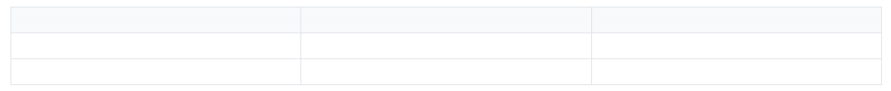
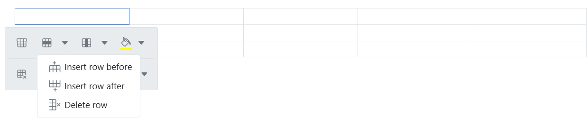
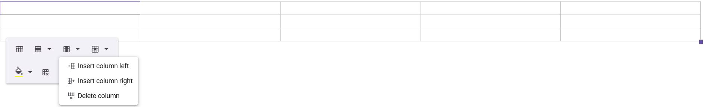
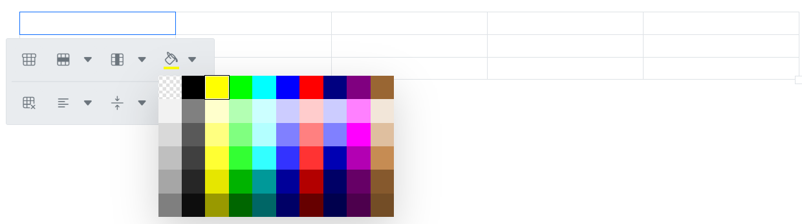
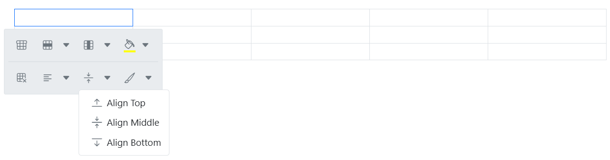
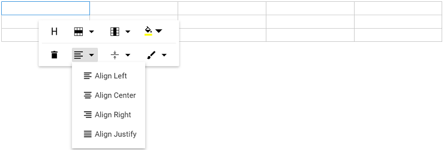
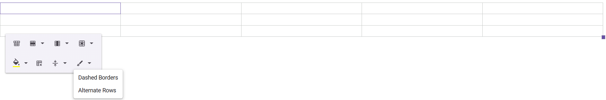
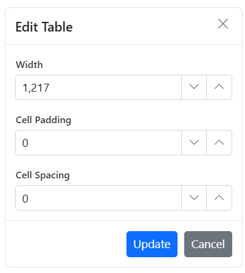
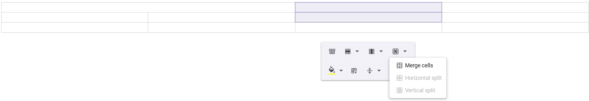
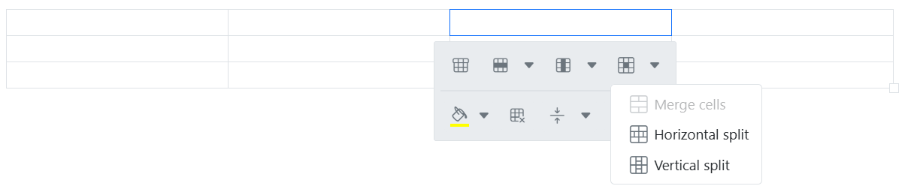

# Table in Vue Rich Text Editor Component

Rich Text Editor allows to insert table of content in edit panel and provides an options to add, edit and remove the table as well as perform other table related action. For inserting the table to the Rich Text Editor, the following list of options have been provided in the [tableSettings](https://ej2.syncfusion.com/vue/documentation/api/rich-text-editor/tableSettingsModel/)

## Configuring the table tool in toolbar

You can add an `CreateTable` tool in the Rich Text Editor toolbar using the `toolbarSettings` [items](https://ej2.syncfusion.com/vue/documentation/api/rich-text-editor/toolbarSettings/#items) property.

Select the number of rows and columns on the table grid to insert the table.

Tables can also be inserted through the `Insert Table` option in the pop-up where the number of rows and columns can be provided manually, and this is the default way in devices.

> To use Table feature, inject `Table` in the provider section.

In the following sample, the table feature has been provided from table module.












## Table headers

The `TableHeader` command is available in the quick toolbar, allowing you to add or remove the header row from the inserted table. The following image illustrates the table header.

## Inserting rows

You can insert `Rows` above or below the selected table cell using the quick toolbar. The focused row can also be deleted. The following screenshot shows the available options of the row item.

## Inserting columns

`Columns` can be inserted to the left or right of the selected table cell using the quick toolbar. The focused column can also be deleted. The following screenshot shows the available options in inserting column item.

## Setting cell background color

Set the background color for each table cell using the `BackgroundColor` command in the quick toolbar.

## Deleting tables

Delete the entire table using the delete item in the quick toolbar.

## Table cell alignments

### Vertical alignment

Align text inside table cells to the top, middle, or bottom using the `TableCellVerticalAlign` tool in the quick toolbar.

### Horizontal alignment

Align text inside table cells to the left, right, or center using the `TableCellHorizontalAlign` tool in the quick toolbar.

## Applying table styles

Table styles provided for class name should be appended to a table element. It helps to design the table in specific CSS styles when inserting in the editor.

By Default, provides Dashed border and Alternate rows.

**Dashed border**: Applies a dashed border to the table.

**Alternate border**: Applies an alternating background to table rows.

## Setting table and cell dimensions

Sets the default width of the table when it is inserted in the Rich Text Editor using the width of [tableSettings](https://ej2.syncfusion.com/vue/documentation/api/rich-text-editor/tableSettings/).

Users can modify the table width, cell padding, cell spacing, background color, border color, border style, and border width through the `TableEditProperties` option in the quick toolbar. By default, the border style is double and the border width is 1px. When users change these values in the dialog, the updates are instantly reflected in the editor as a live preview.

## Table cell selection and formatting

The table cell selection feature in our editor allows for intuitive and efficient table manipulation using both mouse and keyboard interactions.

**Mouse interaction:**

* Click and drag to select multiple cells, rows or columns.
* Selected cells are highlighted with a distinct background color for better visibility.

**Keyboard interaction:**

* Use <kbd>Shift</kbd> + <kbd>Arrow keys</kbd> to extend the selection of cells, rows or columns.
* Background color highlights selected cells for better visibility.

**Table selection with backspace and delete keys:**

* Press the <kbd>Backspace</kbd> key immediately after the table to select the entire table.
* Press the <kbd>Delete</kbd> key immediately before the table to select the entire table.

**Table content text formatting:**

The text formatting feature in tables allows users to apply various styles to selected cells, enhancing the appearance and readability of data. This includes the application of headings, paragraphs, lists, and inline styles such as bold, italic, and strikethrough. Users can efficiently format multiple cells simultaneously by selecting entire rows or columns.









        


## Copy, cut, and paste table rows and columns

The Rich Text Editor supports copying, cutting, and pasting table content, significantly improving the efficiency of table data manipulation. This feature is ideal for applications that require dynamic table content management, allowing users to easily modify and manage table data within the editor.

Users can select multiple table cells by dragging the mouse or by holding the <kbd>Shift</kbd> key and using the <kbd>Arrow keys</kbd>. After selecting the desired cells, the following standard keyboard shortcuts can be used:

| Action | Windows | Mac |
|--------|---------|-----|
| Copy   | <kbd>Ctrl</kbd> + <kbd>C</kbd> | <kbd>⌘</kbd> + <kbd>C</kbd> |
| Cut    | <kbd>Ctrl</kbd> + <kbd>X</kbd> | <kbd>⌘</kbd> + <kbd>X</kbd> |
| Paste  | <kbd>Ctrl</kbd> + <kbd>V</kbd> | <kbd>⌘</kbd> + <kbd>V</kbd> |

**Paste behavior and supported scenarios:**

* Table structure, formatting, and cell properties are automatically preserved during the paste operation.
* The editor intelligently handles cell merging and splitting based on the destination context.
* Supports cross-table operations. Users can copy content from one table and paste it into another.
* Allows pasting partial table content as new tables or into existing table cells.
* Compatible with content from external applications like Excel, Word, and other editors.
* Maintains formatting consistency during both internal and external paste operations.
* Supports pasting into a single clicked cell or a selected range of multiple cells.

## Merging and splitting cells

The Rich Text Editor allows users to modify table appearance by merging or splitting cells.

Configure the `TableCell` item in the Table [quickToolbarSettings](https://ej2.syncfusion.com/vue/documentation/api/rich-text-editor/quickToolbarSettings/#table) property to display merge/split icons when selecting table cells.

### Merging table cells

The table cell merge feature allows you to merge two or more row and column cells into a single cell, combining their contents.

The following image explains the table merge action.

### Splitting table cells

The table cell split feature allows you to a selected cell can be split both horizontally and vertically.

The following image explains the table split action.









        


## See also

* [Table Quick Toolbar](./toolbar/quick-toolbar#table-quick-toolbar)